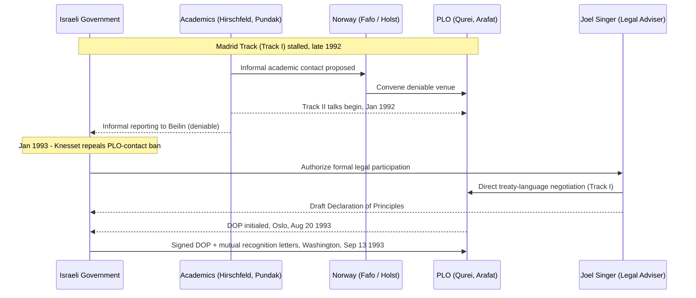

## The Secret Oslo Channel as a Pre-Negotiation Back-Channel

### Theoretical Placement: What a Back-Channel Is For

A **back-channel** is a covert or deniable communication line run in parallel to, or in the absence of, formal negotiations, used to conduct **pre-negotiation** — the phase in which parties determine whether a Zone of Possible Agreement (ZOPA) exists at all before committing to formal talks. Pre-negotiation theory (Zartman) holds that parties enter formal negotiation only once they perceive a "mutually hurting stalemate" — a condition in which the costs of continued unilateral action exceed the expected costs of concession — and once each side can privately test the other's BATNA (best alternative to a negotiated agreement, the floor below which a party will walk away) without publicly signaling weakness. A back-channel exists specifically to let this testing happen with **zero audience cost**, because it is deniable if it fails.

The Oslo channel (January 1992–September 1993) is the paradigmatic case of a back-channel because it satisfies every element of this definition simultaneously: it was secret, it was legally necessary rather than merely convenient, it ran parallel to a failing official track, and it converted into a binding Track I instrument once a ZOPA was confirmed.

### Preconditions: Why a Back-Channel Was Required, Not Optional

Three structural facts made a formal channel impossible in 1992–93:

1. **Legal prohibition**: Israel's 1986 Prevention of Terrorism Ordinance amendment criminalized contact between Israeli citizens and the PLO, which Israel classified as a terrorist organization. Any Israeli official who met PLO representatives risked prosecution. This made Track II — academics without official status — the only legally available channel until the law was repealed by the Knesset in January 1993, mid-process.
2. **Failed parallel Track I**: The official Madrid Conference framework, launched in October 1991 under U.S.-Soviet co-sponsorship, produced a formal Washington negotiating track between Israel and a joint Jordanian-Palestinian delegation (Palestinians could not appear as an independent delegation). By late 1992 this track had stalled over sequencing and representation disputes, demonstrating a mutually hurting stalemate had been reached without producing a substantive channel to resolve it.
3. **Mutual deniability requirement**: Both Yitzhak Rabin's government and Yasser Arafat's PLO leadership needed the ability to disavow the contact if it failed, given that hardline constituencies on both sides (Israeli settler movements and Likud opposition; Hamas and PLO rejectionist factions) would treat any officially-acknowledged contact as a concession in itself.

### Mechanism and Sequence

The channel was convened by the Norwegian Fafo Institute (Fafo Institutt for Anvendt Samfunnsvitenskap, a Norwegian applied social science research foundation), with sociologist Terje Rød-Larsen and his wife Mona Juul (a Norwegian Foreign Ministry official) providing venue, logistics, and eventually a discreet diplomatic conduit to Foreign Minister Johan Jørgen Holst.

**Phase 1 — Track II exploration (January–May 1992):** Israeli academics Yair Hirschfeld and Ron Pundak (Haifa University, no government authority) met PLO Finance Director Ahmed Qurei (Abu Ala) and economist Hanan Ashrawi's colleagues in London and Oslo, framed publicly as an academic economic-cooperation study group. No Israeli government official had authorized these contacts; Hirschfeld reported informally to Deputy Foreign Minister Yossi Beilin afterward, who could deny knowledge if pressed.

**Phase 2 — Quasi-official escalation (autumn 1992–early 1993):** After the June 1992 Israeli election brought Rabin to power on a platform open to renewed negotiation, Beilin authorized Hirschfeld and Pundak to continue with tacit government blessing — still not formal authorization under VCLT Article 7 (the requirement that a person hold "full powers" to represent a state in adopting treaty text), but no longer freelance. Foreign Minister Shimon Peres was briefed and became a discreet sponsor.

**Phase 3 — Formal Track I conversion (spring–August 1993):** Once the Knesset repealed the PLO-contact ban (January 1993), Rabin authorized Foreign Ministry Legal Adviser Joel Singer — a person with actual authority to draft binding treaty language — to join the talks directly. Singer's arrival is the precise moment the channel crossed from Track II to Track I: from this point, language being negotiated could actually become binding once signed. The parties reached agreement on a Declaration of Principles text in Oslo in August 1993.

**Phase 4 — Authentication and signature:** The Declaration of Principles on Interim Self-Government Arrangements was initialed in Oslo on August 20, 1993, and signed in Washington on September 13, 1993, accompanied by an exchange of letters of mutual recognition between Rabin and Arafat — itself a form of consent to be bound expressed through an instrument, per VCLT Article 11's non-exhaustive list of methods (signature, exchange of instruments, ratification, among others).

### Sequence Diagram

### Why the Channel Succeeded Where Track I Failed

Two negotiation-theoretic factors explain the divergence between the stalled Madrid/Washington track and the successful Oslo back-channel:

- **Smaller negotiating set reduces coordination cost.** The Washington talks involved a joint Jordanian-Palestinian delegation, multiple government agencies, and press scrutiny, multiplying the veto points any draft language had to clear. The Oslo channel initially involved fewer than ten people meeting in isolated Norwegian retreats, sharply reducing the number of actors capable of blocking incremental convergence.
- **Deniability preserved each side's win-set.** Under the two-level games framework (Putnam), a negotiator's *win-set* is the range of agreements their domestic constituency will ratify. Because nothing said in the Track II phase was attributable to either government, neither Rabin's nor Arafat's win-set was narrowed by exploratory concessions the way it would have been had the same proposals been floated at Washington.

### Limits and Criticism of the Back-Channel Model, as Illustrated by Oslo

The Oslo case is also the standard evidentiary anchor for critiques of back-channel diplomacy:

1. **Ratification failure risk**: The DOP was negotiated by relatively moderate figures on both sides (academics, Beilin, Peres wing; Qurei, Arafat's inner circle) and did not incorporate hardline constituencies who ultimately treated the agreement as illegitimate. This contributed to the assassination of Rabin by an Israeli opponent of the Accords in November 1995 and to Hamas's continued rejectionism — illustrating the critique that back-channels convened among dialogue-inclined elites can produce agreements insufficiently anchored in each side's actual domestic win-set.
2. **Deferred hard issues**: The DOP's back-channel format allowed rapid convergence precisely because the most intractable issues — Jerusalem's status, Palestinian refugees' right of return, final borders — were explicitly deferred to "permanent status negotiations," a sequencing choice that pre-negotiation theory recognizes as a common back-channel technique (agree on process and easier substance first) but that critics argue merely postponed the mutually hurting stalemate rather than resolving it.
3. **No enforcement mechanism**: As a bilateral instrument without a UN Security Council chapter attached, the DOP's implementation relied entirely on continued political will in both capitals; when that will eroded after 1995–96, no external enforcement structure existed to compel compliance, unlike treaties incorporating dispute-settlement clauses under VCLT Part V.

[Inference] The Oslo case is best read as evidence that a back-channel's structural advantages (deniability, small negotiating set) are most effective for establishing that a ZOPA exists and producing a framework agreement, but do not by themselves solve the domestic-ratification and enforcement problems that determine whether the resulting instrument survives implementation.

**Related Topics**

- Track I versus Track II diplomacy and the deniability/authority distinction
- Two-level games and win-set narrowing (Putnam)
- VCLT Articles 7 and 11: full powers and consent to be bound
- Pre-negotiation theory and the mutually hurting stalemate (Zartman)
- Permanent status negotiations and deferred-issue sequencing in peace processes
- Third-party facilitation by small states (the "Norwegian model")