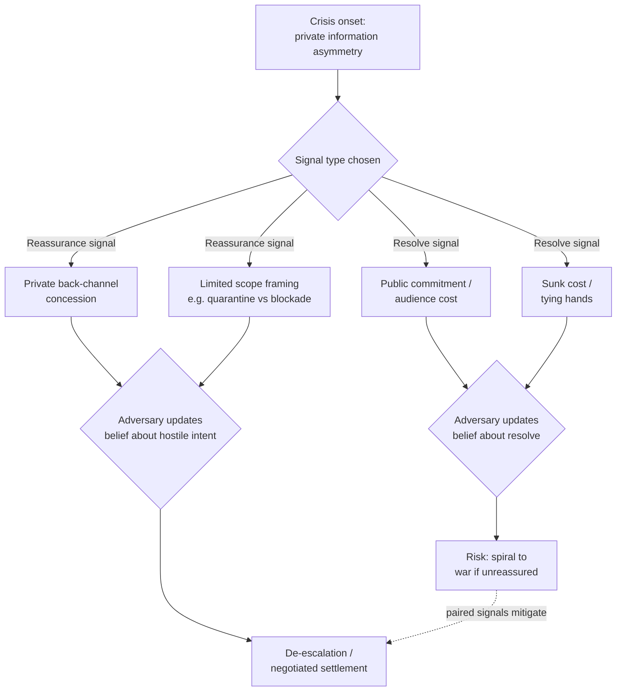

## Signaling Resolve and Reassurance During Interstate Crises

### Theoretical Foundation: The Signaling Problem

Interstate crisis signaling addresses a core informational problem in bargaining theory: states have private information about their own resolve (willingness to bear costs, including war, rather than back down) and their own capabilities, and each side has an incentive to misrepresent both upward to extract concessions. This is the **information asymmetry** problem central to the rationalist theory of war (Fearon, 1995): war can occur even between rational actors because neither side can credibly verify the other's true resolve or power short of a costly test. Crisis signaling is the set of tools states use to overcome this asymmetry — either by convincing an adversary their resolve is genuinely high (**signaling resolve**) or by convincing an adversary that a specific action will not be treated as hostile escalation (**signaling reassurance**).

A signal only overcomes the credibility problem if it is **costly** — cheap talk (a mere verbal statement) can be sent by both a bluffing state and a genuinely resolved state at identical cost, so a rational adversary discounts it. This is the basis of Thomas Schelling's foundational distinction (*The Strategy of Conflict*, 1960; *Arms and Influence*, 1966) between signals that carry information because they are costly and those that do not.

### Costly Signaling Mechanisms for Resolve

**1. Audience costs.** A leader who makes a public commitment (e.g., a red-line declaration) and then fails to follow through pays a domestic political price — removal from office, loss of credibility for future bargaining. Because backing down is more costly for a leader who has spoken publicly, making a public commitment is itself a costly signal: only a genuinely resolved leader can afford to issue it, since a bluffing leader risks being caught bluffing at high domestic cost (Fearon, 1994, "Domestic Political Audiences and the Escalation of International Disputes"). The credibility of an audience-cost signal depends on the *audience actually being able to observe and punish* backing down — a constraint that varies sharply between democracies with a free press and legislative oversight versus more closed systems.

**2. Sunk costs.** Mobilizing military forces, moving assets into theater, or otherwise incurring expenditure that cannot be recovered if the crisis is resolved peacefully demonstrates resolve because a bluffing state would prefer not to waste the resources. Sunk-cost signals are distinct from audience costs: they operate through material rather than reputational stakes.

**3. Tying hands / irreversible commitment.** Deploying forces to a position from which withdrawal is more costly than continuing (e.g., stationing troops directly on a contested border, or a "tripwire" force too small to win but sized to guarantee involvement if attacked) removes the option to back down cheaply, and thereby credibly signals that de-escalation is not being kept in reserve. The classic tripwire example is the continued stationing of a small U.S. garrison force in West Berlin throughout the Cold War: too small to defend the city, but sized specifically to guarantee that any Soviet attack would kill American soldiers and trigger a wider U.S. response, making the American commitment to Berlin's defense credible despite the garrison's military insufficiency.

### Case Study: The Cuban Missile Crisis (October 1962)

The Cuban Missile Crisis is the most extensively documented case combining resolve signaling and reassurance signaling within a single thirteen-day episode.

**Resolve signaling by the United States**: President Kennedy's public television address on October 22, 1962, announcing the naval "quarantine" of Cuba, was a textbook audience-cost signal — a public, on-record commitment that would have been domestically catastrophic to abandon. The quarantine itself (technically a blockade, though the U.S. avoided that term for legal reasons discussed below) was also a sunk-cost signal: it required actual naval deployment and forward interception, imposing real costs and risks of confrontation at sea.

**Reassurance signaling by both sides**: Resolve signals alone risk provoking an adversary into believing war is unavoidable and striking first (the "spiral" dynamic identified in Jervis's security-dilemma literature). To prevent this, both sides paired resolve signals with reassurance:

- Kennedy deliberately chose the *quarantine* short of full invasion, explicitly signaling that the U.S. sought removal of the missiles, not regime change, thereby reassuring Khrushchev that compliance would not be met with further escalation.
- Khrushchev's back-channel letter of October 26 (widely assessed as more personal and conciliatory in tone than his more hardline October 27 formal letter) proposed a resolvable trade, and Kennedy's decision to publicly respond only to the October 26 letter while privately negotiating the harder terms of the second — arranged through his brother Robert Kennedy's back-channel meeting with Soviet Ambassador Anatoly Dobrynin — combined public reassurance with private accommodation.
- The private, undisclosed U.S. commitment to remove Jupiter missiles from Turkey (not made public for years afterward) functioned as a reassurance signal that could be extended without the audience-cost penalty a public trade would have triggered for Kennedy domestically.

This resolution illustrates a key structural point: **resolve signals are typically sent publicly (to maximize audience-cost credibility), while reassurance signals are often best sent privately (to avoid triggering domestic audience costs that would prevent a leader from actually delivering the concession).**

### Legal Framing as a Signaling Choice

The U.S. choice to call its action a "quarantine" rather than a "blockade" was itself a signal with legal content: a blockade is traditionally classified as an act of war under customary international law, while a quarantine was presented as a lesser, defensive public health/security measure, functioning to reassure both the Soviet Union and non-aligned states that the U.S. was not initiating war. The Organization of American States' prior authorization of the quarantine (October 23, 1962) was also used by the U.S. to frame the action as collective regional security enforcement rather than unilateral coercion — a distinct signal aimed at a broader international audience beyond Moscow.

### Signal Types Compared

| Signal Type | Mechanism of Credibility | Typical Audience | Example |
| --- | --- | --- | --- |
| Public commitment (audience cost) | Domestic punishment for backing down | Domestic + adversary | Kennedy's Oct. 22 address |
| Sunk cost | Resources expended regardless of outcome | Adversary | Naval quarantine deployment |
| Tying hands | Removes option to retreat cheaply | Adversary | Berlin tripwire garrison |
| Private reassurance | Avoids triggering own audience costs | Adversary only | Jupiter missile trade (undisclosed) |
| Legal/institutional framing | Multilateral legitimation | Third-party states | OAS authorization of quarantine |

### Diagram: Resolve-Reassurance Signaling Loop

### The Reassurance-Resolve Tradeoff and the Security Dilemma

Robert Jervis's security dilemma framework (*Perception and Misperception in International Politics*, 1976) explains why pure resolve signaling is dangerous: if State A's signal of resolve is read by State B as evidence of offensive intent, B may respond with its own resolve signal, producing a spiral of escalating commitments neither side wanted. Effective crisis management, per Jervis, requires signals that are simultaneously costly enough to demonstrate resolve on the *specific issue in dispute* while being clearly bounded in scope, so the adversary does not update toward believing the signaling state seeks unlimited gains. The Cuban Missile Crisis quarantine succeeded partly because it was narrowly tailored (interdicting only offensive weapons shipments, not a general blockade of all Cuban trade), reducing the risk that Khrushchev would read it as a prelude to invasion.

[Inference] Because both resolve and reassurance signals depend on being correctly interpreted by an adversary embedded in a different political and informational context, historical crisis outcomes are sensitive to leader-level judgment and imperfect information in ways that make the general signaling logic more reliable as an analytical framework than as a predictive tool for any single crisis in progress.

**Related Topics**

- Rationalist theories of war and information asymmetry (Fearon 1995)
- Audience costs and democratic credibility in international bargaining
- The security dilemma and spiral versus deterrence models (Jervis)
- Tripwire forces and extended deterrence commitments
- Back-channel diplomacy as a reassurance mechanism (Dobrynin-Robert Kennedy channel)
- Escalation dominance and the ladder-of-escalation framework (Kahn)