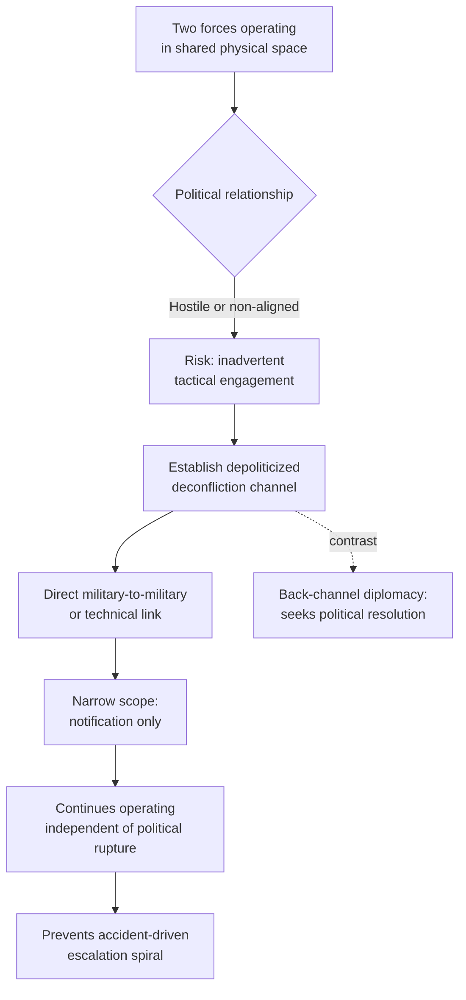

## Deconfliction Mechanisms in Active Conflict Zones

### Definition and Theoretical Placement

**Deconfliction** is a category of crisis-communication mechanism distinct from both resolve signaling and back-channel pre-negotiation: it is the establishment of a standing communication channel between forces of two states (or a state and a non-state armed actor) operating in physical proximity, for the narrow purpose of preventing unintended direct engagement, rather than for negotiating the underlying political dispute. Deconfliction channels are typically **operational and technical rather than political** — they exchange flight paths, target coordinates, or notification of impending strikes, and are deliberately insulated from the broader diplomatic relationship so that they continue functioning even when political relations are hostile or severed.

This distinction matters analytically because deconfliction solves a different bargaining problem than back-channel diplomacy of the Oslo type. Where a back-channel (as in the Oslo case) seeks to identify a Zone of Possible Agreement (ZOPA) for resolving the underlying conflict, a deconfliction channel accepts the underlying conflict as unresolved and instead manages the **accidental-escalation risk** that arises when hostile or wary forces operate in the same physical space. The relevant theoretical concept is the risk of *inadvertent escalation* — conflict spirals triggered not by deliberate policy choice but by an accident, misidentification, or miscalculation at the tactical level that both governments would prefer to avoid (Posen, *Inadvertent Escalation*, 1991).

### Structural Requirements for an Effective Deconfliction Channel

1. **Depoliticized framing.** The channel must be presented, and genuinely function, as separate from the political relationship — enabling continued operation during periods when normal diplomatic contact is suspended or hostile. Officials on both sides need cover to use it without it being read as a political overture (the same "deniability" logic underlying Track II diplomacy, defined as unofficial dialogue among non-state-empowered actors, though deconfliction channels are typically staffed by uniformed military rather than diplomats).
2. **Direct, low-latency contact.** Because the risk being managed is a live operational one (aircraft in the same airspace, forces in proximity), the channel must bypass normal diplomatic transmission (formal notes, embassies) in favor of direct military-to-military or technical links capable of near-real-time exchange.
3. **Narrow, defined scope.** Effective deconfliction channels are typically restricted by mandate to a specific technical function (e.g., flight safety) and explicitly barred from being used to discuss broader strategic or political coordination, both to maintain political deniability and to prevent scope creep that would make the channel itself politically contentious.

### Case Study: U.S.-Russia Syria Deconfliction Line (2015–2024)

Following Russia's September 2015 military intervention in Syria, both Russian and U.S.-led coalition aircraft began operating in overlapping airspace against different (and sometimes opposed) ground targets, without any political alliance or coordination framework between Washington and Moscow. The U.S. Department of Defense and the Russian Ministry of Defense established a dedicated telephone deconfliction line, reportedly connecting U.S. Combined Air Operations Center staff (based at Al Udeid Air Base, Qatar) directly with Russian counterparts, supplemented by a Memorandum of Understanding on flight safety signed October 20, 2015.

The channel's design reflected the structural requirements above:

- It was explicitly **not** a mechanism for coordinating targets or sharing intelligence on ISIS or other targets — the U.S. and Russia backed opposing sides in Syria's broader civil war (the U.S. opposing the Assad government Russia was supporting), so any appearance of strategic coordination would have been politically unacceptable to Washington.
- It operated continuously through periods of severe political deterioration in the broader U.S.-Russia relationship, including after the 2016 election-interference allegations and the 2022 invasion of Ukraine, illustrating the depoliticized-channel design principle: the line reportedly remained in use for airspace safety even as almost all other U.S.-Russia military contact was suspended.
- Its scope was limited to flight-safety notification — informing the other side of planned strike areas and timing to avoid mid-air incidents or accidental strikes on each other's forces — not to political consultation on Syria's future.

[Unverified] Specific operational details of the channel's usage frequency and precise protocols are not fully public, as both governments have limited disclosure to general descriptions of its existence and stated purpose.

### Case Study: Israel-Russia Deconfliction in Syrian Airspace

A parallel mechanism was established between Israel and Russia beginning in September 2015, coordinating Israeli Air Force strikes against Iranian and Hezbollah-linked targets in Syria with Russian forces protecting Syrian government air defenses in the same airspace. This channel is distinguished from the U.S.-Russia line by involving a state (Israel) that was not a combatant in the broader Syrian civil war but conducted a sustained campaign against specific targets within Syrian airspace that Russian air defense systems also operated in. Reported mechanics included advance notification of Israeli strike windows to Russian counterparts to prevent Russian air-defense systems from engaging Israeli aircraft, without Russia providing operational cooperation or intelligence support to the strikes themselves.

### Historical Precedent: The Incidents at Sea Agreement (1972)

Deconfliction mechanisms predate the Syria examples by decades. The U.S.-Soviet Agreement on the Prevention of Incidents On and Over the High Seas (INCSEA), signed May 25, 1972, established rules and communication procedures to prevent naval and air incidents between U.S. and Soviet forces operating in close proximity during the Cold War, following a pattern of dangerous near-collisions and "buzzing" incidents in the 1960s. INCSEA established:

- Standard signals for communicating intentions between ships operating near each other
- Prior notification requirements for certain maneuvers
- An annual bilateral review mechanism to address incidents and refine procedures

INCSEA is frequently cited in the deconfliction literature as the template mechanism because it demonstrated that adversarial great powers could sustain a narrowly-scoped, technical safety arrangement throughout the most tense periods of the Cold War without that arrangement implying any broader political rapprochement.

### Comparison: Deconfliction vs. Back-Channel Diplomacy vs. Crisis Signaling

| Dimension | Deconfliction | Back-Channel (pre-negotiation) | Crisis Signaling |
| --- | --- | --- | --- |
| Primary goal | Prevent accidental tactical engagement | Identify ZOPA for political resolution | Convey resolve or reassurance re: political stakes |
| Typical actors | Uniformed military, technical staff | Academics, retired officials, intermediaries | Heads of state, foreign ministries |
| Underlying conflict | Assumed unresolved, bracketed | Sought to be resolved | Actively being contested |
| Continues during political rupture? | Yes — this is the design intent | No — depends on political appetite | N/A — signaling is the political contest |
| Example | Syria deconfliction line (2015–) | Oslo channel (1992–93) | Cuban Missile Crisis quarantine (1962) |

### Mechanism Diagram

### Limits of Deconfliction Mechanisms

Deconfliction channels manage tactical risk but do not address the underlying political dispute, and their narrow scope is both their strength and their limitation:

1. **No conflict-resolution function.** Because deconfliction channels are deliberately barred from broader political discussion, they cannot themselves produce a settlement of the underlying conflict — Syria's civil war continued for the duration of the U.S.-Russia deconfliction line's operation.
2. **Vulnerable to deliberate breakdown.** A state seeking to escalate deliberately (as opposed to avoid inadvertent escalation) can simply disregard the channel's notifications, as the mechanism has no enforcement power beyond the mutual interest in avoiding accidents.
3. **Scope-creep risk in the other direction.** [Inference] Overuse of a deconfliction channel for issues beyond its narrow technical mandate risks collapsing the depoliticized framing that allows it to survive periods of broader hostility, since either government's domestic or allied audiences may object to a channel that appears to function as informal coordination with an adversary.

**Related Topics**

- Inadvertent escalation theory (Posen) and accidental war risk
- The Incidents at Sea Agreement (1972) as a deconfliction template
- Track I versus Track II diplomacy and the deniability spectrum
- Hotline agreements (the 1963 U.S.-USSR Direct Communications Link / "Moscow-Washington hotline")
- Rules of engagement and command-and-control in coalition operations
- Security dilemma dynamics in shared operational theaters (Jervis)