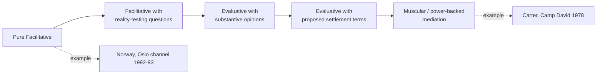

## Facilitative versus Evaluative Mediation Styles

### Definitions and Origin of the Distinction

Mediation is third-party assistance to negotiating parties who retain full decision-making authority over the outcome — the mediator has no power to impose a binding result, distinguishing mediation from arbitration or adjudication. The facilitative/evaluative typology, developed primarily in the U.S. domestic mediation literature (Riskin's 1996 grid is the most cited framework) and subsequently applied to international mediation, distinguishes mediators by **the source of the content that shapes the eventual agreement**.

**Facilitative mediation**: the mediator controls the *process* — structuring the agenda, managing communication, ensuring each side is heard — but deliberately withholds substantive judgment about the merits of either side's position or what a fair outcome should look like. The theory of the case is that the parties themselves possess the best information about their own interests, and a mediator who supplies content displaces the parties' ownership of the solution, reducing the durability of any resulting agreement.

**Evaluative mediation**: the mediator actively assesses the merits of each side's position, offers opinions on likely outcomes (e.g., "if this goes to war/arbitration/continued stalemate, side A is unlikely to achieve X"), and may propose specific settlement terms. The theory of the case is that when parties are too entrenched, too asymmetrically informed, or too mistrustful to generate their own options, an authoritative outside assessment can break a deadlock that pure facilitation cannot.

### Theoretical Grounding: Why the Distinction Matters for Outcome Durability

The choice between styles maps onto a foundational tension in negotiation theory between **procedural legitimacy** and **substantive efficiency**. A facilitative approach protects what negotiation theorists call *ripeness of ownership* — an agreement the parties generated themselves is more likely to survive implementation because neither side can claim it was imposed, reducing the risk of the ratification failure that affects agreements seen as elite-imposed (a dynamic also visible in critiques of Track II diplomacy, i.e., unofficial dialogue among non-state-empowered actors, where agreements reached by dialogue-inclined elites can lack domestic buy-in). An evaluative approach trades some of this ownership for speed and clarity, useful when the primary obstacle to agreement is not mistrust of process but a genuine informational gap about the relative strength of each side's position or BATNA (best alternative to a negotiated agreement — the floor below which a party should walk away).

Mediator leverage in the evaluative mode typically derives from one of two sources: **expertise** (technical or legal authority whose assessment both sides regard as credible) or **power** (the ability to independently affect each side's BATNA through incentives or pressure, sometimes termed "muscular mediation" in the literature on great-power-brokered settlements).

### Case Study: Facilitative Mediation — the Oslo Channel

The Norwegian-facilitated Israeli-Palestinian back-channel (1992–93) exemplifies facilitative mediation at the state-sponsorship level. Norwegian Foreign Ministry officials Terje Rød-Larsen and Mona Juul provided venue, logistics, and confidentiality, but Norway had no independent leverage over either Israel or the PLO and did not offer substantive assessments of the merits of either side's territorial or security claims. Norway's contribution was almost entirely procedural: convening private, secure, deniable meetings and managing the practical mechanics that allowed direct talks between Israeli and PLO representatives to occur at all. This is consistent with the "small state as neutral venue" model sometimes called the Norwegian model, in which the facilitator's lack of independent power is precisely what makes it an acceptable venue to both sides, since neither side fears the facilitator will impose an outcome.

### Case Study: Evaluative Mediation — Camp David 1978

The Camp David Accords negotiations (September 1978) between Israeli Prime Minister Menachem Begin and Egyptian President Anwar Sadat, mediated by U.S. President Jimmy Carter, are the standard case of evaluative, power-backed mediation. Carter and his staff did not merely facilitate communication; they authored the "single negotiating text" procedure, drafting successive versions of proposed agreement language and presenting them to each side for reaction, rather than waiting for the parties to generate their own draft language. Carter also deployed substantial U.S. leverage — including the promise of significant U.S. military and economic aid packages to both Israel and Egypt — functioning as a mediator who could independently alter each side's BATNA, a capability facilitative mediators by design do not exercise. This combination of the single-text procedure (a specific and reusable evaluative-mediation technique: the mediator proposes concrete draft text rather than only managing dialogue) and material incentive leverage produced a signed agreement within thirteen days despite deep prior mistrust between the two leaders.

### The Single Negotiating Text Procedure

Because it is a specific, named, and reusable technique associated with evaluative mediation, the single negotiating text procedure merits separate definition: the mediator, rather than asking each side to propose competing draft texts (which tends to anchor each side to defending its own draft), produces one text and asks each party only to identify what they find unacceptable and why, iterating the draft based on that feedback until both sides can accept it. This shifts the psychological posture of each party from defending a position to critiquing a text, which the Camp David case is widely cited as demonstrating can reduce positional rigidity.

### Comparative Structure

| Dimension | Facilitative | Evaluative |
| --- | --- | --- |
| Mediator controls | Process only | Process and substantive content |
| Source of leverage | Neutrality, trust, procedural skill | Expertise and/or independent power (BATNA-altering incentives) |
| Typical technique | Structured dialogue, active listening, agenda management | Single negotiating text, reality-testing, proposed settlement terms |
| Risk to durability | Lower — parties own the outcome | Higher — outcome may be seen as externally imposed |
| Risk to timeliness | Slower — depends on parties generating options | Faster — mediator supplies options directly |
| Example | Oslo channel (Norway, 1992–93) | Camp David Accords (Carter, 1978) |

### Diagram: Mediator Role Spectrum

### The Debate: Which Style Is More Effective?

**The case for facilitative mediation**: proponents argue that durable settlements require the parties' genuine ownership of the terms, and that evaluative mediators risk having their substantive judgments rejected outright if perceived as biased, destroying the mediator's remaining usefulness for the rest of the process. A mediator who has offered an opinion favoring one side's legal or factual position can lose the *impartiality capital* needed to continue facilitating.

**The case for evaluative mediation**: proponents (notably scholars of "power mediation," such as work by Touval and Zartman on international mediation) argue that facilitative mediation is frequently insufficient where parties face severe informational asymmetry about relative strength, or where at least one party has an incentive to prolong conflict absent external pressure. In such cases, a mediator with the credibility or power to alter incentives directly — as Carter did through aid commitments — can produce an agreement pure facilitation would not reach, because the obstacle is not misunderstanding between the parties but a genuine and otherwise unresolvable conflict of interest.

[Inference] In practice, most historically documented successful international mediations combine elements of both styles across different phases of the same process — typically opening with facilitative techniques to build minimal trust and establish communication, then shifting toward evaluative techniques (single-text procedures, substantive proposals) once the parties have reached the limits of what unassisted dialogue can resolve — rather than representing a mediator's fixed, single-style choice for the entire negotiation.

**Related Topics**

- The single negotiating text procedure as a distinct mediation technique
- Power mediation and BATNA-altering leverage (Touval and Zartman)
- Track I versus Track II diplomacy and mediator authority
- Mediator impartiality and the risk of perceived bias
- Ripening theory and the mutually hurting stalemate (Zartman)
- Multiparty mediation and mediator coalitions (e.g., the Dayton Accords' U.S.-EU-Russia Contact Group)