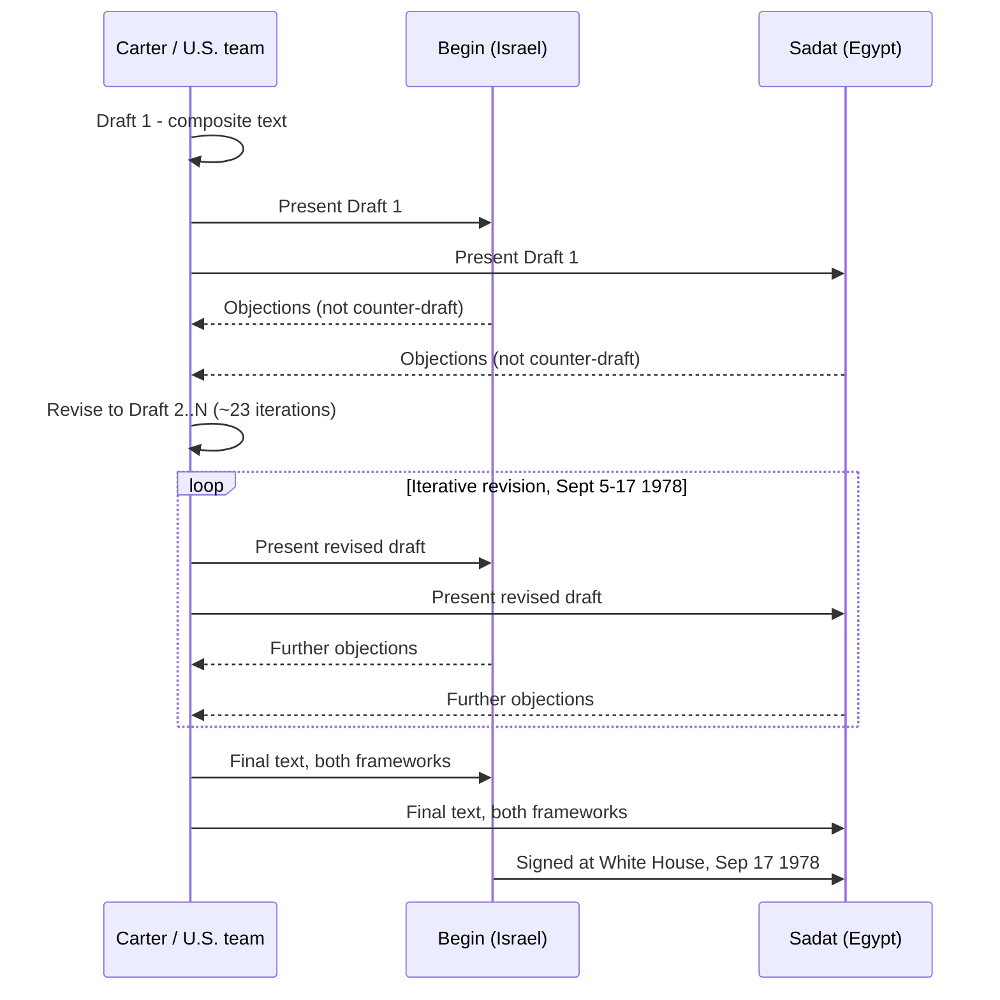

## The Single-Text Mediation Procedure at Camp David

### Definition and Origin

The **single negotiating text procedure** is a mediation technique in which the mediator, rather than requiring each party to submit and defend its own draft proposal, produces one composite text and asks each party only to identify what they find unacceptable in it and why. The mediator revises iteratively based on that feedback until both parties can accept a version, without either party ever having to formally endorse a text before the final round. The technique's theoretical rationale traces to work on negotiation psychology showing that when parties negotiate from competing drafts, each becomes psychologically anchored to defending its own text as a matter of position and credibility, which entrenches distributive bargaining. A single text shifts each party's task from *defending* to *critiquing*, which is a lower-commitment, lower-face-cost cognitive act and therefore more conducive to movement.

The procedure was formalized and popularized in the negotiation-theory literature substantially because of its documented use at the September 1978 Camp David Summit between Israel and Egypt, mediated by U.S. President Jimmy Carter — making Camp David simultaneously the technique's most cited case study and a major reason the technique entered standard negotiation pedagogy (notably via Roger Fisher and William Ury's *Getting to Yes*, which draws on Camp David as its illustrative case for the "one text" method).

### Preconditions at Camp David

By September 1978, direct bilateral talks between Israeli Prime Minister Menachem Begin and Egyptian President Anwar Sadat had demonstrated they could not negotiate face-to-face without the discussion deteriorating into personal animosity and entrenched positional statements. This is the precise condition the single-text procedure is designed to address: it does not require the parties to communicate constructively with each other directly, because all substantive exchange is routed through the mediator's draft rather than through direct dialogue. Carter's decision to convene the summit at the isolated Camp David presidential retreat in Maryland was itself a structural choice reinforcing this: physical isolation from press and domestic political audiences reduced the audience-cost pressure (the political price a leader pays for being seen making concessions) that would have constrained public back-and-forth in Washington or Jerusalem.

### Mechanism, Step by Step

1. **Mediator drafts an initial composite text.** Carter's staff, led substantially by National Security Council staff and briefed extensively beforehand on both sides' positions, produced a first working draft addressing the core issues: Sinai withdrawal, Egyptian-Israeli peace terms, and a framework for Palestinian autonomy.
2. **Each party reviews and objects, not counter-drafts.** Begin and Sadat were asked to identify specific unacceptable provisions and explain the underlying objection, rather than to produce competing draft language. This preserved the single-text format rather than reverting to dueling drafts.
3. **Mediator revises and recirculates.** The U.S. team incorporated objections into a revised draft, repeating the cycle. Historical accounts document approximately twenty-three successive drafts over the thirteen days of the summit (September 5–17, 1978).
4. **Direct meetings are minimized, not eliminated.** Because Begin and Sadat's direct interactions were reportedly counterproductive early in the summit, Carter shifted to conducting most substantive exchange through separate meetings with each leader and his delegation, using the iterative text as the shared reference point rather than requiring the two leaders to negotiate language face-to-face.
5. **Convergence and signature.** The process produced two distinct framework documents — the "Framework for Peace in the Middle East" and the "Framework for the Conclusion of a Peace Treaty between Egypt and Israel" — signed at the White House on September 17, 1978, which subsequently formed the basis for the Egypt-Israel Peace Treaty signed March 26, 1979.

### Why the Format Enabled Movement That Direct Talks Had Not

The single-text procedure's effectiveness at Camp David is best understood through the lens of **BATNA disclosure risk and positional anchoring**. In direct bilateral negotiation, a party that proposes a concession risks two costs: (1) the concession may be read by the other side as revealing weakness, inviting further demands rather than reciprocation, and (2) if reported publicly, the concession creates a domestic audience-cost problem for the leader who proposed it. Routing all substantive movement through a mediator-authored text run largely diffuses both risks: neither Begin nor Sadat had to "propose" a concession in the direct sense; each merely declined to object to language the American side had drafted, which is a lower-visibility, lower-attribution act than initiating a concession — structurally similar to the deniability advantage found in Track II diplomacy (unofficial dialogue by non-state-empowered actors), except here the mediator itself, rather than the go-between, absorbs the attribution risk.

Carter's leverage also mattered independently of the procedural technique: the U.S. offered substantial military and economic aid packages to both Israel and Egypt, meaning the mediation combined the single-text procedural device with what the literature terms "power mediation" — where the mediator can independently alter each party's BATNA through incentives, distinct from the purely facilitative, no-leverage model exemplified by Norway's role in the Oslo channel.

### Sequence Diagram

### Limits and Critiques Specific to This Case

1. **Excludes affected non-signatory parties.** The Framework for Peace in the Middle East addressed Palestinian autonomy without Palestinian representatives participating in the drafting process at any stage — the single text was negotiated exclusively among the U.S., Israel, and Egypt. This is frequently cited as a structural limitation of the technique as applied here: single-text mediation can produce a document both signatories accept while leaving an affected third party's core interests undetermined, contributing to the framework's limited practical effect on the Palestinian autonomy question in subsequent years.
2. **Mediator authorship risks the mediator's own bias entering the text.** Because the U.S. team authored every draft, U.S. policy preferences (e.g., prioritizing a stable Egypt-Israel peace as a Cold War-era strategic goal) shaped the starting framing of every iteration, a dynamic evaluative, mediator-authored processes generally risk more than purely facilitative approaches in which parties generate their own language.
3. **High mediator resource cost.** Twenty-three redrafts over thirteen days required sustained, intensive staff capacity dedicated full-time to the process — a resource commitment available to a resourced great-power mediator like the United States but not necessarily replicable by smaller or less-resourced facilitators.

[Inference] The Camp David case is generally treated in the literature less as evidence that the single-text procedure guarantees success and more as a demonstration of the conditions under which it is likely to work: an empowered, trusted mediator with independent leverage, physical isolation from domestic audience pressures, and parties whose direct interaction has already been shown to be counterproductive.

**Related Topics**

- Facilitative versus evaluative mediation styles and the single-text procedure's place on that spectrum
- Audience costs and the domestic political price of visible concessions
- Power mediation and BATNA-altering leverage (Touval and Zartman)
- The Oslo back-channel as a contrasting facilitative, no-leverage model
- Multiparty exclusion effects in bilateral/trilateral peace frameworks
- Getting to Yes and principled negotiation theory (Fisher and Ury)