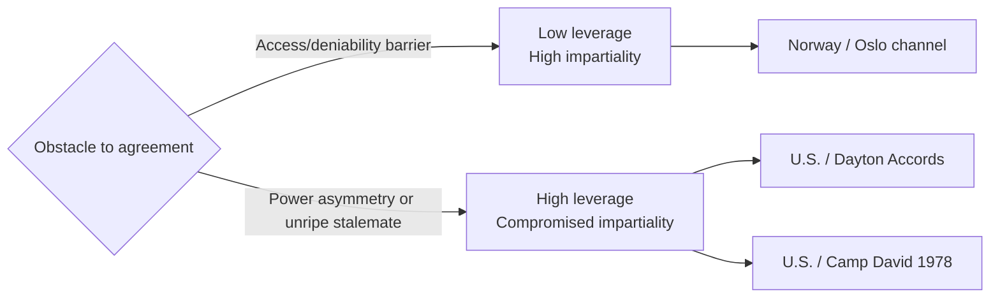

## Mediator Leverage and the Limits of Impartiality

### The Core Tension

Classical mediation theory treats impartiality — the mediator having no stake in the substantive outcome and no bias favoring either party — as a foundational precondition for a mediator's acceptance and effectiveness. Yet empirical study of successful international mediations shows that the mediators who most reliably produce agreements are frequently not neutral in this strict sense: they possess **leverage**, meaning the capacity to independently alter the costs and benefits facing one or both parties, and leverage is disproportionately held by states with their own strategic interest in the outcome. This produces the central puzzle addressed in the mediation literature (most systematically by Saadia Touval and I. William Zartman, *International Mediation in Theory and Practice*, 1985): **the same interest that gives a mediator leverage also compromises the impartiality parties are theoretically supposed to require of a mediator, and yet interested, leveraged mediators succeed more often than disinterested, low-leverage ones in cases involving severe power or informational asymmetry.**

### Sources of Mediator Leverage

Leverage is not a single quantity; the literature identifies several distinct mechanisms by which a mediator can influence outcomes beyond process management:

1. **Material inducement leverage.** The mediator can independently improve a party's BATNA (best alternative to a negotiated agreement) if it accepts a deal, or worsen it if it does not — typically through aid, security guarantees, sanctions relief, or the threat of sanctions. This is the leverage the United States exercised at the 1978 Camp David Summit, where substantial military and economic aid packages to both Israel and Egypt were used to make acceptance of the framework more attractive than continued stalemate.
2. **Reputational/expertise leverage.** A mediator whose factual or legal assessment both parties regard as credible can shift each side's beliefs about the merits of its own position, functioning similarly to the evaluative mediation style, in which the mediator offers substantive judgment rather than only managing process.
3. **Referent/relationship leverage.** A mediator with long-standing trust relationships with one or both parties (often built through prior interactions, shared identity, or sustained diplomatic investment) can extract movement based on relational capital rather than material power — a mechanism more characteristic of smaller, resource-poor facilitators such as Norway in the Oslo channel.
4. **Coercive leverage.** In extreme cases, the mediator can threaten or apply direct pressure (military posture, diplomatic isolation, withdrawal of an existing security relationship) — sometimes termed "muscular mediation." NATO's use of Operation Deliberate Force air strikes against Bosnian Serb positions in 1995, conducted in parallel with U.S.-led shuttle diplomacy, is a documented case in which coercive leverage was applied concurrently with mediation to bring Bosnian Serb leadership to the negotiating table that produced the Dayton Accords.

### Case Study: The Dayton Accords (1995) as Leveraged Mediation

The Dayton Accords negotiations, convened by U.S. Assistant Secretary of State Richard Holbrooke at Wright-Patterson Air Force Base in November 1995, are among the most-cited cases of high-leverage, minimally-impartial mediation. The United States was not a neutral party in the Bosnian War in the disinterested sense: it had led NATO airstrikes against Bosnian Serb forces weeks before the talks began, and Holbrooke's negotiating team combined this recent demonstration of coercive capacity with the threat of continued or renewed military action and the promise of post-conflict reconstruction aid. Holbrooke's own accounts (*To End a War*, 1998) describe the negotiating strategy as involving direct pressure, including confining delegations to the isolated air base for three weeks and imposing his own deadlines and draft proposals — closer to the evaluative, power-backed end of the mediation spectrum than to pure facilitation. Serbian President Slobodan Milošević negotiated on behalf of Bosnian Serb interests despite not himself being a party to the war inside Bosnia, illustrating how leveraged mediation can also involve pressuring an interested third-party sponsor rather than only the immediate belligerents.

### Case Study: Norway in Oslo as Low-Leverage, High-Trust Mediation

By contrast, Norway's facilitation of the 1992–93 Israeli-Palestinian back-channel exemplifies the opposite profile: Norway possessed essentially no material leverage over either Israel or the PLO — no significant aid relationship, no security guarantee capacity, no coercive instruments. Norway's contribution rested almost entirely on referent leverage: Fafo Institute researchers Terje Rød-Larsen and Mona Juul had cultivated personal relationships and a reputation for discretion with figures on both sides prior to the talks. This case is frequently paired with Dayton in the literature specifically to illustrate that low-leverage mediators can succeed where the primary obstacle to agreement is a lack of a secure, deniable communication channel (a problem trust and discretion can solve) rather than a genuine conflict of material interest that only external inducements or pressure can overcome.

### When Does Interested Mediation Outperform Impartial Mediation?

Touval and Zartman's central empirical claim is that mediator effectiveness correlates with leverage more than with impartiality, particularly under two conditions:

- **Severe power asymmetry between the parties.** When one party is substantially weaker, an impartial mediator with no leverage cannot compel the stronger party to make concessions it has no independent incentive to make; only a mediator capable of altering that party's incentives (through aid, security guarantees, or pressure) can produce movement.
- **A mutually hurting stalemate not yet perceived as hurting enough.** Even when conditions for negotiation exist in principle (Zartman's ripeness theory), parties may not yet believe the costs of continued conflict exceed the costs of concession; a mediator with material leverage can artificially accelerate ripening by directly imposing additional costs (sanctions, military pressure) or offering additional benefits (aid) that a neutral facilitator cannot supply.

Conversely, low-leverage but high-trust facilitators tend to outperform interested mediators in different conditions:

- **Legal or political barriers to official contact.** As with the Oslo case, where Israeli law criminalized direct PLO contact, a superpower mediator with an obvious strategic interest in the outcome may be unable to secure the initial access that a discreet, low-stakes facilitator can obtain precisely because it is not perceived as a threat by hardline domestic constituencies on either side.
- **Concerns about greater-power domination of outcome terms.** Parties wary that agreement terms will reflect a powerful interested mediator's own strategic preferences (a documented critique of the U.S. role in shaping the Camp David frameworks) may prefer a facilitator whose lack of leverage also implies a lack of independent stake in imposing particular terms.

### Comparative Table

| Dimension | High-Leverage / Interested Mediation | Low-Leverage / Neutral Mediation |
| --- | --- | --- |
| Leverage source | Material inducement, coercion | Trust, discretion, relationship capital |
| Best suited to | Severe power asymmetry, unripe stalemate | Legal/political access barriers, deniability needs |
| Risk | Outcome seen as imposed; mediator's own interests embedded in terms | Insufficient to move an entrenched or asymmetric dispute |
| Example | Dayton Accords (Holbrooke/U.S., 1995) | Oslo channel (Norway, 1992–93) |
| Impartiality | Compromised by mediator's own strategic stake | Closer to classical neutral-facilitator model |

### Diagram: Leverage-Impartiality Tradeoff

### The Legitimacy Cost of Leverage

Even where leveraged mediation succeeds in producing a signed agreement, the literature identifies a durability cost distinct from the access-barrier problem above: an agreement perceived by domestic constituencies as having been substantively shaped or imposed by an interested outside power risks the same **ratification failure** dynamic documented in critiques of Track II diplomacy and of the Camp David frameworks' exclusion of Palestinian representatives — parties or affected populations who did not participate in shaping the terms, and who may already distrust the mediator's motives, are less likely to treat the resulting agreement as legitimately theirs to uphold.

[Inference] The leverage-impartiality tradeoff is best understood not as a binary choice but as a spectrum mediators and disputants navigate case by case, with the appropriate position on that spectrum depending on which specific obstacle — access, trust, power asymmetry, or stalemate ripeness — is primarily blocking agreement in a given dispute, rather than as evidence that either pure neutrality or pure leverage is generally superior.

**Related Topics**

- Facilitative versus evaluative mediation styles
- Ripeness theory and the mutually hurting stalemate (Zartman)
- The single-text mediation procedure at Camp David
- Coercive diplomacy and the use of force alongside negotiation (Operation Deliberate Force, Dayton)
- The Oslo channel as low-leverage, high-trust facilitation
- Ratification failure and domestic legitimacy of mediated agreements