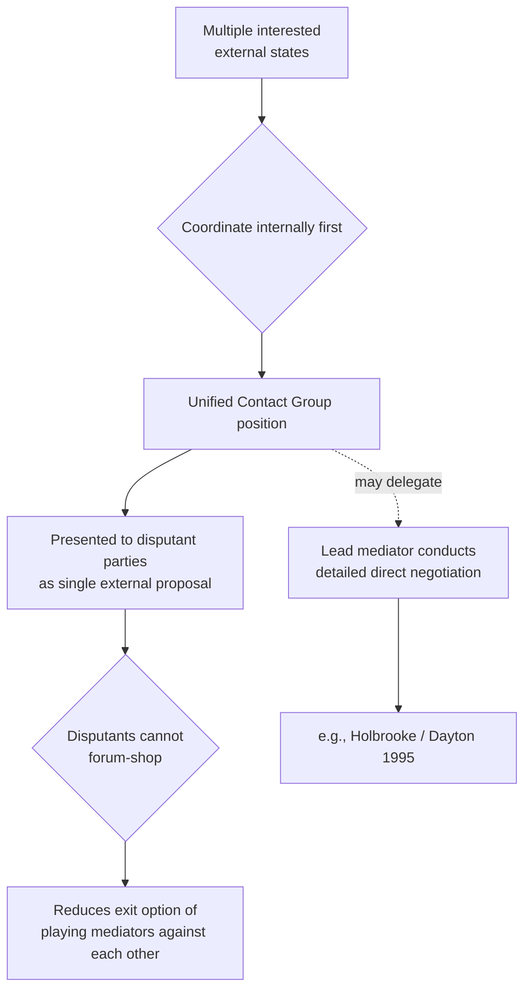

## Multiparty Mediation and the Role of Contact Groups

### Definition and Structural Distinction from Bilateral Mediation

**Multiparty mediation** refers to third-party facilitation conducted not by a single state or individual but by a coalition of external actors — typically several states, sometimes joined by international organizations — acting in a coordinated capacity toward the disputants. A **contact group** is the most institutionalized form this takes: a standing, informally constituted body of interested external states that coordinates its own diplomatic position before engaging the disputants, so that the disputants face a single, pre-negotiated external position rather than several potentially conflicting outside actors competing for influence.

The structural problem multiparty mediation solves is distinct from the leverage and impartiality problems discussed in single-mediator theory (Touval and Zartman's framework, treating mediator effectiveness as a function of leverage more than neutrality). Where a single powerful mediator risks the disputants perceiving the process as reflecting that one mediator's own strategic interests, an uncoordinated multiplicity of external mediators risks the opposite failure mode: **forum shopping**, in which disputants play competing external actors against one another, seeking the mediator whose proposed terms are most favorable, and stalling whenever one mediator's position becomes inconvenient. A contact group is designed specifically to close this exit option by presenting disputants with a unified external position that cannot be shopped around.

### The Coordination Problem Internal to Contact Groups

Because a contact group is itself a coalition of states with distinct national interests, it faces an internal bargaining problem before it can present a unified external position: the mediating states must first negotiate among themselves. This internal process can be as consequential as the mediation of the underlying dispute, and contact group members frequently have divergent interests in the outcome — a dynamic absent from single-mediator cases like the U.S. role at Camp David or Norway's role in the Oslo channel. The internal coordination cost is the primary theoretical tradeoff of the contact group model: it buys unified external leverage at the cost of requiring the mediating coalition to resolve its own disagreements, which can slow the process or force compromises in the mediating position that weaken its coherence.

### Case Study: The Contact Group for Bosnia and Herzegovina (1994–1995)

The Bosnia Contact Group, formed in April 1994, comprised the United States, Russia, the United Kingdom, France, and Germany — a coalition assembled specifically because none of these states alone could credibly claim both leverage over the Bosnian Serb, Bosnian Croat, and Bosniak-led Bosnian government parties and acceptance as a legitimate broker by all sides. Russia's inclusion is the clearest illustration of the coordination-for-leverage logic: Russia held historical and political influence with Bosnian Serb leadership that Western contact group members lacked, while the U.S., UK, France, and Germany held greater leverage over Bosnian government and Croat factions (through NATO's military posture and the prospect of Western reconstruction aid).

The Contact Group's 1994 peace plan proposed a fixed territorial division (51% to a Bosniak-Croat federation, 49% to Bosnian Serb-controlled territory), presented to all parties as a **unified proposal each contact group member had already endorsed internally**, precisely to prevent Bosnian Serb leadership from attempting to negotiate more favorable terms with Russia alone while ignoring Western pressure, or vice versa. When Bosnian Serb leadership rejected the plan via referendum in 1994, the failure illustrated a limit of the model: a unified external proposal removes forum-shopping but does not by itself guarantee disputant acceptance if the terms remain unacceptable to a party not yet at a ripe stalemate (Zartman's concept of the mutually hurting stalemate — the point at which continued conflict's costs are perceived as exceeding the costs of concession).

### From Contact Group to Direct Mediation: The Transition to Dayton

Following the Contact Group's 1994 plan and continued fighting through 1995, NATO's Operation Deliberate Force air campaign against Bosnian Serb positions (August–September 1995) altered the military balance and contributed to a more ripe stalemate. U.S. Assistant Secretary of State Richard Holbrooke then led direct shuttle diplomacy and the subsequent Dayton negotiations (November 1995) on behalf of the broader coalition, illustrating a common multiparty-mediation sequence: **the contact group establishes and coordinates the external position and legitimizes the eventual settlement's terms, while a single empowered lead mediator (in this case, the U.S.) conducts the direct, detailed negotiation with the disputants.** This division of labor allows the coordination benefits of a unified external front while avoiding the practical difficulty of conducting detailed, iterative negotiation (such as the single-text procedure used at Camp David) through a multi-state committee, which would be significantly more cumbersome than a single mediator managing that process directly.

### Comparative Structure: Contact Group vs. Single Mediator

| Dimension | Single Mediator | Contact Group |
| --- | --- | --- |
| Forum-shopping risk for disputants | Low (only one external actor) | Eliminated by design (unified position) |
| Internal coordination cost | None | Significant — members must align first |
| Leverage sources available | Limited to one state's/actor's instruments | Combined leverage across multiple states' distinct relationships |
| Speed of detailed negotiation | Faster (e.g., Camp David's 23 iterative drafts) | Slower — typically hands detailed talks to a lead mediator |
| Example | U.S. at Camp David (1978); Norway in Oslo channel (1992–93) | Bosnia Contact Group (1994–95) |

### Diagram: Contact Group Structure and Function

### Other Documented Contact Group Applications

The contact group model has recurred in several other post-Cold War conflicts, generally following the same logic of combining states with complementary leverage over different disputant parties:

- **Kosovo Contact Group** (a continuation of the Bosnia-era membership: U.S., Russia, UK, France, Germany, later joined by Italy), which attempted to coordinate a unified external position ahead of the 1999 Rambouillet talks preceding the Kosovo War, though Russia's eventual divergence from the Western contact group members over the acceptability of NATO military action illustrates that internal coordination can break down when a genuine, high-stakes conflict of interest exists among contact group members themselves, not only among the disputants.
- **Contact Group on Libya** (2011), coordinated through NATO and Gulf state partners during the Libyan civil war, illustrating that contact groups can be assembled ad hoc for a specific crisis rather than existing as standing institutions.

### Limits of the Contact Group Model

1. **Internal divergence can paralyze the group.** As the Kosovo case illustrates, when contact group members have a genuine conflict of interest regarding the underlying dispute (rather than merely differing tactical preferences), the coordination benefit of the model collapses, and the group's unified position either fractures or defaults to the lowest common denominator all members can accept — potentially a weaker position than any single member might have taken alone.
2. **Legitimacy concerns for excluded regional actors.** A contact group composed primarily of major external powers can generate the same domestic and regional legitimacy critique documented regarding the Camp David frameworks' exclusion of Palestinian representatives: parties and neighboring states not included in the group may view its proposals as externally imposed rather than regionally owned.
3. **Does not resolve ripeness on its own.** As the Bosnian Serb rejection of the 1994 plan demonstrates, a coordinated, forum-shopping-proof external proposal still requires that the underlying stalemate be sufficiently ripe (per Zartman) for the disputants to prefer the proposed terms over continued conflict; unified external pressure can help ripen a stalemate (as NATO airstrikes arguably did before Dayton) but is not automatically sufficient by itself.

[Inference] The contact group model appears most effective as a mechanism for aggregating leverage and foreclosing forum-shopping in disputes where several external powers have complementary but non-identical relationships with different disputant factions, rather than as a general substitute for the detailed, iterative negotiation techniques (such as single-text drafting) that a single empowered mediator can typically execute more efficiently once a ripe moment for settlement has been reached.

**Related Topics**

- Mediator leverage and the limits of impartiality (Touval and Zartman)
- Ripeness theory and the mutually hurting stalemate (Zartman)
- The single-text mediation procedure at Camp David
- Coercive diplomacy and force-backed mediation (Operation Deliberate Force)
- Legitimacy and exclusion effects in externally brokered settlements
- The Rambouillet Conference and its role preceding the Kosovo War