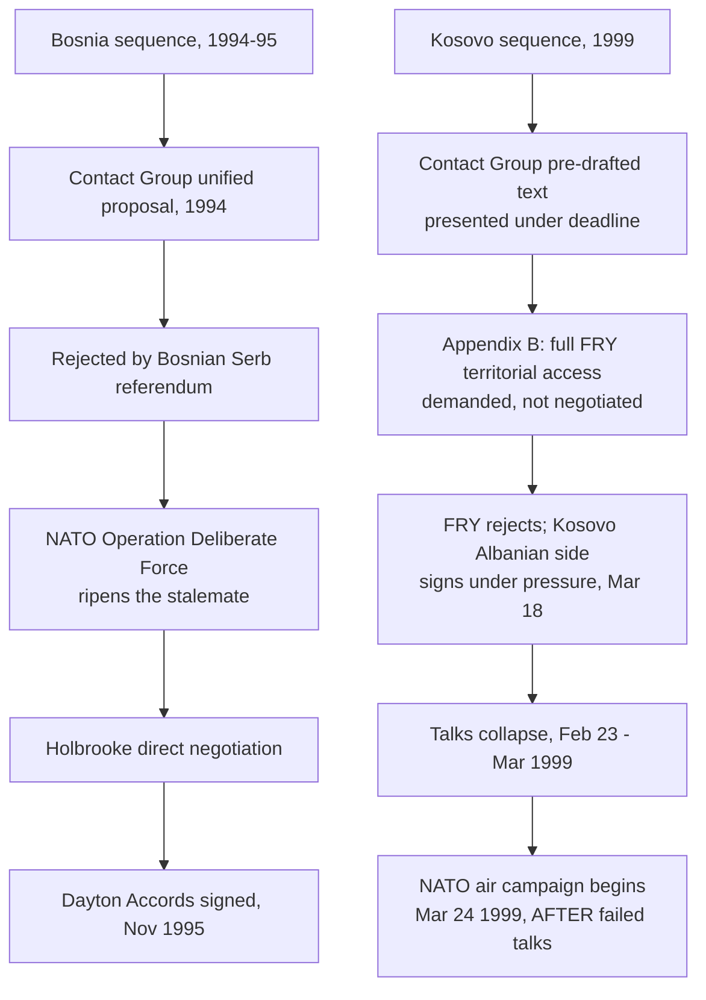

## The Failed Rambouillet Talks as a Documented Mediation Failure

### Background and Convening Context

The Rambouillet Conference (February 6–23, 1999, at the Château de Rambouillet, France) was convened by the Kosovo Contact Group (a continuation of the Bosnia-era coalition: the United States, Russia, the United Kingdom, France, Germany, and Italy) to negotiate a political settlement between the Federal Republic of Yugoslavia (FRY, under President Slobodan Milošević) and Kosovo Albanian representatives, following escalating violence between Yugoslav security forces and the Kosovo Liberation Army (KLA) through 1998. The talks are among the most frequently cited cases of a documented, comprehensive mediation failure that preceded rather than prevented armed conflict — NATO's air campaign against the FRY began March 24, 1999, roughly a month after the talks collapsed.

Recall that a contact group is a coalition of external states that coordinates its own position before presenting disputants with a unified external proposal, designed to prevent disputants from forum-shopping among competing external mediators. Rambouillet is analytically significant precisely because it was convened by this same contact-group model that had underpinned the Dayton Accords' success in 1995, yet produced the opposite outcome — making it a central case for identifying the model's limits rather than its virtues.

### Structural Design of the Talks

The Contact Group imposed a format substantially more coercive and time-limited than either the Oslo channel's open-ended informal process or Camp David's iterative single-text drafting:

- **An imposed deadline.** Delegations were given a fixed negotiating window and told a text would be presented for signature by a set date, a structural choice intended to force urgency but which reduced the time available for the kind of iterative trust-building that characterized successful precedent cases.
- **A pre-drafted text presented for acceptance, not open drafting.** Unlike the Camp David single-negotiating-text procedure, in which the mediator iteratively revised a document based on both parties' evolving objections over thirteen days, the Rambouillet text was substantially pre-written by contact group diplomats (chaired by British and French foreign ministers Robin Cook and Hubert Védrine) and presented to both delegations largely as a document to accept or reject, with limited scope for the disputants themselves to reshape its core terms.
- **Asymmetric attendance.** The Kosovo Albanian delegation, which did not have a single unified command structure at the time (representing multiple political factions alongside the KLA), attended without full authority to bind its own side, while the FRY delegation represented an internationally recognized state government — an asymmetry different in kind from the Oslo channel's Track II origins, where neither side's initial representatives had binding authority.

### The Core Substantive Obstacle: Appendix B

The proposed agreement's Appendix B, governing the status of NATO forces implementing the settlement, would have granted NATO troops free and unrestricted access throughout the entire territory of the FRY (not only Kosovo), including the right to move through Yugoslav territory without FRY government consent or oversight. This provision is widely identified in the historical and diplomatic record as the specific term the Milošević government cited as unacceptable — a demand for extraterritorial military access is a substantially more severe sovereignty infringement than the terms typically found in comparable status-of-forces arrangements, and its inclusion is frequently analyzed as a demand calibrated in a way the FRY could not accept, whether by design (to establish a clear pretext for military action if rejected) or by genuine contact-group miscalculation about what Belgrade would tolerate. [Unverified] Whether Appendix B's severity reflected a deliberate poison pill versus a good-faith but mistaken assessment of Belgrade's true reservation point remains genuinely disputed in the historical and scholarly literature, with some accounts (including remarks attributed to U.S. officials involved) suggesting the terms were calculated to be rejected, and other accounts attributing the outcome to negotiating miscalculation rather than design.

The Kosovo Albanian delegation, by contrast, did not sign the initial text either, reportedly over dissatisfaction with provisions short of the eventual independence referendum the KLA and allied factions sought, though under sustained U.S. pressure the Kosovo Albanian side ultimately signed a version of the accord on March 18, 1999, while the FRY delegation did not.

### Why the Contact Group Model Failed Here

Comparing Rambouillet to the Bosnia Contact Group's successful sequencing (in which the 1994 unified proposal, though itself initially rejected by Bosnian Serb referendum, was followed by NATO's Operation Deliberate Force ripening the stalemate before Holbrooke's direct Dayton negotiations succeeded) surfaces several specific failure mechanisms:

1. **Insufficient ripeness at the time of the ultimatum.** Zartman's ripeness theory holds that a mutually hurting stalemate — the point where continued conflict's costs are perceived by a party as exceeding the costs of concession — is a precondition for a proposal's acceptance, not merely its correct drafting. At Rambouillet, the Contact Group presented near-final terms under deadline pressure without a preceding coercive phase analogous to Operation Deliberate Force having already altered Milošević's calculation; NATO's actual air campaign followed the failed talks rather than preceding them, reversing the sequence that had worked at Dayton.
2. **Deadline-driven format foreclosed iterative single-text refinement.** Where Camp David's twenty-three-draft iterative process allowed each side's objections to reshape the emerging text over time, Rambouillet's compressed and largely pre-set text gave the disputants less genuine authorship over the outcome, reducing the "ownership" effect the single-text procedure is theorized to produce and increasing the likelihood the text would be read as externally imposed.
3. **Internal contact-group coherence masked unequal member commitment.** Unlike the Bosnia Contact Group's earlier coordination, in which Russia's distinct leverage with Bosnian Serb leadership was integrated into a genuinely joint position, Russia's relationship to the Rambouillet process was more strained: Russia participated in the Contact Group but was notably less supportive of the coercive military dimension that Western members were prepared to pursue if talks failed, a divergence that became fully visible once NATO began air operations without UN Security Council authorization (which Russia would have vetoed), undermining the claim that the Contact Group's proposal represented a genuinely unified great-power position rather than a Western-led one merely bearing Russian participation.
4. **Asymmetric delegation authority undermined durable buy-in.** The Kosovo Albanian delegation's internal fragmentation meant that even a signed agreement on that side risked the same **ratification failure** dynamic documented in other mediated settlements (e.g., critiques of the Oslo Accords' limited domestic buy-in): a delegation without unified command over the KLA could not necessarily deliver compliance from all factions even had a full agreement been reached.

### Diagram: Divergence from the Dayton Sequence

### Comparative Table: Rambouillet vs. Successful Contact-Group Precedent

| Dimension | Bosnia Contact Group / Dayton (1994–95) | Rambouillet (1999) |
| --- | --- | --- |
| Ripening sequence | Coercion (airstrikes) preceded final negotiation | Talks preceded coercion; no prior ripening event |
| Text drafting method | Unified proposal, later iterative direct negotiation (Dayton) | Largely pre-set text under fixed deadline |
| Contact Group internal coherence | Genuinely joint position across members | Russian reservations about coercive follow-through visible |
| Disputant delegation authority | Milošević represented Bosnian Serb interests with real authority | Kosovo Albanian delegation lacked unified command |
| Outcome | Signed agreement, held (with continued NATO presence) | Collapsed; followed by armed conflict |

### Interpretive Debate

**The "designed to fail" reading**: some accounts, citing remarks from U.S. officials involved in the process, argue Appendix B's terms were calibrated specifically to be unacceptable to Belgrade, with the Rambouillet process functioning primarily to establish international and domestic political cover for the NATO air campaign that contact-group members (particularly the U.S. and UK) had already concluded was necessary, rather than functioning as a good-faith attempt at a negotiated settlement.

**The "genuine miscalculation" reading**: other accounts attribute the outcome to a good-faith but flawed assessment by contact-group diplomats of what terms Milošević's government could accept, compounded by the compressed timeline and the absence of a prior coercive event that might have altered Belgrade's reservation point, treating the failure as a process design error (insufficient ripeness, insufficient direct iterative drafting) rather than deliberate sabotage of the mediation itself.

[Inference] Both readings are consistent with the observable process failures documented above (deadline compression, insufficient ripening, contact-group internal divergence), and the historical record does not definitively resolve which motivation predominated among contact-group members, meaning Rambouillet's value as a teaching case rests more securely on its process-design lessons than on a settled account of contact-group intent.

**Related Topics**

- Multiparty mediation and the role of contact groups
- Ripeness theory and the mutually hurting stalemate (Zartman)
- The single-text mediation procedure at Camp David, contrasted with pre-set ultimatum texts
- Coercive diplomacy sequencing: airstrikes before versus after negotiation
- Ratification failure and delegation authority in fragmented non-state parties
- NATO's Kosovo intervention and the UN Security Council authorization debate