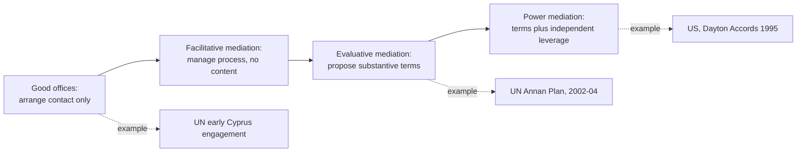

## Good Offices and International Organizations as Mediators

### Definition of "Good Offices" as a Distinct Legal-Diplomatic Category

**Good offices** is a specific term of art in diplomatic and international-law practice denoting the mildest form of third-party involvement in a dispute: a third party facilitates contact and communication between disputants — arranging venues, transmitting messages, offering its premises or personnel — without becoming substantively involved in the negotiation's content, and often without the disputants even negotiating face-to-face through the good-offices provider at all. This places good offices at the extreme facilitative end of the mediation spectrum, distinguishable from full facilitative mediation (as defined in relation to Riskin's mediator-style grid) primarily by degree: a good-offices provider does not manage the negotiation's process the way a facilitative mediator does, but merely enables contact to occur.

The term has specific standing in the UN Charter framework: Article 33 of the UN Charter lists "negotiation, enquiry, mediation, conciliation, arbitration, judicial settlement, resort to regional agencies or arrangements, or other peaceful means" as dispute-resolution mechanisms states are obligated to pursue, and the UN Secretary-General's good offices function has developed as a distinct practice under the Secretary-General's general Charter authority (particularly Article 99, which permits the Secretary-General to bring matters threatening international peace to the Security Council's attention) rather than under any single explicit "good offices" clause.

### Why International Organizations Occupy a Distinct Mediator Category

International organizations (the UN Secretariat, regional bodies such as the African Union or the Organization for Security and Co-operation in Europe) differ structurally from both state mediators (like the U.S. at Camp David) and small-state facilitators (like Norway in the Oslo channel) in ways that shape their mediation role:

1. **Institutional continuity independent of any single government's political cycle.** A UN Secretary-General's envoy or a standing regional-organization mediation unit persists across changes in member-state governments, allowing sustained engagement with a dispute over years or decades in a way that depends less on any single state's shifting domestic political priorities.
2. **Lower (but not absent) leverage than a major-power mediator.** International organizations typically lack the independent material leverage (aid packages, security guarantees, coercive capacity) that gave the U.S. its leverage at Camp David and Dayton; UN mediation efforts generally rely on referent leverage (perceived legitimacy and impartiality) and normative leverage (the weight of an internationally recognized legal or political framework) rather than on inducement or coercion, positioning most UN good-offices and mediation work closer to Norway's low-leverage, high-trust profile than to Holbrooke's power-mediation profile at Dayton.
3. **Multilateral legitimacy at the cost of unified member-state backing.** An international organization's mediation carries the legitimizing weight of broad membership endorsement, but because major member states can hold conflicting interests in the underlying dispute (as Russia's divergence from Western Contact Group members did regarding the Kosovo situation), an international-organization mediator can face the same internal-coordination fragility documented in contact-group mediation, layered on top of the organization's own bureaucratic and political constraints.

### Case Study: UN Secretary-General's Good Offices in Cyprus

The United Nations has exercised continuous good-offices and mediation functions in the Cyprus dispute (between the Republic of Cyprus/Greek Cypriot community and the Turkish Cypriot community, with Greece and Turkey as external guarantor states) since the UN Peacekeeping Force in Cyprus (UNFICYP) was established in 1964, making it one of the longest-running mediation engagements by an international organization. The Secretary-General's Cyprus good-offices mission has cycled through phases resembling different points on the facilitative-evaluative spectrum: for extended periods it functioned as pure good offices (arranging contact and communication channels between the two communities' leaders), while at other points — most notably the 2002–2004 Annan Plan process under Secretary-General Kofi Annan — UN mediators moved toward the more evaluative end, authoring detailed comprehensive settlement plans presented to both communities, structurally resembling the single-text procedure used at Camp David.

The Annan Plan's 2004 referenda outcome (rejected by Greek Cypriot voters, approved by Turkish Cypriot voters) illustrates a limitation specific to international-organization mediation of long-frozen disputes: because the UN mediator lacked the kind of independent material leverage a state mediator like the U.S. could deploy at Camp David or Dayton to alter either community's incentive to accept the plan, the settlement's fate depended almost entirely on each community's own assessment of the terms' merits — with no external inducement available to shift either side's calculation when the terms proved unacceptable to a majority on one side.

### Case Study: African Union Mediation in Sudan/Darfur

Regional organizations occupy an intermediate position: closer to member states geographically and politically, often possessing greater contextual legitimacy with disputants than a geographically distant global body, but frequently facing more acute resource and capacity constraints than the UN. The African Union's mediation role in the Darfur conflict (from 2004, including the AU Mission in Sudan and subsequent AU-UN Hybrid Operation in Darfur, UNAMID, from 2007) illustrates both the legitimacy advantage (an African-led process was seen by many Sudanese and regional stakeholders as more acceptable than an externally imposed Western process) and the capacity limitation (the AU's mediation and peacekeeping efforts were persistently constrained by funding and logistics dependence on external donors, including the UN and Western states, undercutting the AU's practical independence from the same major-power dynamics regional mediation is sometimes framed as an alternative to).

### Distinguishing Good Offices from Fuller Mediation Roles

| Role Type | Substantive involvement | Process control | Example |
| --- | --- | --- | --- |
| Good offices | None — enables contact only | Minimal | UN Secretary-General facilitating initial Cyprus contacts |
| Facilitative mediation | None on substance, but manages structured dialogue | Moderate | Norway, Oslo channel (1992–93) |
| Evaluative mediation | Substantive proposals, single-text drafting | High | U.S., Camp David (1978); UN Annan Plan process (2002–04) |
| Power/coercive mediation | Substantive proposals plus independent leverage | Very high | U.S., Dayton Accords (1995) |

### Diagram: The Good-Offices-to-Mediation Continuum

### The Legal Basis for Third-Party Peaceful Settlement Obligations

It is worth noting precisely what legal obligation underlies international-organization involvement: UN Charter Article 2(3) obligates member states to settle disputes by peaceful means, and Article 33(1) lists good offices' companion mechanisms (negotiation, enquiry, mediation, conciliation, arbitration, judicial settlement, regional arrangements) as the recognized menu of peaceful means, without ranking one as legally superior to another or making any single mechanism, including good offices, mandatory in a particular dispute. This means an international organization's good-offices or mediation role is generally **offered rather than imposed**: disputing states retain the sovereign choice of whether to accept a UN or regional body's proffered good offices, distinguishing this from binding third-party mechanisms such as International Court of Justice adjudication, which requires prior state consent to jurisdiction but produces a legally binding judgment once accepted.

### Limits Specific to International-Organization Mediators

1. **No independent enforcement capacity.** Unlike a state mediator that can back proposals with its own aid or security guarantees, an international organization's proposals generally require member states to separately supply any material incentives or enforcement mechanism, meaning the organization's mediating leverage is often only as strong as the political will of its most engaged member states — reintroducing the same major-power dependency the organizational mediator may have been intended to avoid.
2. **Bureaucratic and mandate constraints.** International organizations' mediation efforts typically require some form of mandate or authorization from a governing body (the UN Security Council or General Assembly; an AU Peace and Security Council decision), which can slow deployment of a mediation effort relative to a single state's ability to act unilaterally, and can be blocked entirely by disagreement among an organization's own member states (as a Security Council veto can block UN Security Council-mandated action).
3. **Perceived proximity to great-power interests can undermine claimed neutrality.** Because major powers hold disproportionate influence within international organizations (permanent Security Council membership with veto power being the clearest example), disputants may perceive nominally multilateral mediation as substantively shaped by the same great-power interests documented as a legitimacy risk in single-state and contact-group mediation, particularly when a mediation effort's funding or diplomatic backing visibly traces to specific major member states.

[Inference] Good offices and international-organization mediation appear most distinctively valuable in disputes where the primary obstacle is establishing or sustaining basic contact and where broad international legitimacy is more important to an eventual settlement's durability than speed or independent material leverage, complementing rather than replacing the state-mediator and contact-group models better suited to disputes requiring rapid, leverage-backed resolution.

**Related Topics**

- Facilitative versus evaluative mediation styles
- Mediator leverage and the limits of impartiality (Touval and Zartman)
- Multiparty mediation and the role of contact groups
- UN Charter Article 33 and the peaceful settlement of disputes framework
- The Annan Plan and referendum-based ratification of mediated settlements
- Regional organizations' comparative legitimacy in local versus global mediation