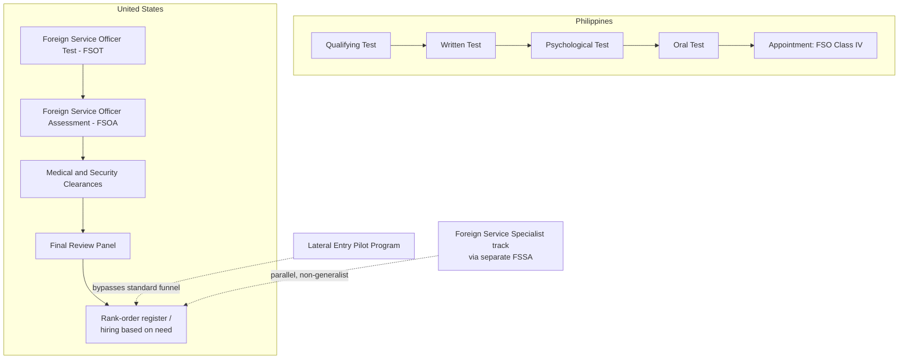

## Foreign Service Entrance Examinations and Lateral Entry Pathways

### Structural Function of Entrance Examinations in Foreign Service Systems

A foreign service entrance examination performs a specific institutional function distinct from most civil-service hiring: it screens for the combination of generalist judgment, negotiation aptitude, and public representational capacity that diplomatic work requires, rather than testing narrow technical competence in a single discipline. Because foreign service officers are commonly rotated across issue areas (political, economic, consular, public diplomacy) and postings over a career, most national systems examined here use a **multi-stage funnel** — a written knowledge test followed by an intensive interpersonal or oral assessment — rather than a single exam, on the theory that written aptitude and the interpersonal/negotiation judgment diplomatic work requires are not reliably measured by the same instrument.

### The Philippine Foreign Service Officer Examination (FSOE)

The Philippine pathway, administered by the Board of Foreign Service Examinations (BFSE) under the Foreign Service Act of 1991 (Republic Act No. 7157), recruits candidates directly to the entry rank of **Foreign Service Officer, Class IV**. The FSOE is structured as a four-stage sequential process, and a candidate must pass each stage to advance to the next:

1. **Qualifying Test (FSOE-QT)** — a written test covering knowledge required at entry level, administered at testing centers across the country. A rating of at least 80.00 on this stage confers two distinct advantages: qualification to advance to the next stage, and conferment by the Civil Service Commission of a standing civil-service eligibility called the Career Foreign Service Officer Eligibility, comparable to the Career Service Professional Eligibility — meaning this stage's value persists independent of whether the candidate ultimately passes the full FSOE. [Civil Service Commission](https://csc.gov.ph/phocadownload/userupload/erpo/announcements/2025/BFSE%20Announcement%202026%20FSOE.pdf)[Civil Service Commission](https://csc.gov.ph/phocadownload/userupload/erpo/announcements/2025/BFSE%20Announcement%202026%20FSOE.pdf)
2. **Written Test** — a substantive knowledge examination administered subsequently, held usually in Metro Manila rather than the distributed provincial testing centers used for the Qualifying Test. [Department of Foreign Affairs](https://dfa.gov.ph/faqs)
3. **Psychological Test** — a required stage that examinees must pass in order to qualify for the Oral Test, screening the personal fitness dimension of the assessment separately from substantive knowledge. [Civil Service Commission](https://csc.gov.ph/phocadownload/userupload/erpo/announcements/2025/BFSE%20Announcement%202026%20FSOE.pdf)
4. **Oral Test** — the final interpersonal assessment stage before Board deliberation on appointment.

**Eligibility requirements** include Philippine natural-born citizenship (with a specific renunciation-of-other-allegiance requirement for dual citizens under the Foreign Service Act's implementing rules), a completed bachelor's degree, and a minimum of two years of work experience following that degree — with a Master's or Juris Doctor degree explicitly not substituting for the required work experience if that experience is absent. A non-refundable ₱500 registration fee applies to the Qualifying Test stage. [Department of Foreign Affairs](https://dfa.gov.ph/faqs)[Department of Foreign Affairs](https://dfa.gov.ph/faqs)

**Failure and retake mechanics** reveal how the Philippine system treats partial progress: examinees who passed the Qualifying Test/CSE-FSO in or after December 2013 are not required to retake that stage if they fail a later stage, and a candidate who fails the Psychological Test must restart from the Written Test stage rather than from the Qualifying Test, subject to Board deliberation, and may retake the Written Test in the following year. This partial-credit structure is distinctive relative to the U.S. system described below, where a full retest of the initial written stage has periodically been required after format revisions. [Department of Foreign Affairs](https://dfa.gov.ph/faqs)

**Compensation upon appointment**: an FSO IV holds salary grade 24, with a basic salary of PHP 102,603 effective January 1, 2026 under Executive Order No. 64, s. 2024, plus allowances and medical insurance benefits under Section 63 of RA 7157. [Department of Foreign Affairs](https://dfa.gov.ph/faqs)

### The U.S. Foreign Service Officer Test (FSOT) and Assessment (FSOA)

The U.S. Department of State's Foreign Service Officer pathway is structurally similar in its funnel logic but organizationally distinct in its knowledge-test design and its recent format history. The process comprises a multiple-choice test assessing general knowledge, English grammar, U.S. history and foreign policy, and logical reasoning, followed by an Oral Assessment combining written and oral examination of general knowledge, analytical skills, and negotiation skills, then medical and security clearances, and a final review panel. [state](https://careers.state.gov/career-paths/fs/)

Unlike the Philippine system's single Written Test stage, the U.S. process names its second major stage the **Foreign Service Officer Assessment (FSOA)**, which since a 2024 modernization has been administered in components: a Case Management Exercise offered separately in advance of a Group Exercise and Structured Interview, with the Case Management Exercise available either from a private location or at approximately 850 on-site Pearson VUE testing locations worldwide. [state](https://careers.state.gov/?p=1350)

**A significant format change occurred in October 2025**: the State Department replaced the prior situational-judgment section with a new logic and reasoning section assessing inference-making, conclusion-justification, identification of logical flaws, and assumption-identification; narrowed the job-knowledge section to U.S. government, history and society, world history and geography, economics, and math and statistics; revised English-expression questions to include reading comprehension; and eliminated the personal narrative essay requirement entirely. Candidates who had already passed the prior version of the FSOT and were awaiting hiring were required to retake the revised test — a retroactive-retake policy the American Foreign Service Association (AFSA) publicly criticized as unfair, describing it as abandoning merit-based principles while imposing an unfair burden on candidates who had already satisfied all prior requirements. [Unverified] The stated policy rationale and its practical effect on candidate pools are contested between the Department's own framing and AFSA's characterization, and I cannot verify which account best represents the change's actual impact from currently available reporting. [State Department Launches New Foreign Service Officer Test; Retakes Required +2](https://www.fedmanager.com/news/state-department-launches-new-foreign-service-officer-test-retakes-required)

The Department has also removed its previous fixed passing-score threshold; candidates now advance competitively based on relative scores and the Foreign Service's stated hiring needs rather than against an absolute cutoff, and as of 2026 the FSOT is administered quarterly, with registration opening one month before each exam window. [speakshark](https://speakshark.com/blog/us-foreign-service-officer-test-dates-2026)[state](https://careers.state.gov/career-paths/fs/)

### Lateral Entry: Definition and Rationale

**Lateral entry** denotes a hiring pathway that admits candidates directly into a foreign service at a rank above the standard entry level, typically in recognition of substantial relevant prior experience (government service in an adjacent policy area, international legal or economic expertise, or comparable private-sector or academic specialization), bypassing the full entry-level examination-and-tenuring track that assumes a candidate begins a career with no prior specialized standing. The rationale mirrors a broader civil-service tension: a purely generalist, entry-level-only recruitment funnel can be slow to acquire specific technical expertise (cybersecurity policy, trade law, regional specialist language competence) that the standard multi-year tenuring track was not originally designed to fast-track.

The U.S. State Department currently operates a Lateral Entry Pilot Program alongside its standard FSOT/FSOA track, reflecting this logic of admitting candidates with relevant prior expertise through a distinct process from the standard entry-level examination sequence. This sits alongside the Department's separate **Foreign Service Specialist** track — assessed through a distinct Foreign Service Specialist Assessment (FSSA) rather than the FSOA used for the generalist Officer track — which recruits directly into specific technical, security, medical, or administrative specializations rather than the five generalist FSO career tracks, functioning as a parallel non-generalist entry point rather than a lateral-rank mechanism per se. [state](https://careers.state.gov/faq_category/fso-career-tracks)[state](https://careers.state.gov/?p=1350)

### Comparative Structure

| Dimension | Philippines (FSOE) | United States (FSOT/FSOA) |
| --- | --- | --- |
| Governing framework | Foreign Service Act of 1991 (RA 7157) | Foreign Service Act of 1980 (not directly cited above) |
| Administering body | Board of Foreign Service Examinations (BFSE), with CSC | U.S. Department of State Board of Examiners |
| Number of sequential stages | Four: Qualifying Test, Written Test, Psychological Test, Oral Test | Written test (FSOT), then multi-component Assessment (FSOA), then clearances and final review |
| Entry rank | Foreign Service Officer, Class IV | Entry-level FSO (career track selected at FSOT registration) |
| Partial-credit on stage failure | Yes — Qualifying Test standing generally preserved across cycles | Generally requires reapplication into a new testing cycle |
| Specialist/lateral pathway | Not identified in available material as a distinct formal track | Distinct Foreign Service Specialist Assessment (FSSA) track, plus a Lateral Entry Pilot Program |
| Minimum work experience | Two years post-bachelor's | Not identified as a fixed statutory minimum in cited material |

### Diagram: Comparative Examination Funnels

### Analytical Note on Examination Design Choices

Both systems separate a **knowledge/aptitude screen** from a **judgment/interpersonal screen**, reflecting the same underlying theory: written tests can efficiently screen a large applicant pool on baseline knowledge and reasoning, but the negotiation, cultural, and representational judgment central to diplomatic effectiveness is better assessed through structured interpersonal exercises (the Philippine Oral Test; the U.S. Case Management Exercise, Group Exercise, and Structured Interview) that a written instrument cannot reliably measure. [Inference] The U.S. system's 2025 removal of narrative-essay and situational-judgment components in favor of a discrete logical-reasoning section suggests an institutional judgment that abstract reasoning ability is a more efficient first-stage filter than assessed writing or hypothetical scenario judgment, though the practical effect of this substitution on eventual officer performance is not something available reporting resolves.

**Related Topics**

- Career tracks within a foreign service (Consular, Economic, Management, Political, Public Diplomacy)
- Tenuring and promotion mechanics into a Senior Foreign Service
- Comparative civil-service versus political-appointee models of diplomatic staffing
- The role of language and area-studies specialization in assignment posting
- Security and medical clearance standards for overseas diplomatic postings
- Attrition and retention dynamics in career foreign services