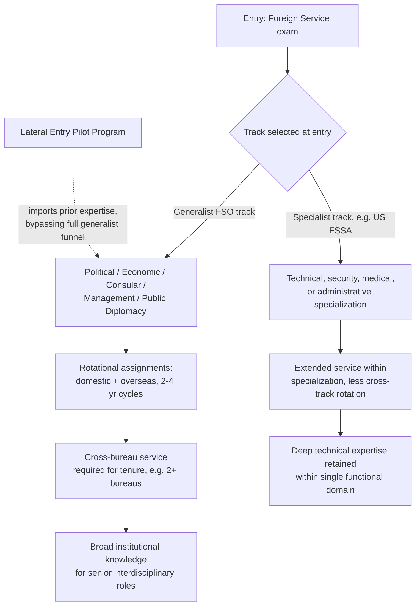

## Rotational Assignments and the Generalist versus Specialist Track

### The Rotational System: Definition and Institutional Rationale

A **rotational assignment system** is a career-management structure in which a foreign service officer is periodically reassigned — typically every two to four years — between different postings (domestic headquarters and overseas missions) and often between different functional areas, rather than remaining in a single role, geographic region, or issue portfolio for a full career. Recall that career tracks within a generalist foreign service (as previously defined for the U.S. system: Consular, Economic, Management, Political, and Public Diplomacy) represent the functional lanes an officer selects, but rotation determines how much of a career is spent moving across postings and, in many systems, across those functional lanes as well.

The institutional rationale rests on three distinct goals that can be in tension with one another:

1. **Breadth of institutional and regional knowledge.** An officer who serves in multiple regions and functional roles develops a broader base of comparative experience than one confined to a single specialization, which is valued for eventual senior positions requiring interdisciplinary and interagency leadership across varied portfolios.
2. **Equitable distribution of hardship and desirable postings.** Rotation prevents any single officer from being permanently confined to, or permanently exempted from, difficult or dangerous posts, distributing hardship service across the officer corps over a career rather than concentrating it.
3. **Institutional resilience against capture or over-familiarity.** Periodic rotation reduces the risk that a long-serving officer becomes so embedded in a single bilateral relationship or local network that professional judgment is compromised by personal relationships accumulated over an extended single posting — a risk distinct from, but related in spirit to, the referent-leverage dynamics discussed in mediator trust-building, where sustained personal relationships are an asset for facilitation but can become a liability for independent judgment if institutionalized without rotation.

### The Generalist Model

Under a **generalist** model — the U.S. Foreign Service Officer track is the paradigm case — officers are hired into one of several broad career tracks (in the U.S. case, Consular, Economic, Management, Political, or Public Diplomacy) at entry, but the explicit career expectation is that an officer will serve in a mix of assignments that cross track boundaries over time, rather than remaining confined to the original track. The U.S. system's tenuring standard makes this structural: the sole criterion for a positive tenuring decision is a candidate's demonstrated potential to serve effectively as a Foreign Service Officer over a normal career span — not track-specific performance — and officers are expected to complete service in at least two separate bureaus after tenure, alongside a mix of completed domestic and overseas assignments demonstrating both regional and substantive expertise. This means the "generalist" label describes not an absence of expertise but an expectation that expertise will be acquired incrementally across multiple postings and roles rather than concentrated in one from the start.

### The Specialist Model

By contrast, a **specialist** track recruits and retains officers within a specific technical, security, medical, administrative, or linguistic specialization from entry onward, without the same expectation of eventual cross-functional generalist rotation. In the U.S. system, this is institutionalized as the Foreign Service Specialist track, assessed through a distinct Foreign Service Specialist Assessment (FSSA) separate from the generalist Foreign Service Officer Assessment (FSOA), reflecting a recognition that the aptitudes required for specialist functions (e.g., regional security, medical support, information management) are not well-screened by the same generalist assessment instrument used for the Political or Economic officer tracks.

The core tradeoff between the two models mirrors a familiar organizational-design tension: **specialization deepens expertise but narrows an individual's institutional perspective and flexibility, while generalist rotation broadens perspective and organizational resilience at some cost to depth in any single technical domain.** Neither the Philippine FSOE process nor the U.S. FSOT/FSOA process as previously documented indicates that the Philippine system maintains a formally distinct specialist entry track comparable to the U.S. FSSA; the Philippine Foreign Service Officer, Class IV entry point applies to a single generalist officer corps, though this does not preclude in-career functional specialization through later assignment history — it means the initial *examination and entry pathway* is not bifurcated the way the U.S. system's parallel FSOA/FSSA structure is.

### Structural Tension: Rotation versus the Lateral Entry and Specialist Tracks

Recall that lateral entry (a hiring pathway admitting candidates directly above entry level in recognition of prior relevant expertise, distinct from the standard generalist entry examination sequence) and the specialist track both represent institutional adaptations that push against pure generalist rotation logic, because they are designed specifically to retain or import deep expertise that a fully generalist rotational career path would dilute. This creates a structural question every foreign service with both a generalist rotational corps and either a specialist track or a lateral entry mechanism must answer: **how much of the institution's expertise-acquisition should occur through rotation-driven generalist breadth, versus through recruiting and retaining officers whose value is precisely that they do not rotate out of their specialization.**

### Diagram: Generalist Rotation versus Specialist Track Structure

### Costs and Benefits Compared

| Dimension | Generalist Rotational Track | Specialist Track |
| --- | --- | --- |
| Depth of technical expertise | Lower per domain, broader overall | Higher in specific domain |
| Institutional breadth for senior leadership | Higher — cross-bureau experience required | Lower unless combined with later track transfer |
| Vulnerability to over-familiarity/capture risk | Lower — periodic rotation limits entrenchment | Higher — sustained specialization can mean sustained relationships |
| Speed of building deep expertise in an emerging domain (e.g., cyber policy) | Slower — expertise diffused across rotating officers | Faster — dedicated recruitment and retention |
| Entry assessment | Generalist instrument (e.g., U.S. FSOA) | Distinct specialist instrument (e.g., U.S. FSSA) |
| Tenuring/advancement criterion | Demonstrated potential across varied assignments | Typically track-specific performance and expertise |

### Practical Implications for Career Planning

An officer choosing (where the system allows a choice) between orienting toward generalist rotation and pursuing or seeking transfer into a specialist track is effectively choosing between two different long-run value propositions to the institution: the generalist path positions an officer for senior leadership roles precisely because those roles require the interdisciplinary, cross-bureau judgment the rotational system is designed to build, while the specialist path positions an officer as an irreplaceable technical resource whose value would be diminished by the same rotation that builds a generalist's career capital. [Inference] Neither path is straightforwardly superior; the appropriate choice depends on an individual officer's comparative advantage and the institution's actual demand for deep specialization versus broad interdisciplinary leadership at a given point in its own strategic priorities, which is not something a general career-mechanics overview can resolve for any specific case.

**Related Topics**

- Foreign service entrance examinations and lateral entry pathways
- Tenuring and promotion mechanics into a Senior Foreign Service
- Career tracks within a generalist foreign service (Political, Economic, Consular, Management, Public Diplomacy)
- Hardship posting differentials and equitable assignment distribution systems
- Regional and functional bureau structure within a foreign ministry
- Comparative civil-service versus political-appointee models of diplomatic staffing