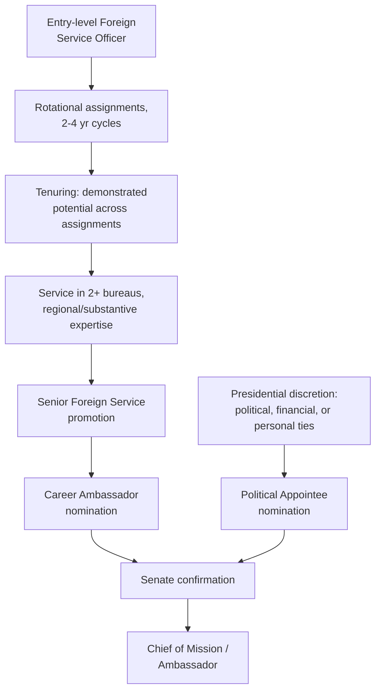

## Political Appointees versus Career Diplomats

### The Structural Distinction

A **career diplomat** enters a foreign service through the competitive examination and assessment process (the multi-stage funnel documented in the Philippine FSOE and U.S. FSOT/FSOA systems) and advances through a merit-based, rotational career governed by tenuring standards, seniority, and performance evaluation over decades of service. A **political appointee** occupies a senior diplomatic post — most visibly an ambassadorship — through selection by the head of government or state as a matter of executive discretion, without passing through the standard entrance examination or career ladder, and typically serves only for the duration of the appointing administration's term.

This distinction sits at the top of the career structure the rotational and tenuring mechanics build toward: while a career officer's path to a senior post like an ambassadorship runs through the tenuring and cross-bureau assignment requirements previously discussed (e.g., the U.S. requirement of service in two separate bureaus after tenure, demonstrated regional and substantive expertise, and Senior Foreign Service promotion), a political appointee bypasses this entire structure, entering directly at the ambassadorial or senior-envoy level.

### The U.S. Case: Institutionalized Dual-Track Ambassadorial Appointment

The United States is the most extensively documented case of a system that formally and simultaneously staffs the same category of position — chief of mission (ambassador) — through both pathways. U.S. ambassadors require Senate confirmation regardless of whether they are career or political appointees, but the nomination itself originates from the President's discretion in both cases; the distinction lies in whether the nominee has a career Foreign Service background.

The proportion of U.S. ambassadorial posts filled by political appointees versus career officers has varied by administration but has historically run in the range of roughly 30 percent political appointees to 70 percent career officers across recent decades, though this ratio is not fixed by statute and fluctuates with each administration's practice. Politically appointed ambassadors are disproportionately assigned to a specific subset of posts: major Western European capitals, and other prestigious or logistically comfortable postings, are considerably more likely to receive political appointees than smaller, higher-hardship, or more technically demanding posts, which are disproportionately staffed by career officers whose specialized regional and functional expertise the rotational system was designed to build.

### Rationale for Political Appointments

Several distinct rationales are advanced for maintaining a political-appointment channel alongside a career service, corresponding loosely to different sources of value a career track does not automatically supply:

1. **Direct access and trust with the appointing head of government.** A politically appointed ambassador who is a personal associate, campaign supporter, or trusted confidant of the president may carry a form of informal access and credibility with the home government that a career officer, however skilled, does not automatically possess — potentially useful when a posting's core function is less about technical negotiation and more about symbolic representation or direct high-level channel-building.
2. **Reward and patronage function.** Ambassadorial appointments have historically served as a mechanism for rewarding political supporters, campaign donors, or party loyalists — a function explicitly separate from diplomatic skill and frequently the target of criticism (discussed below) precisely because it can appear to prioritize political debt repayment over posting-specific competence.
3. **Fresh perspective and reduced institutional inertia.** Proponents of political appointment sometimes argue that career services can develop excessive institutional caution or "clientitis" (a term used pejoratively for career diplomats perceived as having become advocates for their host country's perspective rather than their home government's), and that an outsider appointee is less susceptible to this dynamic — an argument structurally similar to the rotational system's own stated rationale of preventing long-term entrenchment and capture, but applied to justify bypassing career pathways entirely rather than merely rotating within them.

### Case for the Career Model

Critics of extensive political appointment, and proponents of a predominantly career-staffed ambassadorial corps, generally argue from the same institutional logic underlying rotational and tenuring systems:

1. **Regional and technical expertise accumulated through rotation.** A career officer arriving at an ambassadorial post typically brings language competence, prior postings in the region, and functional expertise built cumulatively across a rotational career — the specific asset the tenuring and cross-bureau assignment requirements are designed to build — which a political appointee arriving without prior diplomatic service frequently lacks.
2. **Insulation from short-term political considerations.** A merit-based career track is designed to select and promote officers based on demonstrated diplomatic judgment rather than political loyalty or campaign contribution, theoretically producing personnel decisions less vulnerable to the patronage critique that attaches to political appointment.
3. **Continuity across administration transitions.** Because career officers do not depart en masse with a change in administration the way many senior political appointees do, a predominantly career-staffed diplomatic corps provides greater institutional continuity in bilateral relationships and ongoing negotiations that span multiple political terms.

### Comparative International Practice

Political appointment of ambassadors to the extent practiced in the U.S. system is not universal among foreign services; many countries — including, based on the FSOE structure previously documented, the Philippines' Foreign Service Officer corps — rely much more heavily on a fully career-based ambassadorial corps, with political appointment reserved for rare or exceptional circumstances rather than institutionalized as a routine, substantial minority share of senior postings. [Unverified] I do not have verified, current comparative data on the specific proportion of politically appointed versus career ambassadors across a broad set of national foreign services beyond the U.S. case documented above, and would need to search specific national practices individually to make a reliable comparative claim beyond the general observation that the U.S. system's scale of political appointment is comparatively unusual among career-based foreign services.

### Diagram: Dual Pathways to Ambassadorial Appointment (U.S. Case)

### The Underlying Tradeoff

The political-appointee/career-diplomat distinction reproduces, at the most senior level of diplomatic staffing, the same generalist-specialist tradeoff discussed in relation to rotational assignment structures: a career diplomat's value proposition rests on accumulated, verifiable expertise built through a structured merit process, while a political appointee's value proposition (where a genuine one exists beyond patronage) rests on direct access, trust, or perspective that the structured career process does not by itself generate. [Inference] The empirical debate over whether a given political appointment improves or degrades a specific bilateral relationship's management is highly case-dependent — turning on the individual appointee's own aptitude and the posting's specific demands — and a general career-mechanics overview cannot responsibly generalize about outcomes across the full range of historical political appointments without examining specific cases in detail.

**Related Topics**

- Rotational assignments and the generalist versus specialist track
- Foreign service entrance examinations and lateral entry pathways
- Tenuring and promotion mechanics into a Senior Foreign Service
- "Clientitis" and institutional capture risk in long-term diplomatic postings
- Senate confirmation processes for U.S. chiefs of mission
- Comparative civil-service versus patronage-based models of state diplomatic staffing