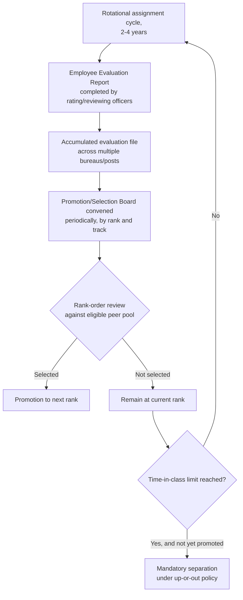

## Performance Evaluation and Promotion Boards in Foreign Services

### The Structural Problem Promotion Systems Solve

Once an officer has entered a foreign service through the entrance examination process and begun a rotational career, the institution faces a recurring measurement problem distinct from initial selection: **how to compare officers who have served in different bureaus, regions, and functional roles against a common standard**, given that the rotational system deliberately places officers in varied assignments precisely so that no two officers' records are directly comparable on task-specific output alone. A promotion board system is the institutional answer to this problem — a periodic, centralized review process that evaluates accumulated performance records against defined competencies rather than relying on a single supervisor's judgment or a fixed seniority timetable alone.

### Performance Evaluation: The Input to the Board Process

Foreign services generally rely on a **structured annual or periodic evaluation report**, completed by an officer's rating and reviewing supervisors, that assesses performance against defined competencies rather than a narrative-only assessment. In the U.S. Foreign Service, this instrument is the Employee Evaluation Report (EER), which rating and reviewing officers complete to document an officer's performance during a specific assignment cycle, generally addressing leadership, substantive/technical skill in the relevant career track, interpersonal and representational effectiveness, and management ability where applicable. Because an officer accumulates one such report per assignment cycle across a rotational career spanning multiple bureaus and posts (recall the U.S. tenuring requirement of service in at least two separate bureaus after tenure), the promotion board's task is explicitly to synthesize a *body* of such reports spanning different supervisors, functional roles, and regional contexts — not to evaluate a single tour in isolation.

This creates a distinct measurement challenge: because supervisors across different bureaus and posts do not calibrate their ratings against a common baseline, evaluation reports are vulnerable to **rater variance** (some supervisors rate more generously than others) and to **halo effects** from an officer's reputation preceding a specific tour. Foreign services address this partly through standardized report formats and defined competency rubrics, and partly through the promotion board structure itself, which aggregates judgment across multiple board members reviewing the same file rather than relying on any single evaluation in isolation.

### The Promotion Board Mechanism

A **promotion board** (in U.S. usage, a Selection Board) is a panel — typically composed of senior officers from within the service, sometimes supplemented by public members from outside the foreign service — convened periodically to review the accumulated evaluation files of officers eligible for promotion within a given rank and career track (or, at more senior levels, across tracks), and to rank-order or select a subset of eligible officers for promotion based on that review. Because boards review files rather than interview candidates directly in most systems, the written evaluation record functions as the near-exclusive evidentiary basis for the promotion decision, which is why evaluation-report quality and consistency carries such institutional weight.

The board process typically operates against a **quota or targets structure**: rather than promoting every officer who meets a fixed competency bar (as a pass/fail credentialing exam might), boards generally select a limited number of officers for promotion from a larger eligible pool in a given cycle, based on relative ranking against peers at the same grade — introducing an explicitly *competitive*, rank-order element to promotion that is structurally different from the largely sequential, stage-based pass/fail logic of the entrance examination funnel (the Qualifying Test, Written Test, Psychological Test, and Oral Test stages of the Philippine FSOE, or the FSOT-then-FSOA sequence in the U.S. system).

### Time-in-Class and Up-or-Out Systems

Many career foreign services, including the U.S. Foreign Service, operate under a **time-in-class (TIC)** or **up-or-out** structure: an officer who is not promoted within a defined number of years at a given rank becomes subject to mandatory separation from the service, rather than being permitted to remain indefinitely at the same grade. This design choice reflects an institutional judgment that a rotational, competitive-promotion system functions best when officers who are not advancing are removed rather than retained indefinitely at a static rank, on the theory that indefinite retention without advancement both blocks promotion opportunities for more competitive junior officers and signals an institutional tolerance for stagnation inconsistent with the merit-based selection logic underlying the entrance examination process itself.

### Diagram: The Evaluation-to-Promotion Pipeline

### Rationale and Critiques of the Up-or-Out Model

**The case for up-or-out**: proponents argue it maintains the same meritocratic discipline that justified the competitive entrance examination in the first place — a service that screens rigorously at entry but then permits indefinite retention without advancement risks accumulating officers whose performance no longer meets the bar the entrance process was designed to enforce, undermining the institutional rationale for competitive selection at every subsequent career stage.

**Critiques of up-or-out**: critics argue the model can incentivize risk-averse behavior — officers may avoid difficult, high-stakes, or unconventional assignments (precisely the kind of challenging postings the rotational system is partly designed to distribute equitably) if a single poor outcome on a high-visibility assignment could jeopardize a promotion needed to avoid mandatory separation. This creates a possible tension between the rotational system's goal of building broad, varied experience (including in hardship or high-risk posts) and an individual officer's rational incentive under an up-or-out regime to seek safer, more evaluatively favorable assignments instead.

### Distinguishing Promotion Boards from Tenuring Decisions

It is worth distinguishing the promotion board process from the **tenuring decision** discussed in relation to rotational assignment structures. Tenuring is a threshold, largely binary determination made relatively early in a career (whether an officer has demonstrated sufficient potential to continue as a career officer at all, based on the sole criterion of demonstrated potential across assignments, not track-specific performance) — a gate an officer passes through once. Promotion boards, by contrast, are a recurring, competitive, comparative process an officer faces repeatedly throughout a career at each successive rank, evaluated against a peer cohort rather than against a fixed threshold alone. Tenuring asks "should this officer continue in the service at all," while promotion boards ask "how does this officer's accumulated record compare to peers competing for a limited number of advancement slots at this rank."

### Comparative Table: Entrance Examination versus Promotion Board Logic

| Dimension | Entrance Examination (e.g., FSOE, FSOT/FSOA) | Promotion Board |
| --- | --- | --- |
| Timing | Once, at entry | Recurring, at each rank |
| Selection logic | Largely sequential pass/fail stages | Competitive rank-order against peer pool |
| Evidentiary basis | Direct testing and assessment exercises | Accumulated evaluation reports across assignments |
| Consequence of failure | Non-admission to the service | Non-promotion; potential mandatory separation under up-or-out |
| Comparability challenge | All candidates face the same instrument | Officers compared despite serving in different bureaus/regions |

[Inference] Because promotion board decisions rest heavily on evaluation-report quality and the specific board members' comparative judgment in a given cycle, a career foreign service's promotion system likely carries more embedded subjectivity than its entrance examination system, notwithstanding structured competency rubrics and multi-member board review designed to mitigate individual rater variance — though the extent of this effect would require dedicated empirical study of specific services' promotion outcomes to establish with confidence rather than being resolvable from general institutional design principles alone.

**Related Topics**

- Rotational assignments and the generalist versus specialist track
- Tenuring decisions and the "demonstrated potential" standard
- Foreign service entrance examinations and lateral entry pathways
- Political appointees versus career diplomats and parallel routes to senior rank
- Up-or-out personnel systems in other professional contexts (e.g., military officer corps)
- Rater bias and calibration challenges in structured performance evaluation