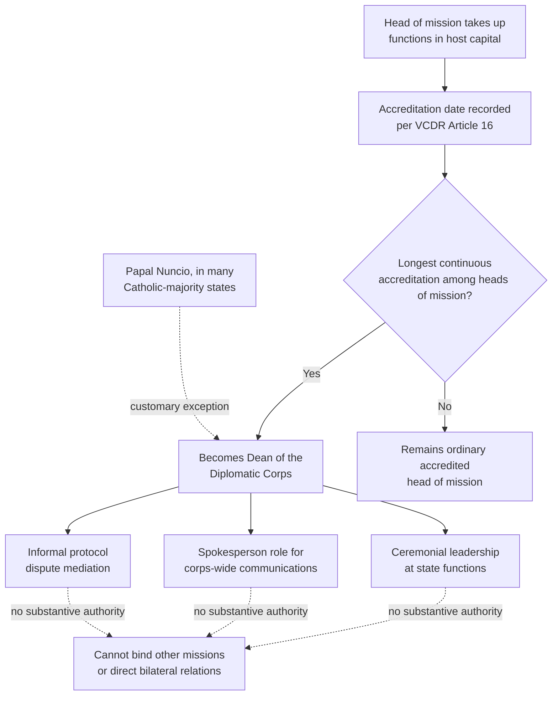

## The Dean of the Diplomatic Corps and Ambassadorial Associations

### Definition and Legal Basis

The **dean of the diplomatic corps** (French: *doyen du corps diplomatique*, reflecting the historical dominance of French as the language of diplomatic protocol) is the head of mission in a given capital who has accumulated the longest continuous period of accreditation to the host state, and who by virtue of that seniority occupies a largely ceremonial and representational leadership role for the diplomatic corps as a collective body. The position is grounded in customary protocol practice codified by the **Vienna Convention on Diplomatic Relations (VCDR), 1961, Article 16**, which establishes that heads of mission take precedence in their respective classes according to the date and time of taking up their functions — meaning seniority for precedence purposes, and by extension the dean's role, is determined by an objective, non-discretionary chronological rule rather than by host-state selection or the corps' own vote. In many Catholic-majority states, a customary exception applies: the papal nuncio (the Holy See's diplomatic representative) is traditionally accorded the deanship regardless of seniority, a practice reflecting historical precedent rather than a VCDR requirement.

### Functions of the Dean

The dean's role is almost entirely representational and coordinative rather than substantive or decision-making, distinguishing the position sharply from any negotiating or mediating function discussed elsewhere in diplomatic practice:

1. **Speaking on behalf of the diplomatic corps collectively.** When the host government wishes to communicate with the assembled diplomatic corps as a body (protocol announcements, ceremonial matters, occasionally a collective response to a crisis affecting foreign missions generally), the dean typically serves as the corps' point of contact and, where appropriate, its spokesperson.
2. **Ceremonial leadership at state functions.** The dean often leads the diplomatic corps' collective participation in state ceremonies — presenting collective greetings at year-end or national holidays, or coordinating corps-wide participation in state funerals or inaugurations — functioning as a protocol coordinator rather than a substantive negotiator.
3. **Informal mediation of protocol disputes among missions.** Because precedence, seating, and ceremonial treatment can be sources of friction among accredited missions (a dispute over precedence order at a state function, for example), the dean sometimes serves an informal facilitative role in resolving such disputes — a facilitative function in the narrow procedural sense (managing process without asserting a substantive position on the merits of any state's underlying bilateral relationship with the host), structurally analogous to the narrow, apolitical scope of good offices in political mediation, though confined here to matters of ceremonial protocol rather than substantive interstate disputes.
4. **Occasional informal channel to the host government during crises.** In some documented instances, deans have served as an informal conduit conveying the diplomatic corps' collective concerns to the host government during periods of political instability affecting foreign missions broadly, though this function depends heavily on the individual dean's standing and the host government's willingness to engage the corps collectively rather than bilaterally.

### What the Dean Is Not

It is important to state precisely what the position does not confer, since the ceremonial prominence of the role can obscure its narrow legal function. The dean holds **no formal authority over other missions' operations**, no diplomatic immunity or privilege beyond what the dean's own accrediting status already provides under the VCDR, and no role in the substantive bilateral relationship between the host state and any individual sending state. The position confers precedence and a coordinating convenience, not power — the dean cannot direct another ambassador's conduct, cannot bind the corps to a collective position without genuine voluntary agreement among missions, and has no standing under the VCDR distinct from any other accredited head of mission beyond the seniority-based precedence rule itself.

### Precedence Mechanics Under VCDR Article 16

The chronological seniority rule matters because it removes host-state discretion from a potentially sensitive determination: if the host government could select the dean, doing so would implicitly signal a preference among accredited states, creating exactly the kind of favoritism concern the VCDR's broader architecture of reciprocal, formally equal treatment among accredited missions (regardless of the sending state's relative power) is designed to avoid. Basing the dean's identity purely on the objective, verifiable date of accreditation removes this discretion and thereby removes it as a source of diplomatic friction — a design logic similar in spirit to why deconfliction mechanisms (as discussed in crisis-communication contexts) are deliberately depoliticized and narrowly scoped: removing subjective judgment from a procedural function preserves the function's ability to operate smoothly even amid broader political tension between the host state and specific missions.

### Ambassadorial Associations

Distinct from the individual dean role, many diplomatic corps also maintain **ambassadorial associations** — more formally organized bodies of accredited heads of mission (or, in some capitals, broader associations including spouses or the wider diplomatic community) that convene regularly for professional, social, and sometimes advocacy purposes beyond the dean's largely ceremonial function. These associations typically:

- Organize regular social and professional events providing a venue for informal contact among heads of mission across the full diplomatic corps, independent of bilateral relations between specific sending states.
- Coordinate charitable or community engagement activities in the host country, often functioning as a visible, apolitical form of collective diplomatic community presence.
- In some capitals, provide a collective voice on matters of shared concern to the diplomatic community as a whole — working conditions, security concerns affecting diplomatic missions generally, or logistical matters (customs, banking access, visa reciprocity issues) that affect the diplomatic community collectively rather than any single bilateral relationship.

Because ambassadorial associations are voluntary and organized independently of the VCDR's precedence rules, their internal leadership structures (which may or may not track the formal dean role) and scope of activity vary considerably by capital and are not governed by a uniform international legal instrument comparable to VCDR Article 16.

### Diagram: Dean Selection and Functional Scope

### Relationship to Broader Diplomatic Protocol Practice

The dean role fits within the broader body of diplomatic protocol governed principally by the VCDR, which also establishes precedence rules among heads of mission of the same class more generally (ambassadors before ministers before chargés d'affaires, for instance, as distinct classes under Article 14), immunity and inviolability provisions, and the formal reciprocal-equality framework underlying accredited diplomatic status regardless of the sending state's relative size or power. The dean's chronological-seniority basis is a specific application of this broader precedence architecture to the practical problem of designating a single representative figure for the corps as a whole, rather than a separate or freestanding protocol institution.

[Inference] Because the dean's practical influence depends substantially on the individual's personal standing, host-government relations, and willingness to engage in the informal coordinative functions described above, the position's real-world significance likely varies considerably across capitals and eras in ways a general definitional overview cannot fully capture — the position's formal basis under VCDR Article 16 is uniform, but its practical exercise is not.

**Related Topics**

- The Vienna Convention on Diplomatic Relations and precedence rules (Article 14, Article 16)
- Diplomatic immunity and inviolability under the VCDR
- Protocol disputes and precedence conflicts among accredited missions
- Agrément and the accreditation process for heads of mission
- Political appointees versus career diplomats in ambassadorial appointment
- Good offices as a model for narrowly scoped, apolitical third-party facilitation