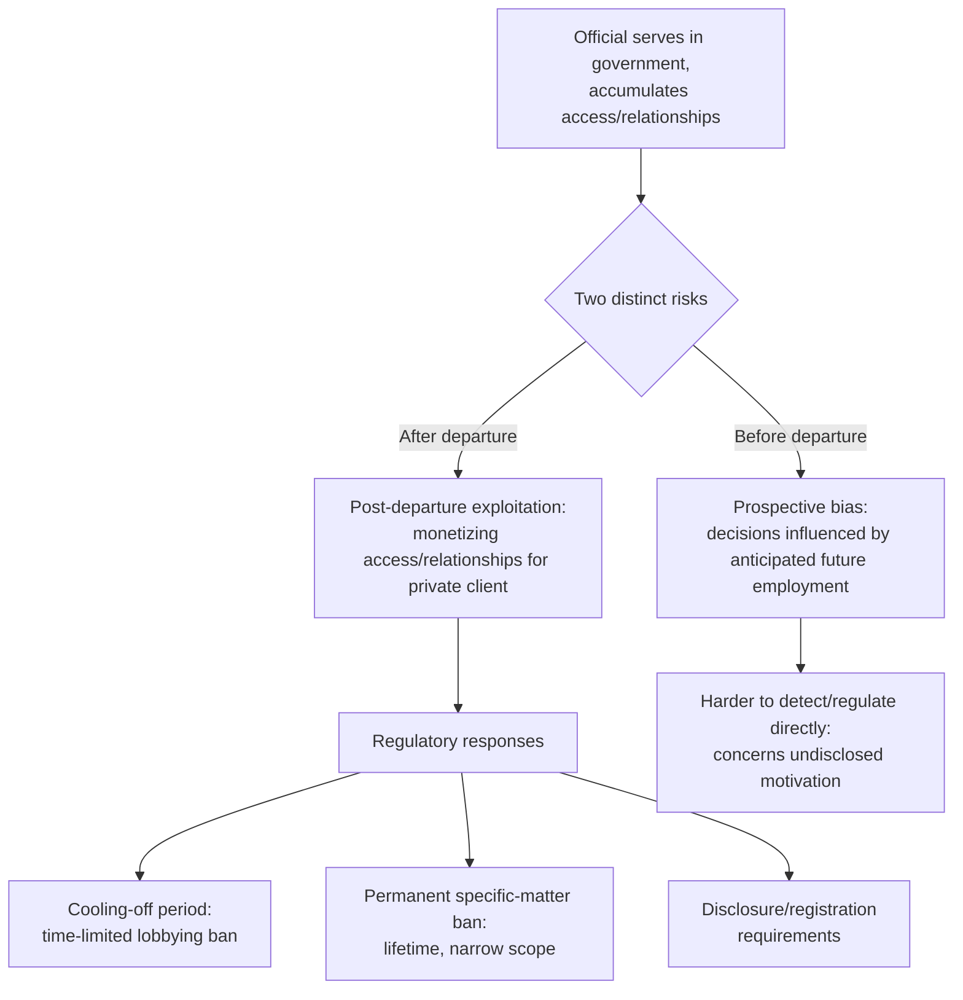

## Post-Government Employment Restrictions and Revolving-Door Ethics Rules

### Definition and the Underlying Policy Concern

**Revolving-door restrictions** are legal or regulatory limits placed on former government officials' ability to take up employment, consulting, or advocacy work — particularly work that involves lobbying their former agency or trading on privileged information or relationships acquired in government service — for a defined period after leaving public office. The term "revolving door" describes the broader pattern of individuals moving between government positions and private-sector roles (often in industries their government role regulated or engaged with) repeatedly across a career, and the restrictions are the regulatory response to specific concerns that pattern raises.

The policy concern is structurally distinct from, but related to, several other integrity concepts already covered in this curriculum: where the dean of the diplomatic corps role is designed to remove discretion from a precedence determination to prevent favoritism, and where deconfliction channels are deliberately depoliticized to preserve function during hostility, post-government employment restrictions address a different integrity risk entirely — that an official's decisions *while still in office* could be improperly influenced by anticipation of future private-sector employment, or that an official's departure could immediately convert government-acquired access, relationships, or non-public information into private commercial value in a way that undermines public confidence in the impartiality of government decision-making.

### Two Distinct Risks Addressed

Revolving-door rules typically target two analytically separate risks, though a single statute or regulation may address both:

1. **Prospective bias risk**: the concern that an official who anticipates a future, lucrative private-sector position might make decisions favorable to a prospective employer while still in office, in the hope of securing that position after departure. This risk exists entirely before departure and is difficult to detect directly, since it concerns an official's undisclosed motivation.
2. **Post-departure exploitation risk**: the concern that a former official will trade on relationships, insider knowledge of ongoing matters, or privileged access to former colleagues for a private client's benefit immediately after leaving office, effectively monetizing public position and access rather than genuine post-government expertise. This is the risk most directly targeted by mandatory "cooling-off" periods.

### Typical Regulatory Mechanisms

Common mechanisms used across jurisdictions to address these risks include:

- **Cooling-off periods**: a mandatory waiting period (commonly one to two years, though this varies significantly by jurisdiction and seniority of the former position) during which a former official may not lobby their former agency or, in more restrictive formulations, may not lobby the government at all on matters related to their former portfolio.
- **Permanent bans on specific-matter representation**: many systems impose a lifetime ban (not merely a cooling-off period) on a former official representing any party, before any government body, on a specific particular matter in which the official personally and substantially participated while in government — a narrower but permanent restriction distinct from the broader, time-limited cooling-off period.
- **Senior-official-specific enhanced restrictions**: more senior officials (cabinet-level, or officials with broad policy-setting authority) are frequently subject to more stringent restrictions than junior staff, reflecting the greater potential value of their post-departure access and the correspondingly greater public concern about prospective bias at senior levels.
- **Disclosure and registration requirements**: even absent an outright prohibition, many systems require former officials engaging in lobbying or advocacy work to register and disclose that activity, creating public transparency around revolving-door movement even where it is not restricted outright.

### Application to the Diplomatic and Foreign Service Context Specifically

Within a foreign service specifically, post-government employment restrictions carry a distinctive flavor connected to the negotiation and diplomatic-practice content otherwise central to this syllabus: a former diplomat's most valuable post-government private-sector asset is frequently not technical expertise in the general sense but rather **personal relationships and privileged insight into a specific foreign government's negotiating style, red lines, and internal decision-making** built up over a career of postings and negotiations — precisely the kind of accumulated relational capital that made facilitators like Norway's Fafo Institute officials effective in the Oslo back-channel, or that gives a long-serving career ambassador value in ongoing bilateral relationship management. This creates a foreign-service-specific version of the exploitation risk: a former ambassador or senior negotiator who moves into private consulting, lobbying, or corporate advisory work for entities with interests in a country or negotiation the official recently handled can monetize exactly the kind of trust-based, relationship-driven access that is valuable in diplomacy precisely because it took years of sustained engagement to build — access a private client could not otherwise readily obtain.

This also connects to why revolving-door restrictions are frequently more contested for senior diplomats specifically than for line civil servants in less relationship-dependent government functions: the same accumulated relational capital that revolving-door rules aim to prevent from being improperly monetized is also a genuinely valuable, legitimately acquired professional asset that career diplomats reasonably expect to be able to draw on in post-government careers (as consultants, academics, or board members), creating an inherent tension between restricting improper exploitation and unduly penalizing legitimate use of expertise honestly earned through a career's rotational and cross-posting experience.

### Diagram: Revolving-Door Risk and Restriction Structure

### The Core Policy Tension

The central debate in revolving-door regulation design mirrors, in a different domain, the leverage-versus-impartiality tradeoff discussed in relation to mediator effectiveness: restrictions that are too permissive risk allowing genuine exploitation of public position for private gain and eroding public trust in the impartiality of government decision-making generally, while restrictions that are too broad or lengthy risk discouraging talented individuals from entering public service at all (since an unusually long or comprehensive post-government restriction reduces the private-sector value of a public-service career) or unduly preventing legitimate, honestly-earned expertise from being used in a post-government career.

[Inference] Because the appropriate balance between these competing concerns depends heavily on jurisdiction-specific legal traditions, the specific seniority and functions of the position in question, and the particular industry or sector into which a former official might move, a general overview of the mechanism cannot responsibly specify what the "correct" length or scope of any given restriction should be — that determination is inherently a jurisdiction-specific policy judgment rather than one derivable from the general structure of the risk alone.

**Related Topics**

- Political appointees versus career diplomats and differing post-service incentive structures
- Mediator leverage and relational capital as a professional asset
- Track I versus Track II diplomacy and the value of former-official informal channels
- Conflict-of-interest disclosure regimes in public administration more broadly
- Lobbying regulation and registration requirements
- Performance evaluation and promotion boards as an alternative integrity-preserving mechanism during active service