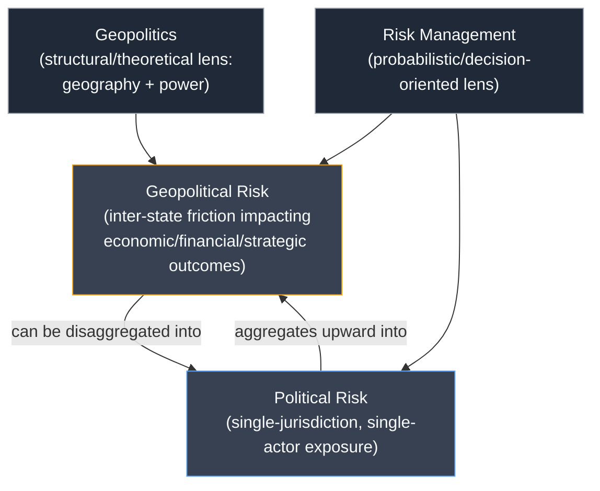

## Defining Geopolitics, Political Risk, and Geopolitical Risk

### Overview

This topic establishes the conceptual foundation for the entire field: three related but distinct terms — geopolitics, political risk, and geopolitical risk — that are frequently conflated in both media and industry usage but carry different analytical scope, methodology, and application. Precision in these definitions determines how an analyst scopes a problem, selects a methodology, and communicates findings to decision-makers.

### Geopolitics: Definition and Scope

**Core Definition**

Geopolitics is the study of how geography — physical terrain, location, resources, climate, and demographics — shapes and constrains the political, economic, and military behavior of states and other actors in the international system. It examines power relationships as a function of spatial and material factors.

**Key Points**

- Geopolitics is fundamentally about the interaction between *geography* and *power*. Classical theorists treated physical space (landmasses, chokepoints, sea lanes, buffer zones) as a near-deterministic driver of state strategy.
- The field emerged in the late 19th and early 20th centuries through theorists such as Halford Mackinder (the "Heartland Theory"), Alfred Thayer Mahan (sea power theory), and Nicholas Spykman (the "Rimland Theory"), each proposing that control of specific geographic zones confers global strategic advantage.
- Modern geopolitics extends beyond pure physical terrain to include control over strategic resources (energy corridors, rare earth minerals), technology infrastructure (undersea cables, semiconductor supply chains), and even cyberspace as a contested domain — sometimes termed "critical geography."
- Geopolitics operates at the macro/systemic level: it explains long-run patterns of great-power competition, alliance formation, and spheres of influence, rather than predicting a specific event on a specific date.

**Analytical Lens**

Geopolitics is best understood as a *theoretical and descriptive framework* — it provides the vocabulary and causal logic (e.g., "why does Russia prioritize control of the Black Sea littoral?") that other analytical products draw upon. It is not itself a forecasting or risk-quantification methodology.

**Example**

A geopolitical analysis of the South China Sea would examine: the strategic value of the sea lanes carrying a large share of global maritime trade, the presence of contested island chains and their military basing potential, the resource base (fisheries, potential hydrocarbon reserves), and how these geographic facts structure the competing claims and naval postures of China, Vietnam, the Philippines, and the United States.

### Political Risk: Definition and Scope

**Core Definition**

Political risk is the probability that political decisions, events, or conditions within a given jurisdiction will negatively (or positively) affect the operating environment, asset value, or expected returns of an investor, firm, or project. It is fundamentally a *decision-relevant, actor-specific* concept rooted in corporate and financial risk management.

**Key Points**

- Political risk is typically decomposed into two broad categories:
  - **Macro (country-level) political risk** — risks that affect all foreign actors within a jurisdiction uniformly, such as expropriation, currency inconvertibility, civil war, or regime change.
  - **Micro (firm/project-level) political risk** — risks that affect a specific industry, company, or transaction, such as targeted regulatory changes, discriminatory taxation, or contract renegotiation/repudiation aimed at a particular sector.
- Common sub-categories of political risk include: expropriation/nationalization risk, currency transfer and convertibility risk, breach-of-contract risk, political violence (war, terrorism, civil unrest), regulatory risk, and sovereign credit/non-payment risk.
- Political risk is the domain historically served by political risk insurance (PRI) providers such as MIGA (Multilateral Investment Guarantee Agency, a World Bank Group institution), OPIC's successor the U.S. International Development Finance Corporation (DFC), and private underwriters (Lloyd's syndicates, Marsh, AIG).
- Political risk analysis is inherently *asset-relative*: the same political event (e.g., a new mining law) can be a severe risk for an extractive-sector investor and irrelevant for a software firm operating in the same country.

**Analytical Lens**

Political risk analysis is *applied and decision-oriented* — it exists to inform specific choices: whether to invest, how to price political risk insurance, how to structure contractual protections (stabilization clauses, arbitration venues), or whether to divest.

**Example**

A political risk assessment for a foreign mining company operating in a resource-nationalist-leaning country would evaluate: the likelihood of contract renegotiation or royalty increases, the track record of similar assets being expropriated, the strength of bilateral investment treaties (BITs) and their enforcement record, and the availability of political risk insurance to hedge residual exposure.

### Geopolitical Risk: Definition and Scope

**Core Definition**

Geopolitical risk (GPR) refers to the probability and potential impact of adverse events arising from the *interactions between states or blocs* — war, terrorism, diplomatic rupture, sanctions, alliance shifts — on economic and financial variables, markets, and strategic outcomes. It sits at the intersection of geopolitics (the systemic, structural lens) and risk management (the probabilistic, impact-oriented lens), but is broader than political risk because it captures *inter-state and systemic* dynamics rather than being confined to a single jurisdiction's internal political environment.

**Key Points**

- Geopolitical risk is inherently **relational and cross-border**: it concerns friction, conflict, or realignment *between* actors (states, blocs, non-state armed groups) rather than the internal politics of a single country in isolation.
- A widely cited operationalization is the Geopolitical Risk (GPR) Index developed by Dario Caldara and Matteo Iacoviello (Federal Reserve Board economists), which quantifies geopolitical risk via automated text search of newspaper archives for terms related to war threats, war acts, terrorism, and adverse geopolitical events. [Unverified: exact current methodology and index composition may have been revised since original publication; verify against the latest Federal Reserve documentation.]
- Geopolitical risk manifests across multiple transmission channels into economic outcomes: trade disruption (sanctions, tariffs, blockades), financial market volatility (flight-to-safety flows, equity/commodity price shocks), supply chain disruption (chokepoint closures, export controls), and direct physical/kinetic risk to assets and personnel.
- Distinguished from political risk by scope: political risk is typically *jurisdiction-bound and actor-specific* (will this country expropriate my asset?), while geopolitical risk is *systemic and relational* (will a Taiwan Strait crisis disrupt global semiconductor supply chains?).
- Geopolitical risk has both a **realized** component (war has broken out, sanctions have been imposed) and a **threat/ambiguity** component (the mere possibility or rhetorical escalation of conflict can move markets and alter firm behavior even absent a kinetic event) — this is the core insight embedded in the Caldara-Iacoviello index's separation of "threats" from "acts."

**Analytical Lens**

Geopolitical risk analysis blends the structural/systemic explanatory power of geopolitics with the probabilistic, impact-quantification discipline of risk management. It is used by central banks, sovereign wealth funds, multinational corporations, and defense/intelligence communities to anticipate how inter-state friction could cascade into economic, financial, or operational consequences.

**Example**

A geopolitical risk assessment of escalating U.S.-China technology tensions would evaluate: the probability of expanded export controls on advanced semiconductors, the likely retaliatory measures (e.g., rare-earth export restrictions), the second-order effects on global electronics supply chains and specific firms' revenue exposure, and the market-pricing implications for related equities and currencies — integrating geopolitical structural analysis (why chip technology is a chokepoint) with risk-quantification (probability-weighted financial impact).

### Comparative Framework

| Dimension | Geopolitics | Political Risk | Geopolitical Risk |
| --- | --- | --- | --- |
| Primary unit of analysis | States/regions and geographic structures | Single country/jurisdiction, single firm/asset | Inter-state relations, blocs, systemic linkages |
| Orientation | Descriptive/theoretical | Applied/decision-oriented | Applied/decision-oriented |
| Time horizon | Long-run, structural | Short-to-medium term, transaction-specific | Short-to-medium term, event- and shock-driven |
| Typical output | Explanatory narrative, strategic assessment | Risk rating, insurance pricing, investment go/no-go | Probability-impact scenarios, market/portfolio exposure estimates |
| End users | Policymakers, academics, strategists | Corporate risk officers, insurers, investors | Central banks, multinational corporations, sovereign wealth funds, defense/intelligence |

### Conceptual Relationship Diagram

### Why the Distinction Matters in Practice

**Key Points**

- Conflating political risk with geopolitical risk leads to scoping errors: a firm might commission a "political risk assessment" when what it actually needs is a geopolitical risk assessment of how a regional conflict could disrupt its multi-country supply chain — these require different data sources, expertise, and modeling approaches.
- Regulatory and disclosure frameworks (e.g., certain ESG or enterprise risk management standards) increasingly require firms to distinguish between country-specific political risk exposure (for jurisdictional disclosures) and systemic geopolitical risk exposure (for stress-testing and scenario planning).
- Misapplication of geopolitical-level rhetoric ("global order is fracturing") to a firm-specific political risk decision (should we invest in this one country?) can produce overly conservative or poorly calibrated risk assessments — the analyst must match the analytical frame to the actual decision being supported.

### SVG: Nested Scope Diagram (svg_diagram)

<svg xmlns="http://www.w3.org/2000/svg" viewBox="0 0 640 420">
<rect x="0" y="0" width="640" height="420" fill="#0f172a" />
<text x="320" y="30" text-anchor="middle" font-size="16" font-weight="bold" fill="#f8fafc">Scope Comparison (svg_diagram)</text>
<ellipse cx="320" cy="230" rx="290" ry="170" fill="none" stroke="#f59e0b" stroke-width="2" />
<text x="320" y="80" text-anchor="middle" font-size="13" fill="#f59e0b">Geopolitics (theoretical/structural frame)</text>
<ellipse cx="230" cy="250" rx="150" ry="110" fill="none" stroke="#60a5fa" stroke-width="2" />
<text x="150" y="160" text-anchor="middle" font-size="12" fill="#60a5fa">Political Risk</text>
<ellipse cx="410" cy="250" rx="150" ry="110" fill="none" stroke="#34d399" stroke-width="2" />
<text x="490" y="160" text-anchor="middle" font-size="12" fill="#34d399">Geopolitical Risk</text>

<text x="230" y="255" text-anchor="middle" font-size="11" fill="`#e2e8f0`">Single jurisdiction</text>

<text x="230" y="272" text-anchor="middle" font-size="11" fill="`#e2e8f0`">Single firm/asset</text>

<text x="230" y="289" text-anchor="middle" font-size="11" fill="`#e2e8f0`">Expropriation, contract</text>

<text x="230" y="306" text-anchor="middle" font-size="11" fill="`#e2e8f0`">renegotiation, FX risk</text>

<text x="410" y="255" text-anchor="middle" font-size="11" fill="`#e2e8f0`">Inter-state / systemic</text>

<text x="410" y="272" text-anchor="middle" font-size="11" fill="`#e2e8f0`">War, sanctions,</text>

<text x="410" y="289" text-anchor="middle" font-size="11" fill="`#e2e8f0`">supply chain shocks,</text>

<text x="410" y="306" text-anchor="middle" font-size="11" fill="`#e2e8f0`">market contagion</text>

<text x="320" y="360" text-anchor="middle" font-size="11" fill="`#94a3b8`">Overlap: a single-country political event (e.g., coup)</text>

<text x="320" y="376" text-anchor="middle" font-size="11" fill="`#94a3b8`">can trigger cross-border geopolitical risk cascades</text>

</svg>

### Common Pitfalls

**Key Points**

- Treating geopolitics as a predictive tool rather than an explanatory framework — it clarifies *why* actors behave as they do but does not, by itself, generate calibrated probabilities.
- Using political risk ratings (designed for single-country FDI decisions) as a proxy for systemic geopolitical risk exposure in globally diversified portfolios — the two are not interchangeable and can produce materially different risk pictures.
- Ignoring the "threat" component of geopolitical risk (rhetorical escalation, troop movements, sanctions threats) and focusing only on realized "acts" — markets and supply chains often reprice well before a kinetic event occurs.
- Assuming geopolitical risk is always negative-impact-only; realignments (e.g., a peace agreement, a new trade bloc) can generate positive geopolitical risk outcomes for specific actors, and a rigorous framework should accommodate bidirectional impact.

**Related Topics**

- History and evolution of geopolitical thought (Mackinder, Mahan, Spykman, Brzezinski)
- The Caldara-Iacoviello Geopolitical Risk (GPR) Index: methodology and applications
- Political risk insurance markets and instruments (MIGA, DFC, Lloyd's syndicates)
- Country risk ratings methodologies (ICRG, Economist Intelligence Unit, Coface)
- Sovereign risk vs. political risk vs. geopolitical risk: boundary cases
- Transmission channels: from geopolitical events to financial market pricing
- Scenario planning and probabilistic forecasting methods in geopolitical risk analysis
- Corporate geopolitical risk functions: structure, mandate, and integration with enterprise risk management