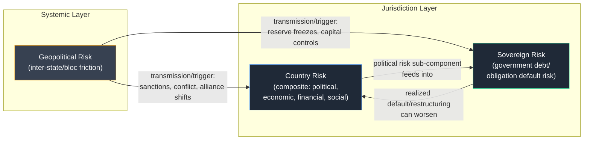

## Geopolitical Risk versus Country and Sovereign Risk

### Overview

This topic disambiguates three risk categories that are frequently used interchangeably in financial media and corporate reporting but rest on distinct causal mechanisms, measurement traditions, and analytical use cases: geopolitical risk (inter-state/systemic friction), country risk (the composite operating-environment risk of a single jurisdiction), and sovereign risk (the specific risk that a government will fail to meet its debt or contractual obligations). Precise boundary-setting between these terms is essential for correctly attributing losses, selecting hedging instruments, and building risk models that do not double-count or omit exposure.

### Country Risk: Definition and Scope

**Core Definition**

Country risk is the aggregate risk of operating, investing, or lending within a specific national jurisdiction, encompassing the full range of factors — political, economic, financial, legal, and social — that could impair the value of assets or returns located in that country. It is the broadest of the three concepts and functions as an umbrella category.

**Key Points**

- Country risk is typically decomposed by commercial rating agencies and multilateral institutions into sub-components: economic risk (macroeconomic stability, growth volatility, fiscal balance), financial/transfer risk (currency convertibility, banking sector health), political risk (as previously defined — institutional stability, expropriation risk, policy continuity), and sometimes structural/security risk (crime, terrorism, social unrest).
- Major country risk rating providers include the **Economist Intelligence Unit (EIU)**, **Coface**, **BMI/Fitch Solutions**, and the proprietary in-house models of major banks and export credit agencies. Each uses a different weighting methodology and scale (letter grades, numeric indices, 0–100 composite scores).
- Country risk is the primary input for cross-border lending decisions, trade credit insurance pricing, and capital allocation decisions by multinational treasury functions — it answers the practical question "how risky is it, in aggregate, to have exposure to Country X right now?"
- Country risk is **static-snapshot oriented by default** — most commercial country risk ratings are updated on a periodic cycle (quarterly/semi-annually) rather than continuously, which creates a structural lag relative to fast-moving geopolitical shocks.

**Analytical Lens**

Country risk analysis is a *composite scoring exercise* — it aggregates multiple risk dimensions into a single rating or index to enable comparison across jurisdictions (e.g., ranking 150 countries for a global credit allocation model). It is inherently backward- and present-looking, built substantially on observable institutional and macroeconomic data.

**Example**

An export credit agency assessing whether to provide financing guarantees for equipment sales to a buyer in a given country would consult that country's aggregate country risk rating, which blends the buyer country's debt sustainability, currency risk, and political stability into a single risk category (e.g., Coface's A1–E scale) used to set premium rates.

### Sovereign Risk: Definition and Scope

**Core Definition**

Sovereign risk is the specific risk that a national government (or an entity backed by government guarantee) will default on, restructure, or otherwise fail to honor its debt obligations or contractual commitments, including the risk that a government will take actions (such as imposing capital controls) that impair a creditor's or investor's ability to be repaid.

**Key Points**

- Sovereign risk is narrower than country risk: it is specifically about *the government as a debtor or counterparty*, not about the general operating environment for firms or investors within that country.
- Sovereign risk is measured primarily through **sovereign credit ratings** (issued by Moody's, S&P Global Ratings, and Fitch Ratings), **sovereign bond yield spreads** relative to a risk-free benchmark (e.g., U.S. Treasuries or German Bunds), and **credit default swap (CDS) spreads** on sovereign debt, which provide a market-implied, continuously updated probability of default.
- Sovereign risk has both a **willingness-to-pay** dimension (a government may have the capacity to service debt but choose not to, for political reasons) and an **ability-to-pay** dimension (fiscal capacity, foreign exchange reserves, debt service ratios) — this distinction is central to sovereign credit analysis and is a key reason sovereign risk cannot be reduced to pure macroeconomic modeling.
- Historical sovereign default episodes (e.g., Argentina 2001 and 2020, Greece 2012, Russia 1998, Sri Lanka 2022) illustrate that sovereign risk can be triggered by a mix of fiscal mismanagement, external shocks (commodity price collapse, currency crises), and — relevantly for this comparison — geopolitical events (sanctions cutting off debt servicing capability, as seen with Russia's 2022 technical default following Western sanctions freezing central bank reserves).
- Sovereign risk is a *bilateral, creditor-debtor relationship concept*; it is priced continuously in real time via liquid bond and CDS markets, in contrast to the periodic-update cadence typical of composite country risk ratings.

**Analytical Lens**

Sovereign risk analysis is a *credit analysis discipline*, closely related to corporate credit analysis but with added complexity from the absence of a supranational bankruptcy enforcement mechanism — restructuring depends on negotiation, IMF/Paris Club involvement, or unilateral default.

**Example**

A bondholder analyzing sovereign risk for Sri Lankan government debt would examine foreign exchange reserve adequacy, external debt service coverage ratios, IMF program status and conditionality compliance, and the CDS-implied probability of default — a fundamentally different (though related) exercise from assessing the general "country risk" of doing retail business in Sri Lanka.

### Geopolitical Risk Revisited: The Systemic/Relational Layer

**Key Points**

- As established in the prior topic, geopolitical risk concerns *inter-state or inter-bloc friction* — it is not confined to a single jurisdiction's internal characteristics (unlike country risk) and is not specifically about government debt-servicing behavior (unlike sovereign risk).
- Geopolitical risk frequently acts as a **transmission mechanism or trigger** that materializes as country risk or sovereign risk in a specific jurisdiction: a geopolitical event (e.g., an armed conflict, a sanctions regime) can rapidly and discontinuously worsen a country's aggregate country risk rating or spike its sovereign CDS spread, even though the country's underlying macroeconomic fundamentals had not changed the day before.
- This produces a critical modeling insight: **country risk and sovereign risk ratings are lagging and endogenous to realized outcomes, while geopolitical risk analysis attempts to be leading and probabilistic about the triggering events themselves.** An analyst relying solely on sovereign credit ratings to anticipate a Russia-style sanctions shock would have been systematically late, since credit ratings are typically downgraded only after risk materializes, whereas geopolitical risk analysis (tracking troop movements, diplomatic breakdown, sanctions legislation pipelines) can flag the probability of the triggering event in advance.
- Geopolitical risk can also be **exogenous and non-jurisdiction-specific** in a way country and sovereign risk cannot: a firm can face geopolitical risk (e.g., disruption of a shared shipping chokepoint like the Strait of Hormuz or the Red Sea) without any single country in its portfolio experiencing a change in its own country or sovereign risk rating — the risk arises from the interaction between third-party states.

**Analytical Lens**

Geopolitical risk analysis functions as a *forward-looking, scenario- and event-driven overlay* on top of country and sovereign risk baselines — it asks "what inter-state dynamics could cause a discontinuous jump in the country/sovereign risk profile of one or more jurisdictions I am exposed to, and through what channel?"

**Example**

Prior to Russia's large-scale invasion of Ukraine in February 2022, Russia's sovereign credit rating and country risk scores reflected relatively strong fiscal metrics (low debt-to-GDP, substantial FX reserves). A geopolitical risk analysis tracking troop buildups, diplomatic rhetoric, and sanctions-legislation pipelines in the preceding months would have flagged a high probability of a triggering event that subsequently caused a near-instantaneous collapse in Russia's effective sovereign risk profile (frozen reserves, CDS trigger disputes, rating agency withdrawal) — a discontinuity that lagging credit ratings alone did not anticipate.

### Comparative Framework

| Dimension | Country Risk | Sovereign Risk | Geopolitical Risk |
| --- | --- | --- | --- |
| Unit of analysis | Single jurisdiction (composite) | Government as debtor/counterparty | Inter-state/bloc relations |
| Core question | "How risky is operating/investing here overall?" | "Will this government honor its debt/obligations?" | "Could inter-state friction disrupt this jurisdiction/asset/supply chain?" |
| Update frequency | Periodic (quarterly/semi-annual ratings) | Continuous (market-priced via bonds/CDS) + periodic (agency ratings) | Event-driven, continuous monitoring |
| Primary data sources | Composite indices (EIU, Coface, BMI) | Credit ratings (S&P, Moody's, Fitch), bond yields, CDS spreads | News-flow indices (e.g., GPR Index), intelligence/OSINT, diplomatic signaling |
| Directionality | Multi-dimensional (political, economic, financial, social) | Bilateral (creditor-debtor) | Relational (state-to-state, bloc-to-bloc) |
| Typical trigger-to-impact lag | Slow (ratings updated periodically) | Faster (market-priced) but rating-agency response still lags | Fastest in principle (designed to be leading/anticipatory) |

### Conceptual Relationship Diagram

### SVG: Lag Structure Comparison (svg_diagram)

<svg xmlns="http://www.w3.org/2000/svg" viewBox="0 0 660 360">
<rect x="0" y="0" width="660" height="360" fill="#0f172a" />
<text x="330" y="28" text-anchor="middle" font-size="16" font-weight="bold" fill="#f8fafc">Anticipation vs. Realization Timeline (svg_diagram)</text>
<line x1="60" y1="180" x2="600" y2="180" stroke="#64748b" stroke-width="2" />
<polygon points="600,180 590,175 590,185" fill="#64748b" />
<text x="600" y="200" text-anchor="end" font-size="11" fill="#94a3b8">Time</text>
<circle cx="150" cy="180" r="6" fill="#f59e0b" />
<text x="150" y="150" text-anchor="middle" font-size="11" fill="#f59e0b">Geopolitical risk signals rise</text>
<text x="150" y="165" text-anchor="middle" font-size="10" fill="#fbbf24">(troop movements, rhetoric,</text>
<text x="150" y="178" text-anchor="middle" font-size="10" fill="#fbbf24">sanctions legislation)</text>
<circle cx="330" cy="180" r="6" fill="#ef4444" />
<text x="330" y="150" text-anchor="middle" font-size="11" fill="#ef4444">Triggering event occurs</text>
<text x="330" y="165" text-anchor="middle" font-size="10" fill="#fca5a5">(conflict onset, sanctions imposed)</text>
<circle cx="450" cy="180" r="6" fill="#60a5fa" />
<text x="450" y="220" text-anchor="middle" font-size="11" fill="#60a5fa">Sovereign CDS/bond spreads</text>
<text x="450" y="234" text-anchor="middle" font-size="10" fill="#93c5fd">reprice (near-real-time)</text>
<circle cx="560" cy="180" r="6" fill="#34d399" />
<text x="560" y="260" text-anchor="middle" font-size="11" fill="#34d399">Country risk rating</text>
<text x="560" y="274" text-anchor="middle" font-size="10" fill="#6ee7b7">downgraded (periodic cycle)</text>
</svg>

### Modeling and Practical Implications

**Key Points**

- **Non-additivity across categories:** an analyst should not simply sum a country risk score, a sovereign risk score, and a geopolitical risk score, since geopolitical risk is frequently the *causal upstream driver* of movements in the other two; naive summation risks double-counting the same underlying exposure.
- **Portfolio-level geopolitical risk can exceed the sum of individual country risks:** a portfolio diversified across countries that are nonetheless linked through a shared geopolitical fault line (e.g., multiple export-dependent economies exposed to the same shipping chokepoint, or multiple firms exposed to the same semiconductor supply chain contested by a great-power rivalry) can carry correlated tail risk that country-by-country risk scoring would understate.
- **Divergent hedging instruments:** sovereign risk is commonly hedged via sovereign CDS or bond duration management; country risk is commonly mitigated via political risk insurance, contractual stabilization clauses, or diversification; geopolitical risk is harder to hedge directly and is more often managed via scenario planning, supply chain redundancy, and strategic (rather than purely financial) risk mitigation.
- [Inference] Because commercial country and sovereign risk ratings are updated on a lag and are partly reactive to realized events, portfolio and enterprise risk frameworks that rely exclusively on these ratings without a dedicated geopolitical risk monitoring function may be structurally prone to underweighting fast-moving, discontinuous geopolitical shocks until after initial repricing has occurred.

**Common Pitfalls**

- Using a country's investment-grade sovereign credit rating as evidence of low geopolitical risk exposure — sovereign ratings assess fiscal/debt capacity, not the probability or impact of inter-state conflict affecting that jurisdiction.
- Treating "emerging market risk" as synonymous with geopolitical risk — many emerging market country/sovereign risk drivers (fiscal indiscipline, currency mismatches) are domestic and unrelated to inter-state friction, while some advanced economies carry substantial geopolitical risk exposure (e.g., Taiwan, South Korea, Baltic states) despite strong sovereign credit profiles.
- Assuming geopolitical risk only matters for sovereign default — it also manifests through operational, supply chain, and market-volatility channels that leave sovereign creditworthiness technically intact while still generating substantial losses for firms and investors.

**Related Topics**

- Sovereign credit rating methodologies (S&P, Moody's, Fitch): criteria and rating scales
- Sovereign default and restructuring mechanisms (Paris Club, IMF programs, CDS auctions)
- Country risk rating models compared (EIU, Coface, BMI/Fitch Solutions, ICRG)
- Sanctions regimes as a geopolitical-to-sovereign-risk transmission channel
- Correlated geopolitical risk in globally diversified portfolios
- Political risk insurance versus sovereign CDS as hedging instruments
- Case study: Russia 2022 sanctions and the sovereign default/geopolitical risk interface
- Building a leading (anticipatory) geopolitical risk indicator versus lagging credit-rating-based approaches