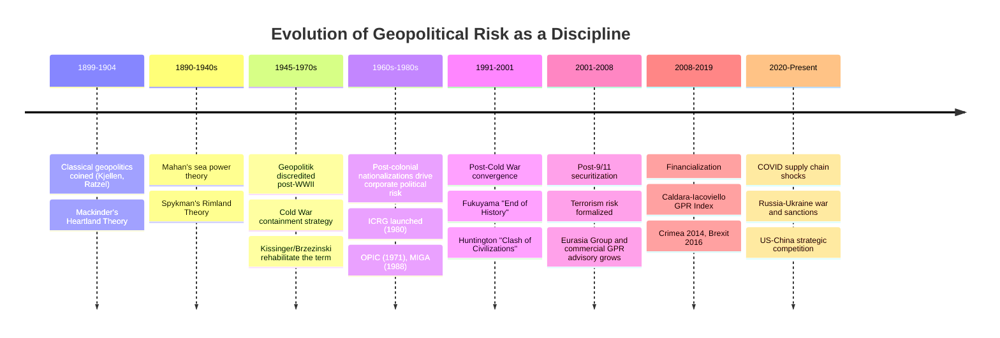

## Historical Evolution of Geopolitical Risk as a Discipline

### Overview

Geopolitical risk as a distinct analytical discipline did not emerge fully formed; it developed through the successive layering of classical geopolitical theory, Cold War strategic studies, corporate political risk management, and post-Cold War financialization of risk analytics. Understanding this evolution clarifies why the discipline today blends geography-based structural reasoning, intelligence-community tradecraft, and quantitative financial modeling into a single (still-maturing) field.

### Phase 1: Classical Geopolitical Theory (Late 19th Century – World War II)

**Key Points**

- The term "geopolitics" was coined by Swedish political scientist **Rudolf Kjellén** around 1899, building on the work of German geographer **Friedrich Ratzel**, whose concept of *Lebensraum* ("living space") framed states as organism-like entities competing for territory.
- **Halford Mackinder's** 1904 paper "The Geographical Pivot of History" introduced the **Heartland Theory**, arguing that control of the Eurasian "Heartland" (roughly the interior of Russia/Central Asia) conferred the potential for world dominance, encapsulated in his dictum linking control of Eastern Europe, the Heartland, the World-Island (Eurasia-Africa), and the world itself.
- **Alfred Thayer Mahan**, an American naval strategist, argued in *The Influence of Sea Power upon History* (1890) that command of the seas and control of maritime chokepoints was the decisive factor in great-power competition — a direct intellectual counterpoint to Mackinder's land-based Heartland thesis.
- **Nicholas Spykman** later synthesized and partially rebutted Mackinder with the **Rimland Theory** (1940s), arguing that the coastal periphery ("Rimland") surrounding the Eurasian landmass, not the interior Heartland, was the more decisive zone of control — a framework that directly informed U.S. Cold War containment strategy.
- This era treated geography as a near-deterministic driver of national strategy and was closely (and controversially) associated with German *Geopolitik* under Karl Haushofer, whose work was later appropriated to provide pseudo-scientific justification for Nazi expansionism — an association that caused the term "geopolitics" to fall into disrepute in Western academia for roughly two decades following World War II.

**Analytical Lens**

This phase was purely theoretical and descriptive — there was no attempt at probabilistic risk quantification or firm-level application; the goal was to explain and predict state strategic behavior at the level of grand strategy.

### Phase 2: Cold War Strategic Studies and the Reframing of Geopolitics (1945–1991)

**Key Points**

- After WWII, the discredited *Geopolitik* label was largely replaced by "strategic studies" and "international relations theory," even though the underlying geographic-power logic persisted, notably in U.S. containment policy, which George Kennan's 1946 "Long Telegram" and subsequent NSC-68 doctrine translated Spykman's Rimland logic into policy.
- **Henry Kissinger** and **Zbigniew Brzezinski** are credited with rehabilitating and popularizing the term "geopolitics" in U.S. policy discourse during the 1970s, applying it to superpower competition, détente, and the balance of power framework.
- This period saw the rise of **area studies** and dedicated intelligence-community risk assessment functions (e.g., the CIA's National Intelligence Estimates), which represented an early institutionalized form of what would later be called geopolitical risk analysis — systematic, government-funded assessment of adversary intentions and capabilities.
- Risk assessment in this era remained overwhelmingly state-centric and security-focused (nuclear deterrence, proxy conflicts, alliance stability) rather than economically or financially oriented; there was minimal integration with corporate decision-making or financial markets.

**Analytical Lens**

Cold War-era geopolitical analysis introduced systematic, institutionalized assessment processes (national intelligence estimates, scenario planning within defense establishments) but remained largely siloed within government and defense/intelligence communities, distinct from the emerging corporate risk management tradition developing in parallel.

### Phase 3: The Corporate Political Risk Era (1960s–1990s)

**Key Points**

- The parallel discipline of **political risk analysis** emerged from a distinct lineage: the wave of post-colonial nationalizations and expropriations in the 1960s–1970s (e.g., oil and mining nationalizations across the Middle East, Africa, and Latin America) created direct commercial demand for systematic assessment of expropriation and contract-repudiation risk facing multinational corporations.
- This drove the creation of dedicated **political risk consultancies and rating services**, including the **International Country Risk Guide (ICRG)**, launched in 1980 by the PRS Group, which remains one of the longest-running continuous country/political risk data series still referenced in academic literature.
- **Political risk insurance (PRI)** institutionalized during this period, with the establishment of the **Overseas Private Investment Corporation (OPIC)** in the U.S. (1971) and the **Multilateral Investment Guarantee Agency (MIGA)** under the World Bank Group (1988), providing formal insurance instruments against expropriation, currency inconvertibility, and political violence.
- This phase developed the applied, decision-oriented methodology — country risk scoring, insurance underwriting criteria, contract stabilization clauses — that remains foundational to political risk practice today, but it was **conceptually distinct from and largely disconnected** from the classical/Cold War geopolitical theory tradition; political risk analysts of this era focused on internal governance and expropriation dynamics rather than inter-state strategic competition.

**Analytical Lens**

The corporate political risk era professionalized risk quantification and produced tradeable/insurable risk products, but its unit of analysis remained the single jurisdiction — it did not yet systematically address cross-border, inter-state relational risk in a form usable by financial markets.

### Phase 4: Post-Cold War Convergence and the "End of History" Interlude (1991–2001)

**Key Points**

- The end of the Cold War produced a temporary intellectual climate in which some analysts (most famously Francis Fukuyama's 1992 "End of History" thesis) argued that liberal-democratic capitalism represented the final form of political-economic organization, implicitly suggesting a diminished long-run role for great-power geopolitical competition.
- Correspondingly, geopolitical risk as a distinct, urgent analytical category received comparatively less attention in mainstream financial risk management during the 1990s, as globalization, trade liberalization, and the expansion of the WTO-centered international order dominated the risk narrative; country risk analysis of this period emphasized economic/financial liberalization risk (currency crises, banking sector fragility) more than inter-state conflict risk.
- The 1990s did produce important counter-currents, notably **Samuel Huntington's** 1993/1996 "Clash of Civilizations" thesis, which reasserted that cultural and civilizational fault lines — geographically distributed — would remain a primary axis of post-Cold War conflict, foreshadowing renewed attention to geographically-rooted risk analysis.
- Emerging market financial crises during this period (Mexico 1994, Asian Financial Crisis 1997–98, Russia 1998) were analyzed primarily through the country-risk/sovereign-risk financial lens rather than as geopolitical risk events, even though some (e.g., the Russian crisis) had significant geopolitical dimensions.

### Phase 5: Post-9/11 Securitization and Terrorism Risk (2001–2008)

**Key Points**

- The September 11, 2001 attacks catalyzed a major expansion of geopolitical/political risk analysis to explicitly incorporate **transnational terrorism** and **non-state actor risk** as first-order categories, alongside traditional inter-state and expropriation risk.
- This period saw growth in dedicated commercial geopolitical risk advisory firms (e.g., Eurasia Group, founded 1998 by Ian Bremmer, which scaled significantly in influence during the 2000s) explicitly marketing "political risk" and "geopolitical risk" analysis as a distinct commercial product for investors and corporations navigating a post-9/11, multipolar risk landscape.
- Insurance markets developed dedicated **political violence and terrorism risk** products (partly spurred by the U.S. Terrorism Risk Insurance Act of 2002, enacted after private terrorism coverage largely disappeared post-9/11), formalizing terrorism as a distinct, insurable sub-category alongside classical political risk.
- The Iraq War (2003) and broader "War on Terror" reasserted the salience of geography (control of oil-producing regions, basing rights, sectarian/ethnic geographic distribution within states) in mainstream geopolitical analysis, partially reviving classical geopolitical reasoning within a counterterrorism and regime-change framing.

### Phase 6: Financialization and Quantification (2008–2019)

**Key Points**

- The 2008 Global Financial Crisis intensified demand across financial institutions for systematic, quantifiable risk frameworks covering tail risks beyond traditional market and credit risk models, creating institutional demand for geopolitical risk to be integrated into formal risk management and asset allocation processes rather than treated as qualitative, advisory-only input.
- **Dario Caldara and Matteo Iacoviello**, economists at the U.S. Federal Reserve Board, developed the **Geopolitical Risk (GPR) Index**, first circulated as working-paper research in the mid-2010s and subsequently published, providing a systematic, text-based, continuously updated quantitative measure of geopolitical risk derived from automated searches of major newspaper archives for war- and conflict-related terminology. [Unverified: exact initial publication/working-paper date; verify against the original Federal Reserve International Finance Discussion Papers series and the authors' subsequent peer-reviewed publication.]
- This period saw geopolitical risk increasingly integrated into **central bank research and financial stability assessments**, sovereign wealth fund and pension fund scenario planning, and credit rating agencies' formal methodologies, marking a shift from purely qualitative advisory output toward index-based, model-integrable data series usable in quantitative finance (e.g., as a factor in asset pricing or volatility models).
- China's rise as a global economic and strategic competitor, Russia's 2014 annexation of Crimea, and the UK's 2016 Brexit referendum each drove renewed mainstream and financial-market attention to geopolitical risk as a distinct, market-moving category, distinguishing it further from routine country-level political risk.

### Phase 7: Contemporary Era — Great Power Competition and Systemic Risk (2020–Present)

**Key Points**

- The COVID-19 pandemic (2020) exposed the fragility of globally optimized supply chains to geographically concentrated disruption, elevating **supply chain geopolitical risk** (semiconductor concentration in Taiwan/South Korea, critical mineral dependence on China, pharmaceutical input concentration) to a top-tier corporate and national security concern.
- Russia's full-scale invasion of Ukraine (February 2022) and the resulting sanctions regime represented arguably the most significant real-world stress-test of contemporary geopolitical risk frameworks, demonstrating rapid transmission from geopolitical event to sovereign risk (reserve freezes, technical default), market risk (energy price shocks, equity market dislocation), and supply chain risk (grain, fertilizer, and energy export disruption) simultaneously.
- U.S.-China strategic competition — spanning trade tariffs, technology export controls (particularly on advanced semiconductors), Taiwan Strait tensions, and industrial policy responses (e.g., the U.S. CHIPS Act and equivalent measures by other jurisdictions) — has become a dominant organizing theme of contemporary geopolitical risk practice, often analyzed under the "great power competition" or "strategic decoupling/de-risking" framework.
- The discipline today is characterized by convergence: geopolitical risk analysis routinely combines **classical geographic/structural reasoning** (chokepoints, resource geography, alliance geography), **intelligence-community-style tradecraft** (open-source intelligence, scenario planning, red-teaming), and **quantitative financial methods** (text-based indices, market-implied risk measures, factor models) — reflecting the convergence of the four historical strands traced above (classical geopolitics, Cold War strategic studies, corporate political risk, and post-2008 financialization).
- [Inference] The accelerating pace of geopolitical shock transmission into financial markets and supply chains observed in the 2020s, relative to earlier decades, appears at least partly attributable to increased global economic interconnection and just-in-time supply chain architectures, which reduce the buffering capacity that previously slowed the propagation of geopolitical shocks into economic outcomes — though rigorously isolating this effect from other contributing factors (media/information velocity, financial market structure changes) would require dedicated empirical study.

### Timeline Diagram

### SVG: Four Converging Strands (svg_diagram)

<svg xmlns="http://www.w3.org/2000/svg" viewBox="0 0 680 380">
<rect x="0" y="0" width="680" height="380" fill="#0f172a" />
<text x="340" y="28" text-anchor="middle" font-size="16" font-weight="bold" fill="#f8fafc">Four Historical Strands Converging into Modern GPR (svg_diagram)</text>
<rect x="30" y="60" width="140" height="60" rx="6" fill="#1f2937" stroke="#f59e0b" stroke-width="2" />
<text x="100" y="85" text-anchor="middle" font-size="11" fill="#fbbf24">Classical Geopolitics</text>
<text x="100" y="102" text-anchor="middle" font-size="10" fill="#fcd34d">(Mackinder, Mahan, Spykman)</text>
<rect x="30" y="150" width="140" height="60" rx="6" fill="#1f2937" stroke="#60a5fa" stroke-width="2" />
<text x="100" y="175" text-anchor="middle" font-size="11" fill="#93c5fd">Cold War Strategic Studies</text>
<text x="100" y="192" text-anchor="middle" font-size="10" fill="#bfdbfe">(Kissinger, Brzezinski, NIEs)</text>
<rect x="30" y="240" width="140" height="60" rx="6" fill="#1f2937" stroke="#34d399" stroke-width="2" />
<text x="100" y="265" text-anchor="middle" font-size="11" fill="#6ee7b7">Corporate Political Risk</text>
<text x="100" y="282" text-anchor="middle" font-size="10" fill="#a7f3d0">(ICRG, OPIC, MIGA)</text>
<rect x="30" y="300" width="140" height="60" rx="6" fill="#1f2937" stroke="#f87171" stroke-width="2" />
<text x="100" y="325" text-anchor="middle" font-size="11" fill="#fca5a5">Financialization</text>
<text x="100" y="342" text-anchor="middle" font-size="10" fill="#fecaca">(GPR Index, market pricing)</text>
<line x1="170" y1="90" x2="470" y2="190" stroke="#64748b" stroke-width="1.5" />
<line x1="170" y1="180" x2="470" y2="195" stroke="#64748b" stroke-width="1.5" />
<line x1="170" y1="270" x2="470" y2="200" stroke="#64748b" stroke-width="1.5" />
<line x1="170" y1="330" x2="470" y2="205" stroke="#64748b" stroke-width="1.5" />
<ellipse cx="560" cy="197" rx="100" ry="70" fill="#374151" stroke="#e5e7eb" stroke-width="2" />
<text x="560" y="185" text-anchor="middle" font-size="12" font-weight="bold" fill="#f9fafb">Contemporary</text>
<text x="560" y="202" text-anchor="middle" font-size="12" font-weight="bold" fill="#f9fafb">Geopolitical Risk</text>
<text x="560" y="219" text-anchor="middle" font-size="10" fill="#d1d5db">Practice</text>
</svg>

### Common Pitfalls

**Key Points**

- Assuming geopolitical risk analysis is a purely modern (post-2010) invention — its intellectual roots extend over a century, and much contemporary methodology (chokepoint analysis, sphere-of-influence reasoning) is a direct descendant of classical geopolitical theory.
- Conflating the classical *geopolitics* tradition (structural, theoretical) with the *corporate political risk* tradition (applied, jurisdiction-specific) as though they had a single continuous lineage — historically, these developed largely independently until the post-2008 financialization phase forced their partial integration.
- Treating any single index or methodology (e.g., the GPR Index) as a complete or final solution — the discipline remains actively evolving, and quantitative indices coexist with (rather than replace) qualitative scenario-based and intelligence-tradecraft approaches.

**Related Topics**

- Detailed profiles of classical theorists: Mackinder, Mahan, Spykman, Kjellén, Haushofer
- The Caldara-Iacoviello GPR Index: construction methodology and academic applications
- History and mandate of ICRG, OPIC/DFC, and MIGA
- Case study: transmission mechanisms in the 2022 Russia-Ukraine sanctions shock
- Rise of commercial geopolitical risk advisory firms (Eurasia Group, Verisk Maplecroft, Control Risks)
- Huntington's "Clash of Civilizations" and its critiques
- U.S.-China strategic competition and the "de-risking" framework
- Integrating geopolitical risk indices into quantitative asset pricing and portfolio models