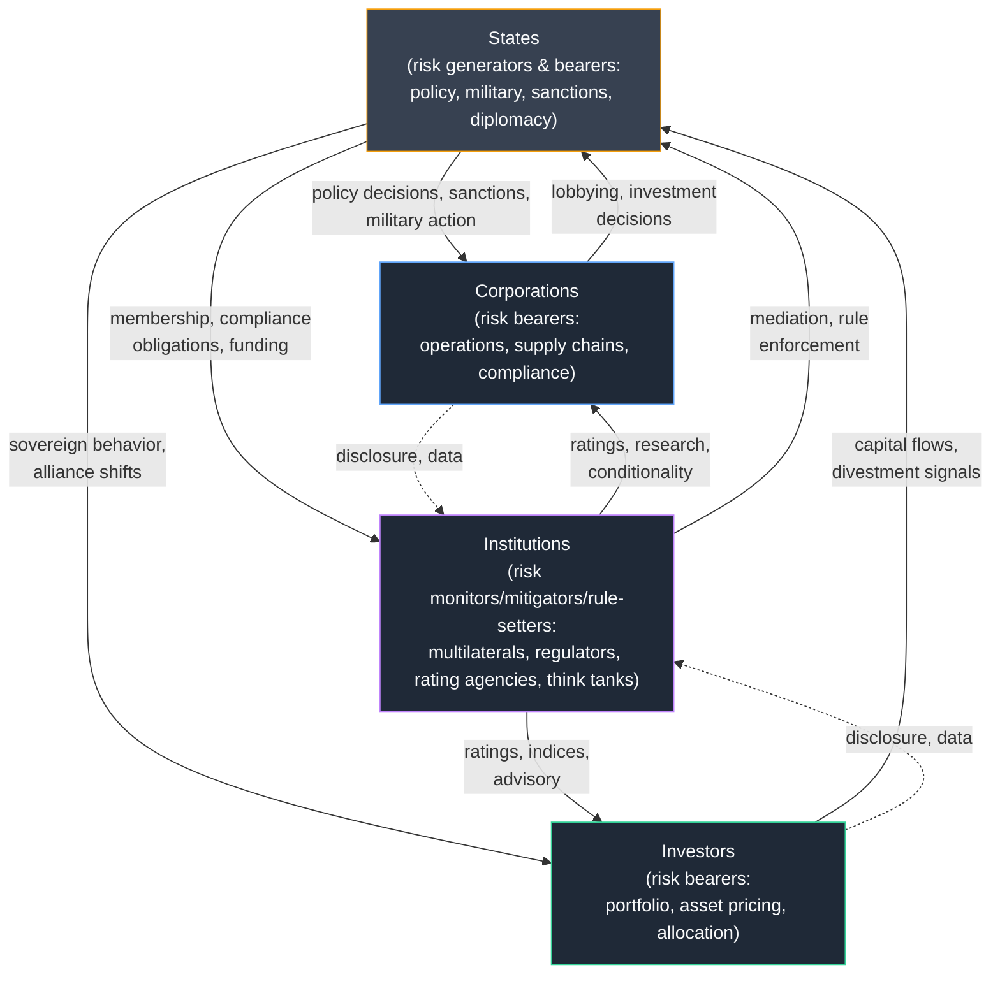

## Key Stakeholders: States, Corporations, Investors, and Institutions

### Overview

Geopolitical risk does not exist in the abstract; it is experienced, generated, and managed differently by distinct classes of actors, each with different exposure profiles, risk tolerances, time horizons, and mitigation toolkits. Mapping these stakeholder categories — states, corporations, investors, and multilateral/institutional actors — is essential because the same geopolitical event (e.g., a regional conflict) generates fundamentally different risk questions and responses depending on which stakeholder category is asking.

### States (Sovereign Governments)

**Core Role**

States are simultaneously the primary **generators** of geopolitical risk (through policy choices, military action, alliance decisions, sanctions) and major **bearers** of geopolitical risk (through exposure to other states' actions, economic dependency, and security threats). This dual role distinguishes states from every other stakeholder category.

**Key Points**

- States operate across multiple risk-relevant functions: **foreign ministries** (diplomatic risk and alliance management), **defense/security establishments** (military risk assessment and deterrence posture), **finance/central bank functions** (sanctions design and implementation, sovereign reserve management), and **trade/commerce ministries** (export controls, trade policy risk).
- States can be categorized by their structural position in the geopolitical risk landscape: **great powers** (U.S., China, and arguably an EU/Russia tier below them) who generate systemic risk through their bilateral competition; **middle powers** (India, Japan, UK, France, Brazil, Indonesia) who both absorb great-power risk and exercise independent regional influence; and **smaller/frontline states** (e.g., Taiwan, Ukraine, Baltic states, Gulf states) who often bear disproportionate geopolitical risk exposure due to geographic position without commensurate capacity to shape great-power dynamics.
- State risk tolerance and time horizons differ structurally from commercial actors: states can absorb losses over multi-decade horizons, mobilize non-market instruments (military deterrence, diplomatic coalition-building, sanctions), and are motivated by security and sovereignty considerations that are not reducible to expected financial return.
- State behavior is a primary **input** to every other stakeholder's risk model (a corporation's supply chain risk depends on state trade policy; an investor's sovereign risk assessment depends on state fiscal and diplomatic behavior) while simultaneously being the **least predictable via standard financial modeling techniques**, since state decision-making is shaped by domestic politics, leadership psychology, and strategic culture rather than market signals.

**Example**

A state's risk-management toolkit is visible in the interplay between diplomatic signaling, military posturing, and economic statecraft: for instance, a government responding to a rival's territorial assertiveness may simultaneously pursue diplomatic protests through international bodies, increase defense spending and alliance coordination, and impose targeted economic sanctions — using instruments unavailable to any private-sector stakeholder.

### Corporations (Multinational Enterprises)

**Core Role**

Corporations are primarily **risk-bearers** rather than risk-generators (with some exceptions, such as large firms whose commercial decisions have geopolitical salience — e.g., technology firms subject to export control regimes, or energy majors whose investment decisions affect host-state fiscal dependency). Corporate geopolitical risk management is fundamentally about protecting operations, assets, personnel, and revenue streams from state-driven disruption.

**Key Points**

- Corporate exposure to geopolitical risk manifests across several operational dimensions: **physical asset risk** (facilities, personnel safety in conflict-affected or politically unstable jurisdictions), **supply chain risk** (dependency on inputs, components, or logistics routes subject to disruption — e.g., semiconductor supply chains concentrated in geopolitically contested East Asia), **market access risk** (tariffs, sanctions, market closure), **regulatory/compliance risk** (export control compliance, sanctions screening, data localization requirements), and **reputational risk** (association with jurisdictions or conflicts that create stakeholder or consumer backlash).
- Corporate geopolitical risk functions are organizationally housed variously within **enterprise risk management (ERM)**, dedicated **geopolitical risk or global security** units (increasingly common in large multinationals since the 2010s), **corporate strategy** functions, or **compliance/legal** departments (particularly for sanctions and export control exposure) — organizational placement significantly affects how geopolitical risk analysis is integrated into decision-making.
- Corporate risk tolerance is fundamentally different from state risk tolerance: firms are ultimately accountable to shareholders for risk-adjusted returns over comparatively shorter time horizons (quarterly/annual reporting cycles, multi-year capital investment horizons), which creates structural tension when geopolitical risks materialize over longer timeframes than standard corporate planning cycles accommodate.
- Corporate mitigation tools include: **political risk insurance** (covering expropriation, currency inconvertibility, political violence), **contractual protections** (stabilization clauses, international arbitration provisions, force majeure clauses), **supply chain diversification/derisking** (multi-sourcing, nearshoring, friend-shoring), **scenario planning and stress testing**, and **divestment/exit strategies** for jurisdictions where risk exceeds tolerance thresholds.
- Publicly listed corporations increasingly face **disclosure obligations** related to geopolitical risk exposure (e.g., under evolving SEC guidance, EU sustainability reporting frameworks, and general "material risk" disclosure requirements), creating a growing formal-reporting dimension to corporate geopolitical risk management that did not exist as prominently in earlier decades.

**Example**

A semiconductor manufacturer with fabrication facilities in Taiwan and significant sales exposure to both the U.S. and Chinese markets exemplifies compounded corporate geopolitical risk: it faces potential export control compliance risk (U.S. restrictions on technology sales to China), market access risk (Chinese retaliatory measures or domestic substitution policification), and existential physical/operational risk (any Taiwan Strait contingency) simultaneously — a textbook case of why corporate geopolitical risk analysis must integrate compliance, supply chain, and scenario-planning functions.

### Investors (Asset Managers, Institutional Investors, Sovereign Wealth Funds)

**Core Role**

Investors are risk-bearers whose primary concern is the impact of geopolitical events on **asset prices, portfolio returns, and capital allocation decisions** — a narrower but more immediately quantifiable lens than the operational risk concerns of corporations.

**Key Points**

- The investor category itself spans several sub-types with distinct mandates and horizons: **hedge funds and active asset managers** (shorter horizons, often seeking to trade geopolitical volatility directly), **pension funds and insurance companies** (longer horizons, liability-matching considerations, generally more conservative geopolitical risk tolerance), **sovereign wealth funds** (which occupy a hybrid position — commercially oriented but ultimately state-owned, creating potential alignment or tension between their home state's geopolitical position and their investment mandate), and **private equity/venture capital** (illiquid, multi-year horizons with limited ability to exit rapidly in response to geopolitical shocks).
- Investors translate geopolitical risk into portfolio management actions through: **country/regional allocation weighting** (underweighting or excluding jurisdictions above a risk threshold), **hedging instruments** (currency hedges, sovereign CDS, commodity hedges for geopolitically sensitive commodities like oil), **scenario-based stress testing** of portfolios against geopolitical tail-risk events, and **engagement/divestment decisions** on ESG or geopolitically sensitive grounds (e.g., divestment from firms with significant Russia exposure following 2022 sanctions).
- Institutional investors increasingly consume or commission **dedicated geopolitical risk research** — either through in-house geopolitical strategy teams (a function that grew substantially at major asset managers and banks through the 2010s and 2020s) or through commercial geopolitical risk advisory firms — reflecting the financialization/quantification phase of the discipline's historical evolution.
- A key structural tension for investors is between **diversification logic** (which assumes risk factors are largely uncorrelated across holdings) and **geopolitical risk's tendency to generate correlated, systemic shocks** across seemingly diversified portfolios (e.g., a Taiwan Strait crisis would simultaneously affect technology, semiconductor, shipping, and broad Asian equity holdings) — meaning geopolitical risk is a leading candidate for genuine "tail risk" that standard diversification does not adequately address.

**Example**

An institutional investor evaluating emerging market bond exposure must weigh not only country-specific sovereign risk metrics but also that country's exposure to great-power competition dynamics (e.g., a country's dependency on Chinese Belt and Road financing versus Western multilateral lending) as a distinct geopolitical risk factor that can affect both direct sovereign risk and broader regional financial stability.

### Institutions (Multilateral, Regulatory, and Analytical Bodies)

**Core Role**

Institutions occupy a distinct fourth category: they are neither purely risk-generators (like states) nor purely risk-bearers seeking to protect commercial interests (like corporations and investors), but rather **risk-monitoring, risk-mitigating, and rule-setting bodies** that shape the environment within which the other three stakeholder categories operate.

**Key Points**

- **Multilateral institutions** (UN, IMF, World Bank Group, WTO, NATO, regional bodies such as the EU, ASEAN, and the African Union) perform functions including conflict mediation and peacekeeping, financial stability support (IMF lending programs, often directly relevant to sovereign risk mitigation), trade rule enforcement, and collective security coordination — their effectiveness or erosion is itself a significant geopolitical risk variable (e.g., debates over WTO dispute-settlement dysfunction or NATO Article 5 credibility).
- **Credit rating agencies** (S&P, Moody's, Fitch) and **country risk rating providers** (EIU, Coface, ICRG/PRS Group) function as quasi-institutional intermediaries, translating geopolitical and country-specific developments into standardized ratings consumed across the investor and corporate stakeholder categories — their methodologies and potential lag effects (discussed in the prior topic on geopolitical risk versus country/sovereign risk) make them a critical, if imperfect, node in the overall risk information ecosystem.
- **Central banks** occupy a distinctive institutional position: they both generate geopolitical-risk-relevant research (e.g., the Federal Reserve's development of the Caldara-Iacoviello GPR Index) and must incorporate geopolitical risk into monetary policy and financial stability assessments, given the potential for geopolitical shocks to transmit into inflation, currency stability, and banking sector health.
- **Academic and think-tank institutions** (e.g., Chatham House, Council on Foreign Relations, Carnegie Endowment, RAND Corporation) and **commercial geopolitical risk advisory firms** (Eurasia Group, Verisk Maplecroft, Control Risks, S&P Global's geopolitical risk offerings) provide the analytical infrastructure — frameworks, indices, scenario products, and bespoke advisory — that the other three stakeholder categories draw upon, effectively functioning as the discipline's knowledge-production layer.
- **Regulatory bodies** (export control authorities such as the U.S. Bureau of Industry and Security, sanctions-implementing bodies such as the U.S. Office of Foreign Assets Control (OFAC) and the EU's sanctions framework) directly translate state-level geopolitical decisions into binding compliance obligations for corporations and investors, making them a critical transmission node between the state and commercial stakeholder categories.

**Example**

The IMF's role in the 2022–2023 Sri Lankan sovereign debt crisis illustrates the institutional stakeholder function: as a multilateral lender, the IMF provided conditional financial support intended to stabilize sovereign risk, while its program conditionality and geopolitical context (competing Chinese and Western/Indian financial and strategic interests in Sri Lanka) made the institutional response itself a subject of geopolitical risk analysis.

### Stakeholder Interaction Framework

### SVG: Stakeholder Risk Profile Comparison (svg_diagram)

<svg xmlns="http://www.w3.org/2000/svg" viewBox="0 0 680 400">
<rect x="0" y="0" width="680" height="400" fill="#0f172a" />
<text x="340" y="28" text-anchor="middle" font-size="16" font-weight="bold" fill="#f8fafc">Stakeholder Time Horizon vs. Mitigation Toolkit (svg_diagram)</text>
<line x1="80" y1="350" x2="620" y2="350" stroke="#64748b" stroke-width="1.5" />
<line x1="80" y1="350" x2="80" y2="60" stroke="#64748b" stroke-width="1.5" />
<text x="350" y="380" text-anchor="middle" font-size="11" fill="#94a3b8">Time Horizon (short → long)</text>
<text x="30" y="200" text-anchor="middle" font-size="11" fill="#94a3b8" transform="rotate(-90 30 200)">Non-market Instruments</text>
<circle cx="180" cy="300" r="12" fill="#34d399" />
<text x="180" y="325" text-anchor="middle" font-size="11" fill="#6ee7b7">Investors</text>
<text x="180" y="340" text-anchor="middle" font-size="9" fill="#a7f3d0">(quarterly-annual)</text>
<circle cx="330" cy="240" r="14" fill="#60a5fa" />
<text x="330" y="270" text-anchor="middle" font-size="11" fill="#93c5fd">Corporations</text>
<text x="330" y="285" text-anchor="middle" font-size="9" fill="#bfdbfe">(multi-year capex cycles)</text>
<circle cx="480" cy="150" r="16" fill="#c084fc" />
<text x="480" y="185" text-anchor="middle" font-size="11" fill="#d8b4fe">Institutions</text>
<text x="480" y="200" text-anchor="middle" font-size="9" fill="#e9d5ff">(program/mandate cycles)</text>
<circle cx="560" cy="90" r="18" fill="#f59e0b" />
<text x="560" y="130" text-anchor="middle" font-size="11" fill="#fbbf24">States</text>
<text x="560" y="145" text-anchor="middle" font-size="9" fill="#fcd34d">(multi-decade, non-market tools)</text>
</svg>

### Cross-Stakeholder Dynamics and Common Pitfalls

**Key Points**

- **Information asymmetry** is structural across these categories: states (particularly through intelligence and diplomatic channels) typically possess superior, earlier information about emerging geopolitical risk than corporations and investors, who often rely on public reporting, commercial advisory services, and market signals with an inherent lag.
- **Misaligned incentives** commonly arise between stakeholder categories operating in the same jurisdiction: a corporation may wish to maintain market access despite rising geopolitical risk (revenue incentive), while its home state may be moving toward restricting that same market access (national security incentive) — creating compliance and strategic tension, visible in contemporary debates over technology firms' China exposure.
- A common analytical pitfall is treating "the market" or "investors" as a monolithic bloc reacting uniformly to geopolitical events — in practice, different investor sub-types (short-horizon hedge funds versus long-horizon pension funds) frequently respond to the same event with different timing, magnitude, and even directional positioning.
- Another common pitfall is underestimating the **institutional stakeholder category's** independent influence — treating multilateral bodies, rating agencies, and regulators as purely passive transmission mechanisms rather than actors whose own institutional credibility, resourcing, and mandate evolution (e.g., debates over WTO reform or credit rating agency methodology changes) constitute an independent source of geopolitical risk in their own right.

**Related Topics**

- Organizational design of corporate geopolitical risk and global security functions
- Sovereign wealth fund governance and the state-investor hybrid mandate
- Export control and sanctions compliance architecture (OFAC, BIS, EU frameworks)
- Credit rating agency methodology and criticisms of ratings lag
- The role of think tanks and advisory firms in geopolitical risk knowledge production
- Multilateral institution effectiveness and erosion as a geopolitical risk factor
- Stakeholder-specific hedging instruments: PRI, sovereign CDS, currency and commodity hedges
- Case study: divergent stakeholder responses to the 2022 Russia sanctions regime