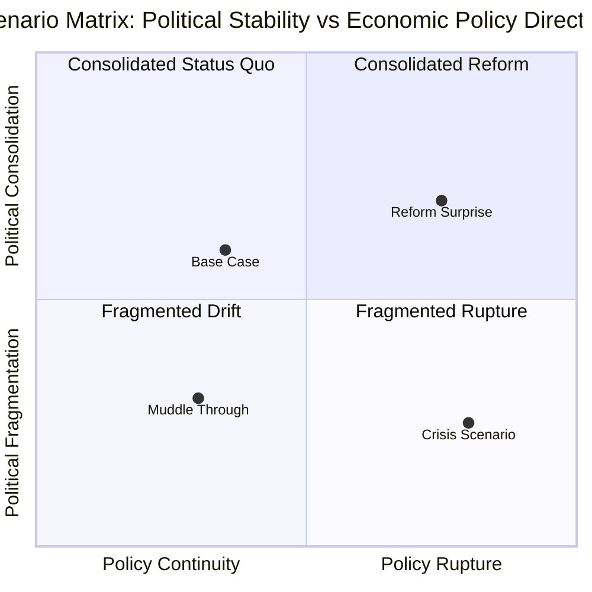
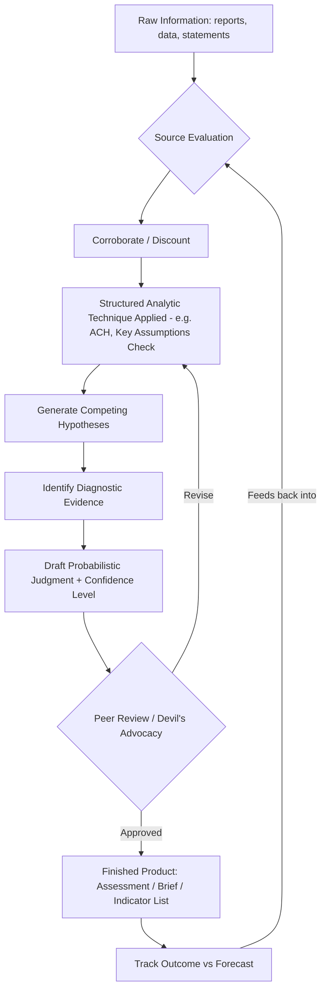

## The Analytical Mindset and Toolkit of a Risk Analyst

### Overview

Geopolitical risk analysis is the discipline of assessing how political, social, economic, and security developments in one or more jurisdictions could affect the interests of a state, company, investor, or organization. The analyst's output is not the event itself but a structured judgment about likelihood, timing, magnitude, and implication. Two analysts with identical access to information routinely reach different conclusions because the discipline is less about data volume and more about the cognitive process applied to that data. This section covers the mindset (the cognitive habits and biases-awareness that separate rigorous analysis from punditry) and the toolkit (the concrete frameworks, sourcing practices, and products analysts use to convert raw information into decision-useful judgment).

### The Core Analytical Mindset

#### Probabilistic Thinking, Not Prediction

A risk analyst does not forecast single outcomes ("Country X will default in 2027"). Instead, the analyst assigns and communicates probabilities across a distribution of outcomes ("60% chance of a negotiated debt restructuring within 18 months, 25% chance of a disorderly default, 15% chance the status quo muddles through"). This matters because:

- Single-point predictions are almost always wrong in their specifics even when directionally correct, and they are unfalsifiable in a useful sense — a missed date doesn't tell you whether your reasoning was sound.
- Probabilistic statements can be scored over time (calibration), which is the only way an analyst or an institution improves.
- Decision-makers need a distribution, not a headline, because their hedging or positioning decisions depend on the shape of the tail risks, not just the modal outcome.

**Key Points**

- Use explicit probability language or numeric ranges rather than hedge words like "could," "might," or "may" without quantification.
- A probability estimate without a timeframe is not a usable forecast — always attach a horizon.
- Track your own forecasts against outcomes; this is the basis of calibration training (see Superforecasting section below).

#### Intellectual Humility and Falsifiability

The analyst mindset treats every judgment as provisional and actively seeks disconfirming evidence rather than confirming evidence. This is the operational translation of Karl Popper's falsifiability criterion into a professional practice: a good geopolitical judgment should specify, in advance, what evidence would prove it wrong.

[Inference] Analysts who explicitly write down disconfirming indicators before an event unfolds tend to update faster and more accurately when those indicators appear, compared to analysts who only defined confirming indicators — this follows from decision-science research on hypothesis testing generally, though it has not been isolated as a controlled finding specific to geopolitical analysts.

#### Cognitive Bias Awareness

Professional analytic tradecraft, most influentially codified in Richards Heuer's *Psychology of Intelligence Analysis* (CIA Center for the Study of Intelligence), identifies recurring failure patterns that the mindset must actively guard against:

| Bias | Description | Mitigation Practice |
| --- | --- | --- |
| Confirmation bias | Seeking/weighting information that supports an existing hypothesis | Actively generate and search for disconfirming evidence (see ACH below) |
| Mirror-imaging | Assuming a foreign actor will reason the way you would in their position | Explicitly model the actor's incentives, domestic constraints, and history, not your own |
| Anchoring | Over-weighting the first estimate or number encountered | Generate an independent estimate before viewing others' forecasts |
| Groupthink | Suppressing dissent to preserve team consensus | Structured techniques requiring a designated dissenting view (e.g., "devil's advocacy") |
| Availability heuristic | Overweighting vivid, recent, or memorable events | Deliberately consult base rates rather than salient anecdotes |
| Client/organizational bias | Shading a judgment to please the audience or fit institutional preference | Separate the analytic line from the policy recommendation; label sourcing/confidence transparently |

#### Base-Rate Discipline

Before assessing case-specific factors, the analyst mindset asks: how often does this general class of event happen? A coup attempt, a currency crisis, a negotiated ceasefire — each has historical base rates across comparable countries and conditions. Case-specific "inside view" reasoning (the specific personalities, this week's headlines) should adjust the base rate ("outside view"), not replace it. This is the single most consistent lesson from Philip Tetlock's forecasting research: forecasters who anchor on base rates and adjust incrementally systematically outperform those who reason purely from narrative.

#### Comfort with Ambiguity and Incomplete Information

Geopolitical questions are almost never resolved by a complete data set. The mindset requires:

- Producing a "best current assessment" under time pressure rather than waiting for certainty that will never arrive.
- Explicitly flagging confidence levels (high/moderate/low confidence) rather than presenting an assessment as uniformly solid.
- Treating information gaps as a labeled feature of the product ("key intelligence gap: we lack visibility into faction X's internal deliberations") rather than hiding them.

#### Structured Skepticism Toward Sources

Every input — a government statement, a leaked document, a social media post, a think-tank report — carries a motive structure. The mindset requires habitually asking: who produced this, what do they gain from my believing it, and how would I know if it were false or manipulated? This is distinct from cynicism; the goal is calibrated trust, not blanket distrust.

### The Analytical Toolkit

#### Structured Analytic Techniques (SATs)

SATs are the formalized procedures that operationalize the mindset above. They exist precisely because unaided human judgment is subject to the biases listed earlier.

**1. Analysis of Competing Hypotheses (ACH)**

Developed by Richards Heuer, ACH forces the analyst to evaluate all plausible hypotheses simultaneously against the same evidence, rather than building a case for a single favored hypothesis and stopping.

Procedure:

1. List all plausible hypotheses (not just the two most obvious).
2. List all significant evidence and arguments.
3. Build a matrix scoring each piece of evidence against each hypothesis for consistency (consistent / inconsistent / not applicable).
4. Refine the matrix, focusing on diagnostic evidence — evidence that discriminates between hypotheses, not evidence that is merely consistent with everything.
5. Draw tentative conclusions by identifying which hypothesis has the *least* evidence against it (not the most evidence for it — this is the critical inversion that fights confirmation bias).
6. Analyze sensitivity: which few pieces of evidence, if wrong, would flip the conclusion?
7. Report conclusions along with the diagnostic evidence and confidence level.
8. Identify milestones/indicators for future review.

**Example** — ACH matrix for "Will State A conduct a military strike on a disputed border installation within 3 months?"

| Evidence | H1: Strike likely | H2: Coercive posturing only | H3: De-escalation intended |
| --- | --- | --- | --- |
| Troop movements to border | Consistent | Consistent | Inconsistent |
| Diplomatic backchannel activity reported | Inconsistent | Consistent | Consistent |
| Domestic approval ratings falling for leader | Consistent | Consistent | Inconsistent |
| Key ally counsels restraint publicly | Inconsistent | Consistent | Consistent |
| Military logistics (fuel, munitions) build-up confirmed | Consistent | Inconsistent | Inconsistent |

Diagnostic evidence here is the logistics build-up: it is inconsistent with H2 and H3 but consistent with H1, making it far more useful than the troop movements (consistent with two hypotheses and thus non-diagnostic).

**2. Key Assumptions Check**

A short, deliberate exercise listing every assumption underpinning the current assessment, then stress-testing each: "What if this assumption is wrong?" Frequently reveals that an entire assessment rests on one unexamined premise (e.g., "we assumed the central bank governor retains autonomy from the executive").

**3. Devil's Advocacy / Team A–Team B**

A designated analyst or sub-team is tasked with building the strongest possible case against the prevailing assessment, specifically to counter groupthink and premature consensus.

**4. Red Team Analysis**

The analyst adopts the adversary's or foreign actor's perspective and incentive structure entirely, producing the assessment *as that actor would see the situation*, rather than as an outside observer. This directly counters mirror-imaging.

**5. Indicators and Warning (I&W) / Indicator Lists**

A pre-defined list of observable events that would signal a scenario is moving toward realization, monitored continuously (e.g., for a currency crisis: FX reserve depletion rate, parallel market premium widening, sovereign CDS spread moves, capital control announcements).

**6. Scenario Planning / Scenario Matrices**

Rather than a single forecast, the analyst builds 3–5 internally consistent future scenarios (not simple probability-weighted averages) that span the plausible outcome space, typically built along two key uncertainty axes.

**7. Delphi Method / Structured Expert Elicitation**

For questions where quantitative data is thin, analysts elicit independent judgments from multiple subject-matter experts anonymously, aggregate them, share the anonymized range back to participants, and iterate — designed specifically to avoid the anchoring and social-conformity effects of an open roundtable discussion.

#### The Superforecasting Toolkit (Tetlock-derived practices)

Emerging from the IARPA-funded Good Judgment Project, these practices are now standard in professional risk shops:

- **Fermi-ize the problem**: break an intractable question into smaller, more tractable sub-questions with knowable or estimable inputs, then reconstruct an estimate from the parts.
- **Granular probability estimates**: use fine-grained percentages (e.g., 63%, not "likely") since the discipline of picking a specific number forces sharper reasoning, even though the false precision of the exact digit is itself acknowledged.
- **Frequent updating in small increments**: revise estimates as new evidence arrives rather than only at scheduled review points, but avoid over-reacting to any single data point ("belief updating without whiplash").
- **Track record / calibration scoring**: maintain a personal or team scorecard (e.g., using a Brier score) of past probabilistic forecasts against realized outcomes.

$$\text{Brier Score} = \frac{1}{N}\sum_{i=1}^{N}(f_i - o_i)^2$$

Where $f_i$ is the forecast probability for event $i$ and $o_i$ is the outcome (1 if it occurred, 0 if not). Lower scores indicate better calibration; a score of 0 is perfect, 0.25 is equivalent to always forecasting 50%, and 1.0 is maximally wrong.

#### Source Evaluation Framework

Professional tradecraft applies a two-dimensional evaluation to every piece of raw reporting, distinguishing source reliability from information credibility (these are treated as independent axes, not conflated):

|  | High Credibility Content | Low Credibility Content |
| --- | --- | --- |
| **High Reliability Source** | Weight heavily | Investigate discrepancy — possible source compromise or one-off error |
| **Low Reliability Source** | Corroborate before using | Discount / flag as unreliable |

Standard sourcing hierarchy used in practice, roughly descending in typical reliability (though [Inference] this ordering is a professional convention rather than a fixed rule, since a well-connected local journalist can outperform a stale government report):

1. Primary government/official documents and data releases
2. On-the-record statements from named officials
3. Established wire services and specialist trade press (Reuters, Bloomberg, regional specialist outlets)
4. Think-tank and academic analysis
5. Local/regional media
6. Social media from verified, subject-matter-relevant accounts
7. Anonymous or unverified social media / rumor networks

#### Analytic Confidence and Sourcing Language

Standardized language (drawn from the U.S. Intelligence Community's analytic tradecraft standards, ICD 203, now widely adopted in private-sector risk shops) separates two distinct concepts that are commonly and wrongly conflated:

- **Likelihood of the event** — expressed as a probability band (e.g., "almost certainly" = 95–99%, "probably/likely" = 55–80%, "roughly even chance" = 45–55%, "unlikely" = 20–45%, "remote" = 1–5%).
- **Confidence in the judgment** — expressed as high/moderate/low confidence, reflecting the quality, corroboration, and consistency of the underlying sourcing, independent of the probability assigned.

A judgment can be "likely" with "low confidence" (a plausible but thinly sourced call) or "roughly even chance" with "high confidence" (a well-sourced conclusion that the outcome is genuinely uncertain).

#### Core Analytical Frameworks Applied to Country/Situation Assessment

- **PMESII-PT** (Political, Military, Economic, Social, Infrastructure, Information, Physical Environment, Time) — a systems-decomposition checklist ensuring no major driver category is overlooked when scoping a country assessment.
- **STEEP/PESTLE** (Political, Economic, Social, Technological, Environmental, Legal) — a business-oriented variant more common in corporate risk and market-entry contexts.
- **Actor mapping / stakeholder analysis** — enumerating relevant actors (state, sub-state, non-state, external powers), their interests, capabilities, and relationships, often visualized as an influence network.
- **Net assessment** — comparative evaluation of two or more competing actors' relative capabilities and trajectories over time, historically associated with military/strategic balance analysis but widely adapted to compare, e.g., a government's capacity versus an insurgent or opposition movement's capacity.

#### Analytical Products (the toolkit's output formats)

- **Current intelligence / situation reports** — short, fast-turnaround updates on a developing event.
- **Estimative assessments** — medium-to-long-horizon probabilistic judgments on a specific question ("Will X happen by Y date").
- **Warning products** — flagging that a low-probability, high-impact scenario's indicators are trending toward activation.
- **Country risk profiles / scorecards** — standardized, often partially quantitative, comparative ratings across political, economic, and security dimensions (used heavily in sovereign risk and corporate market-entry contexts).
- **Scenario decks** — the output of scenario planning exercises, often used directly by corporate strategy or investment committees for stress-testing decisions.

#### Software and Data Tooling

While the mindset and SATs above are analyst-side and largely tool-agnostic, professional practice is increasingly supported by:

- **Structured data/GIS tools** (e.g., ArcGIS, QGIS) for conflict mapping, infrastructure exposure mapping, and supply-chain geographic overlay.
- **Event datasets** (e.g., ACLED for armed conflict events, GDELT for global event/media data) used to build base rates and indicator time series rather than relying purely on qualitative impression.
- **Network/relationship mapping software** for actor and elite-network visualization (e.g., using graph tools built on frameworks like Gephi or bespoke Neo4j-backed systems in more advanced shops). [Unverified] The specific vendor tools in use vary significantly across firms and are often proprietary or bespoke, so no single tool is "standard" across the industry.
- **Collaborative ACH/SAT software** — dedicated structured-analytic-technique platforms exist in the government and defense-contractor space; most private-sector shops replicate the matrices in spreadsheets rather than dedicated software.
- Large-language-model-assisted drafting and rapid literature triage are increasingly used for first-pass source summarization, though [Speculation] the extent to which this materially changes analytic *quality* versus merely analytic *speed* is not yet well established in the public literature and is likely to remain a live debate as adoption deepens.

### Common Pitfalls

- **Narrative substitution for analysis**: constructing a compelling story about "what's happening" without attaching falsifiable, probabilistic claims to it.
- **False precision**: a numeric probability (e.g., "73%") implies a rigor of method that may not be present if it wasn't derived from an explicit structured process.
- **Single-point forecasting**: presenting one predicted outcome rather than a distribution, which collapses under the first disconfirming data point and offers the client no sense of the range of possibilities.
- **Client capture**: unconsciously shading assessments toward what a client, employer, or government sponsor wants to hear.
- **Recency bias in geopolitics specifically**: treating the most recent news cycle as more diagnostic of underlying structural trends than it usually is.

**Related Topics**

- Structured Analytic Techniques in depth (ACH, Key Assumptions Check, Red Team/Team A-B in practice)
- Building and scoring probabilistic forecasts (Brier scores, calibration training)
- Country risk rating methodologies (sovereign risk scorecards, PRS Group, EIU frameworks)
- Open-source intelligence (OSINT) collection and verification techniques
- Political risk insurance and how underwriters use analyst output
- Scenario planning workshops: facilitation and axis selection
- Event datasets and quantitative indicators (ACLED, GDELT, V-Dem) for base-rate construction
- Cognitive bias mitigation training programs (Good Judgment Project methodology)
- Writing for decision-makers: the BLUF (Bottom Line Up Front) format and executive briefing structure