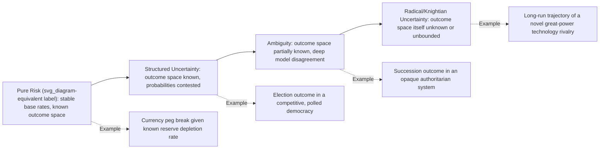

## Geopolitical Risk versus Geopolitical Uncertainty

### Overview

The terms "risk" and "uncertainty" are frequently used interchangeably in casual commentary but represent a foundational conceptual distinction in decision theory that geopolitical analysis inherits directly. The distinction traces to economist Frank Knight's 1921 work *Risk, Uncertainty, and Profit*, and it determines which analytical tools are even valid to apply to a given question. Misapplying risk-appropriate tools (probability distributions, expected value calculations) to genuinely uncertain situations produces false precision; failing to recognize when a situation has become tractable enough for probabilistic treatment leaves an analyst underusing available structure. A risk analyst's first task on any question is often not "what will happen" but "which category of problem am I facing."

### The Knightian Distinction

**Risk**: a situation where the possible outcomes are known (or reasonably enumerable) and a probability distribution over those outcomes can be estimated, even if imperfectly, from historical frequency, structural modeling, or expert elicitation.

**Uncertainty** (sometimes called "Knightian uncertainty" or "true uncertainty"): a situation where either the possible outcomes themselves cannot be fully enumerated in advance, or no meaningful probability distribution can be assigned to them, because there is no relevant reference class, no stable underlying data-generating process, or the situation is genuinely novel.

$$P(\text{outcome} \mid \text{risk}) \text{ is estimable}; \quad P(\text{outcome} \mid \text{uncertainty}) \text{ is not well-defined}$$

**Key Points**

- Risk is measurable; uncertainty is not measurable in the same sense, even with unlimited data-gathering effort.
- The distinction is about the *nature of the problem*, not about the analyst's confidence or effort level — more research does not convert genuine uncertainty into risk.
- Most real-world geopolitical questions sit on a spectrum between the two poles rather than at either extreme.

### Why the Distinction Matters for Geopolitical Analysis

Geopolitical questions are disproportionately prone to Knightian uncertainty compared to, say, actuarial or engineering risk, for several structural reasons:

1. **Small sample sizes for rare, high-stakes events.** Sovereign defaults, coups, interstate wars, and regime collapses are individually rare, and each instance has unique structural features, so building a robust frequency-based probability distribution is difficult.
2. **Reflexivity.** Political and market actors observe risk assessments and change their behavior in response (a leader who knows analysts expect escalation may deliberately signal de-escalation, or vice versa), which destabilizes the very data-generating process an analyst would need to be stable in order to model it statistically.
3. **Regime and structural breaks.** The "rules of the game" (alliance structures, institutional arrangements, technology of warfare or economic coercion) shift over time, meaning historical base rates from one era may not transfer cleanly to the current one.
4. **Strategic actors with private information and deliberate deception.** Unlike a natural hazard (an earthquake has no incentive to mislead seismologists), geopolitical actors actively manage perceptions, conceal capabilities and intentions, and sometimes benefit from analysts being wrong.
5. **Multiple interacting complex systems.** Economic, military, domestic political, and social dynamics interact non-linearly, producing outcomes not reducible to any single well-behaved probability model.

[Inference] Because of these features, a purely quantitative, model-driven approach transplanted directly from financial risk management tends to understate true uncertainty in geopolitical contexts unless it is explicitly supplemented with qualitative, scenario-based, and expert-judgment methods — this follows from the structural features listed above rather than being a directly benchmarked finding.

### A Practical Spectrum, Not a Binary

In professional practice, the risk/uncertainty distinction is best treated as a continuum, and part of the analyst's mindset is correctly locating a given question along it.

Examples mapped onto this spectrum:

| Position on spectrum | Example | Why |
| --- | --- | --- |
| Closer to pure risk | Sovereign default probability given a specific, quantifiable debt-service schedule and FX reserve trajectory | Reasonably stable historical base rates for default given similar debt/reserve ratios exist |
| Structured uncertainty | Outcome of a scheduled election with active, transparent polling | Outcome space (which candidates can win) is well-defined; probability estimation is contested but tractable |
| Ambiguity | Succession following an opaque authoritarian leader's sudden incapacitation | Outcome space (candidate successors, possible fracture, military intervention) is only partially enumerable; little relevant precedent inside that specific system |
| Near-radical uncertainty | Long-term global order effects of a genuinely novel weapons technology or a first-of-its-kind alliance realignment | No comparable historical precedent exists to construct a reference class at all |

### Analytical Implications: Different Tools for Different Zones

**For risk-zone questions** (tractable probability distributions):

- Base-rate-driven forecasting, actuarial and time-series approaches.
- Quantitative indicators and early-warning thresholds (e.g., FX reserves, CDS spreads, protest-event frequency from datasets like ACLED).
- Calibrated probabilistic forecasting per superforecasting practice (Brier-scored, frequently updated estimates).
- Expected-value and expected-loss framing is meaningful and defensible to present to a decision-maker.

**For uncertainty-zone questions** (no defensible probability distribution):

- Scenario planning across plausible, internally consistent futures rather than a single probability-weighted forecast — the goal shifts from "which is most likely" to "is our strategy/portfolio robust across the plausible range."
- Robustness and resilience framing: stress-test decisions against multiple scenarios rather than optimizing against one forecast.
- Real options thinking: preserve flexibility and optionality rather than committing to a single expected-value-maximizing bet.
- Red-teaming and pre-mortems to surface unconsidered outcome categories, since the outcome space itself may be incompletely enumerated.
- Explicit qualitative confidence language over false numeric precision (avoid presenting a specific percentage when the honest state of knowledge does not support one).

**Example** — Contrast in practice for two client questions:

- *"What is the probability Country X restructures its debt in the next 12 months?"* (risk-zone): An analyst can build a matrix of comparable sovereign default cases with similar reserve coverage ratios and debt-service ratios, derive a base rate, and adjust for case-specific factors — producing a defensible numeric probability band.
- *"What will the global order look like if a dominant AI-military capability gap opens between two blocs over the next decade?"* (uncertainty-zone): No comparable historical precedent exists. The appropriate output is a small set of divergent, internally consistent scenarios (e.g., "stabilizing deterrence," "destabilizing arms race," "fragmented spheres of influence") with attention to what indicators would distinguish which scenario is unfolding, not a single percentage forecast.

### Common Analytical Errors From Conflating the Two

- **False precision under uncertainty**: assigning a specific numeric probability (e.g., "62% chance of war") to a situation that is genuinely Knightian, lending unwarranted authority to what is actually an educated guess. [Inference] This is a widely cited failure mode in critiques of geopolitical forecasting products, though the specific rate at which it occurs across the industry is not something that can be precisely quantified from public sources.
- **Under-using structure where it exists**: treating a genuinely tractable, base-rate-rich question (e.g., a well-polled election) as unknowable "geopolitical uncertainty" and retreating to vague qualitative hedging when a calibrated probability would better serve the client.
- **Model-washing**: running a quantitative model on a fundamentally uncertain input set and presenting the output with the borrowed authority of a model, obscuring that the underlying assumptions were themselves guesses.
- **Ignoring reflexivity**: applying a static historical base rate to a situation where the relevant actors are aware of and actively responding to that same historical pattern, invalidating the base rate's stability going forward.
- **Uncertainty as an excuse for no answer**: using "it's uncertain" as a reason to avoid producing any structured judgment at all, when decision-makers still need the best available structured assessment, appropriately caveated, rather than a shrug.

### Related Frameworks for Navigating the Boundary

- **Rumsfeld's known/unknown matrix** (known knowns, known unknowns, unknown unknowns) — a popularized, if imprecise, public-facing analogue to the risk/uncertainty/radical-uncertainty spectrum; "unknown unknowns" roughly maps to the deep end of Knightian uncertainty where the outcome space itself is unenumerated.
- **Taleb's fragility/antifragility framing** — reframes the goal under deep uncertainty away from prediction accuracy and toward building systems, portfolios, or strategies that are robust or benefit from volatility rather than merely surviving it.
- **Bayesian updating as a bridging tool** — even under substantial uncertainty, Bayesian reasoning allows an analyst to hold and systematically revise subjective probability estimates as evidence arrives, functioning as a disciplined middle path between "false numeric precision" and "no structured judgment at all," provided the analyst is transparent that these are subjective/credence-based rather than frequency-based probabilities.

**Related Topics**

- Base-rate construction and reference-class selection for rare geopolitical events
- Scenario planning methodology in depth (axis selection, narrative construction, indicator tagging)
- Calibration and Brier scoring for probabilistic forecasts
- Real options and robustness-based decision-making under deep uncertainty
- Reflexivity in political and market systems (Soros's theory of reflexivity)
- Black swan and tail-risk framing in geopolitical contexts
- Communicating confidence versus likelihood to non-analyst decision-makers
- Early-warning indicator design for risk-zone versus uncertainty-zone questions