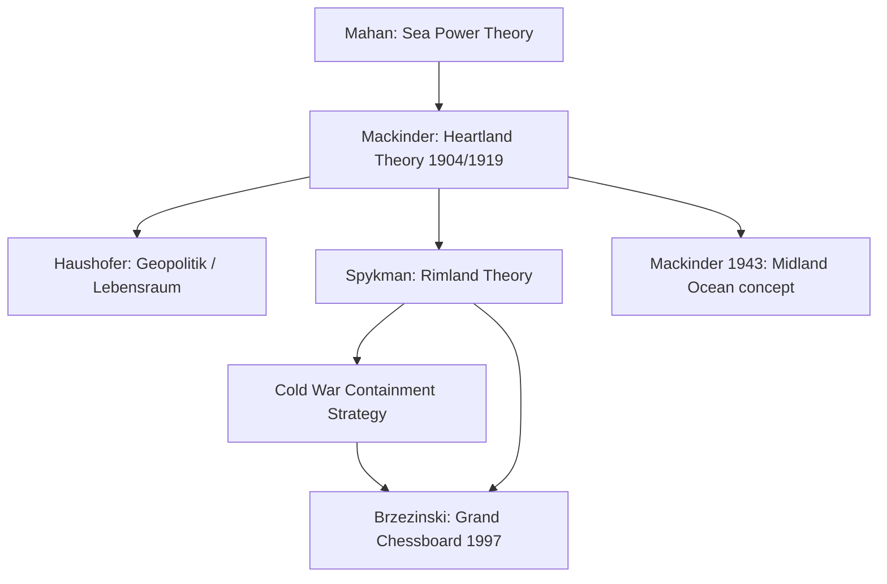

## Mackinder's Heartland Theory

### Overview

Mackinder's Heartland Theory is a foundational framework in classical geopolitics, formulated by the British geographer Sir Halford John Mackinder. It argues that control over the pivotal interior landmass of Eurasia — the "Heartland" — confers the potential for global political domination, due to that region's inaccessibility to sea power and its capacity to project land power outward. The theory reframed geography as a determinant of long-term strategic advantage, shifting emphasis from maritime empires toward continental land masses as the primary arena of great-power competition.

### Historical Origin and Context

The theory was first presented by Mackinder in a 1904 paper, "The Geographical Pivot of History," delivered to the Royal Geographical Society. Mackinder later expanded and revised the concept in his 1919 book *Democratic Ideals and Reality*, and again in a 1943 article, "The Round World and the Winning of the Peace," published in *Foreign Affairs*.

**Key Points**

- Written during a period marked by the closing of the "Columbian Age" of exploration, when nearly all habitable land had been claimed by colonial powers, leaving competition to shift toward control of existing territory rather than discovery of new territory.
- Mackinder was responding to the strategic anxieties of the British Empire, a maritime power, regarding the rise of land-based rivals such as Russia and Germany.
- The theory emerged alongside the closely related work of Alfred Thayer Mahan (sea power theory) and later Nicholas Spykman (Rimland theory), forming a triad of classical geopolitical thought.

### Core Geographic Concepts

Mackinder divided the world into a series of concentric geographic zones, each with distinct strategic characteristics.

#### The Pivot Area / Heartland

The "Pivot Area" (1904 terminology) — later renamed the "Heartland" (1919) — refers to the interior of Eurasia, roughly corresponding to the territory of the Russian Empire and later the Soviet Union.

**Key Points**

- Bounded roughly by the Arctic Ocean to the north, the Himalayas and Central Asian mountain ranges to the south, and the interior river systems that drain into the Arctic or into inland seas rather than the open ocean.
- Characterized by inaccessibility to sea power, since its major rivers do not offer navigable outlets to oceans that a naval force could exploit.
- Possesses vast resource endowments (agricultural, mineral) and a large potential population base, giving it the theoretical capacity to sustain a self-sufficient land power.

#### The Inner or Marginal Crescent

Surrounding the Heartland is the "Inner Crescent" (also called the "Marginal Crescent"), comprising the rimland states of Eurasia.

**Key Points**

- Includes coastal and peninsular regions such as Western Europe, the Middle East, South Asia, and East Asia.
- These areas are accessible both by land (bordering the Heartland) and by sea, making them contested buffer zones between land power and sea power.
- This zone was later developed independently and more thoroughly by Nicholas Spykman under the term "Rimland."

#### The Outer or Insular Crescent

The "Outer Crescent" (or "Insular Crescent") consists of landmasses separated from the Eurasian continental mass and accessible primarily by sea.

**Key Points**

- Includes Britain, the Americas, sub-Saharan Africa, Australia, and Japan.
- Historically dominated by maritime and naval power, since their strategic access to Eurasia depends on control of sea lanes.
- Mackinder viewed this crescent as inherently disadvantaged in a prolonged confrontation with a consolidated Heartland power, due to the logistical costs of projecting force across oceans versus the efficiency of interior land communication (especially after the advent of railways).

### The Central Thesis

Mackinder's argument rested on a technological and historical claim: the rise of railways had diminished the strategic advantage that sea power historically held over land power, because railways allowed rapid, all-weather movement of large forces across continental interiors without dependence on vulnerable sea lanes.

**Key Points**

- Historically, sea power (exemplified by Britain) held superior mobility because ships could move troops and goods faster and more efficiently than overland transport.
- Railways altered this balance by enabling a land power based in the Heartland to mobilize and redeploy forces across Eurasia's interior more efficiently than a maritime power could counter from the periphery.
- A power that controlled the Heartland would be shielded from naval interdiction (since it has no exposed coastline dependent on sea trade for survival) while retaining the capacity to expand outward into the Inner Crescent.

Mackinder's most frequently cited formulation, from the 1919 revision, is often paraphrased as: whoever controls the Heartland controls Eurasia, and whoever controls Eurasia controls the world's destiny. [Unverified: the exact wording varies across summaries and translations of Mackinder's original text; consult the primary source for the precise phrasing Mackinder used in each edition.]

### Evolution Across Mackinder's Publications

| Publication | Year | Terminology / Key Shift |
| --- | --- | --- |
| "The Geographical Pivot of History" | 1904 | Introduced "Pivot Area"; focused on Russo-centric Eurasian interior |
| *Democratic Ideals and Reality* | 1919 | Renamed "Pivot Area" to "Heartland"; expanded scope to include Eastern Europe as a gateway to the Heartland |
| "The Round World and the Winning of the Peace" | 1943 | Responding to WWII geopolitics; acknowledged the growing importance of air power and the Midland Ocean (North Atlantic) concept as a counterweight |

**Key Points**

- The 1919 revision introduced the famous dictum linking control of Eastern Europe to control of the Heartland, and control of the Heartland to control of the World-Island (Eurasia plus Africa) and ultimately the world.
- The 1943 article is notable for tempering the original thesis, acknowledging the rise of air power and proposing the "Midland Ocean" (Atlantic community of the US, Britain, and Western Europe) as a strategic counterbalance to the Heartland.

### Diagram: Concentric Zone Structure (svg_diagram)

<svg xmlns="http://www.w3.org/2000/svg" viewBox="0 0 600 600">
<title>Mackinder's Concentric Geographic Zones (svg_diagram)</title>
<circle cx="300" cy="300" r="280" fill="#dbe9f4" stroke="#2b4a6f" stroke-width="2" />
<circle cx="300" cy="300" r="190" fill="#a9cce3" stroke="#2b4a6f" stroke-width="2" />
<circle cx="300" cy="300" r="100" fill="#5c8db8" stroke="#2b4a6f" stroke-width="2" />
<text x="300" y="305" text-anchor="middle" font-size="16" fill="#0a1f33" font-weight="bold">HEARTLAND</text>
<text x="300" y="325" text-anchor="middle" font-size="11" fill="#0a1f33">(Pivot Area)</text>
<text x="300" y="150" text-anchor="middle" font-size="14" fill="#0a1f33" font-weight="bold">INNER / MARGINAL CRESCENT</text>
<text x="300" y="60" text-anchor="middle" font-size="14" fill="#0a1f33" font-weight="bold">OUTER / INSULAR CRESCENT</text>
<line x1="300" y1="20" x2="300" y2="580" stroke="#0a1f33" stroke-width="1" stroke-dasharray="4,4" />
</svg>

### Strategic Implications and Applications

**Example**

During the Cold War, the Heartland Theory was frequently invoked (directly or implicitly) to explain U.S. containment strategy toward the Soviet Union. The Soviet landmass approximated Mackinder's Heartland, and U.S. policy — including the network of alliances such as NATO and SEATO along the Eurasian rim — mirrored efforts to contain a Heartland power within the Inner Crescent, consistent with Spykman's Rimland refinement of Mackinder's model.

**Key Points**

- Nicholas Spykman argued the Rimland (Inner Crescent), not the Heartland itself, was the true key to global power, since it held the greater population, industrial capacity, and resources — this became a major theoretical rival/complement to Mackinder's thesis.
- Zbigniew Brzezinski's *The Grand Chessboard* (1997) explicitly revisits Mackinder's framework, arguing that Eurasia remains the central chessboard for global primacy and that U.S. strategy should prevent any single power from dominating it.
- Contemporary analysts have applied Heartland logic to Russian strategic behavior in Eastern Europe and Central Asia, and to China's Belt and Road Initiative, interpreted by some as a modern attempt to integrate Heartland and Rimland infrastructure.

### Criticisms and Limitations

**Key Points**

- **Technological obsolescence**: The rise of air power, intercontinental missiles, and later space-based and cyber capabilities undermined the theory's core premise that geography (rail-based land mobility versus sea mobility) is the primary determinant of strategic reach.
- **Environmental determinism**: Critics argue the theory reflects an overly deterministic view that geography singularly dictates political outcomes, discounting economic systems, ideology, technological innovation, and institutional factors.
- **Empirical mismatch**: The Soviet Union, despite controlling most of the Heartland, did not achieve the global domination the theory implies was likely, and eventually collapsed — suggesting resource endowment and geographic position are insufficient without corresponding economic and political capacity.
- **Eurocentrism**: The theory was constructed from a British imperial standpoint and framed non-European regions primarily in terms of their strategic value to European/Western powers.
- [Inference] Many scholars treat the theory today as a heuristic for understanding historical strategic anxieties rather than a predictive model of contemporary power distribution, given the changes in military technology and economic globalization since 1904.

### Relationship to Other Classical Geopolitical Theories

| Theorist | Core Concept | Relation to Heartland Theory |
| --- | --- | --- |
| Alfred Thayer Mahan | Sea Power (command of the sea) | Direct predecessor/rival emphasis; Mackinder's theory can be read as a rebuttal to Mahan's primacy of naval power |
| Nicholas Spykman | Rimland Theory | Refinement/counter-thesis arguing the Inner Crescent (Rimland), not the Heartland, is strategically decisive |
| Karl Haushofer | Lebensraum / German Geopolitik | Adapted and politicized Mackinder's Heartland concept, influencing Nazi German expansionist ideology in the 1930s-40s [Unverified: the extent of direct influence versus parallel development is debated among historians] |
| Zbigniew Brzezinski | Grand Chessboard / Eurasian primacy | Modern revival applying Heartland logic to post-Cold War U.S. grand strategy |

### Mermaid Diagram: Theoretical Lineage

### Application to Contemporary Geopolitical Risk Analysis

**Key Points**

- Analysts use Heartland-derived logic to assess risk in Eastern Europe, viewing states like Ukraine, Belarus, and the Baltic states as buffer zones whose alignment shifts the balance between a resurgent land power and Rimland/maritime coalitions.
- Central Asian resource corridors and infrastructure projects (pipelines, rail corridors, the Belt and Road Initiative) are frequently analyzed through a Heartland-Rimland integration lens, assessing whether continental infrastructure investment is eroding the traditional maritime-power advantage in global logistics.
- Arctic geopolitics — driven by melting sea ice opening new shipping routes and resource access along the northern edge of the historical Heartland — is an emerging area where the theory's core geographic assumptions are being reassessed. [Inference] Some contemporary risk analysts treat the Arctic as a partial revision of the Heartland's traditional inaccessibility, since new sea routes may reduce the landmass's historical isolation from maritime power.

### Conclusion

Mackinder's Heartland Theory remains one of the most cited frameworks in classical geopolitics, valuable less as a precise predictive model and more as a conceptual lens for understanding how geography, transportation technology, and resource distribution interact with great-power competition. Its concentric zone structure — Heartland, Inner Crescent, Outer Crescent — continues to inform contemporary analysis of Eurasian strategic dynamics, even as critics rightly note its limitations in an era of air power, cyber capability, and globalized economic interdependence.

**Related Topics**

- Spykman's Rimland Theory
- Mahan's Sea Power Theory
- Haushofer's Geopolitik and Lebensraum
- Brzezinski's Grand Chessboard
- Containment Strategy and the Cold War
- Arctic Geopolitics and the Northern Sea Route
- China's Belt and Road Initiative as Modern Heartland Integration
- Critical Geopolitics and the Critique of Environmental Determinism