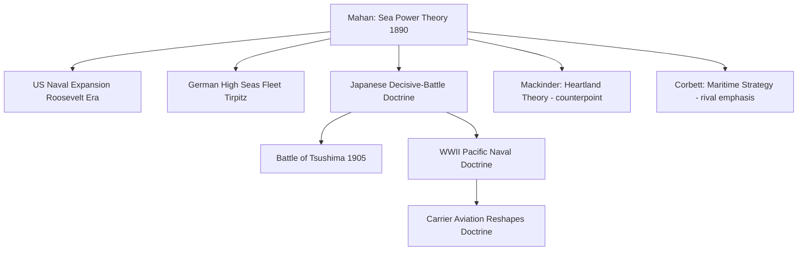

## Mahan's Sea Power and Maritime Strategy

### Overview

Alfred Thayer Mahan's theory of sea power holds that command of the sea — achieved primarily through a concentrated battle fleet capable of destroying or neutralizing an enemy's naval force — is the decisive factor in the rise and durability of great powers. Mahan argued that maritime commerce, colonies, and naval strength form an interdependent system, and that historical national greatness correlates strongly with a state's ability to control sea lines of communication. His work, chiefly *The Influence of Sea Power upon History, 1660–1783* (1890), became one of the most influential texts in the history of strategic thought, shaping naval build-ups in the United States, Germany, Japan, and Britain in the late 19th and early 20th centuries.

### Historical Origin and Context

Mahan was a U.S. Navy officer and president of the Naval War College. His major work was published in 1890, during a period of industrial-era naval modernization (the transition from sail to steam and from wood to steel-armored warships) and rising imperial competition.

**Key Points**

- Mahan drew his historical evidence primarily from the naval wars of the 17th and 18th centuries, especially the Anglo-Dutch Wars and the Anglo-French rivalry, using Britain's rise to preeminence as his central case study.
- The book directly influenced U.S. naval expansion under Theodore Roosevelt, the German High Seas Fleet build-up under Kaiser Wilhelm II (Admiral Alfred von Tirpitz was a noted admirer), and Japanese naval strategy leading into the Russo-Japanese War.
- Mahan wrote in the context of the closing continental frontier in the United States, arguing that national power now required overseas expansion supported by naval strength — a view that fed into the broader intellectual climate of American imperialism in the 1890s.

### Core Theoretical Elements

#### Command of the Sea

Mahan's central concept is "command of the sea": the condition in which one power's navy can control maritime traffic and deny the same to a rival, achieved not through commerce raiding or coastal defense but through decisive fleet engagements.

**Key Points**

- Mahan emphasized concentration of naval force into a single powerful battle fleet, rather than dispersing ships for convoy escort or raiding, arguing that a decisive fleet action that destroys the enemy's main force secures control of the sea for the duration of a conflict.
- He was critical of a "guerre de course" (commerce-raiding) strategy as a primary approach, viewing it as incapable of achieving lasting strategic dominance on its own, since it does not eliminate the enemy fleet's capacity to contest the sea.
- Command of the sea, once achieved, enables uninterrupted movement of one's own trade and military assets while denying the same to the adversary.

#### The Elements of Sea Power

Mahan identified six conditions that determine a nation's potential for sea power.

| Element | Description |
| --- | --- |
| Geographical Position | Coastal access, proximity to major trade routes, and freedom from extensive land-based defense burdens |
| Physical Conformation | Coastline character (harbors, navigable rivers) that facilitates or hinders naval and commercial development |
| Extent of Territory | Length of coastline relative to population and resources, affecting the practicality of defending it |
| Population Size | Availability of manpower for naval service and maritime trades |
| National Character | Cultural predisposition toward commerce, trade, and seafaring enterprise |
| Character of Government | Government policies that support or neglect naval investment, colonial acquisition, and merchant marine growth |

**Key Points**

- Mahan argued these elements interact multiplicatively rather than independently; a favorable geographic position without a supportive government policy, for instance, would not produce durable sea power.
- He treated "national character" as a factor tied to a state's commercial and entrepreneurial disposition, reflecting Mahan's own late-19th-century framing rather than a value-neutral analytical category. [Inference] This element is generally regarded by later scholars as the most culturally and historically contingent of the six, and the least rigorously defined.

#### The Sea Power Triad: Production, Shipping, Colonies

Mahan's system links three components into a self-reinforcing cycle: domestic production generates goods for export; a merchant marine (shipping) carries those goods; and overseas colonies or bases provide secure ports, resupply points, and additional markets, which in turn require naval protection.

**Key Points**

- A merchant marine, in Mahan's framework, is not just an economic asset but a strategic reserve — the pool of ships and trained seamen that can support naval operations in wartime.
- Colonies and overseas bases serve as coaling stations and repair facilities, extending the operational range of a battle fleet, which was especially critical in the era of coal-fired steam propulsion with limited bunker capacity.
- The navy exists, in this model, to protect the shipping and colonies that make national prosperity possible, creating a closed loop: commerce funds the navy, the navy protects commerce and colonies, and colonies sustain the navy's global reach.

### Diagram: The Sea Power Cycle (svg_diagram)

<svg xmlns="http://www.w3.org/2000/svg" viewBox="0 0 500 500">
<title>Mahan's Sea Power Cycle (svg_diagram)</title>
<circle cx="250" cy="250" r="180" fill="none" stroke="#2b4a6f" stroke-width="2" stroke-dasharray="6,4" />
<circle cx="250" cy="80" r="60" fill="#a9cce3" stroke="#0a1f33" stroke-width="2" />
<text x="250" y="75" text-anchor="middle" font-size="13" fill="#0a1f33" font-weight="bold">PRODUCTION</text>
<text x="250" y="92" text-anchor="middle" font-size="10" fill="#0a1f33">(domestic goods)</text>
<circle cx="420" cy="330" r="60" fill="#a9cce3" stroke="#0a1f33" stroke-width="2" />
<text x="420" y="325" text-anchor="middle" font-size="13" fill="#0a1f33" font-weight="bold">SHIPPING</text>
<text x="420" y="342" text-anchor="middle" font-size="10" fill="#0a1f33">(merchant marine)</text>
<circle cx="80" cy="330" r="60" fill="#a9cce3" stroke="#0a1f33" stroke-width="2" />
<text x="80" y="325" text-anchor="middle" font-size="13" fill="#0a1f33" font-weight="bold">COLONIES</text>
<text x="80" y="342" text-anchor="middle" font-size="10" fill="#0a1f33">(bases / markets)</text>
<circle cx="250" cy="260" r="55" fill="#5c8db8" stroke="#0a1f33" stroke-width="2" />
<text x="250" y="255" text-anchor="middle" font-size="13" fill="#ffffff" font-weight="bold">NAVY</text>
<text x="250" y="272" text-anchor="middle" font-size="10" fill="#ffffff">(protects cycle)</text>
<line x1="280" y1="120" x2="390" y2="290" stroke="#0a1f33" stroke-width="2" marker-end="url(#arrow)" />
<line x1="360" y1="360" x2="150" y2="360" stroke="#0a1f33" stroke-width="2" marker-end="url(#arrow)" />
<line x1="110" y1="290" x2="220" y2="120" stroke="#0a1f33" stroke-width="2" marker-end="url(#arrow)" />
</svg>

### Strategic Doctrine: Concentration, Decisive Battle, and Chokepoints

**Key Points**

- Mahan emphasized concentration of force, warning against dividing a fleet across multiple theaters, since a divided fleet risks defeat in detail against a concentrated adversary.
- He stressed control of strategic maritime chokepoints (straits, canals, and key harbors) as force multipliers, since controlling such points allows a smaller force to constrain a larger rival's freedom of movement.
- Mahan's doctrine favored offensive fleet action over passive coastal defense, arguing that a navy confined to defending its own coastline cedes the initiative and eventually loses the broader strategic contest.

**Example**

Britain's historical control of chokepoints such as the Strait of Gibraltar and the English Channel, combined with its concentrated battle fleet (the "fleet in being" doctrine), allowed it to blockade rivals such as France and deny them effective use of the high seas during the Napoleonic Wars — a case Mahan uses extensively in *The Influence of Sea Power upon History* to illustrate command of the sea in practice.

### Influence on 20th-Century Naval Build-Ups

| Nation | Application of Mahanian Doctrine |
| --- | --- |
| United States | Roosevelt-era "Great White Fleet" and battleship-centric naval expansion; foundational text at the U.S. Naval War College |
| Imperial Germany | Tirpitz's High Seas Fleet build-up, intended to challenge British naval supremacy and secure Germany's status as a world power |
| Imperial Japan | Adoption of decisive-battle doctrine, culminating in the Battle of Tsushima (1905) against Russia and later shaping interwar Japanese naval planning |
| United Kingdom | Reinforcement of existing two-power standard naval policy and battle-fleet concentration doctrine |

**Key Points**

- The doctrine of the "decisive battle" — seeking a single climactic fleet engagement to determine command of the sea — became a central organizing principle for interwar Japanese and American Pacific naval planning, later tested (and complicated by carrier aviation) during World War II.
- [Inference] Historians generally regard Mahan's influence as most direct in shaping battleship-centric doctrine before the rise of naval airpower and submarines substantially altered the character of naval warfare in the 20th century.

### Criticisms and Limitations

**Key Points**

- **Technological obsolescence of the battleship-centric model**: The rise of the submarine, naval aviation, and later missile technology undermined the primacy of the concentrated battleship fleet that Mahan's doctrine centered on.
- **Underestimation of commerce raiding**: Critics note that unrestricted submarine warfare in both World Wars demonstrated that guerre de course could inflict severe strategic damage, contrary to Mahan's dismissal of raiding as a primary strategy.
- **Historical selectivity**: Mahan's case studies drew heavily on a specific historical period (1660–1783) and a specific power (Britain), raising questions about the generalizability of his conclusions to different technological eras or non-European maritime powers.
- **Colonial and imperial bias**: The theory's linkage of national greatness to overseas colonization reflects the imperial assumptions of its era and has been critiqued as normatively justifying imperial expansion rather than neutrally describing strategic dynamics.

### Relationship to Other Classical Geopolitical Theories

| Theorist | Core Concept | Relation to Mahan |
| --- | --- | --- |
| Halford Mackinder | Heartland Theory (land power) | Direct theoretical counterpoint; Mackinder's 1904 thesis can be read partly as a response arguing land power (via railways) could rival Mahanian sea power |
| Nicholas Spykman | Rimland Theory | Synthesizes sea power and land power concerns, arguing control of coastal Rimland states requires both maritime and land capabilities |
| Julian Corbett | Maritime Strategy (British theorist) | Contemporary rival theorist who emphasized limited naval objectives and joint army-navy operations over Mahan's decisive-battle doctrine [Unverified: the degree of direct personal rivalry versus differing doctrinal emphasis is debated in secondary literature] |

### Mermaid Diagram: Theoretical and Doctrinal Influence

### Application to Contemporary Geopolitical Risk Analysis

**Key Points**

- Mahanian logic underpins contemporary analysis of naval chokepoint risk — including the Strait of Malacca, the Strait of Hormuz, the Bab-el-Mandeb, and the South China Sea — where control or disruption of a narrow maritime passage can impose outsized strategic and economic costs.
- China's naval modernization and construction of artificial islands with military infrastructure in the South China Sea are frequently analyzed through a Mahanian lens, as an attempt to project sea control and secure regional maritime chokepoints.
- The concept of a "String of Pearls" — a network of Chinese-linked ports across the Indian Ocean — is often interpreted by analysts as a modern analog to Mahan's colonies/coaling-station component of the sea power triad, providing logistical reach for naval and commercial presence. [Inference] This framing is an analytical interpretation applied by contemporary strategists rather than an official doctrine articulated by the states involved.
- Freedom of Navigation Operations (FONOPs) conducted by naval powers in contested waters reflect a continuing emphasis on demonstrating command of the sea and contesting rival claims to maritime chokepoints, a direct descendant of Mahanian doctrine on the strategic value of sea control.

### Conclusion

Mahan's theory of sea power established naval strength, merchant shipping, and colonial reach as an interlocking system central to national power, and it directly shaped naval strategy across multiple great powers in the late 19th and early 20th centuries. While the battleship-centric, decisive-battle doctrine at its core has been substantially reshaped by submarines, naval aviation, and modern precision weapons, the underlying logic of command of the sea and chokepoint control remains a persistent framework in contemporary maritime strategy and geopolitical risk analysis.

**Related Topics**

- Mackinder's Heartland Theory (land power counterpoint)
- Spykman's Rimland Theory
- Julian Corbett's Maritime Strategy
- Naval Chokepoint Risk Analysis (Strait of Malacca, Hormuz, Bab-el-Mandeb)
- China's Naval Modernization and String of Pearls Strategy
- Freedom of Navigation Operations (FONOPs)
- Submarine Warfare and the Decline of Battleship Doctrine
- Carrier Aviation and 20th-Century Naval Strategy Evolution