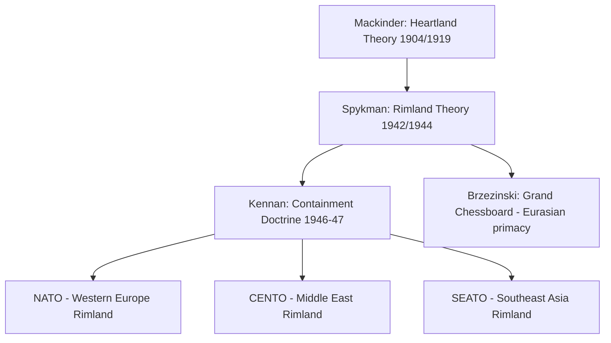

## Spykman's Rimland Theory

### Overview

Nicholas Spykman's Rimland Theory holds that the coastal periphery of Eurasia — the "Rimland" — rather than the continental interior "Heartland" identified by Halford Mackinder, is the true key to global power. Spykman argued that the Rimland's combination of population density, industrial capacity, resource access, and dual accessibility by both land and sea make it strategically decisive, and that no single power should be permitted to dominate it. The theory became a central intellectual foundation for U.S. Cold War containment strategy.

### Historical Origin and Context

Spykman, a Dutch-American professor of international relations at Yale University, developed the theory in two works: *America's Strategy in World Politics* (1942) and, posthumously, *The Geography of the Peace* (1944).

**Key Points**

- Spykman wrote during World War II, directly engaging with the strategic challenge posed by Axis expansion across the Eurasian periphery (Nazi Germany in Europe, Imperial Japan in East Asia).
- His work was explicitly framed as a corrective and extension of Mackinder's Heartland Theory, retaining Mackinder's premise that geography structures the possibilities of state power while relocating the pivotal zone from the interior to the coastal margins.
- Spykman's ideas gained significant influence in shaping post-war U.S. foreign policy, particularly through their affinity with the containment doctrine articulated by George Kennan in 1946–47.

### Core Geographic Concept: The Rimland

The Rimland refers to the coastal and peninsular zone of Eurasia lying between the Heartland and the surrounding oceans — corresponding roughly to Mackinder's "Inner or Marginal Crescent," but elevated by Spykman to primary strategic significance rather than treated as a mere buffer zone.

**Key Points**

- Geographically encompasses Western Europe, the Middle East, the Indian subcontinent, Southeast Asia, and East Asia (including China, Korea, and the Russian Far East coastal zone).
- Functions as an amphibious zone: accessible both by land power emanating from the Heartland and by sea power projected from the surrounding oceans, making it the primary contact zone between the two forms of power.
- Possesses, in Spykman's assessment, greater population, agricultural capacity, and industrial potential than the Heartland itself, which he argued made it the more consequential prize in any struggle for world power.

### Spykman's Critique and Inversion of Mackinder

Spykman directly challenged Mackinder's core claim, arguing that Mackinder overstated the Heartland's inherent strategic value and understated the significance of the surrounding coastal zone.

**Key Points**

- Where Mackinder argued "who rules the Heartland commands the World-Island," Spykman's frequently cited counter-formulation holds that whoever controls the Rimland holds the fate of the world in their hands. [Unverified: exact wording varies across secondary summaries; the phrasing should be checked against the original 1944 text for precise citation.]
- Spykman argued the Heartland's resource and population potential was, in practice, less developed and less immediately convertible into usable power than the industrial and demographic assets already concentrated in the Rimland states.
- He treated the Rimland not as a passive buffer between Heartland and Outer Crescent (as Mackinder implied) but as an independent power base capable of balancing against a Heartland-based land power.

### Strategic Policy Implications: Balance of Power and Containment

Spykman's central policy prescription was that no single power — whether a Heartland-based land power or an outside sea power — should be allowed to gain exclusive control over the Rimland, since such control would grant access to the bulk of Eurasia's population and industrial capacity.

**Key Points**

- Spykman advocated an active U.S. balance-of-power role, rejecting isolationism and arguing the United States had a direct strategic interest in preventing Rimland domination by any hostile power.
- His framework closely anticipated the logic of "containment": limiting the expansion of a potentially hegemonic land power (the Soviet Union, occupying much of the historical Heartland) by securing the Rimland states against absorption or coercion.
- This logic underpinned the U.S. network of Cold War alliances — NATO in Western Europe, CENTO in the Middle East, and SEATO in Southeast Asia — each corresponding to a segment of the Rimland arc.

### Diagram: Rimland Position Relative to Heartland (svg_diagram)

<svg xmlns="http://www.w3.org/2000/svg" viewBox="0 0 600 500">
<title>Spykman's Rimland Relative to Mackinder's Heartland (svg_diagram)</title>
<ellipse cx="300" cy="260" rx="270" ry="200" fill="#dbe9f4" stroke="#2b4a6f" stroke-width="2" />
<ellipse cx="300" cy="260" rx="150" ry="110" fill="#5c8db8" stroke="#0a1f33" stroke-width="2" />
<text x="300" y="255" text-anchor="middle" font-size="15" fill="#ffffff" font-weight="bold">HEARTLAND</text>
<text x="300" y="273" text-anchor="middle" font-size="10" fill="#ffffff">(interior Eurasia)</text>
<text x="300" y="110" text-anchor="middle" font-size="16" fill="#0a1f33" font-weight="bold">RIMLAND</text>
<text x="300" y="128" text-anchor="middle" font-size="11" fill="#0a1f33">(W. Europe – Middle East – S/SE Asia – E. Asia)</text>
<text x="300" y="30" text-anchor="middle" font-size="12" fill="#0a1f33" font-style="italic">Outer oceans / sea power</text>
<line x1="150" y1="150" x2="80" y2="90" stroke="#0a1f33" stroke-width="1.5" marker-end="url(#arrow2)" />
<line x1="450" y1="150" x2="520" y2="90" stroke="#0a1f33" stroke-width="1.5" marker-end="url(#arrow2)" />
</svg>

### Comparative Framework: Mackinder vs. Spykman

| Dimension | Mackinder (Heartland) | Spykman (Rimland) |
| --- | --- | --- |
| Pivotal zone | Interior Eurasia (Pivot Area/Heartland) | Coastal/peninsular Eurasia (Rimland) |
| Source of power | Land mobility (railways), resource base, inaccessibility to sea power | Population density, industrial capacity, dual land-sea accessibility |
| Strategic character | Insulated, defensible, self-sufficient | Amphibious, contested, the primary zone of great-power friction |
| Policy implication | Prevent land power from consolidating the Heartland | Prevent any single power (land or sea based) from dominating the Rimland |
| Cold War application | Used to characterize the USSR's continental position | Used to justify containment along the Eurasian periphery |

### Mermaid Diagram: Theoretical Lineage and Policy Application

### Strategic Applications During the Cold War

**Example**

The Korean War (1950–1953) can be read through a Rimland lens: the Korean Peninsula sits within the East Asian segment of the Rimland, and U.S. intervention aimed to prevent a Heartland-adjacent power (backed by the Soviet Union and China) from absorbing a Rimland state, consistent with Spykman's prescription against allowing Rimland domination by a single continental power.

**Key Points**

- The Vietnam War is likewise frequently analyzed as an application (and, in retrospect, a costly overextension) of Rimland-containment logic in Southeast Asia.
- The Marshall Plan and NATO's formation reflected an economic and military strategy to secure the Western European Rimland against Soviet influence, directly consistent with Spykman's balance-of-power prescription.
- [Inference] Some historians argue containment strategy as actually practiced was as much a product of Kennan's own analysis and the "Long Telegram" as of Spykman's academic framework, with the two lines of thought converging rather than one directly causing the other.

### Criticisms and Limitations

**Key Points**

- **Overextension risk**: Applying Rimland-containment logic globally (as in Vietnam) demonstrated that treating every Rimland segment as strategically vital could lead to costly, poorly calibrated commitments disconnected from core national interests.
- **Technological change**: As with Mackinder's theory, the rise of air power, nuclear deterrence, and later cyber and space capabilities has reduced the exclusivity of Spykman's land-sea accessibility framing as the decisive strategic variable.
- **Static geographic framing**: Critics note that both Rimland and Heartland theories treat geography as a relatively fixed determinant, underweighting the role of economic systems, governance quality, and technological innovation in producing state power.
- **Ambiguous boundaries**: The precise boundary between "Rimland" and "Heartland" is not always geographically crisp (e.g., Central Asia, parts of the Russian Far East), leading to some definitional inconsistency in applying the framework to specific regions. [Unverified: the degree of ambiguity is treated variably across secondary sources; Spykman's own maps offer more precision than some paraphrased summaries suggest.]

### Application to Contemporary Geopolitical Risk Analysis

**Key Points**

- Rimland logic remains embedded in analysis of contemporary flashpoints — the Taiwan Strait, the Korean Peninsula, the Baltic states, and the Persian Gulf — each treated as a contested segment of the Eurasian periphery where land-based and maritime powers compete for influence.
- China's Belt and Road Initiative and naval modernization are frequently interpreted as an attempt to extend influence across Rimland states from a partially Heartland-adjacent position, echoing the amphibious contest Spykman described.
- U.S. alliance structures in the Indo-Pacific (AUKUS, the Quad, bilateral treaties with Japan, South Korea, and the Philippines) continue to reflect a Rimland-containment logic aimed at preventing Chinese dominance over the East and Southeast Asian coastal periphery.
- Russia's actions in Ukraine and the Baltic region are commonly analyzed through a Rimland-contest framework, treating Eastern Europe as a critical Rimland segment whose alignment shapes the broader Heartland-Rimland balance. [Inference] This is an analytical framing used by strategists and commentators rather than a claim about the stated motivations of any specific government.

### Conclusion

Spykman's Rimland Theory reoriented classical geopolitical thought away from Mackinder's continental interior and toward the populous, industrially significant coastal periphery of Eurasia, providing much of the intellectual scaffolding for U.S. Cold War containment strategy. While its land-sea determinism has been complicated by subsequent military and technological change, the Rimland framework continues to inform contemporary analysis of contested zones along the Eurasian periphery, from Eastern Europe to the Taiwan Strait.

**Related Topics**

- Mackinder's Heartland Theory
- Mahan's Sea Power and Maritime Strategy
- George Kennan's Containment Doctrine and the Long Telegram
- Cold War Alliance Systems (NATO, CENTO, SEATO)
- Brzezinski's Grand Chessboard
- Taiwan Strait and East Asian Rimland Risk Analysis
- Belt and Road Initiative as Heartland-Rimland Integration
- Baltic States and Eastern European Buffer Zone Analysis