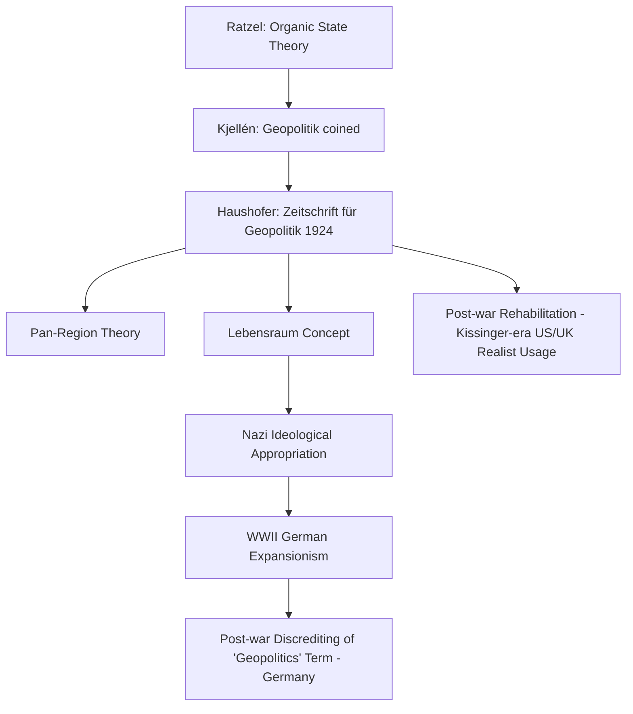

## German Geopolitik and Its Historical Legacy

### Overview

German Geopolitik was a school of geopolitical thought that emerged in early 20th-century Germany, most closely associated with Karl Haushofer, which adapted classical geopolitical concepts — particularly Friedrich Ratzel's organic state theory and elements of Mackinder's Heartland Theory — into a doctrine emphasizing territorial expansion, spatial self-sufficiency, and the state as a living organism requiring "living space" (*Lebensraum*). The school became politically entangled with Nazi ideology in the 1930s and 1940s, and its historical legacy is defined largely by this association, which discredited the term "geopolitics" in mainstream Western academic circles for decades afterward.

### Historical Origin and Intellectual Foundations

German Geopolitik drew on several precursor strands of thought, chiefly the organic state theory of Friedrich Ratzel and the political geography of Rudolf Kjellén (a Swedish political scientist who coined the term "geopolitik" itself).

**Key Points**

- Friedrich Ratzel, a late 19th-century German geographer, proposed that states behave like biological organisms, requiring space (*Raum*) to grow, and that competition for territory was a natural expression of this organic growth — a framework later termed "organic state theory."
- Rudolf Kjellén coined the term "geopolitik" around 1899, building on Ratzel's ideas to describe the state as a geographically and biologically determined organism whose survival depends on territorial expansion or contraction.
- Karl Haushofer, a retired German general and later professor at the University of Munich, founded the *Zeitschrift für Geopolitik* (Journal of Geopolitics) in 1924 and became the central systematizer of German Geopolitik as an academic and quasi-political discipline.

### Core Concepts

#### Lebensraum ("Living Space")

*Lebensraum* is the concept that a state — treated as a biological organism — requires sufficient territory to sustain its population, resources, and continued growth, and that a state's health depends on its ability to acquire such space, by expansion if necessary.

**Key Points**

- The concept originated with Ratzel but was substantially expanded and politicized by Haushofer and, subsequently, by Nazi ideologues, who applied it specifically to justify German territorial expansion into Eastern Europe.
- Under Nazi appropriation, *Lebensraum* became explicitly tied to racial ideology, framing Slavic populations in Eastern Europe as inferior peoples to be displaced, subjugated, or exterminated to make room for German settlement — a use that departed from and radicalized Ratzel's original, less explicitly racialized biological framing. [Unverified: the precise degree of continuity versus radical departure between Ratzel's original concept and later Nazi usage is a subject of ongoing historical debate.]
- The concept functioned as a pseudo-scientific justification for expansionist policy, presenting territorial conquest as a natural biological necessity rather than a political choice.

#### Pan-Regions (Panideen)

Haushofer proposed the concept of "Pan-Regions": large, self-sufficient economic and political blocs organized around a dominant power, each spanning a north-south axis to combine complementary climatic zones and resources.

**Key Points**

- The Pan-Region model envisioned the world divided into a small number of continental-scale blocs, each dominated by a major power (e.g., a German-dominated Pan-Europe/Pan-Africa, a Japanese-dominated Pan-Asia, and a U.S.-dominated Pan-America).
- This concept was partly derived from Mackinder's emphasis on continental-scale strategic units but reoriented toward autarky (self-sufficiency) rather than command of a single pivotal landmass.
- The Pan-Region framework provided intellectual justification for German-Japanese strategic cooperation in the lead-up to World War II, as each power was assigned a notional sphere of continental dominance.

#### Autarky and Grenzen (Borders as Living Membranes)

German Geopolitik emphasized autarky — national self-sufficiency in resources and production — as a strategic necessity, and treated political borders not as fixed lines but as dynamic, semi-permeable "membranes" that expand or contract with the vitality of the state, analogous to a living organism's skin.

**Key Points**

- This organic conception of borders provided a theoretical basis for viewing border revision and territorial expansion as a normal, even inevitable, function of a "healthy" state's growth, rather than as a violation of fixed international boundaries.
- Autarky concerns were tied to Germany's experience of naval blockade during World War I, which had produced severe resource and food shortages — reinforcing the strategic emphasis on securing self-sufficient territorial blocs immune to maritime interdiction.

### Diagram: Conceptual Lineage of German Geopolitik (svg_diagram)

<svg xmlns="http://www.w3.org/2000/svg" viewBox="0 0 600 420">
<title>Conceptual Lineage of German Geopolitik (svg_diagram)</title>
<rect x="20" y="20" width="200" height="70" rx="8" fill="#a9cce3" stroke="#0a1f33" stroke-width="2" />
<text x="120" y="50" text-anchor="middle" font-size="13" fill="#0a1f33" font-weight="bold">Ratzel</text>
<text x="120" y="68" text-anchor="middle" font-size="10" fill="#0a1f33">Organic State Theory</text>
<rect x="220" y="20" width="200" height="70" rx="8" fill="#a9cce3" stroke="#0a1f33" stroke-width="2" />
<text x="320" y="50" text-anchor="middle" font-size="13" fill="#0a1f33" font-weight="bold">Kjellén</text>
<text x="320" y="68" text-anchor="middle" font-size="10" fill="#0a1f33">Coined "Geopolitik"</text>
<rect x="420" y="20" width="160" height="70" rx="8" fill="#a9cce3" stroke="#0a1f33" stroke-width="2" />
<text x="500" y="50" text-anchor="middle" font-size="13" fill="#0a1f33" font-weight="bold">Mackinder</text>
<text x="500" y="68" text-anchor="middle" font-size="10" fill="#0a1f33">Heartland Theory</text>
<line x1="120" y1="90" x2="290" y2="160" stroke="#0a1f33" stroke-width="2" />
<line x1="320" y1="90" x2="300" y2="160" stroke="#0a1f33" stroke-width="2" />
<line x1="500" y1="90" x2="320" y2="160" stroke="#0a1f33" stroke-width="2" />
<rect x="180" y="160" width="240" height="70" rx="8" fill="#5c8db8" stroke="#0a1f33" stroke-width="2" />
<text x="300" y="190" text-anchor="middle" font-size="14" fill="#ffffff" font-weight="bold">Haushofer</text>
<text x="300" y="210" text-anchor="middle" font-size="10" fill="#ffffff">German Geopolitik / Pan-Regions</text>
<line x1="300" y1="230" x2="300" y2="290" stroke="#0a1f33" stroke-width="2" marker-end="url(#arrow3)" />
<rect x="180" y="290" width="240" height="70" rx="8" fill="#c0392b" stroke="#0a1f33" stroke-width="2" />
<text x="300" y="320" text-anchor="middle" font-size="13" fill="#ffffff" font-weight="bold">Nazi Ideology</text>
<text x="300" y="340" text-anchor="middle" font-size="10" fill="#ffffff">Lebensraum / Expansionism</text>
</svg>

### Relationship to Nazi Ideology

The relationship between Haushofer's academic Geopolitik and official Nazi ideology is historically complex and has been the subject of extensive scholarly debate.

**Key Points**

- Haushofer maintained a personal relationship with Rudolf Hess, a senior Nazi official, and this connection is often cited as the primary channel through which Geopolitik concepts (particularly *Lebensraum*) reached Nazi leadership, including Hitler.
- Nazi propaganda and policy selectively appropriated *Lebensraum* and organic-state concepts to provide a pseudo-scientific veneer for policies whose actual driving force was Nazi racial ideology, rather than a rigorous application of Haushofer's academic framework.
- [Inference] Many historians distinguish between Haushofer's Geopolitik as an academic (if flawed and expansionism-friendly) discipline and its instrumentalized, radicalized use by the Nazi regime, cautioning against treating Geopolitik and Nazi ideology as simply identical, even though the two were closely intertwined in practice.
- Haushofer's own relationship with the Nazi regime was ambivalent and ultimately tragic: his son Albrecht Haushofer was executed in 1945 for connections to the anti-Hitler resistance, and Karl Haushofer himself was investigated (though not prosecuted) after the war before dying by suicide in 1946. [Unverified: some biographical details of Haushofer's final years and the precise circumstances of his death are described with varying levels of detail across secondary sources.]

### Historical Legacy and Post-War Discrediting

**Key Points**

- Following World War II, the term "geopolitics" became heavily stigmatized in Western (especially German) academic and public discourse due to its association with Nazi expansionism, and the discipline of political geography in Germany distanced itself from the term for decades.
- In the United States and Britain, the term "geopolitics" was gradually rehabilitated in the postwar period, notably through its adoption (in a de-ideologized sense) by policymakers and scholars such as Henry Kissinger, who used it to describe realist, interest-based analysis of great-power competition rather than organic-state or racial theory.
- The German Geopolitik school's collapse illustrates a recurring critique of environmental/geographic determinism: when geographic theory is fused with political ideology and used to legitimize conquest, it can produce dangerous policy outcomes decoupled from empirical rigor. [Inference] This is treated by many contemporary geopolitical scholars as a cautionary case study in the risks of pairing deterministic theoretical frameworks with political power.

### Comparative Table: Ratzel, Kjellén, Haushofer, and Nazi Appropriation

| Thinker/Actor | Core Contribution | Character of Contribution |
| --- | --- | --- |
| Friedrich Ratzel | Organic state theory, spatial growth as biological necessity | Academic geographic theory |
| Rudolf Kjellén | Coined "geopolitik"; extended organic-state framing | Academic political science |
| Karl Haushofer | Systematized German Geopolitik; Pan-Regions; popularized *Lebensraum* | Academic/quasi-political discipline, politically adjacent |
| Nazi Regime | Weaponized *Lebensraum* with racial ideology to justify expansion and genocide | Political-ideological instrumentalization |

### Mermaid Diagram: Historical Trajectory and Post-War Reception

### Criticisms and Limitations

**Key Points**

- **Pseudo-scientific determinism**: The organic-state analogy at the core of German Geopolitik treats complex political phenomena as biological necessities, a framing widely rejected by contemporary social science as reductive and empirically unfounded.
- **Ideological instrumentalization**: The school's entanglement with Nazi expansionism and genocide represents one of the most severe historical examples of a geographic theory being weaponized to legitimize atrocity, a legacy that continues to shape ethical caution around deterministic geopolitical frameworks.
- **Loss of analytical rigor**: Critics argue that as Geopolitik became politically useful to the Nazi regime, its scholarly rigor eroded in favor of propagandistic utility, undermining any claim to being a neutral academic discipline.
- **Contested scholarly legacy**: Even sympathetic reassessments of Haushofer's academic work must contend with the reality that his framework provided vocabulary and conceptual cover for policies of conquest and genocide, complicating any purely academic rehabilitation of his ideas.

### Application to Contemporary Geopolitical Risk Analysis

**Key Points**

- German Geopolitik's history serves as a foundational cautionary reference point in contemporary geopolitical risk analysis, illustrating the danger of conflating geographic/resource analysis with deterministic or racialized political ideology.
- Contemporary discussions of "resource security" and "strategic autarky" (e.g., in debates over rare-earth mineral supply chains, energy independence, or semiconductor self-sufficiency) sometimes invoke autarky concerns analogous to those in Geopolitik, though modern framings typically avoid the organic-state and racial elements of the original theory.
- Analysts drawing on any autarky- or Lebensraum-adjacent framing today generally take care to explicitly distinguish resource-security analysis from the ideological legacy of German Geopolitik, given the term's strong historical association with Nazi expansionism. [Inference] This distinction is a deliberate methodological caution common in academic and policy literature, rather than a claim that all self-sufficiency analysis inherently carries this legacy.
- The term "geopolitics" itself, following its post-war rehabilitation via realist scholarship, is now used broadly in risk analysis largely stripped of its Geopolitik-specific ideological content, though awareness of this history remains relevant to understanding the discipline's contested origins.

### Conclusion

German Geopolitik represents a critical historical case study in classical geopolitical theory: an academic school that fused organic-state biology, continental Pan-Region strategy, and the concept of Lebensraum, only to be substantially appropriated and radicalized by Nazi ideology to justify territorial conquest and genocide. Its legacy is a persistent cautionary reference in geopolitical analysis, illustrating both the analytical appeal and the profound ethical risks of deterministic, organism-based theories of the state when fused with political power.

**Related Topics**

- Friedrich Ratzel's Organic State Theory
- Mackinder's Heartland Theory
- Rudolf Kjellén and the Origins of the Term "Geopolitik"
- Post-War Rehabilitation of Geopolitics (Kissinger-era Realism)
- Environmental/Geographic Determinism: Critiques and Limitations
- Nazi Expansionism and Eastern European Occupation Policy
- Resource Autarky and Contemporary Strategic Self-Sufficiency Debates
- Critical Geopolitics as an Academic Response to Determinist Frameworks