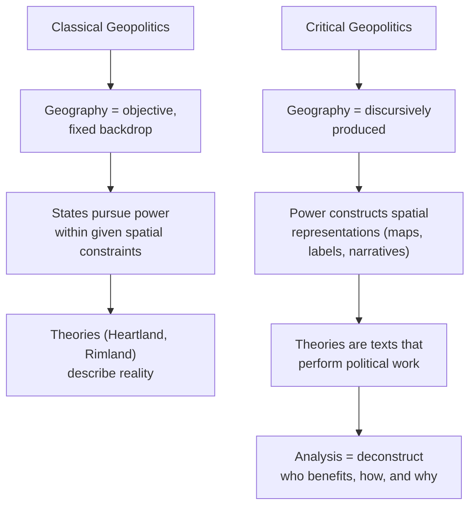

## Critical Geopolitics and Post-Structuralist Critiques

### Overview

Critical geopolitics is a subfield of political geography and international relations that emerged in the late 1980s and early 1990s, applying post-structuralist and critical social theory to the study of geopolitical knowledge and practice. Rather than treating geography as a neutral, fixed backdrop against which states pursue power (the assumption underlying classical geopolitics), critical geopolitics investigates how geographical claims and representations are themselves products of power, discourse, and identity construction. Its central move is to denaturalize space: borders, regions, "heartlands," "arcs of instability," and civilizational blocs are not objective features of the earth waiting to be discovered but are actively written into being through texts, maps, speeches, and institutional practices.

### Intellectual Origins

**Foundational influences**

- **Post-structuralism**: Drawing heavily on Michel Foucault (power/knowledge, discourse, governmentality), Jacques Derrida (deconstruction, the instability of binary oppositions), and Roland Barthes (semiotics, myth-making), critical geopolitics treats geopolitical claims as texts to be read critically rather than facts to be verified.
- **Critical theory**: The Frankfurt School's emphasis on ideology critique and the notion that knowledge is never disinterested but always tied to social and political projects.
- **Postcolonial theory**: Edward Said's *Orientalism* (1978) is frequently cited as a direct precursor, showing how Western geographical imagination constructed "the Orient" as a discursive object to be governed.
- **Feminist geography**: Contributions from scholars such as Joanne Sharp and Jennifer Hyndman highlighting how geopolitical discourse is gendered, privileging masculinist framings of strength, penetration, and containment.

**Key founding texts and figures**

- **Gearóid Ó Tuathail (Gerard Toal)**: *Critical Geopolitics* (1996) is the field's foundational monograph, arguing that geopolitics is a "discourse of statecraft" produced by intellectuals of statecraft rather than a description of geographic reality.
- **John Agnew**: Introduced the concept of the "territorial trap" — the assumption that states are fixed, bounded, and internally homogeneous containers of society, which critical geopolitics seeks to unsettle.
- **Simon Dalby**: Applied critical geopolitics to Cold War discourse and later to environmental security and climate geopolitics.
- **Klaus Dodds**: Extended critical geopolitics into popular culture, film, and everyday life.

### Core Theoretical Claims

**Geopolitics as discourse, not description**

Critical geopolitics argues that classical geopolitical concepts (heartland, rimland, domino theory, clash of civilizations) function less as objective analyses and more as discursive tools that make certain policies appear natural, necessary, or inevitable. Describing a region as a "power vacuum" or a state as a "rogue state" is not a neutral act of labeling — it performs work, legitimizing particular forms of intervention while foreclosing others.

**Deconstructing the state-as-container**

A central target of critique is what Agnew termed the territorial trap: the tendency in mainstream IR and geopolitics to treat states as (1) fixed units of sovereign space, (2) with a clear domestic/international divide, and (3) as containers of society. Critical geopolitics insists these are historically contingent constructions, not natural facts, and that globalization, transnational networks, and diaspora complicate any simple mapping of politics onto bounded territory.

**The subject positions of geopolitical knowledge production**

Ó Tuathail distinguishes three overlapping registers in which geopolitical discourse operates:

- **Formal geopolitics**: The work of academic strategists and think-tank intellectuals producing systematic theories (e.g., Mackinder, Spykman, Huntington).
- **Practical geopolitics**: The everyday reasoning of politicians, diplomats, and military planners as expressed in speeches, briefings, and policy documents.
- **Popular geopolitics**: Representations in film, news media, cartoons, and popular fiction that circulate geopolitical common sense among mass publics.

This tripartite scheme allows critical geopolitics to trace how elite theorizing, statecraft rhetoric, and popular culture reinforce one another in constructing a shared geopolitical imagination.

**Geo-graphing and the power of mapping**

The term "geo-graphing" (writing the earth) captures the idea that maps and geopolitical texts do not represent a pre-existing world so much as inscribe one. Map projections, the choice of what to center or marginalize, the use of color and labeling (e.g., shading a state red as "communist" or "hostile") are treated as rhetorical and political acts embedded in relations of power.

### Methodological Approach

**Discourse analysis**

The primary method is close textual reading of speeches, policy documents, maps, and media, attending to metaphor, binary oppositions (self/other, civilized/barbaric, order/chaos, inside/outside), and narrative structure. Analysts ask not "is this claim true?" but "what work does this claim do, for whom, and with what effects?"

**Deconstruction of binaries**

Following Derrida, critical geopolitics interrogates the hierarchical binaries that structure geopolitical reasoning — West/East, developed/developing, civilized/rogue — showing that the privileged term depends on and is defined against the subordinated term, and that the boundary between them is unstable and contestable.

**Genealogy**

Borrowing from Foucault, some critical geopolitics scholarship traces the historical emergence of concepts (e.g., "the Balkans," "the Middle East," "Eurasia") to show how what appears as a stable geographic category was assembled at a specific historical juncture for specific political purposes.

### Illustrative Example: The "Heartland" Reread

Classical geopolitics (Halford Mackinder, 1904) posited the Eurasian "Heartland" as the geographic pivot of world history, such that whoever controlled it could command the "World-Island" and ultimately the world.

A critical geopolitics reading does not ask whether Mackinder's thesis is geographically correct. Instead, it asks:

- What imperial anxieties (British relative decline, the closing of the frontier, fear of Russian and German expansion) produced the felt need for such a totalizing spatial theory at that moment?
- How did the visual rhetoric of Mackinder's maps (concentric zones, a bounded pivot area) naturalize a particular strategic argument?
- How was this "scientific" geographical claim mobilized in subsequent statecraft (e.g., its afterlife in Cold War containment thinking and in some contemporary Eurasianist discourse) regardless of its empirical validity?

This example demonstrates the field's central analytical shift: from asking "what is the geography of power?" to asking "how is geography made to appear as power's natural terrain?"

### Diagram: Classical vs. Critical Geopolitics Epistemology

### Post-Structuralist Critiques of Mainstream IR and Geopolitics

**Critique of state-centrism**

Post-structuralist geopolitics challenges realist and neorealist IR's assumption of the state as a unitary, rational, pre-given actor. Instead, the state itself is understood as an effect of ongoing discursive and performative practices (border controls, passports, national narratives, security discourse) that continually reproduce its boundaries and identity — a position closely associated with R.B.J. Walker's work on sovereignty and the inside/outside distinction.

**Critique of security discourse (securitization)**

Related work, particularly the Copenhagen School (Barry Buzan, Ole Wæver) though not always labeled "critical geopolitics" per se, shows how declaring an issue a "security threat" is itself a political speech act that justifies extraordinary measures. Critical geopolitics scholars use similar tools to show how threats are geographically coded (e.g., mapping "arcs of instability" or "axis" formations).

**Critique of geopolitical determinism**

Post-structuralist critique rejects the environmental and geographic determinism embedded in classical theory (the idea that physical geography straightforwardly dictates political destiny), arguing this naturalizes contingent political choices as inevitable outcomes of terrain, resources, or location.

**Critique of the "God's-eye view"**

Following feminist and postcolonial epistemology, critical geopolitics challenges the assumed neutral, aerial, cartographic vantage point of classical geopolitical writing (what Donna Haraway called the "god trick" of seeing everything from nowhere), arguing all geopolitical vision is situated, partial, and embodied.

### Key Debates and Internal Tensions

- **Relativism concern**: Critics (including some sympathetic to the project) worry that treating all geopolitical claims as discourse risks a corrosive relativism that makes it difficult to evaluate competing claims about real-world stakes such as war, displacement, or resource conflict.
- **Structure vs. agency**: Tension exists between emphasizing discourse's constitutive power and retaining space for material constraints (physical geography, economic structures, military capability) that are not purely discursive.
- **Policy relevance**: Because critical geopolitics is oriented toward critique rather than prescription, it has been characterized by some IR scholars as less directly useful to policymakers than classical or neoclassical geopolitics, though proponents argue that destabilizing taken-for-granted assumptions is itself a policy-relevant contribution.
- **Feminist and postcolonial geopolitics as offshoots**: By the 2000s, feminist geopolitics (embodiment, everyday life, care) and postcolonial geopolitics (subaltern voices, decolonial critique) developed partly in dialogue with and partly in tension with the original Ó Tuathail/Agnew/Dalby formulation, pushing critical geopolitics toward more grounded, ethnographic methods rather than solely elite discourse analysis. [Inference: the degree of divergence versus continuity between these strands is debated within the field itself and not a settled classification.]

### Applications in Contemporary Analysis

- **Media and popular culture analysis**: Examining how Hollywood films, video games, and news coverage encode geopolitical common sense (e.g., representations of terrorism, migration, or "failed states").
- **Border and migration studies**: Analyzing how borders are discursively and materially produced as sites of exception and control rather than simply as lines on a map.
- **Climate and environmental geopolitics**: Simon Dalby's later work applies critical geopolitics to the securitization of climate change, questioning how "climate security" discourse allocates responsibility and justifies intervention.
- **Deconstructing "civilizational" frameworks**: Applying discourse analysis to critique Samuel Huntington's "Clash of Civilizations" thesis as a totalizing narrative that essentializes cultural blocs.

### Distinguishing Related Terms

| Term | Focus | Relation to Critical Geopolitics |
| --- | --- | --- |
| Classical geopolitics | Physical geography as determinant of state power | Primary object of critique |
| Critical geopolitics | Discursive construction of geographic/geopolitical knowledge | The field itself |
| Feminist geopolitics | Gendered bodies, everyday life, embodiment | Overlapping offshoot, adds embodied/scalar focus |
| Postcolonial geopolitics | Colonial legacies, subaltern agency, Eurocentrism | Overlapping offshoot, adds decolonial focus |
| Geopolitik (early 20th c. German) | State organicism, Lebensraum | Historical object of critique, not a precursor |

**Related Topics**

- Foucauldian discourse analysis and governmentality in IR
- Edward Said's *Orientalism* and its influence on geopolitical theory
- The "territorial trap" (John Agnew) in detail
- Copenhagen School securitization theory
- Feminist geopolitics and embodiment (Joanne Sharp, Jennifer Hyndman)
- Postcolonial and decolonial approaches to geopolitics
- Popular geopolitics: film, media, and everyday geopolitical reasoning
- Mackinder's Heartland Theory (classical geopolitics baseline)
- Huntington's Clash of Civilizations (as object of critical geopolitics critique)
- Geopolitics of climate change and environmental security (Simon Dalby)