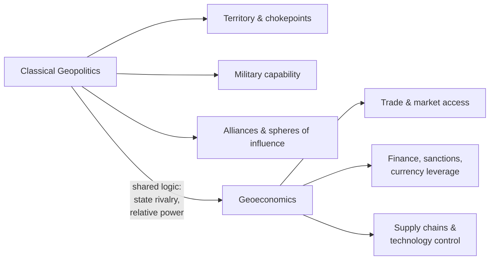

## Geoeconomics as an Evolution of Geopolitical Thought

### Overview

Geoeconomics refers to the use of economic instruments — trade, investment, finance, sanctions, technology controls, currency policy — to achieve geopolitical objectives, and conversely, to the analysis of how economic power and geographic/strategic considerations interact in an era where military force is often constrained, costly, or politically undesirable. The term captures a shift in the study and practice of statecraft: from a primary emphasis on territorial control and military capability (classical geopolitics) toward the deployment of economic leverage — market access, supply chains, capital flows, standards-setting — as the principal arena of great-power competition.

### Conceptual Origins

**Coining and early formulation**

- **Edward Luttwak** is widely credited with introducing the term "geo-economics" in his 1990 essay "From Geopolitics to Geo-Economics: Logic of Conflict, Grammar of Commerce," arguing that with the end of the Cold War, the "methods of commerce" were displacing the "methods of warfare" as the primary means by which states pursued relative advantage, even as the underlying logic of rivalry between states persisted unchanged.
- Luttwak's core claim was not that conflict between states was disappearing, but that its *grammar* was changing: states would increasingly wage what amounts to strategic competition through subsidies, market protection, industrial policy, and technology competition rather than through armed force.

**Relationship to classical geopolitics**

Where classical geopolitics (Mackinder, Mahan, Spykman) centered on control of territory, chokepoints, and physical resources as the basis of state power, geoeconomics retains the realist assumption that states are the primary actors locked in competition for relative power, but relocates the terrain of that competition from land and sea to markets, supply chains, and financial systems. In this sense, geoeconomics is frequently characterized as an *evolution* rather than a rejection of geopolitical thought: it preserves the zero-sum, state-centric logic of classical geopolitics while updating the instruments through which that logic is enacted.

**Scholarly consolidation**

- **Robert Blackwill and Jennifer Harris**, *War by Other Means: Geoeconomics and Statecraft* (2016), provided the most influential contemporary systematization, defining geoeconomics as the use of economic instruments to produce beneficial geopolitical results, and the effects of other nations' economic actions on a country's geopolitical goals.
- Their work argued the United States had historically underutilized geoeconomic tools relative to China and Russia, sparking substantial policy debate in Washington think tanks and government.

### Core Instruments of Geoeconomic Statecraft

**Trade policy**

Tariffs, preferential trade agreements, export controls, and market access restrictions used not purely for economic efficiency but to reward allies, punish rivals, or build strategic dependencies.

**Investment and finance**

- Sovereign wealth funds and state-directed investment used to acquire strategic assets (ports, telecommunications infrastructure, critical minerals).
- Development finance and infrastructure lending (e.g., China's Belt and Road Initiative) used to build political influence and create dependent relationships.
- Currency policy and the strategic use of reserve currency status.

**Sanctions and financial exclusion**

- Targeted sanctions, asset freezes, and exclusion from payment systems (e.g., SWIFT) as coercive tools short of military conflict.
- Extraterritorial application of sanctions regimes (e.g., U.S. secondary sanctions) leveraging dominance of the dollar-based financial system.

**Export controls and technology denial**

- Restriction of access to critical technologies (semiconductors, advanced computing, dual-use goods) to slow a rival's technological and military development — exemplified by expanding U.S. export control regimes targeting China's semiconductor sector.

**Supply chain and industrial policy**

- Reshoring, "friend-shoring," and strategic stockpiling of critical inputs (rare earths, semiconductors, pharmaceuticals) to reduce vulnerability to coercion.
- State subsidies and industrial policy (e.g., the U.S. CHIPS and Science Act, EU industrial strategy) framed explicitly in national-security as well as economic terms.

**Standards and institutional leverage**

- Competition to set technical standards (5G, AI governance frameworks) and to shape the rules of international economic institutions (WTO, IMF, regional trade architecture) in ways that favor a state's strategic position.

### Diagram: From Geopolitics to Geoeconomics

### Illustrative Example: Semiconductor Export Controls

The evolving U.S. export control regime on advanced semiconductors and semiconductor manufacturing equipment directed at China provides a canonical contemporary geoeconomic case:

1. **Objective**: Slow a strategic competitor's progress in AI and advanced computing without direct military confrontation.
2. **Instrument**: Restriction of exports of advanced lithography equipment, high-end chips, and related know-how, leveraging U.S. dominance (and that of allied firms) in specific segments of the semiconductor supply chain.
3. **Multilateral coordination**: Extending controls through allied producers (e.g., coordination with the Netherlands and Japan regarding lithography equipment) to close substitution routes.
4. **Response dynamics**: The targeted state responds with its own geoeconomic countermeasures — export restrictions on critical minerals (e.g., gallium, germanium), accelerated domestic investment in indigenous semiconductor capacity, and diversification of supply relationships.

This example illustrates the geoeconomic logic identified by Luttwak, Blackwill, and Harris: commercial and technological instruments deployed with explicitly strategic, state-competitive objectives, producing escalatory dynamics structurally similar to classical security dilemmas.

### Key Theoretical Debates

**Continuity vs. discontinuity with classical geopolitics**

- **Continuity view**: Geoeconomics is best understood as classical geopolitical logic (relative gains, state rivalry, spheres of influence) operating through new instruments in a globalized, economically interdependent world — the underlying realist assumptions are unchanged.
- **Discontinuity view**: Some scholars argue geoeconomics represents a genuine structural shift, reflecting the reality that economic interdependence and globalized production networks have made direct territorial conquest largely obsolete as a rational strategy among major powers, forcing a substantively different mode of competition centered on network position and interdependence rather than territorial control (a framing associated with the "weaponized interdependence" literature of Henry Farrell and Abraham Newman).

**Weaponized interdependence**

Farrell and Newman's concept describes how states occupying central "hub" positions in global networks (financial messaging systems, internet infrastructure, technology supply chains) can exploit that structural position to gather intelligence or restrict adversaries' access — a more network-theoretic elaboration of geoeconomic power that extends beyond Luttwak's original trade-and-industrial-policy framing.

**Efficiency vs. security trade-off**

A recurring tension in geoeconomic policy is the cost of "de-risking" or "decoupling" supply chains for security purposes against the economic efficiency losses this entails — critics argue aggressive geoeconomic competition risks fragmenting the global economy into competing blocs (sometimes termed "slowbalization" or a "new Cold War" economic architecture), while proponents argue resilience and strategic autonomy justify the efficiency costs. [Inference: the precise magnitude of these trade-offs is empirically contested and depends heavily on sector- and country-specific assumptions, so this remains an area of active economic research rather than settled fact.]

**Asymmetric vulnerability**

Geoeconomic leverage is a function of asymmetric dependence: a state's coercive power via trade or finance is proportional to how replaceable it is by the target state. This has driven strategic interest in mapping supply chain "chokepoints" (rare earth processing, advanced lithography, energy transit routes) as the geoeconomic analogue to classical geopolitics' physical chokepoints (Strait of Hormuz, Suez Canal, Strait of Malacca).

### Comparison Table: Classical Geopolitics vs. Geoeconomics

| Dimension | Classical Geopolitics | Geoeconomics |
| --- | --- | --- |
| Primary terrain | Physical territory, chokepoints | Markets, finance, supply chains, technology |
| Primary instrument | Military force, alliances | Trade policy, sanctions, investment, export controls |
| Key theorists | Mackinder, Mahan, Spykman | Luttwak, Blackwill & Harris, Farrell & Newman |
| Underlying logic | Relative power via territorial/military control | Relative power via economic/network leverage |
| Escalation risk | Armed conflict | Economic decoupling, retaliatory sanctions, tech bifurcation |
| Chokepoint analogue | Straits, canals, land corridors | Semiconductors, rare earths, payment systems, standards |

### Applications in Contemporary Analysis

- **China–U.S. strategic competition**: Framed extensively through geoeconomic lenses — technology restrictions, tariff regimes, Belt and Road Initiative versus Western infrastructure alternatives (e.g., the EU's Global Gateway, the G7's Partnership for Global Infrastructure and Investment).
- **Russia sanctions regime (post-2022)**: A large-scale test case of coordinated multilateral financial and trade sanctions as a substitute for direct military engagement, including central bank asset freezes and energy market restructuring.
- **Critical minerals competition**: Rare earths, lithium, cobalt, and other inputs central to clean energy and defense technology are increasingly analyzed as 21st-century geoeconomic chokepoints analogous to oil in 20th-century geopolitics.
- **Friend-shoring and bloc formation**: Analysis of how supply chains are being reorganized along geopolitical alignment lines rather than pure cost-efficiency criteria.

**Related Topics**

- Edward Luttwak's original geoeconomics thesis in full
- Blackwill and Harris, *War by Other Means* — detailed instrument typology
- Weaponized interdependence (Farrell & Newman) and network chokepoint theory
- Sanctions regimes as statecraft: design, effectiveness, and evasion
- Critical minerals and rare earth supply chain geopolitics
- Semiconductor supply chain geopolitics and export control architecture
- Belt and Road Initiative as geoeconomic strategy
- De-risking, decoupling, and "slowbalization" debates
- Currency and reserve-status geoeconomics (dollar dominance, de-dollarization)
- Industrial policy as strategic statecraft (CHIPS Act, EU strategic autonomy)