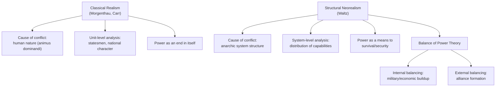

## Realism and Structural Neorealism

### Overview

Realism is the longest-standing and most influential paradigm in international relations theory, holding that international politics is fundamentally a struggle for power among self-interested states operating in an anarchic system with no overarching authority to enforce order. Structural neorealism (also called neorealism or structural realism), developed principally by Kenneth Waltz, reformulated classical realism into a more rigorous, systemic theory by locating the causes of state behavior not in human nature or the character of individual leaders, but in the structure of the international system itself. For a geopolitical risk analyst, realism and neorealism remain the default lens through which state behavior — arms races, alliance formation, balancing, and great-power rivalry — is most commonly interpreted, even by analysts who do not explicitly label themselves realists.

### Classical Realism

**Core premises**

- **Human nature as the root cause of conflict**: Classical realists, most influentially Hans Morgenthau in *Politics Among Nations* (1948), located the drive for power in an innate human lust for domination (*animus dominandi*), which is then expressed at the level of the state.
- **The state as a unitary, rational actor**: States are treated as the primary actors in international politics, pursuing their interests defined in terms of power.
- **Six principles of political realism** (Morgenthau): politics is governed by objective laws rooted in human nature; the concept of interest defined as power is the main signpost of political realism; power and interest are variable across time and context, not fixed; universal moral principles cannot be applied to state action in their abstract form; realism refuses to identify the moral aspirations of a particular nation with universal moral law; and the political sphere is autonomous from other spheres such as law or ethics.
- **Prudence as the supreme political virtue**: Because power is the currency of politics, statesmen must act prudently, weighing consequences rather than adhering rigidly to moral abstractions.

**Predecessors and intellectual lineage**

Classical realism draws on a long tradition often traced back to Thucydides' account of the Peloponnesian War (the "Melian Dialogue" and its dictum that "the strong do what they can and the weak suffer what they must"), Niccolò Machiavelli's emphasis on the ruler's need to master both virtue and necessity, and Thomas Hobbes' state-of-nature theorizing about life without a sovereign authority.

**E.H. Carr's contribution**

E.H. Carr's *The Twenty Years' Crisis* (1939) is frequently cited as an early realist critique of interwar liberal idealism, arguing that the failure of the League of System reflected a naïve faith in international law and morality unsupported by an analysis of underlying power relations.

### Structural Neorealism: Waltz's Reformulation

**The shift to system-level theory**

Kenneth Waltz's *Theory of International Politics* (1979) is the foundational text of neorealism. Waltz argued that classical realism's grounding in human nature was theoretically unsatisfying because it could not explain variation in state behavior across different systemic conditions using a constant (human nature). Instead, Waltz proposed that the *structure* of the international system — not the internal characteristics of states or the psychology of leaders — is the primary determinant of international outcomes.

**Three defining elements of system structure**

Waltz specified that international political structure is defined by three components:

1. **Ordering principle**: The system is anarchic — there is no central authority above sovereign states capable of enforcing rules or providing security, in contrast to the hierarchic ordering principle of domestic politics.
2. **Character of the units**: In an anarchic system, units (states) are functionally similar, all performing the same basic task of ensuring their own survival, even though they differ enormously in capability.
3. **Distribution of capabilities**: Because units are functionally alike, the key variable that changes across systems and over time is how power (military, economic, and other capabilities) is distributed among the units — that is, the system's polarity (unipolar, bipolar, multipolar).

**Anarchy and self-help**

Because there is no supranational authority to guarantee security, states exist in a condition of self-help: each state must ultimately rely on its own capabilities (or alliances) to ensure survival, since no other actor is obligated or reliably able to come to its aid. This generates a persistent security dilemma: measures one state takes to increase its own security (military buildup, alliance formation) are perceived as threatening by other states, prompting reciprocal measures, even when neither side has aggressive intent.

**Balance of power theory**

Neorealism predicts that states will act to prevent any single state from achieving preponderant power, either through:

- **Internal balancing**: Building up one's own military and economic capabilities.
- **External balancing**: Forming alliances with other states against a rising or dominant power.

Waltz argued that balancing behavior is a structurally induced tendency of anarchic systems, not merely a policy choice, and that unbalanced power tends to provoke counterbalancing coalitions over time.

### Diagram: Classical Realism vs. Structural Neorealism

### Offensive vs. Defensive Neorealism

Neorealism itself subsequently split into two major sub-schools over how much power states should rationally seek under anarchy.

**Defensive neorealism**

Associated with Waltz himself and later elaborated by scholars such as Stephen Walt, defensive neorealism argues that the anarchic structure of the system generally incentivizes states to seek an *appropriate* amount of power to maintain security, because excessive power-seeking tends to trigger counterbalancing coalitions that leave the aggressor worse off. Stephen Walt's *balance of threat* theory refines Waltz's balance of power by arguing that states balance against perceived *threat* — a function of aggregate power, geographic proximity, offensive capability, and perceived intentions — rather than against raw power alone.

**Offensive neorealism**

Associated principally with John Mearsheimer, *The Tragedy of Great Power Politics* (2001), offensive neorealism argues that because states can never be certain of others' intentions and cannot fully trust in the reliability of any external guarantor of their security, the rational strategy under anarchy is to maximize relative power whenever the expected benefits outweigh the costs, with the ultimate rational goal being regional hegemony. Mearsheimer's theory predicts persistent great-power competition and is frequently invoked in contemporary analysis of U.S.–China strategic rivalry.

### Comparison Table: Offensive vs. Defensive Neorealism

| Dimension | Defensive Neorealism | Offensive Neorealism |
| --- | --- | --- |
| Key theorist | Waltz, Walt | Mearsheimer |
| Rational state behavior under anarchy | Seek security, an appropriate amount of power | Maximize relative power, seek hegemony |
| Expected systemic outcome | Balance of power tends toward stability | Persistent great-power competition, potential for hegemonic war |
| View of expansion | Often self-defeating (provokes balancing) | Often rational when opportunity costs are favorable |
| Central mechanism | Balance of threat | Security maximization via power maximization |

### Illustrative Example: NATO Expansion Debates

Neorealist frameworks are frequently applied to explain and critique post-Cold War NATO enlargement:

- **Mearsheimer's offensive-realist argument**: NATO expansion eastward toward Russia's borders was predictable to provoke a security response from Russia, since a great power will act to prevent a rival alliance system from encroaching on what it perceives as its sphere of influence, regardless of the West's stated defensive intentions — Mearsheimer has argued the Ukraine crisis is substantially a product of this dynamic. [Inference: this remains one of the most contested applications of neorealist theory in the field, with many IR scholars disputing the explanatory weight Mearsheimer assigns to alliance structure relative to Russian domestic politics and agency, so it should be treated as an illustration of the theory's application rather than an uncontested causal account.]
- **Defensive realist / balance-of-threat counterpoint**: Using Walt's framework, one could argue Russian balancing behavior is better explained by perceived intentions and regime-type signaling rather than by aggregate power or proximity alone, since NATO's defensive character and lack of offensive capability posture would, under a pure balance-of-threat logic, generate a comparatively muted threat response.

This example is commonly used pedagogically because it shows how the same structural theory (neorealism) generates different predictions and interpretations depending on which sub-variant (offensive vs. defensive) and which specific mechanism (power vs. threat) is applied.

### Critiques of Neorealism

- **Parsimony at the cost of explanatory power**: Critics (including liberal institutionalists and constructivists) argue that by reducing explanation to system structure and distribution of capabilities, neorealism struggles to explain variation in state behavior among states facing similar structural conditions, or change over time in state preferences and identity.
- **Neglect of domestic politics**: Neoclassical realism (Gideon Rose, Fareed Zakaria, and others) emerged partly as a corrective, reintroducing unit-level variables (leader perception, state-society relations, domestic institutions) as intervening variables between systemic structural pressures and actual foreign policy outputs, arguing that structure alone underdetermines specific policy choices.
- **Static treatment of anarchy**: Constructivists, notably Alexander Wendt ("Anarchy is what states make of it," 1992), argue that anarchy itself does not have a fixed logical entailment (self-help is not automatically implied by anarchy) but is instead constituted by intersubjective understandings and practices among states, which can and do change.
- **Underestimation of cooperation**: Liberal institutionalists (Robert Keohane) argue neorealism understates the extent to which international institutions can mitigate the security dilemma and facilitate sustained cooperation even under anarchy.

### Applications in Geopolitical Risk Analysis

- **Alliance and balancing forecasts**: Neorealist logic is used to anticipate how rising powers will trigger counterbalancing coalitions (e.g., analysis of Quad formation as a response to China's rise).
- **Arms race and security dilemma modeling**: Used to interpret military modernization programs as at least partly defensively motivated responses to perceived threats rather than solely aggressive intent, which has direct implications for de-escalation and crisis-management recommendations.
- **Polarity assessments**: Structural neorealism's polarity framework (unipolar, bipolar, multipolar) remains a standard heuristic for characterizing the contemporary international system and forecasting stability, frequently applied to debates over whether the post-Cold War unipolar moment is transitioning to bipolarity (U.S.–China) or multipolarity.
- **Sphere-of-influence risk assessment**: Used to flag geopolitical flashpoints where a great power is likely to perceive external actors' actions (basing agreements, alliance expansion, resource access) as encroachments requiring a response.

**Related Topics**

- Morgenthau's six principles of political realism in full
- Waltz, *Theory of International Politics* — structural theory methodology
- Balance of threat theory (Stephen Walt) in detail
- Mearsheimer's offensive realism and the concept of regional hegemony
- Neoclassical realism: reintegrating unit-level variables
- Constructivism (Wendt) as a critique of neorealist anarchy
- Liberal institutionalism (Keohane) and cooperation under anarchy
- Polarity and system stability debates (unipolarity, bipolarity, multipolarity)
- Security dilemma theory and its applications to arms races
- Thucydides and the "realist" reading of ancient history