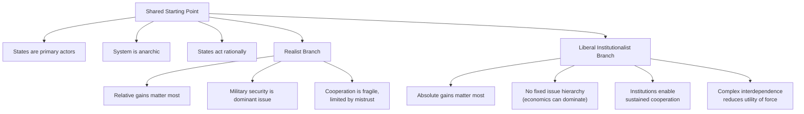

## Liberal Institutionalism and Interdependence Theory

### Overview

Liberal institutionalism (also called neoliberal institutionalism) is a major paradigm in international relations that shares realism's core assumptions of state centrism, rationality, and anarchy, but arrives at substantially more optimistic conclusions about the prospects for sustained interstate cooperation. Its central claim is that international institutions, regimes, and dense patterns of economic and political interdependence can mitigate the effects of anarchy, reduce transaction costs, increase transparency, and make cooperation a rational strategy even among self-interested states. For geopolitical risk analysts, this body of theory provides the primary counterweight to realist expectations of persistent conflict, and underpins much of the analytical framework used to assess the stability of trade regimes, multilateral institutions, and economic interdependence as either a stabilizing or destabilizing force.

### Intellectual Origins

**Classical liberal roots**

- Liberal IR theory traces its philosophical lineage to Immanuel Kant's *Perpetual Peace* (1795), which argued that republican governance, international federation, and commercial exchange (*cosmopolitan right*) would collectively reduce the likelihood of war among states.
- Woodrow Wilson's early-20th-century liberal internationalism, embodied in the League of Nations project, represented an explicit policy application of the belief that international institutions and collective security arrangements could restrain state aggression — though this "idealist" phase was heavily criticized by classical realists (E.H. Carr) for underestimating the role of power.

**Emergence of neoliberal institutionalism**

Neoliberal institutionalism developed in the 1970s and 1980s substantially as a response to and engagement with neorealism, accepting many of Waltz's structural premises (anarchy, state centrism, rationality) while challenging his pessimistic conclusions about the limits of cooperation.

- **Robert Keohane**, *After Hegemony: Cooperation and Discord in the World Political Economy* (1984), is the foundational text, arguing that international regimes and institutions can sustain cooperation even after the decline of a hegemonic power that originally created them, by reducing uncertainty and transaction costs among states with overlapping interests.
- **Robert Axelrod's** work on the evolution of cooperation, using iterated Prisoner's Dilemma game theory, provided a rational-choice microfoundation showing how reciprocal strategies (e.g., "tit-for-tat") can sustain cooperation among self-interested actors over repeated interactions without requiring a central enforcer.

### Core Theoretical Claims

**Absolute gains vs. relative gains**

A central point of divergence from realism concerns how states evaluate the benefits of cooperation:

- **Realist view (relative gains)**: States are primarily concerned with how cooperation affects their power *relative* to other states, since a rival's disproportionate gain from cooperation could later be converted into a security threat — this makes cooperation difficult to sustain even when it is mutually beneficial in absolute terms.
- **Liberal institutionalist view (absolute gains)**: States are primarily concerned with whether cooperation improves their own welfare in absolute terms, regardless of how gains are distributed relative to partners — this makes sustained cooperation considerably more feasible, particularly in economic domains.

**Institutions reduce the costs of anarchy**

Keohane's functional theory of regimes argues institutions matter because they perform several concrete functions that anarchy alone does not provide:

- **Reducing transaction costs**: Providing standing negotiation forums and legal frameworks rather than requiring states to renegotiate terms from scratch in every interaction.
- **Increasing information and transparency**: Monitoring compliance and reducing uncertainty about other states' behavior and intentions, thereby easing the security dilemma.
- **Enabling issue linkage**: Allowing states to bundle multiple issues together, creating additional incentives for cooperation and making defection more costly across a broader relationship.
- **Lengthening the "shadow of the future"**: Institutionalized, repeated interaction increases the expected value of maintaining a reputation for reliability, which discourages defection in any single interaction.

**Regime theory**

International regimes are defined as sets of implicit or explicit principles, norms, rules, and decision-making procedures around which actors' expectations converge in a given issue area (e.g., the international trade regime embodied in the WTO, or the nuclear non-proliferation regime). Regime theory examines how such arrangements persist and adapt even as underlying power distributions shift.

### Complex Interdependence Theory

**Keohane and Nye's framework**

Robert Keohane and Joseph Nye's *Power and Interdependence* (1977) is the foundational text of interdependence theory, proposing "complex interdependence" as an alternative model to the realist state-centric, military-security-dominated view of world politics. Complex interdependence is characterized by three core features:

1. **Multiple channels connect societies**: Beyond formal interstate diplomatic relations, states are linked through interstate, transgovernmental (agency-to-agency), and transnational (non-state actor) channels — corporations, NGOs, international organizations, and informal networks all matter independently of formal state-to-state diplomacy.
2. **Absence of hierarchy among issues**: Military security does not consistently dominate the agenda; economic, environmental, and social issues frequently take precedence depending on context, in contrast to realism's assumption that "high politics" (security) always trumps "low politics" (economics, welfare).
3. **Minor role of military force**: Among states characterized by complex interdependence (particularly advanced industrial democracies), military force becomes a less usable and less relevant instrument for resolving disputes, as the costs of using force against economically interdependent partners tend to outweigh the benefits.

**Sensitivity and vulnerability**

Keohane and Nye distinguish two dimensions of interdependence relevant to assessing relative power and risk exposure:

- **Sensitivity**: How quickly and how costly changes in one state's conditions produce effects in another, given existing policies and structures (e.g., how quickly an oil price shock affects an import-dependent economy before policy adjustments are made).
- **Vulnerability**: The cost of adjusting to external changes even after policies have been altered — that is, the availability and cost of alternatives. A state that is sensitive but has readily available alternatives is less vulnerable than one that is both sensitive and lacks substitutes.

This sensitivity/vulnerability distinction is directly applicable to contemporary supply-chain and energy-dependency risk analysis, since it clarifies that raw exposure to a shock (sensitivity) is analytically distinct from the deeper structural risk of being unable to adjust (vulnerability).

### Diagram: Realist vs. Liberal Institutionalist Assumptions

### Illustrative Example: The European Union as Institutionalized Interdependence

The European Union is frequently used as the paradigmatic case for liberal institutionalist and complex interdependence theory:

1. **Multiple channels**: EU integration links member states not only through formal diplomacy but through supranational institutions (European Commission, European Parliament), transgovernmental regulatory networks, and dense transnational economic and civil-society ties.
2. **Issue hierarchy erosion**: Economic and regulatory issues (single market rules, monetary policy, competition law) routinely dominate the EU's political agenda over traditional military-security concerns among member states.
3. **Minor role of force**: The near-total absence of military force as a tool for resolving disputes among EU member states — a historically novel condition among neighboring European great powers — is frequently cited as evidence for the interdependence thesis, since France and Germany's deep economic and institutional integration is credited with making armed conflict between them effectively unthinkable in a way that would have been implausible a century earlier.
4. **Institutional lock-in**: Keohane's argument that institutions persist and continue to structure cooperation is evidenced by the EU's continuation and adaptation through multiple crises (the 2008 financial crisis, the Eurozone debt crisis, Brexit) without wholesale institutional collapse.

### Critiques of Liberal Institutionalism

- **Realist rejoinder on relative gains**: Realists such as Joseph Grieco argue that even modest asymmetries in absolute gains can generate relative-gains anxieties in security-relevant domains, undermining the neoliberal assumption that welfare-maximizing cooperation is generally stable, particularly outside of clearly delineated low-security-salience economic issue areas.
- **Institutional weakness under great-power stress**: Critics note that institutions have repeatedly proven unable to prevent or resolve conflict when core great-power interests are directly threatened (e.g., limits of UN Security Council action when a permanent member is a direct party to conflict), suggesting institutional effects may be more pronounced among like-minded or already-cooperative states than as a general constraint on all state behavior.
- **Complex interdependence as a special case, not a general condition**: Critics argue the conditions of complex interdependence (multiple channels, no issue hierarchy, minimal use of force) describe relations chiefly among advanced liberal democracies, and travel poorly to relationships involving authoritarian great powers or revisionist states, where realist dynamics may remain more explanatory. [Inference: the scope conditions under which complex interdependence versus realist dynamics best explain state behavior remain a live empirical and theoretical debate rather than a settled matter, particularly regarding contemporary U.S.–China economic relations.]
- **Weaponization of interdependence**: More recent scholarship (Farrell and Newman's "weaponized interdependence") complicates the original optimistic reading by showing that asymmetric interdependence — rather than uniformly restraining conflict — can itself become a coercive tool when one state occupies a structurally central position in a network (e.g., financial messaging systems, technology supply chains), partially bridging liberal interdependence theory back toward geoeconomic and realist concerns about relative power.

### Comparison Table: Neorealism vs. Neoliberal Institutionalism

| Dimension | Neorealism | Neoliberal Institutionalism |
| --- | --- | --- |
| View of anarchy's effects | Persistent constraint favoring self-help | Mitigable through institutions and repeated interaction |
| Gains calculus | Relative gains dominant | Absolute gains dominant |
| Issue hierarchy | Security ("high politics") dominant | No fixed hierarchy; economics can dominate |
| Role of institutions | Epiphenomenal, reflect underlying power | Independently consequential, shape state behavior |
| Expected trajectory of interdependence | Can create vulnerability, exploitable by rivals | Generally stabilizing, raises cost of conflict |
| Key theorists | Waltz, Mearsheimer | Keohane, Nye, Axelrod |

### Applications in Geopolitical Risk Analysis

- **Trade and institutional stability assessment**: Used to evaluate the durability of multilateral trade and financial institutions (WTO, IMF, regional trade blocs) under stress from rising nationalism or great-power competition.
- **Economic interdependence as a conflict-risk variable**: The sensitivity/vulnerability framework is directly applicable to assessing how exposed a state or firm is to disruption in a given bilateral or multilateral relationship (e.g., energy dependency, critical mineral supply chains), and whether that exposure constitutes exploitable leverage.
- **Institutional resilience forecasting**: Regime theory's emphasis on institutional persistence beyond the conditions of their creation informs assessments of whether existing multilateral frameworks are likely to adapt or fracture amid shifting power distributions (e.g., debates over reform versus fragmentation of the post-1945 Bretton Woods institutions).
- **Distinguishing stabilizing from weaponizable interdependence**: Contemporary risk analysis increasingly draws on the synthesis of complex interdependence theory with weaponized interdependence literature to assess when economic ties function as a stabilizing constraint on conflict versus when they create asymmetric coercive leverage for one party.

**Related Topics**

- Keohane, *After Hegemony* — regime theory and cooperation after hegemonic decline
- Keohane and Nye, *Power and Interdependence* — complex interdependence in full
- Axelrod's iterated Prisoner's Dilemma and the evolution of cooperation
- Relative gains vs. absolute gains debate (Grieco's critique of neoliberalism)
- Regime theory: principles, norms, rules, and decision-making procedures
- Weaponized interdependence (Farrell & Newman) as a bridge to geoeconomics
- Sensitivity and vulnerability analysis applied to supply chain risk
- Democratic peace theory as a related liberal IR strand
- European Union integration as a case study in institutionalized interdependence
- Constructivist critiques of both realist and liberal institutionalist assumptions