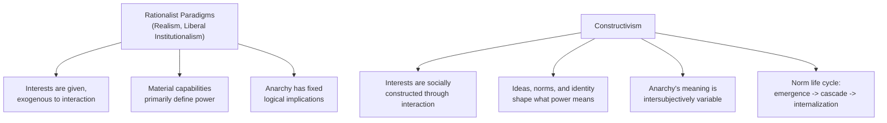

## Constructivism and the Role of Ideas and Identity

### Overview

Constructivism is a major paradigm in international relations theory that challenges the materialist and rationalist assumptions shared by both realism and liberal institutionalism, arguing instead that the structures of international politics are constituted primarily by shared ideas, norms, identities, and social practices rather than by brute material forces (military capability, economic power) alone. Where realism and neoliberalism largely treat state interests as exogenously given — fixed prior to and independent of social interaction — constructivism argues that interests and identities are themselves socially constructed, historically contingent, and subject to change through interaction. For geopolitical risk analysts, constructivism provides essential tools for understanding why materially similar states behave very differently (e.g., why some states pursue nuclear weapons and others with comparable capability do not), and why norms, identity, and legitimacy can shift the boundaries of what is considered acceptable state behavior over time.

### Intellectual Origins

**Philosophical roots**

Constructivism draws on sociological theory, particularly the work of Peter Berger and Thomas Luckmann on the social construction of reality, and Anthony Giddens' structuration theory, which holds that social structures and individual agency mutually constitute one another rather than structure simply determining agent behavior in a one-way, deterministic fashion.

**Entry into IR theory**

Constructivism entered mainstream IR theory substantially in response to the end of the Cold War, an event that many argued classical realist and neorealist theories — with their emphasis on stable, materially-determined structure — failed to anticipate or adequately explain, since the peaceful dissolution of Soviet power and the transformation of Soviet foreign policy identity under Gorbachev were difficult to account for using purely material-capability-based models.

- **Alexander Wendt**, "Anarchy is What States Make of It: The Social Construction of Power Politics" (1992) and *Social Theory of International Politics* (1999), is the foundational text of systemic constructivism, directly engaging and challenging Waltz's neorealism on its own systemic terms.
- **Nicholas Onuf** is credited with coining the term "constructivism" in IR in *World of Our Making* (1989).
- **Peter Katzenstein**, editor of *The Culture of National Security* (1996), helped consolidate constructivist research on how norms and identity shape security policy specifically.
- **Martha Finnemore and Kathryn Sikkink**, "International Norm Dynamics and Political Change" (1998), provided the most widely used framework for analyzing how international norms emerge, spread, and become internalized.

### Core Theoretical Claims

**Anarchy is what states make of it**

Wendt's central argument directly contests Waltz's claim that anarchy structurally entails self-help behavior. Wendt argues anarchy is a permissive condition without inherent logical content — it does not by itself dictate whether states will treat one another as enemies, rivals, or friends. What anarchy "means" for state behavior depends on the intersubjective understandings and shared expectations that states develop through repeated interaction and identity formation, not on the structural condition of anarchy itself.

**Three cultures of anarchy**

Wendt elaborates this claim by identifying three distinct "cultures of anarchy," each defined by a different dominant role identity that states assign to one another, and each generating a different logic of interstate behavior:

- **Hobbesian culture**: States relate to one another as enemies, viewing the other's sovereignty and survival as illegitimate and worth eliminating; this generates a logic close to the realist self-help worst case.
- **Lockean culture**: States relate to one another as rivals, accepting one another's sovereignty and right to exist even while competing for advantage; this generates a logic of restrained competition governed by mutual recognition of sovereignty, closer to the historical norm of the modern state system.
- **Kantian culture**: States relate to one another as friends, settling disputes without war and cooperating on security matters; this generates a logic approximating the "pluralistic security community" evident among contemporary Western liberal democracies.

**Identity constitutes interest**

A foundational constructivist claim is that state interests are not fixed prior to social interaction but are constituted through identity. A state's sense of "who it is" (a great power, a peaceful trading state, a revolutionary vanguard, a besieged fortress) substantially shapes what it perceives its interests to be, meaning that identity change can produce interest change even absent any change in material capabilities.

**Norms and norm life cycles**

Finnemore and Sikkink's norm life cycle model describes how international norms — shared standards of appropriate behavior for actors of a given identity — emerge and spread through three stages:

1. **Norm emergence**: Norm entrepreneurs (individuals, NGOs, epistemic communities) actively promote a new norm, often using organizational platforms to frame issues in ways that resonate with existing understandings.
2. **Norm cascade**: Once a critical mass of states adopt the norm, a dynamic of imitation and social pressure (a desire for legitimacy, esteem, and conformity) leads to rapid, broader adoption, often assisted by international organizations acting as socialization agents.
3. **Internalization**: The norm becomes so widely accepted that it is taken for granted and no longer subject to broad public debate, becoming part of the standard, unquestioned repertoire of appropriate state behavior.

**Logic of appropriateness vs. logic of consequences**

Constructivists, drawing on James March and Johan Olsen, distinguish two logics of action: the **logic of consequences** (rationalist, cost-benefit calculation central to realism and neoliberalism) versus the **logic of appropriateness** (actors ask "what does a person/state in my role, in this situation, do?" and act according to internalized norms and identity-based scripts, rather than instrumental calculation).

### Diagram: How Constructivism Diverges from Rationalist IR Theory

### Illustrative Example: The Nuclear Non-Proliferation Norm

Constructivist analysis is frequently applied to explain patterns of nuclear weapons acquisition that pure material/rationalist theories struggle to account for:

1. **Material/rationalist expectation**: A purely rationalist security-maximizing logic would predict that any state technically and economically capable of acquiring nuclear weapons, particularly in a threatening regional security environment, would do so — yet numerous technically capable states (e.g., several advanced industrial democracies) have consistently chosen not to pursue nuclear arsenals.

- **Constructivist explanation**: Nina Tannenwald's work on the "nuclear taboo" argues that a powerful normative prohibition against nuclear weapons use (and, by extension, against their acquisition by states seeking international legitimacy) has become deeply internalized among most states, functioning as an identity-constituting norm — being a "responsible," "non-proliferating" state has become part of what it means to hold legitimate standing in international society for many states, independent of a purely cost-benefit calculation of security needs.

2. **Norm entrepreneurship and cascade**: The Nuclear Non-Proliferation Treaty (NPT) regime illustrates the norm life cycle — early norm entrepreneurship by concerned scientists and diplomats, a cascade of accessions as non-proliferation became associated with international legitimacy and access to peaceful nuclear technology, and substantial (though incomplete) internalization, such that overt nuclear pursuit by a new state is treated as a significant deviation requiring explanation and typically incurring reputational and material costs.

This example illustrates the distinctive constructivist contribution: explaining variation in state behavior (why similarly capable states make different choices) by reference to identity and norms rather than solely to material capability or systemic structure.

### Variants Within Constructivism

**Conventional (modernist) constructivism**

Associated with Wendt, Katzenstein, and Finnemore, this variant retains substantial commitment to systematic, often positivist-influenced social science methodology while emphasizing the causal and constitutive role of ideas — seeking to identify how specific ideational and normative factors shape observable state behavior in testable ways.

**Critical constructivism**

More closely aligned with post-structuralist and critical theory approaches (overlapping with critical geopolitics), this variant is more skeptical of positivist methodology, emphasizing deeper interpretive and genealogical analysis of how discourse and power jointly constitute identity, often with an explicit critical or emancipatory orientation.

**Feminist constructivism**

Examines how gendered norms and identities shape security practices and state behavior, building on constructivism's ideational focus to analyze how masculinized conceptions of strength and security become embedded as taken-for-granted standards of appropriate state conduct.

### Critiques of Constructivism

- **Underspecified causal mechanisms**: Critics, particularly from rationalist traditions, argue constructivism is often stronger at describing how norms and identities matter in retrospect than at generating clear, falsifiable predictions about when and how ideational change will occur.
- **Difficulty explaining norm contestation and reversal**: While the norm life cycle model explains norm diffusion effectively, critics note it is comparatively less developed in explaining norm erosion, contestation, or reversal (e.g., renewed great-power revisionism or the fraying of previously "internalized" norms), which has become a growing focus of more recent constructivist scholarship on "norm contestation."
- **Risk of indeterminacy**: If interests and identities are fully socially constructed and malleable, critics argue constructivism risks being unable to specify in advance which of many possible identity constructions will prevail in a given case, limiting its predictive (as opposed to explanatory/interpretive) power. [Inference: the extent to which this is a genuine limitation versus an inherent and defensible feature of an interpretivist research program is itself a matter of ongoing methodological debate within the discipline, not a settled criticism.]
- **Relationship to material factors**: Some critics argue constructivism can understate the continued weight of material capability and structural constraint, though most contemporary constructivists explicitly reject pure idealism and argue ideas and material factors operate together rather than as a strict either/or.

### Comparison Table: Realism, Liberal Institutionalism, and Constructivism

| Dimension | Realism | Liberal Institutionalism | Constructivism |
| --- | --- | --- | --- |
| Source of state interests | Given, rooted in power/security | Given, rooted in welfare maximization | Socially constructed through interaction |
| Primary explanatory variable | Material capability distribution | Institutions, regimes, interdependence | Ideas, norms, identity |
| View of anarchy | Fixed logic (self-help) | Mitigable via institutions | Variable in meaning (cultures of anarchy) |
| Change over time | Change follows shifts in material power | Change follows institutional development | Change follows normative/identity shifts |
| Key theorists | Waltz, Mearsheimer | Keohane, Nye | Wendt, Finnemore, Sikkink, Katzenstein |

### Applications in Geopolitical Risk Analysis

- **Explaining anomalous state behavior**: Used when a state's actions diverge from what pure material/capability-based models would predict (e.g., voluntary nuclear or WMD disarmament, unexpected alliance realignment tied to identity shifts).
- **Norm erosion monitoring**: Tracking the contestation or erosion of previously internalized norms (territorial integrity, non-use of force, non-proliferation) as a leading indicator of rising geopolitical risk, since norm erosion often precedes and enables materially costly revisionist action.
- **Identity-based conflict analysis**: Applied to assess how domestic identity narratives (civilizational, ethnonationalist, ideological) shape a state's foreign policy posture and threat perception in ways not reducible to material interest calculations.
- **Legitimacy and soft power assessment**: Constructivist attention to legitimacy and international social standing informs analysis of how reputational and normative costs (rather than purely material sanctions) constrain or fail to constrain state behavior in specific crises.

**Related Topics**

- Wendt, *Social Theory of International Politics* — systemic constructivism in full
- Finnemore and Sikkink's norm life cycle model in detail
- Nina Tannenwald and the nuclear taboo as a case study in normative constraint
- Katzenstein, *The Culture of National Security* — norms and security policy
- Critical constructivism and its overlap with critical geopolitics
- Feminist constructivism and gendered security norms
- Logic of appropriateness vs. logic of consequences (March & Olsen)
- Norm contestation and norm erosion as an emerging research frontier
- Ontological security theory as a constructivist extension
- Securitization theory (Copenhagen School) as an adjacent constructivist-influenced approach