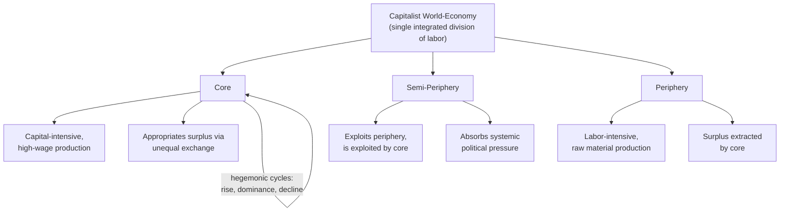

## Marxist and World-Systems Perspectives

### Overview

Marxist and world-systems perspectives constitute a structural, historical-materialist approach to international relations that analyzes global politics primarily through the lens of class relations, capital accumulation, and the international division of labor, rather than through the state-centric power or interest frameworks shared by realism, liberalism, and even most constructivism. Where mainstream IR theories typically treat states as the fundamental unit of analysis, Marxist-derived approaches treat the capitalist world economy as a single, integrated structural totality within which states, classes, and regions occupy differentiated and unequal positions. For geopolitical risk analysts, this tradition offers essential tools for understanding structural economic inequality between regions, the political economy of resource extraction and dependency, and how core-periphery dynamics shape patterns of conflict, intervention, and underdevelopment that purely state-centric theories tend to underweight.

### Intellectual Origins

**Classical Marxist theories of imperialism**

- **Vladimir Lenin**, *Imperialism, the Highest Stage of Capitalism* (1917), is the foundational text linking capitalism's internal contradictions to international conflict, arguing that advanced capitalist economies, facing declining domestic profit rates and overproduction, were driven to export capital and compete for colonial markets and resources, and that this competition among rival capitalist-imperialist powers was the underlying structural cause of World War I.
- **Rosa Luxemburg**, *The Accumulation of Capital* (1913), argued capitalism structurally requires continuous expansion into non-capitalist territories to sustain accumulation, providing an early theoretical basis for later dependency and world-systems arguments about the necessity of a periphery to capitalist reproduction.
- **J.A. Hobson**'s earlier (non-Marxist but influential) *Imperialism: A Study* (1902) linked colonial expansion to underconsumption and surplus capital seeking overseas investment outlets, directly influencing Lenin's later formulation.

**Dependency theory**

Emerging from Latin American structuralist economics in the 1950s–60s, dependency theory challenged modernization theory's assumption that "developing" states would naturally converge with advanced industrial economies through a linear developmental process.

- **Raúl Prebisch** and the Economic Commission for Latin America (ECLA/CEPAL) developed early structuralist critiques of the terms of trade between primary-commodity-exporting peripheral economies and manufactured-goods-exporting core economies, arguing peripheral economies faced systematically declining terms of trade (the Prebisch-Singer thesis).
- **André Gunder Frank**, *Capitalism and Underdevelopment in Latin America* (1967), advanced the influential claim that underdevelopment in the periphery is not a pre-capitalist condition awaiting development, but is itself actively produced by peripheral regions' structural incorporation into the capitalist world economy as sources of surplus extraction for the core — a thesis often summarized as "the development of underdevelopment."

### World-Systems Theory

**Immanuel Wallerstein's synthesis**

Immanuel Wallerstein's *The Modern World-System* (multi-volume, beginning 1974) is the most systematic and influential elaboration of this tradition, synthesizing dependency theory, Marxist political economy, and Fernand Braudel's *longue durée* historical method into a comprehensive theory of the capitalist world economy as a single historical social system originating in the "long 16th century."

**Core structural concepts**

- **The capitalist world-economy as the unit of analysis**: Wallerstein argues the appropriate unit for social-scientific analysis is not the individual state or society but the world-system as a whole — an integrated economic system based on a single division of labor spanning multiple political and cultural units, with no single overarching political authority (distinguishing a "world-economy" from a "world-empire," which has unified political control).
- **Tripartite structural positions**: States and regions occupy one of three broad structural positions within the world-economy, defined by their role in production and exchange rather than by geographic location alone:
  - **Core**: Regions with capital-intensive, high-wage, technologically advanced production, occupying the dominant position in the international division of labor and appropriating surplus value from peripheral production through unequal exchange.
  - **Periphery**: Regions specializing in labor-intensive, low-wage, often raw-material or primary-commodity production, structurally subordinated to core interests and exploited through unequal terms of trade.
  - **Semi-periphery**: An intermediate category combining elements of both core and peripheral production, playing an important stabilizing structural role by absorbing some of the political pressure that a purely bipolar core-periphery system would generate (e.g., historically industrializing states that both exploit peripheral labor/resources and are themselves exploited by core capital).
- **Hegemonic cycles**: Wallerstein and later world-systems scholars (notably Giovanni Arrighi) identify recurring cycles in which a single core state achieves temporary hegemonic dominance of the world-economy (combining production, commercial, and financial superiority), followed by inevitable relative decline as rival core powers catch up and competition intensifies — historically identified cycles include Dutch hegemony (17th century), British hegemony (19th century), and U.S. hegemony (mid-20th century onward), with contemporary world-systems scholars actively debating whether the U.S. hegemonic cycle is currently in a terminal declining phase.

**Unequal exchange**

A key mechanism binding the system together is unequal exchange: trade between core and peripheral producers systematically transfers value from low-wage peripheral producers to high-wage core producers even under nominally "free" and voluntary market exchange, because wage differentials are not fully offset by corresponding productivity differentials — meaning formally equal market transactions can still produce structurally unequal outcomes.

### Diagram: World-Systems Structural Positions

### Illustrative Example: Resource-Extraction Economies and the "Resource Curse"

World-systems and dependency frameworks are frequently applied to analyze the persistent underdevelopment of resource-rich peripheral economies:

1. **Structural positioning**: A state whose economy is dominated by primary commodity export (oil, minerals, agricultural products) to core manufacturing economies occupies a classically peripheral structural position, regardless of the nominal political sovereignty and formal independence it holds.
2. **Mechanism of underdevelopment**: Dependency theorists argue this structural position generates specific, self-reinforcing developmental pathologies — susceptibility to commodity price volatility, weak incentives for economic diversification, currency effects that disadvantage other export sectors (a dynamic closely related to what mainstream economics separately identifies as "Dutch disease"), and elite class interests aligned with continued commodity extraction and export rather than with broader industrial development.
3. **Contrast with core-state trajectories**: World-systems theory would predict that historically core states industrialized in substantial part by leveraging colonial and peripheral extraction to accumulate capital, meaning the "underdevelopment" of contemporary peripheral resource economies is analytically linked to, rather than separate from, the historical process of core development — a direct application of Frank's "development of underdevelopment" thesis.

This example illustrates the tradition's central methodological move: explaining persistent economic and political disparities between states as a structural product of their position within a single integrated global system, rather than as a product of each state's internal characteristics considered in isolation.

### Related and Successor Frameworks

**World-systems analysis and hegemonic stability**

Giovanni Arrighi's *The Long Twentieth Century* (1994) extended Wallerstein's hegemonic cycle framework with detailed attention to financialization as a recurring signal of a declining hegemon's transition from productive/commercial dominance toward speculative financial dominance — a pattern Arrighi argued was recurrently observable in the terminal phases of Genoese, Dutch, British, and (he argued) emerging American hegemonic cycles.

**Gramscian and neo-Gramscian IR (Robert Cox)**

Robert Cox's neo-Gramscian approach, drawing on Antonio Gramsci's concept of hegemony (understood as a combination of coercion and ideological consent rather than force alone), analyzes how a dominant class's worldview becomes embedded not only within a single state but across the entire structure of the international order — including its institutions, ideas, and material capabilities jointly ("historical structures") — providing a framework for analyzing how international institutions can function to legitimate and stabilize a particular global class order.

**Critiques from within the tradition**

Some scholars within the broader critical/Marxist tradition (e.g., proponents of "uneven and combined development," drawing on Leon Trotsky) critique Wallerstein's world-systems approach for treating structural positions (core/periphery) as overly static and functionalist, arguing for greater attention to the historically specific and contested political agency of class actors within and across these structural positions.

### Critiques of Marxist and World-Systems Perspectives

- **Structural determinism**: Mainstream IR critics argue world-systems theory can understate the agency of individual states, political leaders, and social movements, treating structural position as excessively determinative of outcomes and underweighting instances of successful late industrialization (e.g., East Asian newly industrialized economies) that appear to complicate a strict core-periphery determinism.
- **Empirical challenges from East Asian development**: The rapid industrial upgrading of several East Asian economies from peripheral/semi-peripheral to core-like production profiles within a few decades is frequently cited as an empirical challenge to strong versions of dependency theory's claims about structural barriers to peripheral advancement, though world-systems scholars have responded by incorporating such cases as evidence of semi-peripheral mobility rather than as a refutation of the core-periphery framework itself. [Inference: whether East Asian industrialization is best explained as a case internal to world-systems theory (successful semi-peripheral ascent) or as evidence against its structural claims remains genuinely contested among specialists, and is not resolved by consensus.]
- **Economistic reductionism**: Critics from constructivist and other traditions argue class-and-accumulation-centered analysis can underweight the independent causal role of ideas, identity, and non-economic norms in shaping state behavior.
- **Testability and parsimony concerns**: As with some critiques of constructivism, critics note the world-systems framework's very high level of historical and structural abstraction can make it difficult to generate specific, falsifiable predictions about near-term state behavior, limiting its use for short-horizon risk forecasting relative to its strength in long-run structural analysis.

### Comparison Table: Mainstream IR Theory vs. Marxist/World-Systems Perspectives

| Dimension | Mainstream IR (Realism/Liberalism) | Marxist/World-Systems |
| --- | --- | --- |
| Primary unit of analysis | The state | The capitalist world-economy as a whole |
| Primary driver of behavior | State power/security or welfare interests | Class relations and capital accumulation |
| Source of inequality between states | Differences in capability or institutional development | Structural position (core/semi-periphery/periphery) |
| View of underdevelopment | Internal/domestic developmental lag | Actively produced by incorporation into world-economy |
| Time horizon of analysis | Typically shorter-run, state-interaction focused | Long-run (centuries), systemic and historical |

### Applications in Geopolitical Risk Analysis

- **Structural inequality and instability forecasting**: Used to contextualize persistent instability in peripheral, commodity-dependent economies as a structural feature of their position in global production networks rather than as isolated governance failures alone.
- **Resource-extraction risk assessment**: Directly informs analysis of political risk in extractive-industry-dependent states, including elite capture, commodity price exposure, and the political economy of resource nationalism.
- **Hegemonic transition analysis**: Arrighi's and Wallerstein's hegemonic cycle frameworks are used, alongside power-transition and geoeconomic theories, to contextualize debates about a potential transition from U.S. to Chinese (or multipolar) systemic centrality, including attention to financialization as a potential indicator of hegemonic-cycle position.
- **Global inequality and grievance analysis**: Provides a structural framework for understanding how global economic inequality feeds into transnational political grievance, migration pressure, and anti-systemic movements that purely state-centric security analysis may otherwise treat as exogenous or disconnected phenomena.

**Related Topics**

- Lenin, *Imperialism, the Highest Stage of Capitalism* — classical Marxist theory of imperialism
- Wallerstein, *The Modern World-System* — full multi-volume framework
- Arrighi, *The Long Twentieth Century* — hegemonic cycles and financialization
- Prebisch-Singer thesis and terms-of-trade deterioration
- Dependency theory and the "development of underdevelopment" (André Gunder Frank)
- Neo-Gramscian IR and historical structures (Robert Cox)
- Resource curse and Dutch disease as related political-economy concepts
- Uneven and combined development as a critique within the Marxist tradition
- Financialization as an indicator of hegemonic decline
- East Asian developmental-state trajectories as a test case for dependency theory