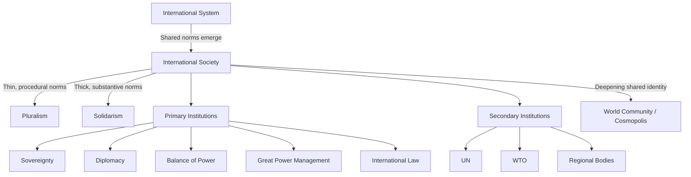

## The English School and International Society

### Overview

The English School (also called the International Society approach or Rationalism) is a theoretical tradition in International Relations that occupies a middle ground between Realism and Liberalism/Idealism. It argues that states form an "international society" (not merely an anarchic system) bound together by shared rules, institutions, and norms, even in the absence of a central authority. For geopolitical risk analysts, the English School provides a vocabulary for distinguishing between purely coercive power dynamics and the normative, institutional fabric that constrains and channels state behavior — a distinction critical for assessing when states will honor commitments, respect sovereignty norms, or break from them.

### Core Intellectual Foundations

The School originated with the British Committee on the Theory of International Politics (founded 1958), with foundational figures including Martin Wight, Hedley Bull, Adam Watson, and later Barry Buzan. Hedley Bull's *The Anarchical Society* (1977) remains the tradition's canonical text.

**Key Points**

- Rejects both the Realist view of pure anarchy/power struggle and the strong Liberal/Cosmopolitan view of a global community of individuals
- Focuses on the **society of states** as the primary unit of normative and institutional life
- Draws heavily on historical and legal analysis rather than pure structural or rational-choice modeling
- Bridges IR theory with international law, diplomatic history, and political theory

### The Three Traditions (Wight's Via Media)

Martin Wight identified three competing traditions within Western political thought about international relations, and the English School positions itself as the synthesizing middle path:

1. **Realism (Hobbesian)** — international politics as a state of war; states pursue power in an anarchic system with no meaningful society
2. **Rationalism (Grotian)** — states form a society bound by mutual recognition, law, and diplomacy even while pursuing self-interest; this is the English School's own core position
3. **Revolutionism (Kantian)** — a transnational community of humankind transcends the state system, prioritizing universal moral obligations over sovereign boundaries

$$\text{System} \subset \text{Society} \subset \text{Community}$$

This nesting captures the School's central claim: an international **system** (mere interaction and awareness) can evolve into an international **society** (shared rules and institutions), which can further evolve into a world **community** (shared identity and solidarism).

### System vs. Society: The Core Distinction

**International System**

- States merely interact, calculate, and react to one another (e.g., balance-of-power dynamics)
- No shared norms are necessarily required — this is closer to the Realist/structural view
- Example: adversarial great powers monitoring each other's military capabilities purely for strategic calculation

**International Society**

- States recognize common interests and values, accept themselves as bound by common rules (e.g., international law, diplomatic conventions), and cooperate in common institutions
- Bull defined this as a group of states that, "conscious of certain common interests and common values, form a society in the sense that they conceive themselves to be bound by a common set of rules in their relations with one another, and share in the working of common institutions"
- Example: mutual recognition of embassy immunity even between hostile states

### Bull's Five "Institutions" of International Society

Hedley Bull identified core institutions (understood not as organizations but as durable practices) that sustain order in international society:

| Institution | Function |
| --- | --- |
| Balance of power | Prevents any single state from dominating the system |
| International law | Codifies mutual obligations and expectations |
| Diplomacy | Maintains communication and negotiation channels |
| War | Serves as an enforcement/last-resort mechanism of the society (not merely destructive chaos) |
| Great power management | Recognizes special responsibilities of major powers in maintaining order |

**Example**

A risk analyst assessing a territorial dispute between two mid-sized states would examine: (1) whether both states have historically respected arbitration rulings (international law), (2) whether formal or back-channel diplomatic contact persists despite tension (diplomacy), (3) whether regional or global great powers are exerting restraining pressure (great power management). Weakness across all three institutions signals elevated escalation risk; robustness across them signals a managed, society-bound dispute likely to stay below the threshold of war.

### Pluralism vs. Solidarism

This is the School's central internal debate and one of its most operationally useful concepts for risk analysts.

**Pluralism**

- International society is thin, procedural, and minimal
- States agree only on baseline rules of coexistence: sovereignty, non-intervention, mutual recognition, pacta sunt servanda
- Order is prioritized over justice; cultural and political diversity among states is respected and not to be overridden
- Associated with Bull's earlier work and with Robert Jackson

**Solidarism**

- International society can and should develop thicker shared norms, including collective enforcement of human rights and humanitarian standards
- Justice (including individual/human rights) can override strict sovereignty when consensus is strong enough (e.g., Responsibility to Protect)
- Associated with Nicholas Wheeler and later solidarist scholarship

**Key Points**

- The pluralist-solidarist spectrum is not binary but a continuum; real international society sits at different points depending on issue-area (e.g., more solidarist on nuclear non-proliferation, more pluralist on domestic governance models)
- [Inference] The trajectory of a given regime (trending pluralist or solidarist) can be used as a leading indicator of intervention likelihood in humanitarian crises, since solidarist normative consensus historically preceded interventions such as Kosovo (1999) and Libya (2011)

### Primary vs. Secondary Institutions (Buzan's Reformulation)

Barry Buzan, in reviving and structurally reworking the English School (particularly *From International to World Society?*, 2004), distinguished:

- **Primary institutions**: deep, evolved practices constitutive of international society itself — sovereignty, territoriality, diplomacy, great power management, international law, nationalism, the market
- **Secondary institutions**: the formal intergovernmental organizations that operationalize primary institutions — the UN, WTO, IMF, regional bodies

This distinction matters for risk analysis because secondary institutions (e.g., a specific UN resolution mechanism) can fail or be bypassed while the underlying primary institution (e.g., great power management, diplomacy) persists — meaning apparent "institutional collapse" is often less severe than headlines suggest.

### The English School and Geopolitical Risk Analysis: Applications

**1. Distinguishing Rhetoric from Revisionism**

The School helps analysts separate a state's rhetorical challenge to specific rules from an actual rejection of international society's foundational primary institutions (sovereignty, non-intervention, diplomacy). A state can be a harsh critic of a secondary institution (e.g., WTO dispute mechanisms) while remaining a status-quo actor with respect to sovereignty norms.

**2. Assessing "Revisionist" vs. "Reformist" State Behavior**

- A reformist state seeks to change specific rules or institutions from within international society (still recognizes its legitimacy)
- A revisionist/revolutionary state rejects the legitimacy of international society's core primary institutions altogether
- [Inference] This distinction offers analysts a more granular risk gradient than the binary "status quo vs. revisionist power" framing common in Realist-derived risk models

**3. Regional International Societies**

Buzan and others extended the framework to note that international society is not globally uniform — there can be regional societies with denser or thinner normative content (e.g., the EU as a highly solidarist regional society nested within a thinner global pluralist society). Risk models should account for this layering rather than treating "the international system" as normatively homogeneous.

**4. Expansion of International Society**

Historical work (Bull and Watson's *The Expansion of International Society*, 1984) traces how a European-originated society of states expanded globally through colonialism, decolonization, and post-WWII institutionalization. This historical lens helps explain persistent legitimacy contestation from states that view the society's foundational rules as externally imposed rather than consensually constructed — a recurring source of friction in contemporary multilateral negotiations (e.g., debates over global governance reform, Global South demands for a revised international order).

### Diagrammatic Summary

### Critiques and Limitations

- **Eurocentrism**: Critics (including postcolonial scholars) argue the "expansion of international society" narrative naturalizes a European origin point and downplays coercive imposition through colonialism
- **Conceptual vagueness**: "Society," "institution," and "order" are sometimes criticized as under-specified compared to the more formalized variables of structural Realism or quantitative IR approaches
- **Limited predictive power**: The School is stronger at historical-interpretive analysis than at generating falsifiable, forward-looking predictions, which can limit its direct utility in quantitative risk-scoring models
- [Inference] For risk analysts requiring probabilistic outputs, English School concepts are best used as qualitative overlays or contextual variables layered onto more formal (Realist, Liberal-institutionalist, or quantitative) models rather than as standalone predictive frameworks

### Comparison with Other IR Traditions

| Tradition | View of Anarchy | Role of Norms/Institutions | Primary Risk-Analytic Use |
| --- | --- | --- | --- |
| Realism | Pure self-help anarchy | Epiphenomenal, power-derivative | Power balances, capability assessments |
| Liberalism | Mitigated by institutions/interdependence | Institutions reduce transaction costs, enable cooperation | Regime durability, economic interdependence risk |
| English School | Anarchy with society | Norms and institutions are constitutive, historically embedded | Legitimacy contestation, order vs. justice tradeoffs, revisionist gradation |
| Constructivism | Socially constructed | Norms constitute state identity/interest itself | Norm diffusion, identity-driven conflict |

### Next Steps

- **Related Topics**: Hedley Bull's *The Anarchical Society*; Buzan's *From International to World Society?*; the Grotian tradition in international law; Regional Security Complex Theory (Buzan/Wæver); Responsibility to Protect (R2P) doctrine; the Expansion of International Society thesis (Bull & Watson); Constructivism and norm diffusion; comparative sovereignty regimes; great power management in multipolar orders; legitimacy and order in post-Cold War multilateralism