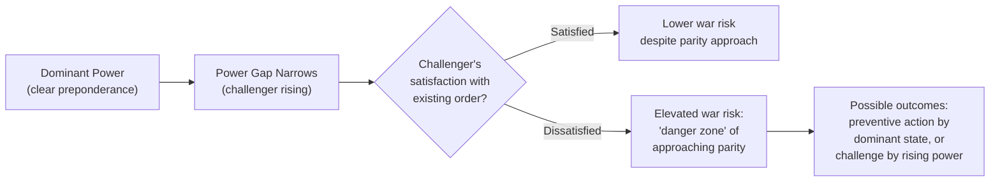

## Power Transition and Hegemonic Stability Theory

### Overview

Power transition theory and hegemonic stability theory constitute a related family of IR theories concerned specifically with how shifts in the relative distribution of power among great powers affect the likelihood of major war and the stability of international order. Unlike classical balance-of-power realism, which generally predicts that concentrations of power provoke counterbalancing and that rough parity is stabilizing, this tradition argues the opposite in key respects: that hierarchical concentrations of power (hegemony or clear preponderance) tend to produce order and stability, while the process of a rising challenger closing the power gap with a dominant state — particularly under conditions of dissatisfaction with the existing order — is the primary structural condition associated with major war. This body of theory is central to contemporary geopolitical risk analysis of U.S.–China relations, where it is frequently invoked (and contested) as an analytical frame for assessing the risk of great-power conflict.

### Intellectual Origins and Core Texts

**Power transition theory**

- **A.F.K. Organski**, *World Politics* (1958), is the foundational text, explicitly challenging balance-of-power realism's assumption that parity is stabilizing. Organski argued instead that international order is inherently hierarchical, with a dominant state at the top of the system supported by allied and satisfied major powers, and that the danger point for major war arises when a rapidly growing challenger approaches parity with the dominant state — not when power is already roughly equal or heavily concentrated.
- **Organski and Jacek Kugler**, *The War Ledger* (1980), extended and empirically tested the theory, introducing the critical distinction between a challenger's *satisfaction* with the existing international order and its raw power trajectory.

**Hegemonic stability theory**

- Emerging from international political economy scholarship in the 1970s, associated with **Charles Kindleberger** (*The World in Depression, 1929-1939*, 1973) and later **Robert Gilpin** (*War and Change in World Politics*, 1981), hegemonic stability theory argues that a stable, open international economic order requires a single dominant power (a hegemon) willing and able to provide collective goods — open markets, a reserve currency, crisis-lender-of-last-resort functions, and enforcement of "rules of the game" — that a fragmented, multipolar system with no dominant provider will tend to undersupply.
- **Robert Gilpin**'s formulation is the most directly relevant to security-focused geopolitical risk analysis, integrating hegemonic decline with the likelihood of "hegemonic war" — a systemic war that occurs when a declining hegemon's capacity to maintain the existing international order no longer matches a rising challenger's growing power and dissatisfaction with that order.

### Core Theoretical Claims

**Hierarchical rather than anarchic emphasis**

Where neorealism emphasizes anarchy as the system's defining feature, power transition theory emphasizes that international politics functions in practice as a de facto hierarchy, with a dominant state (or small group of core allied states) occupying the top position, exercising disproportionate influence over the rules, norms, and distribution of benefits within the existing international order — closely paralleling hegemonic stability theory's emphasis on a single leading power providing systemic public goods.

**The power transition and the danger zone**

The theory's central causal claim is that the period of greatest war risk is not when power is grossly unequal (a dominant hegemon facing no plausible challenger) nor when power is already roughly equal and stable, but specifically during the *transition* period when a rising challenger's power trajectory is closing the gap with the dominant state and approaching rough parity — because:

- The dominant state faces a diminishing window in which preventive action (including preventive war, in the theory's more pessimistic variants) remains a viable option to forestall the challenger's rise.
- The rising challenger, as it approaches parity, has increasing capability to contest the existing order and increasing incentive to do so if it perceives that order as having been constructed to benefit the incumbent hegemon at its expense.

**Satisfaction vs. dissatisfaction with the status quo**

A crucial refinement, particularly associated with Organski and Kugler and later elaborated by Douglas Lemke and Ronald Tammen, is that power parity alone does not determine war risk — the challenger's *satisfaction* with the existing international order is an equally critical variable:

- **Satisfied rising powers**: A rising power that is broadly content with the existing rules, norms, and distribution of status within the international order (having benefited from and been socialized into that order) is theorized to be substantially less likely to initiate conflict even as it approaches parity, since it has strong incentives to preserve rather than overturn a system it perceives as broadly legitimate and beneficial.
- **Dissatisfied rising powers**: A rising power that perceives the existing order as illegitimate, imposed, or structured to unfairly constrain its status and interests is theorized to pose substantially greater war risk as it approaches parity, since it has strong incentives to revise the existing rules once it possesses sufficient capability to do so.

This satisfaction variable is frequently cited as the theory's most analytically important — and most difficult to measure — contribution, since it shifts the central risk question from "how much power does the challenger have?" to "how much power does the challenger have, *and* how does it evaluate the legitimacy of the order it is gaining the capability to challenge?"

**Hegemonic stability and public goods provision**

Gilpin's and Kindleberger's hegemonic stability theory argues a dominant power's willingness to bear the costs of providing collective economic goods (open trade access, currency stability, crisis management) is central to sustaining an open, stable international economic order — and that hegemonic decline, marked by declining relative willingness or capacity to bear these costs, tends to produce greater international economic instability (a claim Kindleberger applied specifically to interwar economic collapse, attributing it partly to Britain's inability and the United States' unwillingness to perform the stabilizing hegemonic role during that transition period).

### Diagram: The Power Transition "Danger Zone"

### Illustrative Example: Thucydides's Trap and the U.S.–China Framing

The contemporary popularization of power transition logic owes substantially to Graham Allison's *Destined for War: Can America and China Escape Thucydides's Trap?* (2017), which applies the framework to U.S.–China relations:

1. **Historical pattern claim**: Allison's Thucydides's Trap Project examined sixteen historical cases over roughly 500 years in which a rising power's growth threatened to displace a ruling power, finding that twelve of these cases resulted in war, while four did not — used to argue that a structural tendency toward conflict exists when a rising power approaches parity with an established power, though not an inevitability. [Inference: the historical case selection, coding of "war" outcomes, and comparability across highly disparate historical eras (from ancient Greece to the 20th century) have been substantially disputed by other historians and political scientists, so the specific 12-of-16 finding should be treated as a contested empirical claim rather than settled historical consensus.]
2. **Application to U.S.–China**: China's rapid economic and military growth relative to the United States over recent decades is frequently framed using power transition logic as a contemporary instance of the "danger zone" — a rising power approaching parity with an established power, with analysts disagreing sharply over China's degree of satisfaction with the existing U.S.-led international order (a status quo power seeking reform from within versus a revisionist power seeking to overturn core elements of the existing order).
3. **Competing interpretations**: Some analysts argue China's extensive integration into and substantial benefit from existing international economic institutions (WTO membership, global supply chain centrality) suggests meaningful satisfaction with significant elements of the status quo even while it seeks revision of specific security arrangements (e.g., regional alliance structures, Taiwan's status) — illustrating the theory's core analytical difficulty: satisfaction is rarely all-or-nothing, and mixed or issue-specific dissatisfaction complicates simple binary risk assessments.

### Critiques and Debates

- **Measurement difficulty of "satisfaction"**: The satisfaction variable, while theoretically crucial, is difficult to operationalize and measure independently of the very conflict behavior it is meant to predict, raising concerns about circularity in some empirical applications.
- **Determinism concerns**: Critics, including many constructivists and some liberal institutionalists, argue power transition framings can encourage a degree of fatalism about great-power conflict ("this pattern has recurred historically, therefore it will recur again"), potentially underweighting the role of institutions, economic interdependence, nuclear deterrence, and deliberate policy choices in preventing transitions from escalating to war — a critique frequently leveled specifically at popularized "Thucydides's Trap" framing.
- **Nuclear-age applicability**: Some scholars argue the empirical base for power transition theory, built substantially on pre-nuclear historical cases, may transfer imperfectly to a nuclear-armed great-power transition, since the catastrophic costs of great-power war under mutual nuclear deterrence may fundamentally alter the risk calculus in ways not captured by historical cases predating nuclear weapons. [Inference: whether nuclear deterrence meaningfully changes the applicability of historical power-transition patterns, or whether it merely changes the form conflict is likely to take (proxy conflict, gray-zone competition) rather than eliminating transition-related risk, remains an open and actively debated question rather than a resolved one.]
- **Hegemonic stability theory's economic-security linkage**: Critics of Gilpin's and Kindleberger's economic hegemonic stability claims note that later research has found mixed empirical support for the strict claim that a single hegemon is necessary for open economic order, with some scholars (e.g., work in the liberal institutionalist tradition) arguing institutions can substitute for hegemonic provision of public goods under certain conditions — directly connecting this debate back to the realism/liberal-institutionalism divide over the independent causal weight of institutions.

### Comparison Table: Power Transition Theory vs. Balance-of-Power Realism

| Dimension | Balance-of-Power Realism | Power Transition Theory |
| --- | --- | --- |
| View of system structure | Fundamentally anarchic | Functionally hierarchical |
| Stabilizing condition | Rough parity among great powers | Clear hegemonic preponderance |
| Highest-risk condition | Unbalanced concentration of power | Challenger approaching parity with dominant state |
| Key additional variable | Aggregate power and perceived threat | Challenger's satisfaction with existing order |
| Predicted response to a rising power | Counterbalancing coalition formation | Possible preventive action by dominant state, or challenge by rising power |

### Applications in Geopolitical Risk Analysis

- **Great-power conflict risk forecasting**: Used alongside neorealist and geoeconomic frameworks to assess the risk trajectory of the U.S.–China relationship, with particular attention to indicators of Chinese satisfaction or dissatisfaction with specific elements of the existing international order (trade rules, regional security architecture, institutional representation) rather than treating "rising power" status alone as sufficient for risk assessment.
- **Historical benchmarking of transition risk**: The comparative historical case method (as in Allison's Thucydides's Trap Project) is used, with appropriate caution about case comparability, to contextualize contemporary power shifts against historical analogues of peaceful versus violent transitions (e.g., the peaceful late-19th/early-20th century transition of relative power between Britain and the United States is frequently cited as a comparatively successful non-war transition case worth analytical attention alongside the more frequently cited violent transition cases).
- **Hegemonic provision-of-goods risk**: Gilpin's and Kindleberger's economic hegemonic stability framework informs analysis of risks associated with declining U.S. willingness or capacity to underwrite existing international economic and security institutions, and the resulting vacuum-filling dynamics among other powers.
- **Early-warning indicator development**: Analysts use rate-of-change metrics in relative GDP, military expenditure, and technological capability between an established and rising power as one (contested) input into broader early-warning frameworks for elevated great-power conflict risk, generally in combination with — rather than in place of — qualitative assessment of stated grievances and revisionist intent.

**Related Topics**

- Organski and Kugler, *The War Ledger* — empirical power transition testing
- Gilpin, *War and Change in World Politics* — hegemonic war theory in full
- Kindleberger's hegemonic stability theory and interwar economic collapse
- Allison, *Destined for War* — the Thucydides's Trap historical case project
- Satisfaction/dissatisfaction measurement challenges in power transition research
- Long cycle theory (George Modelski) as a related systemic framework
- Preventive war theory and its relationship to power transition dynamics
- Nuclear deterrence and its effect on great-power transition risk
- U.S.–China relative capability trend analysis as an applied case
- Britain-to-U.S. hegemonic transition as a comparative "peaceful transition" case