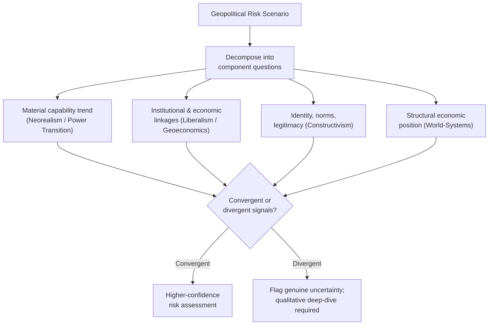

## Applying IR Theory to Real-World Risk Scenarios

### Overview

This capstone topic addresses the practical methodology of using multiple, often competing, IR theoretical frameworks together to analyze real-world geopolitical risk, rather than relying on any single paradigm in isolation. Professional geopolitical risk analysis rarely applies realism, liberal institutionalism, constructivism, Marxist/world-systems analysis, or power transition theory as mutually exclusive, all-or-nothing choices; instead, practitioners typically use these frameworks as complementary analytical lenses, each illuminating different causal mechanisms and risk factors within the same scenario, while remaining attentive to each theory's characteristic blind spots. This topic synthesizes the preceding chapter's theoretical content into a working methodology for multi-paradigm risk assessment.

### Why Single-Paradigm Analysis Is Insufficient

**Each theory answers a different question well**

No single IR paradigm is designed to explain every dimension of a geopolitical risk scenario, because each theory foregrounds a different causal mechanism and correspondingly brackets others as secondary or exogenous:

- Realism and neorealism are strongest at explaining state security-seeking behavior, alliance formation, and responses to shifts in relative material power, but are comparatively weak at explaining variation in state behavior among similarly positioned states, or normative and identity-driven policy shifts.
- Liberal institutionalism and interdependence theory are strongest at explaining the durability of cooperative arrangements and the stabilizing (or, per weaponized interdependence, coercive) effects of economic ties, but can understate how security anxieties and relative-gains concerns constrain cooperation under conditions of acute rivalry.
- Constructivism is strongest at explaining anomalous behavior, identity-driven foreign policy, and normative change over time, but is comparatively weaker at generating precise, falsifiable predictions about the timing of specific events.
- Marxist/world-systems perspectives are strongest at explaining long-run structural inequality and the political economy of extraction and dependency, but operate at a level of abstraction that is less suited to short-horizon, event-level forecasting.
- Power transition and hegemonic stability theory are strongest at framing long-run great-power conflict risk associated with shifting capability distributions, but depend heavily on a difficult-to-measure satisfaction variable and risk deterministic overreach if applied mechanically.

**Risk of single-paradigm blind spots**

Analysts who rely exclusively on one paradigm risk systematically mis-weighting certain classes of risk indicators — for example, a purely realist analysis of a bilateral dispute might underweight the stabilizing effect of dense trade interdependence, while a purely liberal-institutionalist analysis might underweight how relative-gains anxiety in a security-salient sector (e.g., semiconductors) can override otherwise cooperation-favoring economic incentives.

### A Multi-Paradigm Analytical Methodology

**Step 1: Decompose the scenario into component questions**

Rather than asking "what does theory X predict for this scenario?", effective practice decomposes a complex geopolitical risk scenario into narrower component questions, each of which is better suited to a particular theoretical lens:

- What is the underlying distribution of material capabilities, and how is it trending? → **Neorealism / power transition theory**
- What institutional, trade, and financial linkages exist between the relevant actors, and how asymmetric is the resulting interdependence? → **Liberal institutionalism / interdependence theory / geoeconomics**
- What identity narratives, norms, and legitimacy concerns are shaping how relevant actors interpret the situation and their available options? → **Constructivism**
- What structural economic position (core, periphery, semi-periphery) do the involved states occupy, and how does this shape underlying grievance or vulnerability? → **Marxist / world-systems analysis**
- Is a rising power approaching parity with an established power in the relevant domain, and how satisfied does that rising power appear to be with the existing order? → **Power transition theory**

**Step 2: Identify convergent and divergent indicators**

- **Convergent signals**: When multiple theoretical frameworks point toward the same directional risk assessment (e.g., neorealist balancing concerns *and* constructivist identity-based threat narratives *and* power-transition dissatisfaction all pointing toward elevated risk), analytical confidence in that risk assessment is generally higher.
- **Divergent signals**: When frameworks point in different directions (e.g., realist relative-power concerns suggesting elevated risk, while liberal-institutionalist interdependence indicators suggest restraint), this divergence itself is analytically valuable — it flags genuine uncertainty and a scenario where the outcome may hinge on which causal logic proves dominant, warranting closer qualitative investigation rather than an averaged or arbitrarily weighted composite score.

**Step 3: Weight frameworks by scenario characteristics, not by default preference**

Different scenario types tend to favor different frameworks as primary (though not exclusive) lenses:

- Security-dominant crises with limited economic interdependence and high military salience tend to be better explained by realist/neorealist frameworks.
- Trade disputes, sanctions regimes, and economic statecraft scenarios benefit from geoeconomic and interdependence-theory analysis, informed by sensitivity/vulnerability assessment.
- Scenarios involving sudden shifts in a state's foreign policy orientation absent major material capability change (e.g., a change in government producing a sharp alignment shift) are often better explained through a constructivist identity/norm lens.
- Long-run instability in resource-dependent or historically peripheral economies benefits from world-systems/dependency framing alongside conventional political risk indicators.
- Long-horizon great-power rivalry assessment benefits from combining power transition theory's capability-trend and satisfaction analysis with realist balancing predictions and constructivist attention to identity-driven threat perception.

### Diagram: Multi-Paradigm Risk Assessment Workflow

### Illustrative Example: Multi-Paradigm Analysis of a Hypothetical Maritime Territorial Dispute

Consider a generic but representative scenario: a rising regional power asserts expanded maritime claims in a resource-rich, strategically located area also claimed by smaller neighboring states and traversed by significant global shipping traffic.

**Realist/neorealist lens**: The rising power's expanded claims can be read as consistent with either defensive neorealist security-seeking (securing maritime approaches and resource access against perceived encirclement) or offensive neorealist power maximization (testing the limits of achievable regional influence while a favorable capability window exists) — the analyst would examine relative capability trends and the credibility of external balancing coalitions among affected neighbors and extra-regional powers as key risk indicators.

**Liberal institutionalist/geoeconomic lens**: The analyst would assess the depth of trade and investment interdependence between the claimant and its neighbors/trading partners, the presence and credibility of relevant institutional dispute-resolution mechanisms (e.g., international arbitration bodies, regional organizations), and the potential for economic interdependence to raise the cost of coercive escalation — while also considering, per weaponized interdependence, whether the rising power's economic centrality to the region gives it *coercive* leverage rather than purely restraining ties.

**Constructivist lens**: The analyst would examine how the claim is framed in domestic and international discourse (historical/civilizational entitlement narratives, sovereignty and territorial-integrity norms, "restoration" versus "expansion" framing) and assess whether the claimant state's identity as a rising or resurgent power is driving threat perception and risk tolerance independent of narrow material calculation.

**World-systems/geoeconomic lens**: The analyst would assess the resource and shipping-lane stakes in structural terms — whether smaller claimant states occupy a peripheral position vulnerable to coercive economic or political pressure from the rising power, and how this structural asymmetry shapes their available response options.

**Power transition lens**: If the rising power's regional capability is approaching parity with, or exceeding, that of previously dominant regional or extra-regional actors, the analyst would specifically assess the rising power's satisfaction with existing regional order and institutions as a key differentiator between a manageable assertive-but-status-quo posture and a higher-risk revisionist trajectory.

**Synthesis**: A robust risk assessment would integrate all five lenses into a composite judgment — for instance, noting that strong economic interdependence (liberal lens) may create meaningful, though not unlimited, restraint on the probability of overt conflict, while simultaneously flagging that constructivist identity narratives and power-transition dissatisfaction indicators suggest elevated risk of sustained gray-zone coercion even absent full-scale conflict, producing a differentiated forecast (e.g., low probability of major war, elevated probability of sustained coercive/gray-zone activity) rather than a single undifferentiated risk score.

### Common Methodological Pitfalls

- **Theory shopping**: Selectively invoking whichever framework supports a pre-existing conclusion, rather than systematically applying multiple frameworks and reporting where they converge or diverge — a significant threat to analytical objectivity that structured, framework-explicit methodology is specifically designed to mitigate.
- **False precision from composite scoring**: Mechanically averaging or weighting outputs from different theoretical frameworks into a single numerical risk score can obscure genuine theoretical disagreement about underlying causal mechanisms, and risks conveying spurious confidence; qualitative documentation of *why* frameworks diverge is often more analytically valuable than a single blended number. [Inference: the appropriate degree of quantification versus qualitative judgment in composite geopolitical risk scoring is a matter of ongoing methodological debate within the risk analysis profession, and practice varies significantly by institution and use case.]
- **Neglecting scope conditions**: Applying a theory outside the scope conditions under which it was developed to travel well (e.g., applying complex interdependence assumptions, largely developed with reference to advanced liberal democracies, uncritically to relations involving authoritarian great powers) without explicitly considering whether those scope conditions are met.
- **Underweighting domestic-level variables**: All five major paradigms discussed operate substantially at the systemic or structural level; neoclassical realism's reintroduction of unit-level variables (leader perception, domestic coalition politics, state capacity) is a useful supplementary check against purely systemic-level analysis that can otherwise miss decisive domestic political drivers of a specific decision.

### Summary Table: Theory-to-Risk-Factor Mapping

| Risk Factor Category | Primary Theoretical Lens | Key Indicators |
| --- | --- | --- |
| Military buildup, alliance shifts | Neorealism | Relative capability trends, balancing behavior |
| Trade/financial exposure | Liberal institutionalism / Geoeconomics | Sensitivity, vulnerability, institutional dispute mechanisms |
| Legitimacy, identity-driven escalation | Constructivism | Norm framing, identity narratives, threat perception |
| Structural economic dependency | World-systems / dependency theory | Core-periphery position, commodity exposure |
| Long-horizon great-power rivalry | Power transition theory | Capability convergence rate, satisfaction indicators |
| Decisive short-term decisions | Neoclassical realism (unit-level) | Leader perception, domestic coalition constraints |

**Related Topics**

- Neoclassical realism as a bridge between systemic and unit-level analysis
- Structured analytic techniques (SATs) for multi-paradigm synthesis
- Scenario planning and alternative-futures analysis in geopolitical risk
- Indicator and warning (I&W) methodology for early-warning risk systems
- Qualitative vs. quantitative geopolitical risk scoring debates
- Gray-zone and hybrid conflict as a distinct risk category
- Case study methodology for testing competing theoretical explanations
- Analyst cognitive bias mitigation (e.g., theory-shopping, confirmation bias) in risk assessment
- Integrating geoeconomic and traditional security risk frameworks
- Building composite risk indices from multi-theoretical inputs