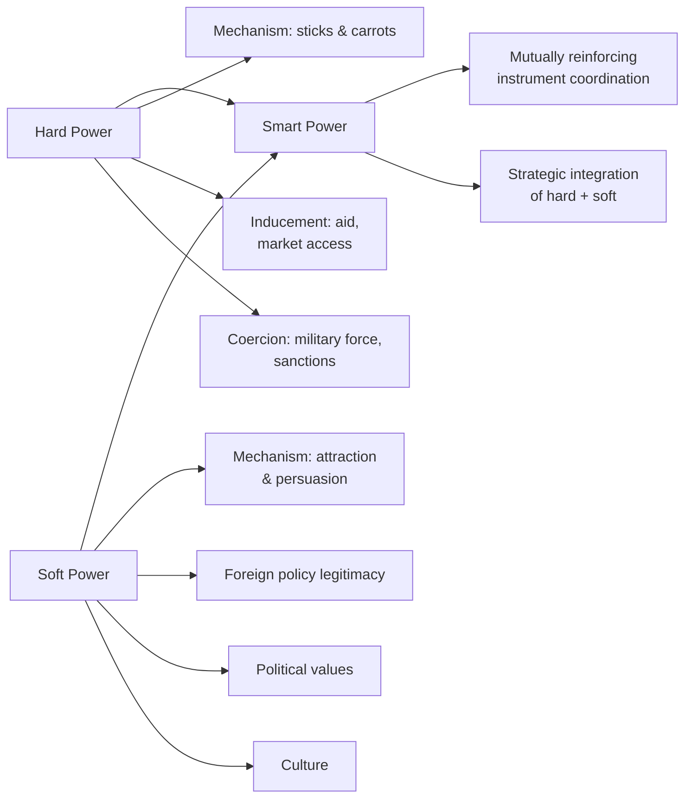

## Hard Power, Soft Power, and Smart Power

### Overview

Hard power, soft power, and smart power constitute a foundational vocabulary triad in international relations for classifying the *means* by which states (and increasingly non-state actors) exercise influence over others. Developed primarily by Joseph Nye, this typology cuts across the theoretical paradigms covered elsewhere in this syllabus (realism, liberalism, constructivism) by focusing not on why states seek power but on the different resource types and behavioral mechanisms through which power is actually converted into influence. For geopolitical risk analysts, this vocabulary is essential for characterizing *how* a given actor is likely to pursue its objectives in a specific scenario, and for assessing which forms of leverage are actually available to and effective for a given state given its particular resource endowments.

### Hard Power

**Definition and core mechanism**

Hard power is the ability to influence the behavior of others through coercion or inducement — command power exercised via military force, economic sanctions, or economic inducements (aid, market access, investment) that directly change what another actor calculates to be in its interest through threats or payments. Nye characterizes hard power as working through "sticks and carrots."

**Core instruments**

- **Military coercion**: Direct use or credible threat of armed force, including deterrence (threatening unacceptable costs to prevent an action) and compellence (threatening costs to force a change in ongoing behavior).
- **Economic coercion**: Sanctions, trade restrictions, asset freezes, and other punitive economic measures designed to impose costs sufficient to alter target behavior — substantially overlapping with the geoeconomic instruments discussed elsewhere in this syllabus.
- **Economic inducement**: Aid, preferential trade terms, investment, and other positive economic incentives offered conditionally to shape another actor's behavior.

**Measurement and limitations**

Hard power resources are comparatively straightforward to measure using conventional material indicators (military expenditure, force size and technological sophistication, GDP, trade volume), which historically made hard power the primary focus of classical and structural realist analysis. However, Nye and others emphasize that raw material capability does not automatically translate into effective influence — converting potential (resource-based) power into realized (behavioral) power depends on strategy, will, and target vulnerability, meaning hard-power *resources* and hard-power *outcomes* are analytically distinct.

### Soft Power

**Definition and core mechanism**

Soft power, a concept Nye introduced in *Bound to Lead* (1990) and elaborated fully in *Soft Power: The Means to Success in World Politics* (2004), is the ability to shape the preferences of others through attraction and persuasion rather than coercion or payment — getting others to want the outcomes you want, such that they voluntarily align with your objectives because they find your values, culture, policies, or institutions attractive or legitimate, rather than because they have been forced or paid to do so.

**Sources of soft power**

Nye identifies three primary resource categories from which soft power is generated:

- **Culture**: A country's cultural products (entertainment, education, language, popular culture) and their attractiveness or resonance to foreign publics, insofar as this attractiveness translates into a broader positive disposition toward the country of origin.
- **Political values**: The degree to which a state's political values and domestic institutions (democratic governance, rule of law, human rights protections) are perceived as legitimate and worth emulating by other societies.
- **Foreign policy**: The degree to which a state's foreign policy is perceived by others as legitimate, having moral authority, and serving broader shared interests rather than being purely narrow and self-interested — Nye emphasizes that foreign policy actions perceived as hypocritical or excessively unilateral can actively undermine soft power even when cultural or values-based resources remain strong.

**Distinguishing soft power from propaganda and public diplomacy**

Nye is explicit that soft power is not synonymous with propaganda or public diplomacy, which are tools or channels that can be used to *communicate* a state's attractiveness, but do not themselves constitute soft power. Soft power, properly understood, rests on the underlying genuine attractiveness of a state's culture, values, and policies — attempts to manufacture attraction through propaganda in the absence of genuinely attractive underlying resources tend to be ineffective or counterproductive, since target audiences can generally distinguish authentic attraction from manufactured messaging over time.

**Measurement challenges**

Soft power is inherently more difficult to measure than hard power, since it depends on subjective perceptions among foreign publics and elites that are not directly observable in the way military budgets or trade volumes are — this has led to the development of various soft power index projects (e.g., the *Soft Power 30*/*Global Soft Power Index* series produced by different organizations over time) using composite survey and expert-assessment methodologies, though such indices remain subject to significant methodological debate over weighting and comparability.

### Smart Power

**Definition and core mechanism**

Smart power, a term Nye developed further in response to critiques that the hard/soft dichotomy could be misread as suggesting soft power alone is sufficient or that the two are separable in practice, refers to the strategic combination of hard and soft power resources into an effective, mutually reinforcing overall strategy — recognizing that hard and soft power are not substitutes but are frequently complementary, and that successful strategy typically requires calibrated integration of both rather than exclusive reliance on either.

**Rationale for the concept**

Nye introduced smart power partly in response to post-9/11 U.S. foreign policy debates, in which critics argued that heavy reliance on hard power (military intervention) without adequate attention to soft power erosion (declining international legitimacy and attractiveness) produced strategically counterproductive outcomes — expensive hard-power commitments that simultaneously undermined the soft-power foundations needed for durable, legitimate influence and coalition-building.

**Smart power in practice**

Effective smart power strategy typically involves close coordination across instruments — for example, combining credible deterrent capability (hard power) with diplomatic engagement, development assistance, and cultural/educational exchange (soft power) in a way where each component reinforces rather than undermines the others; a purely coercive posture that alienates potential coalition partners, or a purely attraction-based posture unsupported by credible capability, are both identified as characteristic smart-power failure modes.

### Diagram: The Hard–Soft–Smart Power Spectrum

### Illustrative Example: Contrasting Great-Power Influence Strategies

A useful applied comparison involves contrasting how different major powers have historically emphasized different points on the hard-soft-smart spectrum in a given region:

- **Primarily hard-power-weighted approach**: A state relying substantially on security guarantees, military basing agreements, and economic coercion/inducement to secure regional influence, with comparatively less investment in cultural or values-based attraction — analytically, this approach tends to produce influence that is highly responsive to the continued credibility of material commitments but potentially fragile if those commitments are perceived to weaken, since it has not been reinforced by independent value-based legitimacy.
- **Primarily soft-power-weighted approach**: A state relying substantially on cultural exchange, educational partnerships, development assistance framed around shared values, and diplomatic engagement, with comparatively modest hard-power presence — analytically, this approach can build durable, lower-cost influence but may struggle to shape outcomes in scenarios requiring rapid, decisive leverage, and can be vulnerable to rivals employing harder-edged coercive instruments in the same space.
- **Smart-power-integrated approach**: A state combining credible security commitments with sustained cultural, educational, and development engagement, explicitly coordinated so that hard-power presence does not undermine the legitimacy on which soft-power attraction depends (e.g., ensuring basing agreements or military presence do not generate the kind of local grievance that erodes broader public goodwill) — this is the strategy Nye's smart power framework explicitly recommends, though achieving genuine coordination in practice (rather than merely possessing both types of resources) is analytically the harder and more variable achievement.

This comparative framing is commonly used in geopolitical risk analysis to characterize and forecast how different great powers are likely to compete for influence in contested regions (e.g., comparative analysis of U.S., Chinese, and Russian influence strategies in specific regional contexts), since the *mix* of instruments a state relies on has direct implications for the durability, cost structure, and escalation risk of its influence-seeking behavior.

### Relationship to IR Theoretical Paradigms

- **Realism**: Hard power maps closely onto the material capability focus central to classical and structural realism; realists are generally more skeptical of soft power's independent causal weight, tending to treat attraction and legitimacy as, at most, secondary to underlying material capability.
- **Liberal institutionalism**: Soft power's emphasis on legitimacy and attraction overlaps with liberal institutionalism's attention to how institutional legitimacy facilitates cooperation, though soft power as a concept is broader than institutional analysis alone, encompassing culture and values.
- **Constructivism**: Soft power has the closest affinity with constructivism, since both frameworks treat perceptions, legitimacy, and identity as independently consequential rather than epiphenomenal to material power — though Nye's framework is generally considered less theoretically developed than formal constructivist scholarship regarding the precise mechanisms by which attraction translates into behavioral influence.

### Critiques of the Framework

- **Conceptual looseness**: Critics argue the hard/soft distinction, while intuitively useful, can be conceptually imprecise at the margins — economic inducement, for instance, involves elements of both material payoff (hard-power-like) and could be argued to also depend partly on the inducing state's perceived legitimacy (soft-power-adjacent), complicating clean categorization in some cases.
- **Measurement and causal attribution difficulty**: Because soft power's effects are mediated through subjective foreign perceptions that are difficult to isolate from other causal factors, empirically demonstrating that soft power *causes* specific behavioral outcomes (rather than merely correlating with favorable relations for other reasons) remains methodologically challenging.
- **Smart power as a slogan rather than a rigorous theory**: Some scholars argue "smart power" functions more as a policy-advocacy framing device (encouraging balanced strategy) than as a rigorous, independently falsifiable theoretical contribution beyond the underlying hard/soft power distinction itself. [Inference: the extent to which smart power constitutes a genuinely novel analytical category versus primarily a normative policy prescription built on the earlier hard/soft distinction is a matter of scholarly interpretation rather than settled consensus.]
- **State-centrism**: The original formulation focuses primarily on state actors; contemporary applications increasingly extend the framework to non-state actors (multinational corporations, transnational advocacy networks, even non-state armed groups) with varying degrees of conceptual fit.

### Comparison Table: Hard, Soft, and Smart Power

| Dimension | Hard Power | Soft Power | Smart Power |
| --- | --- | --- | --- |
| Mechanism | Coercion / inducement | Attraction / persuasion | Strategic integration of both |
| Core resources | Military, economic capability | Culture, values, policy legitimacy | Combined hard + soft resource base |
| Measurability | Relatively direct (material indicators) | Difficult (perception-dependent) | Composite, context-dependent |
| Nye's framing | "Sticks and carrots" | "Getting others to want what you want" | Balanced, mutually reinforcing strategy |
| Characteristic risk | Costly, can generate resentment/balancing | Can be slow, insufficient for urgent leverage | Requires coordination; failure if hard power undermines soft power legitimacy |

### Applications in Geopolitical Risk Analysis

- **Influence-strategy characterization**: Used to classify and compare how different state and non-state actors are pursuing regional or global influence, informing forecasts about the durability and escalation potential of that influence.
- **Vulnerability assessment**: Soft power erosion (declining perceived legitimacy, reputational damage from policy actions) is tracked as a leading indicator of weakening non-coercive influence, which can in turn increase reliance on costlier or more escalatory hard-power instruments.
- **Coalition-building capacity assessment**: A state's soft-power resources are relevant to assessing its capacity to build and sustain voluntary coalitions and alliances (linking back to balance-of-threat and liberal institutionalist analysis), as opposed to relying solely on coercive or transactional inducements.
- **Comparative great-power competition analysis**: The hard/soft/smart power framework provides accessible, widely used vocabulary for structuring comparative assessments of great-power competition for influence in contested regions, frequently used alongside geoeconomic and power transition frameworks in composite risk products.

**Related Topics**

- Nye, *Soft Power: The Means to Success in World Politics* — full framework
- Public diplomacy as a soft power instrument (distinguished from soft power itself)
- Sharp power as a related but distinct concept (covert or coercive information influence)
- Soft power index methodologies and their limitations
- Deterrence and compellence theory as hard-power subcategories
- Cultural diplomacy and educational exchange programs as case studies
- Reputation and legitimacy erosion as risk indicators
- Comparative great-power influence strategy analysis (U.S., China, Russia case studies)
- Economic statecraft as a hard/soft power hybrid category
- Non-state actor soft power (corporations, NGOs, transnational networks)