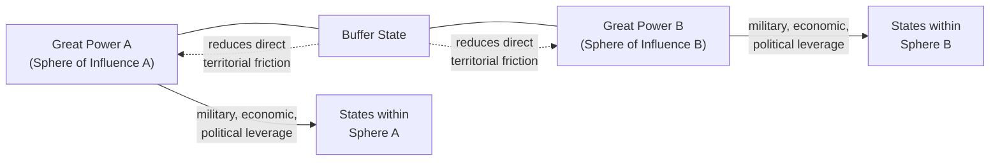

## Spheres of Influence and Buffer States

### Overview

Spheres of influence and buffer states are foundational spatial-political concepts describing how great powers organize and contest control over territory and lesser states surrounding their core areas of power, particularly at the margins between competing great-power zones. A sphere of influence denotes a geographic area within which a dominant power exercises significant, though typically informal and non-territorial, control over the political, economic, or security decisions of weaker states, while a buffer state denotes a smaller, often weaker state positioned geographically between two or more great powers whose continued independent (or neutral) existence serves to reduce direct friction between the surrounding great powers. Both concepts remain central to contemporary geopolitical risk analysis, particularly in assessing great-power sensitivity to external actors' actions in contested border regions.

### Spheres of Influence

**Definition and core characteristics**

A sphere of influence is a geographic zone in which one great power claims, and is generally recognized by rival powers (whether explicitly through agreement or tacitly through restraint) to hold, a privileged degree of political, economic, or strategic influence over the states or territories within it, without necessarily exercising formal sovereignty or direct colonial control over that territory. The concept is distinguished from outright annexation or colonization by its typically informal character — the dominant power shapes outcomes through leverage, influence, and implicit or explicit deterrence of rival interference, rather than through direct administrative control.

**Historical formalization examples**

- **The Monroe Doctrine** (1823) is a canonical early articulation of a formally declared sphere of influence, with the United States asserting that European powers should refrain from further colonization or intervention in the Western Hemisphere, implicitly establishing the Americas as a U.S. sphere of primary interest.
- **The Berlin Conference** (1884-85) formalized European spheres of influence across Africa during the colonial "Scramble for Africa," establishing recognized zones of exclusive European claim-making even before formal territorial administration was established in many areas.
- **The Yalta and Potsdam arrangements** (1945) are frequently characterized, particularly by realist analysts, as having established de facto Soviet and Western spheres of influence across post-war Europe, with Eastern Europe falling under Soviet dominance and Western Europe under U.S.-aligned influence — though the degree to which this was an explicit negotiated agreement versus an emergent outcome of relative military positions at war's end remains a subject of historical debate.

**Mechanisms of sphere-of-influence maintenance**

- **Military presence and basing**: Forward-deployed forces, defense agreements, and security guarantees that create dependency relationships and deterrence against external interference.
- **Economic leverage**: Trade dependency, investment relationships, and development assistance that create structural economic reliance on the dominant power — closely overlapping with geoeconomic instruments discussed elsewhere in this syllabus.
- **Political and diplomatic influence**: Support for aligned political factions, diplomatic backing in international forums, and, in more coercive variants, interference in the internal political processes of states within the sphere.
- **Tacit rival restraint**: A sphere of influence's persistence typically depends not only on the dominant power's active maintenance efforts but also on rival great powers' calculated restraint from directly contesting it, whether due to the costs of confrontation, reciprocal recognition of the rival's own spheres, or the buffer/deterrent value of leaving the arrangement undisturbed.

### Buffer States

**Definition and core function**

A buffer state is a smaller or weaker state situated geographically between two or more larger, potentially rival powers, whose continued existence as an independent or neutral entity is valued (by the surrounding great powers, the buffer state itself, or both) because it reduces the likelihood of direct territorial contact and friction between the rival powers, thereby lowering the probability of great-power conflict arising from border proximity alone.

**Theoretical rationale**

The buffer state concept connects directly to realist security-dilemma logic: direct territorial contact between two great powers' spheres of control increases mutual threat perception and the frequency of friction-generating incidents (border disputes, competing claims over local populations, forward military deployments in immediate proximity to the rival). A buffer state, by occupying the intervening space, creates geographic distance that can reduce (though not eliminate) these friction-generating dynamics — provided the buffer state's own alignment does not itself become a contested prize that generates the very great-power friction the buffer was meant to prevent.

**Historical and contemporary examples**

- **Belgium** was formally established and internationally guaranteed as a neutral buffer state in 1839 specifically to prevent direct great-power friction between France and the German states/Prussia in a strategically sensitive area of Western Europe — a status whose violation by Germany in 1914 (as part of the Schlieffen Plan) directly triggered British entry into World War I, illustrating both the intended stabilizing function of buffer status and the acute crisis potential when that status is violated.
- **Afghanistan** functioned as a buffer state between the British and Russian empires during the 19th-century "Great Game," with both empires generally preferring Afghan independence (under substantial great-power influence) over direct territorial contact between British India and Russian Central Asian possessions.
- **Mongolia**, positioned between Russia/the Soviet Union and China, has frequently been analyzed as a buffer state whose continued independent existence has been valued by both larger neighbors as preferable to direct territorial contact or contested control.
- **Contemporary contested buffer cases**: States such as Ukraine (between Russia and the Euro-Atlantic security architecture) and various Central Asian and Caucasus states (between Russia, China, and other regional powers) are frequently analyzed using buffer-state frameworks, particularly regarding the risk that contested efforts to shift a buffer state's alignment (rather than preserve its neutral/intermediate status) can itself become the proximate trigger for great-power friction the buffer arrangement was originally meant to prevent.

### Diagram: Sphere of Influence and Buffer State Configuration

### Illustrative Example: Contested Buffer Status and Alignment Risk

A recurring analytical pattern involves a buffer state whose traditionally intermediate or neutral status comes under pressure as it moves (or is perceived by a neighboring great power to be moving) toward closer alignment with a rival power's institutional or security architecture:

1. **Baseline buffer function**: A state positioned between two great-power spheres provides mutual distance-based friction reduction as long as its alignment remains genuinely intermediate or the surrounding powers accept a degree of ambiguity in its orientation.
2. **Alignment-shift risk**: When the buffer state's government pursues, or is perceived to be pursuing, integration into one great power's institutional, economic, or security architecture (trade agreements, security partnerships, alliance membership pathways), the great power on the other side frequently interprets this as an erosion of the buffer's stabilizing function and a direct encroachment of the rival's sphere of influence toward its own borders or core security zone.
3. **Realist and power-transition interpretation**: This dynamic is frequently analyzed (see also the NATO expansion example discussed under structural neorealism) as a structurally predictable source of friction, since a shift in a buffer state's alignment directly alters the effective boundary of a great power's sphere of influence without necessarily requiring any change in that great power's own material capabilities — making buffer-state alignment shifts a distinctively sensitive category of geopolitical risk indicator, often generating a disproportionate great-power response relative to the buffer state's own material size or capability.
4. **Buffer state's own agency**: Critically, analysis should not treat the buffer state purely as a passive object of great-power competition — the buffer state's own government and population typically have independent preferences regarding alignment, sovereignty, and security guarantees, and frameworks that treat buffer states solely as strategic space between great powers risk underweighting the buffer state's own agency and legitimate security interests as a contributing causal factor in the scenario. [Inference: the appropriate analytical weight to give a buffer state's own agency versus surrounding great-power structural pressure in any specific contemporary case is a matter of scenario-specific judgment and remains actively contested among analysts, rather than resolved by the buffer-state concept itself.]

### Relationship to IR Theoretical Paradigms

- **Realism/neorealism**: Spheres of influence and buffer states map closely onto realist balance-of-power and security-dilemma logic — buffer states reduce friction by increasing geographic distance between rival power projections, while spheres of influence represent an informal mechanism through which great powers manage relative power and security without requiring direct territorial annexation.
- **Power transition theory**: A rising power's efforts to establish or expand a sphere of influence, or to shift a buffer state's alignment in its favor, can be read as a specific behavioral manifestation of the broader capability-convergence dynamics discussed under power transition theory, particularly when such efforts are interpreted by the established power as evidence of dissatisfaction with the existing regional order.
- **Constructivism**: Constructivist analysis would examine how the legitimacy of a given sphere of influence claim, or a buffer state's own identity and alignment preferences, is discursively constructed and contested — for instance, whether a great power's sphere-of-influence claim is framed (and accepted or rejected by relevant audiences) as a legitimate sphere of "special interest" versus an illegitimate infringement on smaller states' sovereign equality.
- **Liberal institutionalism**: Institutional integration (trade blocs, security alliances, multilateral organizations) is one of the primary mechanisms through which a buffer state's alignment can shift, connecting this topic directly to liberal institutionalist analysis of how institutional membership reshapes state interests and constrains future policy options.

### Critiques and Analytical Complications

- **Normative tension with sovereign equality**: The sphere-of-influence concept sits in direct tension with the principle of sovereign equality and self-determination central to the post-1945 international legal order, since it implies smaller states' policy autonomy is legitimately constrained by proximity to a great power — a tension frequently at the center of contemporary disputes over whether sphere-of-influence claims by great powers should be treated by other actors as a legitimate basis for restraint or as an illegitimate infringement to be resisted.
- **Buffer status is not self-enforcing**: A buffer state's stabilizing function depends on continued great-power acceptance of its intermediate status; the concept does not by itself guarantee stability, and historically, contested buffer states have been frequent sites of great-power proxy competition and, in some cases (Belgium in 1914, various Cold War-era contested states), direct trigger points for broader conflict rather than reliable conflict-preventers.
- **Analytical risk of great-power-centric framing**: Critics, particularly from constructivist and postcolonial-influenced perspectives (with direct overlap to the critical geopolitics material covered earlier in this syllabus), argue that sphere-of-influence and buffer-state frameworks can implicitly reproduce a great-power-centric analytical lens that treats smaller states primarily as strategic space or objects of competition, understating their agency, internal politics, and legitimate independent interests.
- **Ambiguity in contemporary application**: Unlike the more formally demarcated 19th- and early-20th-century cases, contemporary spheres of influence are rarely explicitly codified, making their boundaries and the degree of restraint rival powers are actually willing to observe considerably more ambiguous and contested in real-time crisis analysis than in retrospective historical case studies.

### Comparison Table: Spheres of Influence vs. Buffer States

| Dimension | Sphere of Influence | Buffer State |
| --- | --- | --- |
| Core function | Extends a dominant power's control/leverage outward | Reduces direct friction between rival powers |
| Typical status of affected states | States within the sphere have constrained autonomy | The buffer state itself may retain nominal independence/neutrality |
| Primary risk indicator | Contestation or encroachment by a rival power | Alignment shift toward one great power's sphere |
| Formalization | Varies from explicit (Monroe Doctrine) to tacit (Cold War Eastern Europe) | Sometimes formally guaranteed (Belgium 1839), sometimes informal |
| Relation to great-power friction | Can be a source of friction when contested | Intended to reduce friction; can become a friction trigger if status is violated |

### Applications in Geopolitical Risk Analysis

- **Flashpoint identification**: Buffer states and contested sphere-of-influence peripheries are systematically flagged as elevated-risk zones for great-power friction, since alignment shifts in these areas carry disproportionate signaling weight relative to the buffer state's own material capability.
- **Early-warning indicator development**: Tracking shifts in a buffer state's trade orientation, security partnerships, and institutional integration pathways as leading indicators of potential great-power response, informed by the historical pattern that such shifts are frequently interpreted by the affected great power as sphere-of-influence encroachment regardless of the buffer state's own stated intent.
- **Sphere-of-influence claim assessment**: Used to evaluate the credibility and likely persistence of a great power's informal claims over a given region, including assessment of whether rival powers are likely to continue tacit restraint or to actively contest the claim.
- **Escalation-pathway analysis**: The historical pattern of buffer-state status violations serving as proximate conflict triggers (Belgium 1914) informs scenario planning around how a contested buffer state's crisis could escalate into direct great-power confrontation, distinct from the underlying structural risk factors alone.

**Related Topics**

- Monroe Doctrine as a formally declared sphere of influence
- Yalta/Potsdam spheres of influence debate in Cold War historiography
- Belgian neutrality (1839) and its violation in 1914 as a buffer-state case study
- The "Great Game" and Afghanistan's historical buffer function
- Contemporary contested buffer states (Ukraine, Caucasus, Central Asia) as applied cases
- Security dilemma theory and its relationship to buffer-state stabilization
- Sovereign equality and self-determination as normative counterpoints to sphere-of-influence claims
- Proxy conflict dynamics in contested buffer and sphere-of-influence zones
- Critical geopolitics critique of great-power-centric spatial frameworks
- NATO expansion debates as a contemporary sphere-of-influence/buffer-state case