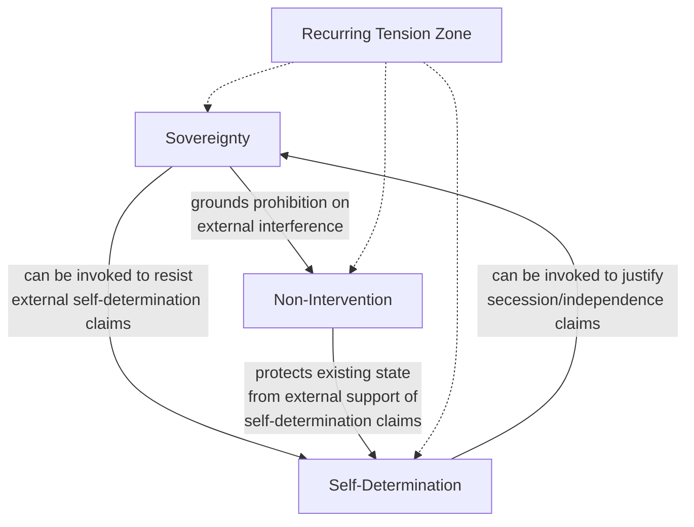

## Sovereignty, Self-Determination, and Non-Intervention

### Overview

Sovereignty, self-determination, and non-intervention constitute the foundational legal-political vocabulary of the modern state system, defining the basic entitlements and constraints that structure how states relate to one another and to the populations and territories they govern. Sovereignty establishes a state's supreme, exclusive authority within its territory and its formal equality with other states in the international system; self-determination establishes peoples' claimed right to determine their own political status and government; and non-intervention establishes the corresponding prohibition on external interference in a state's internal affairs. These three concepts are analytically and historically interdependent, and their frequent tensions — particularly between sovereignty/non-intervention and self-determination, and between sovereignty and emerging humanitarian intervention norms — are a recurring source of contested legitimacy in contemporary geopolitical crises.

### Sovereignty

**Definition and core attributes**

Sovereignty, in its classical Westphalian formulation, denotes a state's supreme and exclusive authority over its territory and population, free from external interference, combined with formal juridical equality among all sovereign states regardless of material power disparities. Sovereignty is conventionally analyzed as encompassing several distinct but related dimensions:

- **Internal sovereignty**: Supreme authority over domestic governance, law, and population within the state's territory, without a higher internal authority to which the state is subordinate.
- **External sovereignty**: Independence from external control and formal equality of legal status with other sovereign states in the international system, regardless of relative material power.
- **Territorial sovereignty**: Exclusive authority over a defined territory, including control over borders and the resources and population within them.
- **Westphalian sovereignty**: The specific historical norm, conventionally traced to the Peace of Westphalia (1648), of non-interference by external authorities (including religious authorities) in a state's internal governance arrangements — frequently cited as foundational to the modern state system, though historians note the "Westphalian" label is in some respects a later analytical construction rather than a term contemporaries themselves used systematically. [Inference: the degree to which 1648 represents a genuine historical turning point versus a retrospectively constructed origin myth for the sovereign state system is itself debated among historians and IR theorists, so this attribution should be treated as a widely used analytical convention rather than an uncontested historical fact.]

**Sovereignty as a graduated, not absolute, concept**

Contemporary IR and international law scholarship increasingly treats sovereignty as a bundle of distinguishable attributes that can be partially pooled, delegated, or constrained (e.g., through treaty commitments, international organization membership, or military occupation) without a state necessarily losing sovereign status altogether — Stephen Krasner's influential formulation identifies at least four analytically distinct types of sovereignty (domestic, interdependence, international legal, and Westphalian), noting that these dimensions can vary independently, such that a state may possess strong international legal sovereignty (formal recognition) while experiencing substantially compromised domestic or Westphalian sovereignty in practice.

### Self-Determination

**Definition and normative development**

Self-determination is the principle that peoples have the right to freely determine their own political status and pursue their economic, social, and cultural development, without external imposition — most commonly invoked in the context of colonial independence movements, secessionist claims, and, in the internal self-determination formulation, a population's right to meaningful participation in its own governance short of full independence.

**Historical development**

- **Woodrow Wilson**'s articulation of self-determination as a principle for post-World War I territorial and political reorganization (alongside parallel Bolshevik advocacy for national self-determination as an anti-imperial principle) marked its emergence as a significant, though initially unevenly applied, international norm.
- **UN Charter and decolonization era codification**: Self-determination was substantially codified as a formal international legal principle through the UN Charter's reference to "equal rights and self-determination of peoples," and subsequently elaborated through key instruments including UN General Assembly Resolution 1514 (1960, the Declaration on the Granting of Independence to Colonial Countries and Peoples) and its incorporation into the International Covenant on Civil and Political Rights and International Covenant on Economic, Social and Cultural Rights (both 1966), which open with an identical common Article 1 affirming that all peoples have the right of self-determination.

**External vs. internal self-determination**

International law and practice have developed a widely referenced (though not universally agreed) distinction:

- **External self-determination**: The right of a "people" (most clearly established in the colonial context) to independence and separate statehood.
- **Internal self-determination**: A population's right to meaningful political participation, autonomy, and representation within an existing state, without necessarily entailing a right to secession — the dominant contemporary legal interpretation generally treats internal self-determination (rather than a general right to secede) as the default entitlement for most sub-state groups, with external self-determination/secession treated as legally exceptional rather than a general right available to any self-identified "people."

**Remedial secession theory**

A significant, though contested, strand of international legal and political theory argues a right to external self-determination (secession) may arise as a remedial measure in cases of sustained, severe oppression or denial of internal self-determination by the parent state — this "remedial secession" theory remains legally unsettled and inconsistently applied in state practice, with recognition of specific secessionist claims continuing to depend heavily on political considerations among recognizing states rather than on a clearly codified, consistently applied legal test.

### Non-Intervention

**Definition and core prohibition**

The principle of non-intervention prohibits states (and, in an extended contemporary sense, international organizations) from coercively interfering in matters that fall within another state's domestic jurisdiction, particularly regarding its choice of political, economic, and social systems and its internal governance arrangements. Non-intervention is closely linked to, and substantially derives from, the broader sovereignty principle, and is formally codified in the UN Charter's prohibition on the threat or use of force against the territorial integrity or political independence of any state, alongside customary international law elaborated through instruments such as the UN General Assembly's 1965 Declaration on the Inadmissibility of Intervention.

**Contested boundary with legitimate international concern**

A central and recurring analytical difficulty concerns where the boundary lies between prohibited "intervention" in domestic affairs and legitimate international engagement, criticism, or conditionality (e.g., human rights monitoring, election observation, conditional development assistance) — international law and practice generally treat coercive interference (military force, coercive economic measures aimed at compelling specific internal political outcomes) as intervention proper, while non-coercive engagement (diplomatic criticism, voluntary conditionality, participation in international human rights mechanisms) is generally not treated as a violation of non-intervention, though this distinction is frequently contested in specific applied cases.

### Diagram: The Sovereignty–Self-Determination–Non-Intervention Triangle

### Illustrative Example: The Sovereignty/Self-Determination Tension in Secessionist Disputes

A recurring structural tension arises when a sub-state group within an existing sovereign state asserts a claim to external self-determination (independence), directly implicating all three concepts simultaneously:

1. **Parent state's sovereignty claim**: The existing sovereign state typically invokes territorial sovereignty and the principle of territorial integrity to reject the legitimacy of the secessionist claim, often supported by non-intervention arguments against external states providing political, material, or diplomatic support to the secessionist movement.
2. **Secessionist movement's self-determination claim**: The secessionist movement typically invokes self-determination, often combined with remedial secession arguments if it can point to sustained denial of internal self-determination or severe rights violations by the parent state, to argue for a legitimate right to independent statehood.
3. **Third-party state responses**: External states' decisions on whether to recognize a secessionist claim, provide support, or defer to the parent state's territorial integrity are shaped by a combination of legal assessment, but also — frequently more decisively in practice — by each recognizing state's own political interests, alliance relationships, and precedent-setting concerns regarding its own or its partners' internal secessionist movements, producing well-documented patterns of inconsistent international recognition practice across broadly comparable cases.
4. **Absence of a bright-line legal test**: Because international law has not developed a clearly codified, consistently applied test for when self-determination claims override territorial integrity and non-intervention norms, these disputes are characteristically resolved (or left unresolved) through a combination of contested legal argument, political calculation by third-party states, and, frequently, the underlying balance of material power and control on the ground rather than through a clean, predictable legal adjudication process. [Inference: this characterization reflects a widely shared assessment among international law scholars regarding the practical inconsistency of recognition practice, but the appropriate weighting between legal principle and political calculation in any specific case remains genuinely contested and is not itself a settled empirical finding.]

### Relationship to IR Theoretical Paradigms

- **Realism**: Realists generally treat sovereignty norms and non-intervention as reflecting underlying state power relations rather than as independently binding constraints — a great power's willingness to respect another state's sovereignty and non-intervention entitlements is analyzed as substantially conditional on its own interests and the costs of violation, rather than as a fixed normative commitment.
- **Liberal institutionalism**: Emphasizes how international legal institutions and multilateral frameworks (UN Charter provisions, regional organizations) provide structured mechanisms for managing sovereignty and self-determination disputes, and can create genuine, if imperfect, constraints on unilateral intervention through reputational and institutional costs.
- **Constructivism**: Provides the most direct theoretical purchase on this topic, since sovereignty, self-determination, and non-intervention are themselves norms whose meaning and scope of application have changed substantially over time through contestation and reinterpretation (e.g., the historical narrowing of legitimate self-determination claims from a broad post-colonial principle toward the internal/external distinction, or the contested emergence and subsequent contraction of humanitarian intervention and "Responsibility to Protect" norms as potential qualifications on strict non-intervention).
- **Critical geopolitics and postcolonial critique**: Directly relevant to this topic's historical application, since critical geopolitics scholarship has extensively examined how sovereignty and self-determination principles were selectively and unevenly applied during and after decolonization, often in ways that served the strategic interests of intervening or recognizing great powers rather than reflecting a neutral, consistently applied legal principle.

### Critiques and Contemporary Tensions

- **Selective application critique**: A recurring critique, with particular salience in postcolonial and critical scholarship, is that sovereignty, self-determination, and non-intervention norms have historically been applied selectively and inconsistently, with recognition and enforcement patterns substantially tracking great-power interests rather than reflecting a neutral, rule-based application of consistent legal principles.
- **Humanitarian intervention and Responsibility to Protect (R2P) tension**: The emergence of R2P as a normative (though contested and inconsistently applied) qualification on strict non-intervention — holding that the international community bears some responsibility to act when a state is unable or unwilling to protect its population from mass atrocities — represents a significant, still-unsettled tension with traditional non-intervention and sovereignty norms, with state practice remaining highly inconsistent regarding when (if ever) R2P is invoked to justify intervention.
- **Sovereignty erosion through economic and institutional interdependence**: Liberal institutionalist and geoeconomic analysis (see related chapter content) notes that deep economic interdependence, international institutional membership, and conditional development finance can substantially constrain a state's effective policy autonomy even while its formal (Westphalian, international legal) sovereignty remains intact — raising analytically important questions about the gap between formal sovereign status and substantive policy autonomy.
- **Self-determination's indeterminate scope**: Critics note that international law has never satisfactorily defined which groups qualify as a "people" entitled to self-determination, leaving substantial indeterminacy that is resolved in practice through political contestation and inconsistent third-party recognition rather than clear legal criteria.

### Comparison Table: Core Concepts at a Glance

| Concept | Core Claim | Primary Beneficiary | Key Tension |
| --- | --- | --- | --- |
| Sovereignty | Supreme, exclusive state authority within territory | The existing state | Can conflict with self-determination and humanitarian norms |
| Self-determination | Peoples' right to determine their own political status | Peoples/sub-state groups (contested category) | Can conflict with parent-state territorial integrity |
| Non-intervention | Prohibition on coercive interference in domestic affairs | The existing state | Can conflict with humanitarian intervention/R2P norms |

### Applications in Geopolitical Risk Analysis

- **Secessionist and territorial dispute risk assessment**: Used to structure analysis of the competing legal and political claims in active or potential secessionist disputes, and to assess the likelihood and pattern of third-party state recognition or support.
- **Intervention risk and legitimacy assessment**: Used to assess the legal and normative legitimacy claims likely to be invoked around potential intervention scenarios, and to anticipate which framings (sovereignty/non-intervention versus self-determination/R2P) different states and international actors are likely to deploy.
- **Sovereignty erosion monitoring**: Used alongside geoeconomic and institutional analysis to assess the gap between a state's formal sovereign status and its substantive policy autonomy, particularly relevant for states with heavy external financial dependency or extensive institutional conditionality commitments.
- **Recognition pattern forecasting**: Historical patterns of selective and politically contingent recognition practice inform probabilistic assessment of how third-party states are likely to respond to a given contemporary self-determination or intervention scenario, based substantially on those states' own interests and precedent concerns rather than on the legal merits alone.

**Related Topics**

- Peace of Westphalia (1648) and the origins of the sovereign state system
- Krasner's four dimensions of sovereignty in detail
- UN General Assembly Resolution 1514 and decolonization-era self-determination
- Internal vs. external self-determination and remedial secession theory
- Responsibility to Protect (R2P) and its contested application history
- Comparative secessionist recognition case studies (inconsistent state practice)
- UN Charter provisions on the use of force and non-intervention
- Sovereignty erosion through international financial institution conditionality
- Postcolonial critique of selective sovereignty/self-determination application
- Territorial integrity norm as a counterweight to self-determination claims