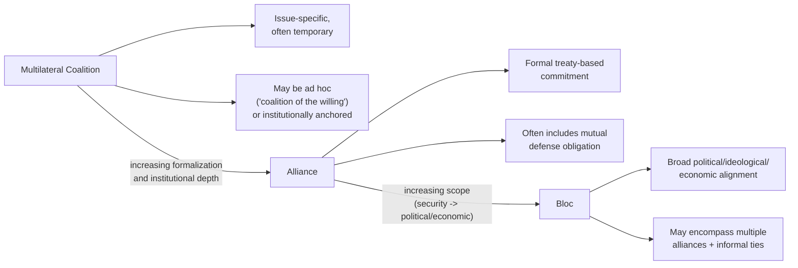

## Alliances, Blocs, and Multilateral Coalitions

### Overview

Alliances, blocs, and multilateral coalitions constitute the core vocabulary for analyzing how states aggregate power and coordinate policy through formal and informal groupings, rather than acting in strict isolation. An alliance is typically a formal, often treaty-based commitment between two or more states to cooperate on security matters, frequently including mutual defense obligations; a bloc is a broader, often more loosely structured grouping of states sharing an aligned political, ideological, or economic orientation, not always codified in a single binding treaty; and a multilateral coalition typically denotes a more flexible, often issue-specific or temporary grouping formed to address a particular problem or crisis, which may or may not involve formal institutionalization. For geopolitical risk analysts, precisely distinguishing among these categories — and assessing their relative cohesion, formal commitment strength, and durability — is essential for forecasting how collective action among states is likely to unfold in a given crisis.

### Alliances

**Definition and core features**

An alliance is a formal agreement, typically codified in a treaty, between two or more states committing to cooperate on security matters, most centrally including some form of mutual defense or mutual assistance obligation in the event one member is attacked. Alliances are the most institutionally formal category in this vocabulary triad, generally involving explicit, legally binding commitments rather than the looser alignment characteristic of blocs.

**Types of alliance commitment**

- **Defensive alliances**: Commit members to mutual assistance if a member is attacked by an external party — the most common contemporary alliance form, exemplified by NATO's Article 5 collective defense commitment.
- **Offensive alliances**: Commit members to joint action in pursuit of shared expansionary or revisionist objectives, historically more common but comparatively rarer as an explicitly codified contemporary alliance type.
- **Non-aggression pacts**: A more limited commitment in which parties agree not to attack one another, without necessarily including mutual defense obligations against third parties — historically significant examples (e.g., the 1939 Molotov-Ribbentrop Pact) illustrate that non-aggression pacts can function as temporary strategic arrangements rather than durable alignments.
- **Ententes**: A looser form of understanding or coordination between states, involving mutual consultation and often informal expectation of support, without the binding legal commitment characteristic of formal defense treaties — historically exemplified by the pre-World War I Triple Entente.

**Alliance reliability and credibility**

A central analytical concern in alliance theory is the gap between an alliance's formal, written commitments and the actual credibility of those commitments being honored in a real crisis — factors bearing on credibility include the alliance's institutionalized command and planning integration (joint exercises, integrated command structures, forward-deployed forces), the domestic political costs a member would face for abandoning a treaty partner, and the broader reputational costs of alliance abandonment for a state's credibility with its other security partners. This credibility gap is a persistent focus of geopolitical risk analysis, since an alliance's formal existence does not by itself guarantee the behavioral outcome (actual military support) the alliance is nominally designed to produce.

**Alliance formation logic across paradigms**

- **Balance-of-power/balance-of-threat realism**: Predicts alliances form primarily as external balancing responses to a perceived threatening concentration of power (Waltz) or specifically to perceived threat combining power, proximity, offensive capability, and intent (Walt).
- **Bandwagoning**: An alternative realist-compatible prediction in which weaker states, rather than balancing against a threatening power, instead align with (bandwagon alongside) the threatening power, typically to share in the spoils of its expansion or to avoid becoming its target — theorized to be comparatively less common than balancing among great powers but more plausible among weaker states with limited independent balancing capacity.

### Blocs

**Definition and core features**

A bloc is a broader, often more diffusely structured grouping of states sharing an aligned political, ideological, economic, or strategic orientation, which may or may not be anchored in a single formal treaty and may encompass multiple overlapping formal alliances, economic arrangements, and informal alignment patterns simultaneously. Blocs are typically distinguished from alliances by their broader scope (often encompassing political and economic as well as security dimensions) and their less uniformly codified institutional structure.

**Historical and contemporary examples**

- **Cold War blocs**: The Western/NATO bloc and the Soviet/Warsaw Pact bloc are the canonical historical example, each encompassing formal military alliance structures (NATO, the Warsaw Pact) alongside broader political, economic (e.g., Comecon for the Soviet bloc), and ideological alignment that extended well beyond the specific terms of the underlying defense treaties.
- **Contemporary bloc framings**: Analysts frequently discuss the possible emergence of a more loosely structured "Western" bloc/bloc of democracies versus a China-Russia-aligned bloc (sometimes analyzed alongside the "Non-Aligned"/Global South framing, discussed below) in contemporary great-power competition, though the degree to which this framing accurately captures the considerably more fluid, cross-cutting, and issue-specific alignment patterns of the contemporary multipolar-trending system remains actively debated among analysts, since many states maintain substantial simultaneous economic and diplomatic ties across notionally opposed blocs in a way that complicates a clean bipolar bloc framing. [Inference: whether contemporary international politics is trending toward genuinely bloc-like bipolar alignment or toward a more fluid, cross-cutting multipolar pattern of issue-specific alignment is a live empirical and interpretive question among analysts, not a settled characterization.]

**Non-Aligned Movement as a counter-bloc case**

The Non-Aligned Movement, formally established in 1961 (building on the 1955 Bandung Conference), represents a historically significant case of states explicitly organizing to resist bloc alignment during the Cold War, asserting an independent foreign policy orientation rather than formal alignment with either the Western or Soviet bloc — providing an important conceptual counterpoint illustrating that bloc non-alignment can itself become an organized, if loosely structured, collective posture.

### Multilateral Coalitions

**Definition and core features**

A multilateral coalition is typically a more flexible, often issue-specific or temporally bounded grouping of states formed to address a particular problem, crisis, or shared objective, which may draw on standing institutional frameworks (UN-authorized coalitions, regional organization frameworks) or may be assembled ad hoc outside formal existing institutional structures ("coalitions of the willing").

**Coalitions of the willing**

This term describes ad hoc coalitions assembled for a specific purpose (often military intervention) outside the framework of a formal standing alliance or a binding UN Security Council authorization, relying instead on the voluntary participation of states willing to contribute to the specific effort — such coalitions offer flexibility and can be assembled more rapidly than reforming or expanding a standing alliance's mandate, but typically lack the durable institutional infrastructure (integrated command structures, established burden-sharing arrangements, long-term interoperability investment) of formal standing alliances, which can affect operational coherence and longer-term sustainability.

**Multilateral institutional coalitions**

Distinguished from ad hoc coalitions of the willing, some multilateral coalitions operate through established institutional frameworks (UN peacekeeping/peace-enforcement mandates, regional organization frameworks such as the African Union or ASEAN) that provide a standing procedural and legal basis for coalition formation, generally offering greater legitimacy (particularly where UN Security Council authorization is obtained) at the potential cost of the greater negotiation complexity and possible veto constraints inherent in formal multilateral decision-making processes.

### Diagram: Alliance–Bloc–Coalition Spectrum

### Illustrative Example: Comparing Collective Response Options in a Regional Crisis

Consider a hypothetical regional security crisis in which multiple states with varying degrees of formal commitment to one another must decide how to respond:

1. **Formal alliance members**: States bound by a mutual defense treaty face the clearest (though not necessarily automatic) expectation of collective response, but the analyst must still assess credibility factors — the domestic political will to honor the commitment, the alliance's actual military integration and readiness for the specific contingency, and whether the triggering circumstances clearly fall within the treaty's defined scope (since many defense treaties are narrower than popular characterizations suggest, often requiring specific triggering conditions such as an attack on a member's own territory rather than a broader security concern).
2. **Bloc-aligned but non-treaty states**: States sharing broader political or ideological alignment with the affected party, but lacking a formal defense treaty commitment, face a substantially more discretionary decision — analysts would examine bloc cohesion indicators (shared economic dependency, ideological alignment strength, historical pattern of coordinated action) to assess the likelihood of political, economic, or non-combat material support, while recognizing that bloc alignment alone does not predict military intervention with anything like the reliability of a formal alliance commitment.
3. **Potential coalition partners outside existing structures**: States with no formal alliance or bloc alignment to either party might still join an ad hoc coalition of the willing if the crisis engages sufficiently salient shared interests or normative concerns (e.g., a clear violation of core sovereignty/non-intervention norms, discussed in the preceding topic), but coalition formation in this category is analytically the least predictable, depending heavily on case-specific diplomatic mobilization, domestic political considerations in each potential contributing state, and the availability of institutional authorization (UN Security Council backing substantially increases the pool of willing coalition contributors relative to a purely ad hoc framing).

This layered analysis illustrates why geopolitical risk assessment of collective response to a crisis requires disaggregating "the international community's" likely response into these distinct categories rather than treating alliance, bloc, and coalition dynamics as a single undifferentiated variable.

### Relationship to IR Theoretical Paradigms

- **Realism**: Alliance formation is a core realist research area, with balance-of-power and balance-of-threat theories providing the dominant explanatory frameworks for why and when alliances form, and burden-sharing and free-riding dynamics within alliances (a recurring practical concern in, for example, NATO defense-spending debates) analyzed through realist and rational-institutionalist lenses.
- **Liberal institutionalism**: Provides the stronger framework for analyzing why formal alliances and institutionalized coalitions persist and deepen over time even after their original threat-based rationale weakens (e.g., debates over NATO's post-Cold War persistence and functional evolution), emphasizing institutional lock-in, reduced transaction costs for repeated coordination, and the value of standing institutional infrastructure.
- **Constructivism**: Emphasizes how shared identity (e.g., a "community of democracies" framing) and normative alignment, rather than purely threat-based calculation, can explain both the cohesion of certain blocs and the comparative ease of coalition formation among states sharing strong identity-based affinity, independent of narrow material interest alignment.
- **Power transition/geoeconomics**: Bloc formation is frequently analyzed as a behavioral response to perceived great-power transition dynamics or as a geoeconomic strategy (e.g., "friend-shoring" supply chain realignment along bloc lines), connecting this topic directly to material covered in the geoeconomics and power transition sections of this syllabus.

### Critiques and Analytical Complications

- **Alliance credibility gap**: A persistent critique/analytical caution is that formal alliance commitments are frequently less automatic and less reliable in practice than their treaty text might suggest, since actual response depends on contested political interpretation of triggering conditions and on domestic political will at the moment of crisis, not merely on the treaty's existence.
- **Bloc framing overreach**: As noted above, critics caution against overreliance on binary bloc framings (e.g., "West vs. the rest," democracies vs. autocracies) that can obscure the considerably more fluid, cross-cutting, and often economically interdependent relationships many contemporary states maintain simultaneously across notionally opposed groupings, potentially producing analytically misleading risk assessments if applied too rigidly.
- **Coalition fragility**: Ad hoc coalitions of the willing, while offering formation speed and flexibility, are frequently critiqued for lacking the durable interoperability, burden-sharing arrangements, and long-term political commitment mechanisms that make formal alliances more resilient to strain over an extended operation, making coalition-based interventions potentially more vulnerable to member attrition over time. [Inference: the relative operational durability of ad hoc coalitions versus formal alliances varies considerably by specific historical case, and general claims about coalition fragility should be treated as a documented tendency rather than a universal rule.]
- **Free-riding and burden-sharing disputes**: A recurring practical tension within both formal alliances and looser blocs concerns unequal distribution of the costs of collective defense or collective action, which can generate internal alliance/bloc friction independent of the external threat environment the grouping was formed to address.

### Comparison Table: Alliances, Blocs, and Coalitions

| Dimension | Alliance | Bloc | Multilateral Coalition |
| --- | --- | --- | --- |
| Formalization | High (treaty-based) | Variable (may combine formal + informal ties) | Variable (ad hoc to institutionally anchored) |
| Scope | Primarily security | Political, economic, ideological, and security | Typically issue- or crisis-specific |
| Durability | Generally durable, institutionalized | Variable, dependent on continued alignment | Often temporary/purpose-bound |
| Example | NATO (Article 5 defense treaty) | Cold War Western/Soviet blocs | UN-authorized or ad hoc intervention coalitions |
| Key risk factor | Credibility gap between commitment and action | Overreach of binary bloc framing | Fragility/attrition over extended operations |

### Applications in Geopolitical Risk Analysis

- **Collective response forecasting**: Used to disaggregate and probabilistically assess how different categories of external actors (formal allies, bloc-aligned partners, potential ad hoc coalition members) are likely to respond to a given crisis, rather than treating international response as a single undifferentiated variable.
- **Alliance credibility assessment**: Analysts systematically assess indicators of alliance commitment credibility (joint military exercises, forward basing, domestic political rhetoric, historical precedent of honoring similar commitments) as a distinct risk variable from the alliance's formal treaty text alone.
- **Bloc cohesion monitoring**: Used to track indicators of bloc cohesion or fragmentation (economic interdependence patterns, voting alignment in multilateral institutions, divergent responses to shared challenges) as a leading indicator of whether a notionally aligned bloc is likely to present a genuinely unified response to a given geopolitical development.
- **Coalition feasibility assessment**: Used in scenario planning to assess the likely composition, size, and durability of a potential ad hoc or institutionally-anchored coalition response to a hypothetical crisis, including assessment of the marginal effect of UN Security Council or regional organization authorization on coalition size and legitimacy.

**Related Topics**

- Balance-of-threat theory and alliance formation logic (Stephen Walt) in detail
- Bandwagoning vs. balancing as alternative alliance-formation predictions
- NATO's post-Cold War institutional evolution and burden-sharing debates
- The Non-Aligned Movement and Bandung Conference historical case
- Coalitions of the willing: historical case studies and operational challenges
- UN Security Council authorization processes and multilateral legitimacy
- Free-riding and burden-sharing dynamics within alliances
- Friend-shoring and bloc-aligned supply chain realignment (geoeconomic linkage)
- Global South and non-alignment framing in contemporary multipolar analysis
- Alliance abandonment risk and reputational cost theory