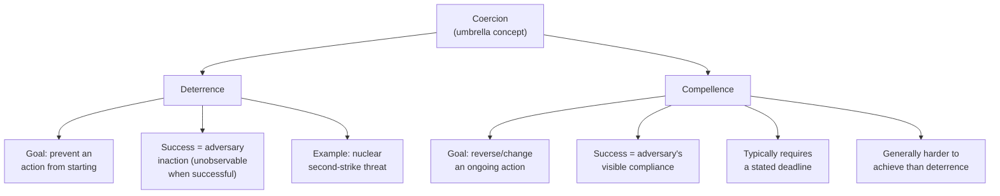

## Deterrence, Coercion, and Compellence

### Overview

Deterrence, coercion, and compellence constitute the core strategic-behavioral vocabulary for analyzing how states use threats, and the calculated withholding or application of force, to influence adversaries' behavior without necessarily engaging in direct armed conflict. Deterrence is the strategy of preventing an adversary from taking an unwanted action by threatening unacceptable costs in response; compellence is the strategy of forcing an adversary to change an ongoing behavior or take a specific action through the threat or use of force; and coercion is the broader umbrella term encompassing both, denoting the general use of threats and costly signals to alter an adversary's behavior. This vocabulary, developed substantially within Cold War strategic studies, remains central to contemporary geopolitical risk analysis of nuclear posture, conventional military signaling, and gray-zone/hybrid conflict short of open war.

### Deterrence

**Definition and core logic**

Deterrence is the strategy of dissuading an adversary from initiating an unwanted action by convincingly threatening to impose costs, or deny benefits, sufficient to make that action irrational from the adversary's own cost-benefit perspective. Deterrence is fundamentally a strategy aimed at preventing an action that has *not yet occurred* — it succeeds when the adversary refrains from acting, meaning successful deterrence is characteristically difficult to observe directly, since a successfully deterred action is, definitionally, an action that never happens.

**Thomas Schelling's foundational contribution**

Thomas Schelling's *The Strategy of Conflict* (1960) and *Arms and Influence* (1966) are foundational texts in deterrence theory, developing game-theoretic analysis of how credible threats function as a form of bargaining and communication between adversaries, and introducing key concepts including the distinction between deterrence and compellence, the strategic value of deliberately limiting one's own options ("the threat that leaves something to chance"), and the role of costly, hard-to-fake signals in establishing credibility.

**Deterrence by punishment vs. deterrence by denial**

- **Deterrence by punishment**: Threatens to impose unacceptable retaliatory costs on the adversary in response to the undesired action, without necessarily preventing the action itself from succeeding militarily — the canonical example is nuclear deterrence via assured retaliatory capability (second-strike capability), where the threat is not to prevent an attack from physically succeeding but to guarantee devastating retaliation regardless of the attack's initial success.
- **Deterrence by denial**: Threatens (or actually demonstrates capability) to prevent the adversary's action from achieving its objective in the first place, making the action's expected benefit low regardless of whether retaliation follows — exemplified by forward-deployed conventional defenses designed to defeat an invasion before it can succeed, rather than merely threatening subsequent punishment.

**Extended deterrence**

Extended deterrence refers to a state's effort to deter an attack not on itself but on a third party (typically an ally) by threatening retaliation on that ally's behalf — a strategically more difficult undertaking than direct deterrence of an attack on oneself, since the credibility of a state's willingness to incur potentially severe costs (including nuclear retaliation risk) on behalf of an ally's defense is inherently more contestable than the credibility of its willingness to defend itself directly, a concern frequently summarized in Cold War-era debates over whether a nuclear power would genuinely "trade" its own cities for an ally's defense.

**Credibility and the requirements of successful deterrence**

Schelling and subsequent deterrence theorists identify several requirements for a deterrent threat to be credible and therefore effective:

- **Capability**: The deterring state must possess the actual military or other capability to carry out the threatened response.
- **Communication**: The threat must be clearly and unambiguously communicated to the party being deterred, since an adversary cannot be deterred by a threat it does not understand or does not believe applies to the contemplated action.
- **Resolve/credibility**: The adversary must believe the deterring state genuinely would carry out the threatened response if the proscribed action occurred, which depends on factors including the deterring state's stated interests, past behavior, domestic political constraints, and the stakes involved for the deterring state itself.

### Compellence

**Definition and core logic**

Compellence, a term Schelling introduced as the active counterpart to deterrence, is the strategy of using threats or the actual application of force to compel an adversary to *change* an ongoing course of action, undo an action already taken, or take some specific new action — unlike deterrence, which seeks to maintain a status quo by preventing an action from starting, compellence seeks to actively alter the adversary's behavior, typically requiring the adversary to take a visible, often domestically costly action (reversing course, withdrawing forces, ceasing an ongoing activity).

**Why compellence is generally harder than deterrence**

Deterrence and compellence theorists generally regard compellence as a structurally more difficult undertaking than deterrence, for several related reasons:

- **Deterrence requires only inaction; compellence requires visible action**: A deterred state need only refrain from a contemplated action, which can occur without public acknowledgment or domestic political cost; a compelled state must take a visible, often publicly humiliating action (reversing a prior decision, withdrawing forces already deployed), which typically carries greater domestic political and reputational costs for the compelled state's own leadership.
- **Compellence often requires specifying a timeline**: Because compellence demands a specific behavioral change rather than indefinite restraint, it typically requires the coercing state to specify a deadline or timeline for compliance, which introduces additional complexity (the credibility of the deadline itself, escalation risk if the deadline passes without compliance) not present in open-ended deterrent threats.
- **Ambiguity of "sufficient" compliance**: Compellence scenarios frequently generate disputes over what specifically constitutes adequate compliance with the compellent demand, creating additional friction and escalation risk not present in the comparatively binary success/failure structure of deterrence (the proscribed action either occurred or it did not).

### Coercion as the Umbrella Concept

**Definition and relationship to deterrence and compellence**

Coercion is the broader strategic category encompassing both deterrence and compellence, denoting the general use of threatened or actual costs to alter an adversary's behavior through the adversary's own cost-benefit calculation, as distinguished from "brute force," which seeks to physically impose an outcome directly without requiring the adversary's own compliance decision (e.g., physically destroying an adversary's capability to act, versus threatening costs sufficient to make the adversary choose not to act).

**Coercive diplomacy**

Alexander George's concept of coercive diplomacy specifically refers to the use of threats, and sometimes limited, demonstrative force, as a bargaining tool to persuade an adversary to comply with a demand, positioned as an alternative to full-scale military solutions — coercive diplomacy is generally analyzed as combining elements of compellence (demanding behavioral change) with diplomatic bargaining and, often, the deliberate provision of a face-saving option for the target to comply without maximal humiliation, which George and others argue improves the likelihood of successful compliance relative to demands that leave no dignified path to compliance.

### Diagram: Deterrence vs. Compellence Logic

### Illustrative Example: Contrasting Deterrent and Compellent Postures in a Crisis

Consider a hypothetical crisis in which one state has already taken a limited military action (e.g., establishing a forward military presence in disputed territory) that a rival power wishes to reverse:

1. **Deterrent phase (prior to the action)**: Before the initial action occurred, the rival power's deterrent posture (forward defenses, declaratory red lines, demonstrated resolve in prior comparable situations) aimed to prevent the action from being taken in the first place — the fact that the action nonetheless occurred can be analyzed, after the fact, as either a deterrence failure (the threat was insufficiently credible, capable, or communicated) or as reflecting the initiating state's assessment that its own stakes in the action outweighed the credible costs threatened.
2. **Compellent phase (after the action)**: Once the action has occurred, the rival power seeking to reverse it faces the structurally harder compellence problem — it must now induce the initiating state to take the visible, domestically costly step of withdrawing or reversing course, typically requiring escalated threats or costs beyond what would have been necessary to deter the action in the first place, since the initiating state has already incurred the political and reputational costs of taking the action and now faces the additional cost of a visible reversal.
3. **Escalation risk in the compellent phase**: Analysts would specifically examine whether the compelling state has specified a clear, credible deadline; whether it has left the target state a face-saving path to compliance (per George's coercive diplomacy framework); and whether the target state's domestic political constraints make visible compliance especially costly, all of which bear directly on the probability of successful compellence versus continued escalation. [Inference: the specific probability of successful compellence in any given real-world crisis depends on case-specific factors that deterrence/compellence theory identifies as relevant variables but does not itself predict with precision, so this remains a framework for structured qualitative assessment rather than a source of quantitative forecasts.]

This example illustrates the analytically important asymmetry between deterrence and compellence: the same underlying threat or capability may be adequate to prevent an action from being initiated, while proving insufficient to reverse that same action once it has already occurred, meaning risk analysts should not assume a state's demonstrated deterrent credibility automatically implies equivalent compellent credibility.

### Coercion in the Contemporary Domain: Gray-Zone and Hybrid Applications

**Extension beyond classical military deterrence**

Contemporary strategic studies has extended deterrence and coercion concepts beyond classical military and nuclear contexts to encompass gray-zone and hybrid threats — cyber operations, economic coercion, disinformation campaigns, and other actions calibrated to remain below the threshold likely to trigger a full military response, while still seeking to achieve compellent or deterrent effects.

**Cross-domain deterrence**

A significant area of contemporary strategic studies examines "cross-domain deterrence" — whether and how threats or capabilities in one domain (e.g., cyber capability, economic leverage) can effectively deter or compel behavior in a different domain (e.g., conventional military action), and whether traditional deterrence theory, developed substantially in a nuclear/conventional military context, translates adequately to these newer domains, where attribution difficulty (particularly in cyberspace) can undermine the clear communication and credibility requirements central to classical deterrence theory.

### Relationship to IR Theoretical Paradigms

- **Realism**: Deterrence and compellence theory developed substantially within, and remains most closely associated with, the realist tradition, given its foundational assumptions of rational, unitary state actors calculating costs and benefits under conditions of potential conflict.
- **Constructivism**: Constructivist critiques of classical deterrence theory emphasize that the credibility and meaning of threats are not purely a function of objective material capability but are also shaped by identity, reputation, and normative context — for instance, questioning whether "rationality" itself is a stable, universally shared calculation framework across different adversaries with different values and risk tolerances, or whether deterrence signals can be systematically misread across differing cultural and strategic contexts. [Inference: the degree to which cross-cultural or identity-based variation meaningfully undermines classical deterrence theory's rational-actor assumptions, versus representing a second-order refinement within a still largely applicable framework, remains a genuinely contested question among strategic studies scholars.]
- **Power transition theory**: Deterrence credibility concerns are directly relevant to power transition theory's "danger zone" dynamics, since a declining dominant power's deterrent credibility may erode precisely as a rising challenger's capability approaches parity, potentially creating exactly the conditions under which both deterrence failure and preventive-action temptation become more likely.

### Critiques and Analytical Complications

- **Unobservability of successful deterrence**: A persistent methodological challenge is that successful deterrence, by definition, produces the absence of an event, making it inherently difficult to empirically verify whether a given deterrent posture is actually responsible for an adversary's restraint, or whether the adversary never intended the proscribed action for entirely independent reasons.
- **Rationality assumption**: Classical deterrence and compellence theory assumes a rational, cost-benefit-calculating adversary; critics note this assumption can be strained in cases involving highly ideologically motivated actors, actors under severe domestic political pressure that distorts their cost-benefit calculation, or situations of severe informational uncertainty where the adversary may simply misjudge the deterring state's actual capability or resolve.
- **Compellence's higher failure rate in practice**: Empirical and historical analysis broadly supports the theoretical expectation that compellence attempts fail more frequently than deterrent postures succeed, given the structural asymmetries described above, a pattern with direct implications for risk analysts assessing the likely success of coercive diplomacy in an active crisis.
- **Escalation risk inherent to coercive signaling**: Both deterrent and especially compellent signaling carry inherent escalation risk, since demonstrative shows of force or capability intended to enhance credibility can themselves be perceived by the target as offensive preparation, potentially triggering the very security-dilemma dynamics that increase rather than decrease conflict risk.

### Comparison Table: Deterrence vs. Compellence

| Dimension | Deterrence | Compellence |
| --- | --- | --- |
| Objective | Prevent an action from starting | Reverse or change an ongoing action |
| Success signal | Absence of the proscribed action (hard to observe) | Visible compliant action by the target |
| Relative difficulty | Generally easier to achieve | Generally harder to achieve |
| Timeline requirement | Often open-ended/indefinite | Typically requires a specified deadline |
| Domestic cost to target | Low (inaction requires no public acknowledgment) | High (visible reversal often politically costly) |

### Applications in Geopolitical Risk Analysis

- **Crisis escalation assessment**: Used to distinguish whether a given coercive scenario is fundamentally a deterrence or compellence problem, since the two carry substantially different probability-of-success profiles and escalation-risk characteristics.
- **Deterrent credibility monitoring**: Analysts track indicators of deterrent credibility erosion (declining forward military presence, ambiguous or inconsistent declaratory signaling, historical instances of unenforced red lines) as leading indicators of elevated risk that a previously deterred action may be reconsidered by an adversary.
- **Coercive diplomacy feasibility assessment**: George's coercive diplomacy framework is used to assess whether a specific compellent demand is likely to succeed, based on whether a credible deadline, sufficient threatened costs, and a face-saving compliance path are present.
- **Cross-domain and gray-zone risk analysis**: Extended and cross-domain deterrence concepts inform analysis of contemporary hybrid threats (cyber, economic coercion, disinformation) that are deliberately calibrated to operate in ambiguous zones where classical deterrence signaling and attribution may be less effective.

**Related Topics**

- Schelling, *Arms and Influence* — foundational compellence/deterrence theory
- Deterrence by denial vs. deterrence by punishment in contemporary defense posture
- Extended deterrence and alliance credibility (direct link to the alliances topic)
- Alexander George's coercive diplomacy framework in detail
- Cross-domain deterrence and cyber attribution challenges
- Nuclear deterrence theory and second-strike capability
- Gray-zone and hybrid conflict as a distinct contemporary risk category
- Security dilemma theory and its relationship to coercive signaling risk
- Historical deterrence failure case studies
- Power transition "danger zone" dynamics and deterrence credibility erosion