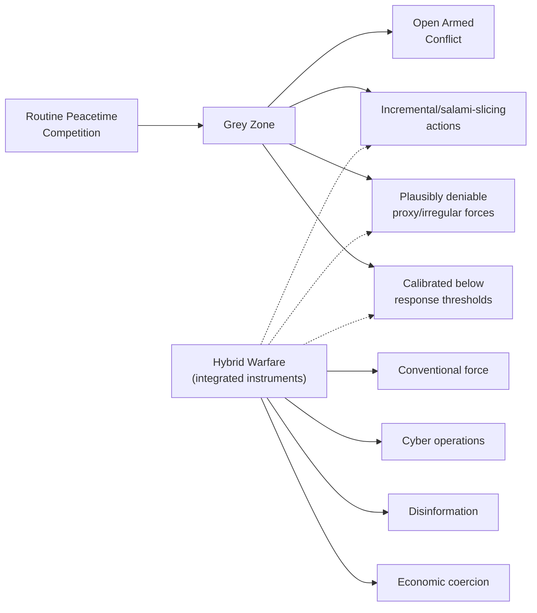

## Grey-Zone Conflict and Hybrid Warfare

### Overview

Grey-zone conflict and hybrid warfare are closely related, partially overlapping concepts describing contemporary forms of state (and sometimes non-state) competition and coercion that occur below the threshold of conventional armed conflict, deliberately exploiting ambiguity regarding attribution, legal classification, and the appropriate threshold for a forceful response. Grey-zone conflict refers most fundamentally to the strategic space between routine peacetime competition and open war, characterized by actions calibrated to achieve strategic objectives while avoiding actions clear and unambiguous enough to trigger a decisive military or legal response; hybrid warfare refers more specifically to the integrated, coordinated use of multiple instruments — conventional and irregular military force, cyber operations, disinformation, economic coercion, and proxy actors — often blended together in a single coordinated campaign. For geopolitical risk analysts, these concepts have become central to contemporary risk assessment precisely because they are designed to complicate the traditional analytical categories (war/peace, combatant/non-combatant, state/non-state) on which earlier IR theory and international law were substantially built.

### Grey-Zone Conflict

**Definition and core characteristics**

Grey-zone conflict (sometimes "gray zone") describes a strategic approach in which a state pursues its objectives through actions specifically designed to remain below the threshold likely to trigger a decisive conventional military response or a clear legal determination of armed attack, while still applying meaningful coercive pressure toward a strategic goal. The defining characteristic is deliberate ambiguity — regarding attribution (who is responsible), legal classification (does this constitute an "armed attack" triggering self-defense rights or alliance obligations), and intent (is this a deniable provocation or an accident) — engineered specifically to complicate the target's decision-making and response options.

**Core tactical characteristics**

- **Incrementalism**: Grey-zone actions are frequently pursued through a deliberate strategy of small, individually low-salience steps (sometimes termed "salami slicing" or "creeping expansion") that accumulate toward a significant strategic gain over time, with each individual increment calibrated to be too minor to justify a strong response in isolation, while the cumulative effect over time produces substantial strategic change.
- **Plausible deniability**: Extensive use of proxy forces, unmarked or unacknowledged personnel, cyber operations routed through intermediaries, and other mechanisms designed to allow the responsible state to maintain formal deniability even when responsibility is widely suspected or informally acknowledged, complicating both legal attribution and the political calculus of response.
- **Below-threshold calibration**: Deliberate targeting of the ambiguous space below commonly understood thresholds for triggering collective defense obligations (e.g., NATO's Article 5) or clear violations of international law governing the use of force, exploiting the reality that most legal and alliance frameworks were designed around clearer, more unambiguous armed-attack scenarios.

**Instruments commonly employed in grey-zone strategy**

- **Irregular and paramilitary forces**: Use of unmarked military personnel, private military contractors, or proxy militias to conduct operations with reduced formal state attribution.
- **Maritime and territorial encroachment**: Use of coast guard, maritime militia, or other non-front-line-military assets to assert disputed territorial or maritime claims incrementally, avoiding the clearer escalatory signal of conventional naval deployment.
- **Economic coercion**: Calibrated trade restrictions, informal boycotts, or investment pressure applied short of formal, declared sanctions (directly overlapping with the geoeconomic instruments discussed elsewhere in this syllabus).
- **Cyber operations**: Espionage, infrastructure probing, and disruptive (though typically non-lethal and reversible) cyber activity calibrated to avoid clearly crossing into what would widely be recognized as an armed attack.
- **Disinformation and influence operations**: Coordinated information campaigns designed to shape target-population political attitudes, sow social division, or delegitimize a target government, generally understood as a lower-intensity, longer-horizon influence instrument rather than a decisive-effect tool in isolation.

### Hybrid Warfare

**Definition and core characteristics**

Hybrid warfare refers to the deliberate, coordinated integration of multiple distinct instruments of coercion and conflict — conventional military force, irregular/guerrilla tactics, cyber operations, economic pressure, and information/disinformation operations — into a single, blended campaign designed to exploit the target's vulnerabilities across multiple domains simultaneously, complicating a unified, single-domain response.

**Relationship to grey-zone conflict**

Hybrid warfare and grey-zone conflict are closely related but analytically distinguishable: grey-zone conflict emphasizes the *positioning* of activity below a triggering threshold (a statement about where on the peace-war spectrum the activity sits), while hybrid warfare emphasizes the *integration and coordination* of multiple distinct instruments into a blended campaign (a statement about the compositional structure of the activity) — in practice, the two concepts substantially overlap, since much grey-zone activity is conducted through a hybrid combination of instruments, and much hybrid warfare is deliberately calibrated to remain in the grey zone, but a hybrid campaign can in principle also include more overt, higher-intensity conventional military components not purely confined to the grey zone.

**Historical development of the term**

The term "hybrid warfare" gained significant currency in Western strategic studies discourse particularly following its application to Russia's 2014 activities in Crimea and eastern Ukraine, which combined unmarked military personnel, cyber operations, disinformation campaigns, and support for local proxy forces in a coordinated fashion — though scholars note that the underlying blended tactics the term describes have significant historical precedent well before the term's contemporary popularization, and some strategic studies scholars have raised definitional concerns about whether "hybrid warfare" describes a genuinely novel phenomenon or primarily repackages longstanding irregular warfare and political warfare concepts under new terminology suited to a contemporary information environment. [Inference: the degree to which contemporary hybrid warfare represents a qualitatively novel strategic phenomenon, as opposed to a relabeling of longstanding political and irregular warfare practices adapted to new technological instruments (cyber, social media-enabled disinformation), remains a matter of genuine scholarly disagreement rather than settled consensus.]

### Diagram: The Grey Zone on the Peace–War Spectrum

### Illustrative Example: A Composite Grey-Zone/Hybrid Campaign Pattern

Drawing on widely documented patterns from post-2014 strategic studies literature, a representative (composite, illustrative rather than case-specific) grey-zone/hybrid campaign might combine the following elements in a coordinated sequence:

1. **Information preparation**: A sustained disinformation and influence campaign preceding overt action, designed to shape both domestic (within the target state) and international audience perceptions, often exploiting or amplifying existing social or political grievances within the target population to create a permissive or divided environment.
2. **Deniable personnel deployment**: Introduction of unmarked or unacknowledged military or paramilitary personnel, frequently described in official statements as local actors or "volunteers" rather than acknowledged state forces, complicating both legal attribution and alliance-trigger determinations.
3. **Cyber and infrastructure disruption**: Coordinated cyber operations targeting government communications, critical infrastructure, or information systems, calibrated for disruptive rather than clearly destructive effect, timed to coincide with and reinforce the broader campaign.
4. **Economic pressure**: Calibrated economic measures (informal trade restrictions, energy supply leverage) applied to increase pressure on the target government without crossing into formally declared, clearly attributable sanctions.
5. **Incremental territorial or political fait accompli**: A culminating action (territorial seizure, political intervention) presented as a fait accompli, calculated to be difficult and costly to reverse once established, shifting the burden of escalation onto the target and any potential external supporters (directly engaging the compellence-versus-deterrence asymmetry discussed in the preceding topic, since reversing an established fait accompli is a structurally harder compellence problem than deterring its initial establishment).

This composite pattern illustrates why grey-zone/hybrid campaigns pose distinctive analytical challenges: no single element in isolation may be clearly severe enough to trigger a decisive response, yet the coordinated cumulative effect can achieve substantial strategic objectives — precisely the intended effect of the strategy.

### Analytical and Policy Challenges

**Attribution difficulty**

Grey-zone and hybrid tactics are specifically designed to complicate attribution, particularly in the cyber domain, where technical, political, and evidentiary challenges in definitively and publicly attributing responsibility can significantly delay or dilute response, and where a target state's confidence in private attribution assessments may substantially exceed what can be publicly and persuasively demonstrated to domestic and international audiences.

**Threshold and legal classification ambiguity**

A central challenge is that existing international legal frameworks governing the use of force (the UN Charter's provisions on self-defense and prohibited use of force) and alliance treaty triggers (such as NATO's Article 5) were developed with reference to comparatively clearer armed-attack scenarios, and have not been definitively or uniformly reinterpreted to specify precise thresholds for cyber operations, proxy force use, or economic coercion — creating genuine ambiguity (rather than merely an adversary's ambiguity-manufacturing success) about where the legal and alliance-triggering line actually sits for many grey-zone activities.

**Response calibration dilemma**

Target states face a persistent strategic dilemma in responding to grey-zone provocations: responding too weakly risks validating the incremental strategy and inviting further salami-slicing, while responding too strongly (treating a genuinely ambiguous or minor provocation as equivalent to overt armed attack) risks unwarranted escalation and potential loss of domestic or international legitimacy if the response appears disproportionate to the ambiguous provocation.

### Relationship to IR Theoretical Paradigms

- **Realism**: Grey-zone and hybrid strategies can be read through a realist lens as a rational adaptation to a strategic environment (nuclear deterrence, dense economic interdependence, robust international normative constraints on overt aggression) that has substantially raised the costs of conventional interstate war among major and regional powers, pushing competition into lower-intensity, ambiguity-exploiting channels as a rational substitute.
- **Constructivism**: Directly relevant to the normative and legal-classification dimension of grey-zone strategy, since the effectiveness of grey-zone tactics depends substantially on genuine, unresolved intersubjective disagreement about how existing norms (sovereignty, non-intervention, the legal threshold for "armed attack") apply to novel instruments — a live contestation over norm application rather than a settled legal or normative question.
- **Deterrence/compellence theory**: Directly connects to the preceding topic, since grey-zone strategy can be understood as deliberately designed to defeat classical deterrence by avoiding the clear, attributable, threshold-crossing actions that deterrent threats and alliance commitments are generally structured to respond to — creating a distinctive contemporary challenge sometimes termed "deterrence by denial" or "resilience" strategies aimed specifically at the grey zone, distinct from classical punishment-based deterrence.
- **Geoeconomics**: Economic coercion instruments used in grey-zone campaigns overlap substantially with the geoeconomic statecraft toolkit discussed earlier in this syllabus, illustrating the cross-cutting, multi-instrument character of hybrid campaigns.

### Critiques and Definitional Debates

- **Conceptual overstretch**: Critics argue "grey zone" and "hybrid warfare" have, in some usage, become sufficiently broad and elastic as to risk losing clear analytical boundaries, potentially being applied to describe almost any form of below-threshold state competition, which can dilute the terms' usefulness for precise risk categorization and response planning.
- **Novelty debate**: As noted above, a significant strand of scholarly critique questions whether contemporary hybrid/grey-zone warfare represents a genuinely novel strategic category or substantially repackages longstanding irregular warfare, political warfare, and covert action practices (with substantial Cold War-era and earlier historical precedent) under new terminology shaped by the contemporary information and cyber environment.
- **Response-strategy underdevelopment**: Critics note that strategic studies and policy literature has developed grey-zone/hybrid *description* considerably further than clearly validated *response* doctrine, meaning the analytical vocabulary for characterizing these campaigns has outpaced consensus guidance on optimal calibrated response strategies. [Inference: whether emerging "resilience-based" and "deterrence by denial" response frameworks for the grey zone constitute a mature, validated response doctrine or remain a still-developing area of strategic studies practice is itself an open question reflecting the field's relative youth.]
- **Risk of adversary-label overuse**: Some analysts caution that overly readily labeling an adversary's ambiguous action as "hybrid warfare" or "grey-zone aggression" can itself become a rhetorically loaded, threat-inflating framing device, and that rigorous case-specific analysis of actual intent, coordination, and effect is necessary to avoid analytically unjustified escalation of the perceived threat.

### Comparison Table: Grey-Zone Conflict vs. Hybrid Warfare

| Dimension | Grey-Zone Conflict | Hybrid Warfare |
| --- | --- | --- |
| Primary emphasis | Positioning on the peace-war spectrum (below-threshold) | Integration/coordination of multiple instruments |
| Core mechanism | Ambiguity exploitation, incrementalism | Blended, multi-domain coordinated campaign |
| Typical instruments | Often overlaps substantially with hybrid instruments | Conventional + irregular force, cyber, disinformation, economic pressure |
| Key analytical challenge | Attribution and legal threshold ambiguity | Coordinating a unified response across multiple affected domains |
| Popularized reference case | Broader strategic studies literature (various) | Russia's 2014 Crimea/eastern Ukraine campaign |

### Applications in Geopolitical Risk Analysis

- **Indicator and warning development**: Used to structure early-warning indicator frameworks specifically calibrated to detect incremental, below-threshold activity (disinformation campaign onset, irregular force movements, calibrated economic pressure) that conventional military-focused warning indicators may underweight.
- **Attribution confidence assessment**: Risk products increasingly distinguish between private/intelligence-community attribution confidence and publicly demonstrable attribution, given the direct relevance of this gap to how confidently a response can be justified to domestic and allied audiences.
- **Cumulative/salami-slicing pattern tracking**: Analysts track sequences of individually minor incidents for cumulative pattern significance, since grey-zone strategy is specifically designed to evade single-incident threshold-based risk flagging.
- **Cross-domain resilience assessment**: Given hybrid warfare's multi-domain character, risk assessment increasingly requires integrated analysis across military, cyber, economic, and information-domain vulnerability simultaneously, rather than siloed single-domain risk assessment.

**Related Topics**

- Salami-slicing and incremental fait accompli strategy in detail
- Attribution challenges in cyber operations and their legal/political implications
- Russia's 2014 Crimea operation as the reference hybrid warfare case study
- NATO Article 5 threshold ambiguity and grey-zone alliance-trigger debates
- Disinformation and influence operations as a distinct risk category
- Deterrence by denial and resilience-based response strategies
- Proxy warfare and plausible deniability mechanisms
- Economic coercion short of formal sanctions (geoeconomic linkage)
- Maritime grey-zone tactics (coast guard/militia-based territorial assertion)
- Indicator and warning (I&W) methodology adapted for below-threshold activity