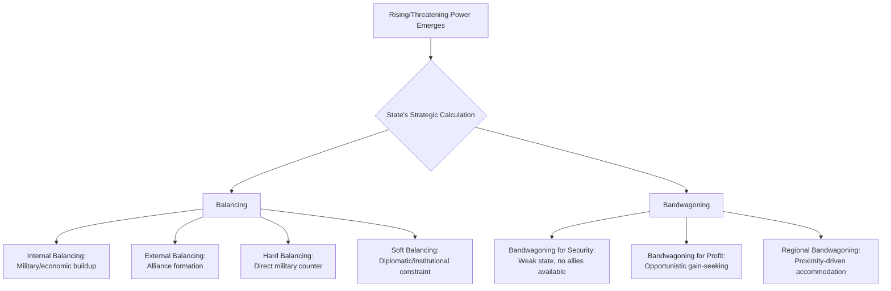

## Balance of Power versus Bandwagoning

### Overview

Balancing and bandwagoning are the two foundational, opposing strategic responses that states adopt when confronted with a rising or threatening power. This binary is central to structural Realist theory and functions as one of the most widely applied analytic tools in geopolitical risk analysis, used to forecast alliance formation, defection, and realignment in response to shifts in the distribution of power or threat.

### Core Definitions

**Balancing**

The strategy of allying with other states (or building internal capabilities) to counter and check a rising or threatening power, preventing it from achieving dominance.

**Bandwagoning**

The strategy of aligning with the rising or threatening power itself, rather than against it — accommodating the stronger state instead of opposing it.

$$P_{\text{align}} = f(\text{Threat}, \text{Capability Gap}, \text{Geographic Proximity}, \text{Perceived Intentions}, \text{Alliance Reliability})$$

### Theoretical Foundations

**Key Points**

- Kenneth Waltz (*Theory of International Politics*, 1979) argued balancing is the dominant, structurally predictable behavior in an anarchic system, since states prioritize survival and resist any single actor achieving hegemony
- Stephen Walt (*The Origins of Alliances*, 1987) refined this into **Balance of Threat theory**, arguing states balance against *threat* — not raw power alone — with threat determined by aggregate power, geographic proximity, offensive capability, and perceived aggressive intentions
- Bandwagoning was historically treated as the empirically rarer, riskier choice, associated with weaker states lacking the resources to balance effectively
- Randall Schweller (*Deadly Imbalances*, 1998) challenged the balancing-as-default assumption, arguing bandwagoning is more common than classical Realism predicts, especially among revisionist or opportunistic states seeking gain rather than merely security

### Balancing: Mechanisms

**1. External Balancing**

Formal or informal alliance formation with other states to aggregate capabilities against the threatening power.

- Example: NATO's formation in 1949 as external balancing against Soviet power in Europe

**2. Internal Balancing**

Unilateral buildup of a state's own military and economic capabilities without relying on allies.

- Example: Sustained defense-spending increases by a state facing a rising regional rival, absent formal alliance commitments

**3. Hard Balancing**

Explicit military buildups and formal counter-alliances aimed directly at offsetting a rival's power.

**4. Soft Balancing**

Non-military tools — diplomatic coalitions, international institutions, economic statecraft, and normative delegitimization — used to constrain a powerful state without direct military confrontation. [Inference] Soft balancing has become an increasingly prominent explanatory concept in the post-Cold War unipolar and re-multipolarizing order, where direct hard balancing against a dominant power carries prohibitive costs.

### Bandwagoning: Mechanisms

**1. Bandwagoning for Profit**

A state aligns with a rising power to share in the spoils of its expansion (territorial, economic, or influence-based gains), as Schweller emphasizes — driven by opportunity rather than fear.

**2. Bandwagoning for Security**

A weaker state, unable to secure reliable allies or lacking capability to balance, aligns with the threatening power to avoid becoming its target — "if you can't beat them, join them."

**3. Regional Bandwagoning**

Smaller states in a rising power's immediate neighborhood may bandwagon due to geographic vulnerability and limited alternative security guarantees, particularly when external balancers are distant or unreliable.

### Comparative Table

| Dimension | Balancing | Bandwagoning |
| --- | --- | --- |
| Core logic | Counter the threat | Accommodate the threat |
| Underlying motive | Security/survival (defensive) | Security (weak states) or profit (opportunistic states) |
| Theoretical association | Waltz, Walt (defensive/neoclassical Realism) | Schweller (revisionist/neoclassical Realism) |
| Typical actor | Great or middle powers with resources to resist | Weak states, or opportunistic revisionists |
| Predicted frequency (classical Realism) | Dominant/default response | Rare, exceptional |
| Risk-analytic signal | Alliance formation, defense pacts, arms buildups | Alignment shifts toward rising power, deference in disputes |

### Determinants of Balancing vs. Bandwagoning Choice (Walt's Framework)

According to Balance of Threat theory, a state's choice is shaped by:

1. **Aggregate power** — the rising state's total resources (population, industrial/military capacity)
2. **Geographic proximity** — threats from neighboring states are perceived as more urgent than distant ones
3. **Offensive capability** — power that is more easily projected offensively is more threatening
4. **Perceived intentions** — a state perceived as aggressive or expansionist is more threatening than one perceived as status-quo oriented, even with equivalent capabilities

**Key Points**

- [Inference] Weak states bordering a strong, aggressive neighbor with limited access to external allies face the highest structural incentive to bandwagon, since balancing is materially unavailable and bandwagoning at least defers direct confrontation
- Strong states with access to reliable coalition partners face stronger incentives to balance, since the costs of bandwagoning (subordination, loss of autonomy) outweigh alliance costs

### Diagrammatic Summary

### Worked Examples

**Example 1: Balancing**

Cold War Western Europe balanced against Soviet power through NATO — pooling military capability (external balancing) and simultaneously rebuilding national defense industries (internal balancing), driven by proximity, aggregate Soviet power, and perceived expansionist intent (Walt's threat variables all present at high levels).

**Example 2: Bandwagoning**

Smaller states within a rising regional hegemon's immediate periphery, lacking credible external security guarantees, may shift trade dependencies and diplomatic alignment toward the dominant regional power rather than joining a distant, less reliable counter-coalition — a pattern consistent with bandwagoning for security.

**Example 3: Mixed/Hedging Strategy**

[Inference] Many contemporary middle powers do not purely balance or bandwagon but **hedge** — maintaining economic engagement with a rising power while simultaneously pursuing security cooperation with a counterbalancing power, deferring a binary strategic commitment. This hedging behavior is increasingly treated in the risk-analysis literature as a third empirical category distinct from Waltz's and Walt's binary framework.

### Applications in Geopolitical Risk Analysis

**Key Points**

- **Alliance risk forecasting**: Tracking shifts in defense pacts, joint exercises, and basing agreements as leading indicators of balancing coalitions forming against a rising power
- **Defection risk**: Identifying which weaker states within an existing alliance structure show bandwagoning incentives (economic dependency, proximity, credibility doubts about the alliance leader) as candidates for defection or hedging
- **Escalation forecasting**: A shift from bandwagoning to balancing behavior among a rising power's neighbors is often a leading indicator of that power's declining perceived legitimacy or of overreach in offensive behavior
- **Alliance reliability assessment**: Perceived unreliability of an alliance's security guarantor increases bandwagoning incentives among smaller member states, per Walt's proximity/intentions variables

### Critiques and Limitations

- The balancing/bandwagoning binary is criticized as too reductive for contemporary multipolar and economically interdependent contexts, where hedging and issue-specific alignment are increasingly common
- Domestic-level variables (regime type, elite preferences, economic dependencies) are underspecified in the classical structural formulation, prompting Neoclassical Realist extensions incorporating unit-level factors
- [Unverified] Empirical studies disagree on the actual historical frequency of bandwagoning versus balancing, with findings sensitive to case selection and operational definitions of "threat" and "alignment"

### Next Steps

- **Related Topics**: Stephen Walt's Balance of Threat theory; Neoclassical Realism and unit-level variables; hedging strategies in middle-power foreign policy; offensive vs. defensive Realism; alliance reliability and abandonment/entrapment dynamics; regional hegemony and power transition theory; soft balancing in unipolar/multipolar orders; Schweller's revisionist state typology