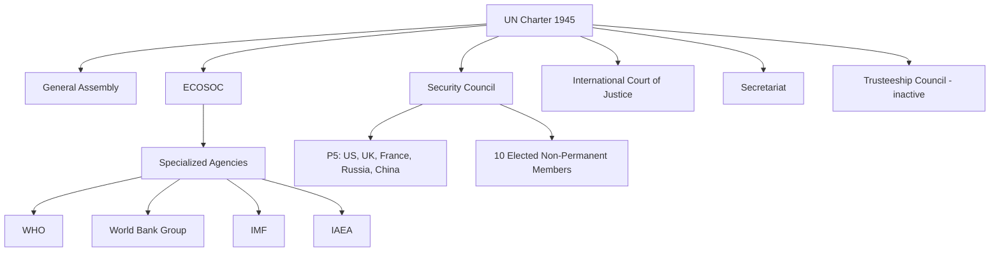

## The United Nations System and Security Council Dynamics

### Overview

The United Nations is the primary universal-membership intergovernmental organization and the institutional core of the post-1945 multilateral order. For geopolitical risk analysts, the UN system matters less as a governance ideal and more as an operational signal generator: Security Council voting patterns, veto usage, sanctions regimes, peacekeeping mandates, and General Assembly coalition behavior all provide observable, trackable indicators of great-power alignment, conflict trajectories, and normative legitimacy contests.

### Institutional Architecture of the UN System

**Key Points**

- Founded 1945 via the UN Charter, signed in San Francisco, entering into force October 24, 1945, replacing the League of Nations
- Structured around six principal organs: the General Assembly, Security Council, Economic and Social Council (ECOSOC), Trusteeship Council (now inactive), International Court of Justice (ICJ), and the Secretariat
- Surrounded by a broader "UN system" of specialized agencies, funds, and programmes (e.g., WHO, IMF, World Bank, UNHCR, UNICEF, WFP, IAEA) that are legally distinct but institutionally affiliated

### The General Assembly

- One state, one vote; 193 member states as of current membership
- Resolutions are generally non-binding (soft law) except on internal UN budgetary/administrative matters
- Functions as a barometer of broad international normative consensus and coalition alignment (e.g., voting blocs on contested geopolitical issues)
- The **Uniting for Peace** resolution (1950) allows the GA to recommend collective action, including force, when the Security Council is deadlocked by veto — used historically as a workaround mechanism

**Example**

Emergency Special Sessions convened under Uniting for Peace procedures are a recurring risk-analytic signal: when the Security Council is paralyzed by a P5 veto on a major crisis, GA vote margins and abstention patterns in a resulting emergency session reveal the true distribution of state-level legitimacy judgments, independent of P5 politics.

### The Security Council: Structure

- 15 members total: 5 permanent members (**P5**: United States, United Kingdom, France, Russia, China) and 10 non-permanent members elected by the GA for two-year terms, with regional rotation
- Primary responsibility under the Charter for the maintenance of international peace and security (Article 24)
- Resolutions under **Chapter VII** of the Charter are legally binding and can authorize sanctions, arms embargoes, or the use of force
- Resolutions under **Chapter VI** address peaceful settlement of disputes and are recommendatory rather than binding

### The Veto Power

**Key Points**

- Under Article 27(3), any P5 member can block a substantive resolution by casting a negative vote — procedural votes are exempt from the veto
- Abstention by a P5 member does **not** count as a veto and does not block resolution passage — a critical technical distinction frequently misunderstood
- The veto was designed to ensure great-power buy-in to the postwar order, reflecting a Realist compromise: no collective security system could function if it obligated great powers to act against their own vital interests
- Veto frequency and pattern is one of the single most useful quantitative time-series indicators of great-power relations available to risk analysts

$$\text{Resolution Passes} \iff (\text{Yes votes} \geq 9) \land (\text{No P5 veto cast})$$

### Historical Veto Patterns

| Period | Dominant Veto User(s) | Typical Subject Matter |
| --- | --- | --- |
| 1946–1965 | Soviet Union (heavy usage) | Cold War bloc contestation, admission of new member states |
| 1966–1989 | United States (increasing usage) | Middle East resolutions, especially Israel-related |
| 1990–2010 | Relatively low overall usage | Post-Cold War cooperative period ("veto lull") |
| 2011–present | Russia, China (increasing joint and separate usage); US usage on Middle East issues | Syria conflict, Ukraine-related resolutions, Middle East dynamics |

[Inference] A sustained rise in veto frequency by a given P5 member, especially on resolutions with broad non-P5 support, is a leading indicator of that state's growing willingness to bear reputational costs for shielding itself or an aligned client state from binding multilateral action — often correlating with an underlying bilateral or regional crisis involving that member's core interests.

### Security Council Decision-Making Dynamics

**1. P5 Unity vs. Fragmentation**

Council effectiveness on any given crisis depends heavily on whether the P5 share a baseline threat assessment. High P5 unity (e.g., early post-Gulf War period) enables binding Chapter VII action; P5 fragmentation (e.g., Syria since 2011) produces gridlock and reliance on non-Council mechanisms (regional organizations, coalitions of the willing, unilateral action).

**2. The E10 (Elected Ten)**

Non-permanent members lack veto power but influence agenda-setting, penholding on specific files, and can shape resolution language through negotiation leverage, particularly when P5 votes are closely divided.

**3. Penholder System**

Informal practice whereby a specific P5 member takes lead drafting responsibility for resolutions on a given crisis or country file (e.g., traditionally the UK on Yemen, France on certain African files) — an informal institutional practice not specified in the Charter but consequential for agenda control.

**4. Sanctions Committees**

The Council establishes subsidiary sanctions committees (targeted sanctions, arms embargoes, travel bans, asset freezes) tied to specific resolutions — a key operational output analysts track for compliance risk and enforcement gaps.

### Peacekeeping Operations (PKOs)

- Authorized under a hybrid of Chapter VI and Chapter VII authority depending on mandate strength (traditional monitoring vs. robust civilian-protection mandates)
- Not explicitly provided for in the Charter — often called "Chapter Six and a Half" operations, reflecting their improvised institutional origin
- Mandate renewal cycles (commonly annual) are recurring risk-analytic checkpoints: renewal language changes, troop ceiling adjustments, and mandate scope shifts signal evolving P5 threat perceptions of the underlying conflict

**Example**

A peacekeeping mandate renewal that quietly narrows the force's protection-of-civilians authority, or reduces troop ceilings, is frequently a leaked signal of P5 disagreement on the mission's trajectory — worth flagging even absent an explicit veto event, since it reflects negotiated compromise language rather than open confrontation.

### UN Reform Debates

**Key Points**

- Persistent proposals to expand permanent membership (commonly cited candidates: India, Brazil, Germany, Japan, and an African seat) remain unresolved due to P5 consensus requirements for Charter amendment (Article 108/109) — any reform is subject to the same veto logic it seeks to reform
- The **G4** (Brazil, Germany, India, Japan) advocates mutual support for permanent seats; the **Uniting for Consensus** group (including Italy, Pakistan, South Korea, Argentina, Mexico) opposes new permanent seats in favor of expanded elected membership
- [Inference] The structural requirement that P5 members ratify any change to their own veto privileges makes near-term structural Security Council reform highly improbable regardless of General Assembly sentiment, since no P5 member has strong incentive to dilute its own veto power

### Security Council and Great Power Competition: Risk-Analytic Reading

| Observable Indicator | Risk-Analytic Interpretation |
| --- | --- |
| Veto cast on a resolution with broad co-sponsor support | Signals a P5 member's willingness to isolate itself diplomatically to protect a core interest or client state |
| Abstention by a P5 member (not veto) | Signals discomfort but not existential opposition — a softer alignment signal |
| Resolution passed unanimously | Signals rare P5 convergence, often reflecting genuine shared threat perception |
| Repeated failure to agree on presidential statements (non-binding) | Signals deep procedural gridlock, often preceding action shifting to non-UN venues |
| Sanctions committee reporting gaps or panel-of-experts findings on evasion | Signals sanctions regime erosion and enforcement risk |

### Critiques and Limitations of the UN System

- **Legitimacy-effectiveness tradeoff**: The veto preserves great-power participation (system stability) at the direct cost of the Council's capacity to act against P5 interests (effectiveness), an intentional Charter-level design tradeoff
- **Representational lag**: The P5 configuration reflects 1945 power distribution, not contemporary economic or demographic realities, fueling persistent legitimacy contestation from rising and Global South powers
- **Selectivity critique**: Analysts and scholars note recurring asymmetries in Council responsiveness across crises of comparable humanitarian severity, often explained by differential P5 interests rather than uniform application of Charter principles
- [Unverified] Quantitative claims about the precise causal weight of Council paralysis versus other factors (e.g., troop-contributing country willingness, host-state consent) in specific peacekeeping failures vary across the scholarly and practitioner literature and are contested case by case

### Next Steps

- **Related Topics**: Chapter VI vs. Chapter VII authority; UN sanctions regimes and enforcement mechanisms; Uniting for Peace precedent and Emergency Special Sessions; UN Security Council reform proposals (G4, Uniting for Consensus, Ezulwini Consensus); peacekeeping mandate design and troop-contributing country dynamics; the International Court of Justice and state compliance; regional organizations as UN Chapter VIII actors (NATO, AU, EU); great power management as an English School primary institution