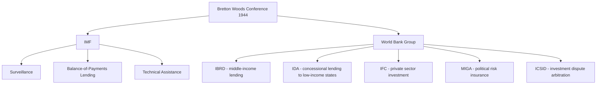

## International Financial Institutions: IMF and World Bank

### Overview

The International Monetary Fund (IMF) and World Bank Group are the two principal Bretton Woods institutions governing the international financial and development architecture. For geopolitical risk analysts, these institutions serve dual roles: as economic stabilization mechanisms whose lending decisions carry significant political signaling weight, and as arenas of great-power institutional influence where voting-share governance structures shape whose economic priorities get embedded in conditionality.

### Origins and Institutional Architecture

**Key Points**

- Both institutions were established at the 1944 Bretton Woods Conference, alongside what became the GATT/WTO system, to prevent a recurrence of the competitive currency devaluations and trade collapse of the interwar period
- The IMF's original mandate centered on exchange-rate stability and short-term balance-of-payments support; the original Bretton Woods fixed exchange-rate system anchored to gold-convertible dollars collapsed in 1971 (the "Nixon Shock"), after which the IMF's role shifted toward surveillance and crisis lending under floating-rate conditions
- The World Bank Group (originally the International Bank for Reconstruction and Development, IBRD) was created for postwar reconstruction and later pivoted to long-term development financing
- Both are headquartered in Washington, D.C., and by informal convention the IMF is traditionally led by a European Managing Director while the World Bank is traditionally led by an American President — a governance norm increasingly contested by emerging economies

### IMF: Core Functions

**1. Surveillance**

Regular monitoring of member states' macroeconomic and financial policies (Article IV consultations) to identify emerging vulnerabilities before they become crises.

**2. Lending**

Short- to medium-term financing to members facing balance-of-payments crises, typically attached to policy conditionality (structural adjustment or fiscal reform commitments).

**3. Capacity Development**

Technical assistance and training to strengthen member states' fiscal, monetary, and financial-sector institutions.

### IMF Lending Instruments

| Instrument | Purpose | Typical Conditionality Level |
| --- | --- | --- |
| Stand-By Arrangement (SBA) | Short-term balance-of-payments support | Moderate to high |
| Extended Fund Facility (EFF) | Longer-term structural balance-of-payments issues | High, structural reforms |
| Rapid Financing Instrument (RFI) | Urgent needs (e.g., natural disaster, commodity shock) | Low, limited conditionality |
| Precautionary and Liquidity Line (PLL) | Crisis-prevention for states with sound fundamentals | Low |
| Extended Credit Facility (ECF) | Concessional lending for low-income countries | Moderate, poverty-reduction linked |

### World Bank Group: Core Institutions

- **IBRD**: Lends to creditworthy middle-income and lower-income sovereign governments at near-market rates
- **IDA (International Development Association)**: Provides concessional loans and grants to the world's lowest-income countries, funded through periodic donor replenishment cycles
- **IFC (International Finance Corporation)**: Invests directly in private-sector enterprises in developing economies
- **MIGA (Multilateral Investment Guarantee Agency)**: Provides political risk insurance to investors in developing markets — directly relevant to geopolitical risk practice, as MIGA-insured projects generate a standing market-priced signal of perceived political risk in specific jurisdictions
- **ICSID (International Centre for Settlement of Investment Disputes)**: Arbitrates investor-state disputes, a key venue tracked in sovereign risk and expropriation-risk analysis

### Governance Structure and Voting Power

**Key Points**

- Both institutions use a **weighted voting system** based on financial quota/capital subscriptions rather than one-state-one-vote, unlike the UN General Assembly
- IMF quotas determine both voting power and access to Fund resources; quota reviews (conducted periodically, roughly every five years per the Articles of Agreement, though often delayed) are a recurring institutional flashpoint over the relative voice of emerging economies versus incumbent advanced economies
- The United States retains sufficient voting share in both institutions to hold an effective veto over major decisions requiring an 85% supermajority (e.g., quota changes, Articles of Agreement amendments), a structural feature frequently cited as the clearest formal instance of a single state's institutional veto in the global financial governance system
- [Inference] The persistent underrepresentation of large emerging economies relative to their share of global GDP in IMF/World Bank voting structures is a documented driver of parallel institution-building, illustrated by the creation of the New Development Bank (BRICS-led) and the Asian Infrastructure Investment Bank (China-led) as alternative or supplementary financing channels

$$\text{Voting Share}_i \approx \frac{\text{Quota}_i}{\sum_j \text{Quota}_j}$$

### Conditionality and Political Risk

**1. Structural Adjustment and Domestic Political Risk**

IMF program conditionality (fiscal consolidation, subsidy reform, currency devaluation, privatization) frequently triggers acute short-term domestic political risk in borrowing states — historically associated with austerity-driven unrest, and a standard input variable in sovereign political-risk models.

**2. Catalytic/Signaling Function**

An IMF program approval often functions as a **certification signal** to private capital markets and other bilateral/multilateral lenders regarding a state's macroeconomic credibility, frequently unlocking additional financing beyond the Fund's own disbursement (the "IMF seal of approval" effect). Conversely, a failed or suspended IMF program is a strong negative signal correlating with capital flight and currency risk.

**3. Debt Sustainability Analysis (DSA)**

Joint IMF-World Bank frameworks assessing whether a country's debt trajectory is sustainable — outputs directly feed into sovereign credit risk assessments and debt restructuring negotiations (e.g., under the G20 Common Framework for low-income country debt treatment).

### Example: Program Approval as a Risk Signal

A state entering acute balance-of-payments distress that successfully negotiates and receives Executive Board approval for an IMF Extended Fund Facility typically sees this priced positively by sovereign bond markets, reflecting reduced near-term default risk — even before disbursement, since approval signals both a policy-adjustment commitment and IMF technical validation of the adjustment path. Analysts should track **staff-level agreement** versus **Executive Board approval** as distinct milestones, since staff-level agreements can subsequently fail at the Board stage over conditionality or geopolitical disputes among influential shareholders.

### Geopolitical Dimensions and Great-Power Influence

**Key Points**

- Major shareholders can exercise informal influence over IMF/World Bank lending decisions beyond formal voting thresholds, through Executive Board deliberation dynamics and bilateral pressure on program design — a recurring theme in critical political-economy scholarship on IFI governance
- Sanctions regimes imposed by major shareholders (particularly the US, given dollar-clearing system centrality) can functionally constrain a target state's access to IMF/World Bank financing even absent formal institutional sanctions action
- Alternative development finance institutions (New Development Bank, AIIB, various regional development banks) increasingly offer borrowing states financing options with different conditionality profiles, altering the traditional leverage dynamics of Bretton Woods conditionality
- [Inference] The growth of non-Western alternative lending channels reduces the coercive leverage traditionally available to the US and its allies through IMF/World Bank conditionality, a structural trend relevant to long-horizon assessments of Western economic statecraft effectiveness

### IMF vs. World Bank: Functional Comparison

| Dimension | IMF | World Bank |
| --- | --- | --- |
| Primary focus | Macroeconomic/balance-of-payments stability | Long-term development financing |
| Typical loan tenor | Short to medium term | Long term (often 15–30+ years) |
| Conditionality focus | Fiscal/monetary policy reform | Project- and sector-specific reform |
| Signaling function | Macro credibility certification | Development priority alignment |
| Traditional leadership norm | European Managing Director | American President |
| Key risk-analytic output | Article IV reports, program conditionality, DSA | Country Partnership Frameworks, project risk assessments |

### Critiques and Limitations

- **Conditionality critique**: Structural adjustment programs have been extensively criticized for imposing socially costly austerity, with contested empirical evidence on long-run growth effects across different country contexts
- **Governance legitimacy critique**: Quota-based voting structures are argued to entrench advanced-economy dominance disproportionate to contemporary global economic weight
- **Policy uniformity critique**: Early "Washington Consensus"-era conditionality was criticized for applying broadly similar reform templates across heterogeneous economies; subsequent reforms have introduced more context-specific program design, though debate over residual uniformity continues
- [Unverified] The precise magnitude of informal major-shareholder influence over specific individual lending decisions is difficult to establish empirically and remains a matter of ongoing scholarly and practitioner dispute, distinct from the clearly documented formal voting-share structure

### Next Steps

- **Related Topics**: Sovereign debt restructuring and the G20 Common Framework; the Washington Consensus and its critiques; BRICS institution-building (New Development Bank, Contingent Reserve Arrangement); Asian Infrastructure Investment Bank and parallel financial architecture; dollar-clearing system centrality and financial sanctions leverage; sovereign credit risk methodology; the WTO and global trade governance; capital account liberalization and currency crisis risk