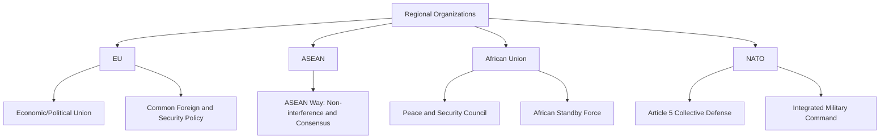

## Regional Organizations: EU, ASEAN, African Union, and NATO

### Overview

Regional organizations occupy the institutional layer between individual states and universal bodies like the UN, and they vary enormously in their degree of legal integration, decision-making rules, and enforcement capacity. For geopolitical risk analysts, regional organizations function as both risk-dampening mechanisms (through institutionalized dispute resolution and collective deterrence) and risk-transmission channels (through contagion effects when one member's crisis triggers bloc-wide instability). Understanding each organization's decision rules, membership dynamics, and institutional depth is essential for forecasting how regional crises will be managed or amplified.

### Comparative Institutional Snapshot

| Organization | Founded | Members (approx.) | Primary Domain | Decision Rule |
| --- | --- | --- | --- | --- |
| European Union (EU) | 1993 (Maastricht); roots to 1957/1951 | 27 | Economic integration, political union, single market | Mixed: unanimity (CFSP, treaty change), qualified majority voting (most single-market law) |
| ASEAN | 1967 | 10 | Regional economic/political cooperation | Consensus (strict unanimity norm) |
| African Union (AU) | 2002 (successor to OAU, 1963) | 55 | Continental political/economic integration, peace and security | Consensus preferred; majority voting available for some matters |
| NATO | 1949 | 32 | Collective military defense | Consensus/unanimity |

### European Union (EU)

**Institutional Architecture**

- Evolved from the European Coal and Steel Community (1951) through the European Economic Community (1957/Treaty of Rome) to the EU proper under the Maastricht Treaty (1993), with the Lisbon Treaty (2009) as the current constitutional framework
- Core institutions: European Council (heads of state/government, strategic direction), Council of the EU (ministerial, legislative co-decision), European Parliament (directly elected, co-legislator), European Commission (executive/agenda-setting, sole legislative initiator), Court of Justice of the EU (binding supranational adjudication)
- Distinguished from all other regional organizations on this list by its degree of **supranationalism**: EU law has direct effect and primacy over conflicting national law in areas of EU competence, enforced by a court with binding jurisdiction over member states

**Key Points**

- Common Foreign and Security Policy (CFSP) remains governed by **unanimity**, meaning any single member state can block collective foreign policy action — a persistent structural constraint on EU geopolitical actorness despite economic and regulatory power
- The single market and most internal legislation operate under **Qualified Majority Voting (QMV)**, a weighted system requiring a defined threshold of member states and population share
- Enlargement and treaty amendment require unanimous ratification by all member states, giving any single member effective veto leverage over EU expansion or constitutional change
- [Inference] The unanimity requirement on CFSP is a recurring analytic focal point, since it means EU external action capacity is structurally bottlenecked by its most reluctant or most exposed member on any given foreign policy file, making EU collective action predictions highly sensitive to identifying which member state holds the marginal veto position

**Example**

A sanctions package against a third country requires unanimous Council agreement; a single member state with significant bilateral economic exposure to the target state can delay or dilute the measure, producing a weaker collective instrument than aggregate EU economic leverage would otherwise suggest — a standard risk-analytic caveat when estimating the EU's coercive economic statecraft capacity from GDP or trade-share figures alone.

### ASEAN (Association of Southeast Asian Nations)

**Institutional Architecture**

- Founded 1967 (Bangkok Declaration) by Indonesia, Malaysia, Philippines, Singapore, and Thailand; expanded to 10 members
- Governed by the **ASEAN Charter** (2008), which formalized but did not fundamentally alter the organization's consensus-based, non-interventionist operating norms
- Institutionally thin relative to the EU: no supranational court with binding jurisdiction over members, no directly elected parliament, limited pooled sovereignty

**Key Points**

- Operates under the **"ASEAN Way"**: strict consensus decision-making and a strong non-interference norm regarding members' internal affairs, prioritizing sovereignty preservation and non-confrontational diplomacy over binding collective action
- This design deliberately trades institutional depth for inclusiveness, allowing ASEAN to maintain cohesion across members with widely varying regime types, economic development levels, and external great-power alignments
- ASEAN Centrality is a recurring principle in the organization's diplomatic architecture, referring to ASEAN's self-positioned role as the convening hub for broader regional security dialogues (ASEAN Regional Forum, East Asia Summit, ASEAN+3) amid great-power competition between the US and China in the Indo-Pacific
- [Inference] The consensus rule means ASEAN's collective statements on sensitive geopolitical issues (e.g., South China Sea disputes) are systematically calibrated to the most cautious or most externally aligned member, limiting the bloc's capacity for unified positions on contested security matters even where a majority of members share concerns

### African Union (AU)

**Institutional Architecture**

- Established 2002, succeeding the Organisation of African Unity (OAU, founded 1963), with an explicit mandate shift from strict non-interference toward a **"non-indifference"** principle permitting intervention in cases of grave circumstances
- Core organs: Assembly of Heads of State and Government, Executive Council, Peace and Security Council (PSC), Pan-African Parliament, African Court on Human and Peoples' Rights, AU Commission (secretariat)
- The **Peace and Security Council** is the AU's most operationally significant body for risk analysis, modeled functionally on the UN Security Council but with a broader, rotating elected membership and no permanent-member veto structure

**Key Points**

- Article 4(h) of the AU Constitutive Act formally establishes the Union's right to intervene in a member state in respect of grave circumstances — war crimes, genocide, crimes against humanity — a significant normative departure from the OAU's strict non-interference doctrine and from ASEAN's continuing non-interference norm
- The **African Standby Force** concept provides a framework for AU-mandated peace-support operations, though actual deployment capacity has historically depended heavily on external funding and logistics support (notably EU and UN funding mechanisms)
- The AU frequently operates in a **subsidiarity relationship** with the UN Security Council on peace-and-security matters, with AU-authorized or AU-led missions often seeking or receiving UN Chapter VIII-consistent endorsement or hybrid financing arrangements
- [Inference] The Article 4(h) intervention norm represents a more solidarist institutional design (in English School terms) than the strict pluralist non-interference norms governing ASEAN, reflecting differing regional historical experiences with civil conflict, mass atrocity, and external intervention debates

### NATO (North Atlantic Treaty Organization)

**Institutional Architecture**

- Founded 1949 under the North Atlantic Treaty, originally as external balancing against Soviet power in Europe
- Core institutions: North Atlantic Council (principal political decision-making body), Military Committee, integrated command structure (Supreme Allied Commander Europe/ACO), Secretary General (political leadership, not commander)
- The only organization on this list built around a **binding mutual-defense commitment**

**Key Points**

- **Article 5** establishes that an armed attack against one or more members is considered an attack against all, though the specific response each member provides remains a matter of national decision under the treaty's actual text — Article 5 obligates consultation and response but does not mandate automatic military action by every member
- **Article 4** allows any member to request consultations when it perceives its territorial integrity, political independence, or security threatened — a lower-threshold mechanism frequently invoked prior to any Article 5 determination and itself a useful risk-analytic signal of rising alliance-level threat perception
- Decision-making operates by consensus among all members, meaning enlargement, out-of-area operations, and major strategic concept revisions require unanimous member agreement, creating veto leverage for individual members over collective alliance decisions (structurally analogous to EU unanimity dynamics, though in the security rather than economic domain)
- Post-Cold War strategic concept evolution has expanded NATO's operational scope beyond core Article 5 territorial defense to include out-of-area crisis-response operations, partnership frameworks (Partnership for Peace, individual partnership programs), and increasingly China-related strategic assessments in recent Strategic Concepts

**Example**

A member state's invocation of Article 4 consultations following a perceived hybrid or conventional threat is a standard early-warning risk indicator, since it signals formal alliance-level threat escalation prior to any determination on Article 5 applicability, and often precedes force posture adjustments, forward deployments, or intelligence-sharing escalation among allied states.

### Cross-Organizational Comparative Analysis

**1. Decision Rules and Collective Action Capacity**

- Consensus/unanimity requirements (ASEAN, NATO, EU-CFSP, AU-preferred) systematically privilege the most cautious or most exposed member, producing a structural "lowest common denominator" dynamic in collective foreign/security policy output
- [Inference] This shared design feature across otherwise very different organizations suggests risk analysts should treat "bloc position" forecasts with an explicit veto-holder identification step rather than aggregating member preferences as if majority sentiment determines collective output

**2. Supranationalism vs. Intergovernmentalism**

- The EU is uniquely supranational among the four, with binding law and court enforcement; ASEAN, the AU, and NATO all remain fundamentally intergovernmental, relying on member-state compliance rather than supranational legal enforcement
- This distinction directly affects sanctions/enforcement credibility: EU sanctions carry binding domestic legal force across all 27 members once agreed, whereas AU or ASEAN collective measures depend more heavily on voluntary member implementation

**3. Enlargement as a Strategic Signal**

- NATO and EU enlargement processes are both closely tracked geopolitical indicators, since accession candidacy and membership action plans function as strong signals of a state's long-term strategic alignment and frequently trigger anticipatory reactions from excluded major powers (a recurring dynamic in security-complex analysis)

### Interaction with Great-Power Competition

**Key Points**

- NATO enlargement and EU association/accession processes in Eastern Europe have been persistent flashpoints in great-power relations, illustrating how regional-organization membership decisions function as balancing/bandwagoning signals at the state level (see Balance of Power vs. Bandwagoning)
- ASEAN Centrality is explicitly maintained as a hedging mechanism amid intensifying US-China strategic competition in the Indo-Pacific, allowing individual members to avoid binary alignment choices through the bloc's institutionalized neutrality posture
- AU peace-and-security operations increasingly intersect with competition among external funders and partners (EU, US, Gulf states, China, Russia via Wagner-linked and successor arrangements) for influence over African security architecture, a factor relevant to assessing intervention/stabilization mission durability
- [Unverified] The relative long-run trajectory of each organization's institutional depth (further EU integration, ASEAN Charter reform, AU Agenda 2063 implementation, NATO strategic concept evolution) is subject to considerable member-state political contingency and is not reliably projectable through institutional design analysis alone

### Critiques and Limitations

- **EU**: Democratic deficit critiques regarding Commission agenda-setting power; persistent north-south and east-west policy divergence within the bloc; CFSP unanimity criticized as producing strategic paralysis relative to the bloc's aggregate economic weight
- **ASEAN**: Non-interference norm criticized for limiting effective collective response to internal member crises (e.g., recurring criticism regarding the bloc's response mechanisms to Myanmar's post-2021 internal crisis)
- **AU**: Chronic dependency on external funding for peace-support operations raises sustainability and sovereignty-of-agenda concerns; implementation gaps between AU normative frameworks (Article 4(h), Agenda 2063) and operational capacity are widely documented
- **NATO**: Burden-sharing disputes among members regarding defense-spending targets recur as a persistent alliance-cohesion stress point; consensus requirement creates enlargement and operational vulnerabilities analogous to EU unanimity constraints

### Next Steps

- **Related Topics**: NATO Article 5 vs. Article 4 mechanics; EU Common Foreign and Security Policy and Qualified Majority Voting; ASEAN Centrality and Indo-Pacific strategic hedging; African Union Article 4(h) and the Responsibility to Protect; regional security complex theory (Buzan/Wæver); enlargement as a geopolitical signal; burden-sharing disputes in alliance politics; subsidiarity between regional organizations and the UN Security Council