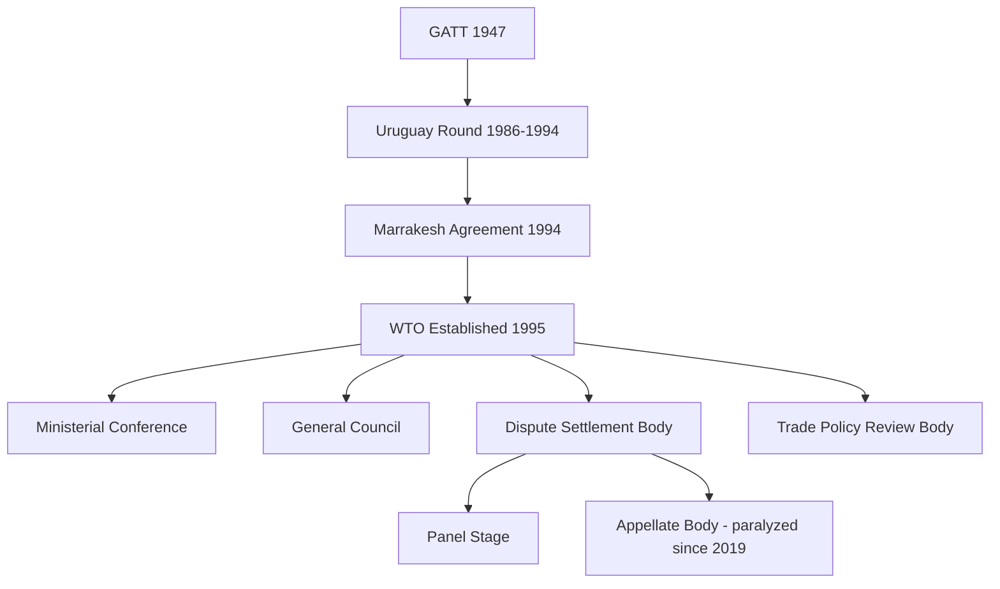

## The World Trade Organization and Multilateral Trade Rules

### Overview

The World Trade Organization is the central institutional pillar of the multilateral trading system, providing the legal framework, negotiating forum, and binding dispute-settlement mechanism governing international trade. For geopolitical risk analysts, the WTO matters as both a rules-based constraint on state economic behavior and as an increasingly strained institution whose functional erosion — particularly the paralysis of its dispute-settlement Appellate Body — is itself a significant risk signal regarding the broader trajectory of the rules-based multilateral order.

### Origins and Institutional Architecture

**Key Points**

- The WTO was established January 1, 1995, under the Marrakesh Agreement, succeeding the General Agreement on Tariffs and Trade (GATT, 1947), which had operated as a provisional treaty framework without a permanent institutional structure
- Unlike GATT, the WTO is a full international organization with legal personality, a permanent Secretariat, and — critically — a binding, enforceable dispute-settlement system
- Current membership stands at 166 members (as of the most recent accessions), encompassing the substantial majority of global trade
- Governed by consensus decision-making as the default rule, with voting (one country, one vote) available but rarely invoked in practice for substantive decisions

### Core Principles of the Multilateral Trade System

**1. Most-Favored-Nation (MFN) Treatment**

Members must extend the same favorable trade terms granted to any one trading partner to all other WTO members, preventing discriminatory bilateral favoritism outside permitted exceptions (e.g., free trade agreements under GATT Article XXIV).

**2. National Treatment**

Imported goods, once past the border and applicable tariffs, must be treated no less favorably than domestically produced like goods under internal taxation and regulation.

**3. Reciprocity**

Trade liberalization commitments are negotiated as mutual concessions, with tariff bindings representing negotiated ceilings that members commit not to exceed.

**4. Transparency**

Members must publish trade regulations and notify the WTO of relevant measures, supporting predictability for other members and traders.

**5. Special and Differential Treatment**

Developing and least-developed country members receive longer implementation timelines, technical assistance provisions, and certain flexibility in commitment levels, though the scope and self-designation of "developing country" status has become a significant point of contention among major economies.

### Institutional Structure

| Body | Function |
| --- | --- |
| Ministerial Conference | Highest decision-making body; meets roughly every two years |
| General Council | Conducts WTO's regular business between Ministerial Conferences; also convenes as Dispute Settlement Body and Trade Policy Review Body |
| Dispute Settlement Body (DSB) | Administers dispute settlement rules and procedures |
| Councils for Trade in Goods, Services, and TRIPS | Oversee implementation of respective covered agreements |
| Secretariat | Administrative support; does not have independent decision-making authority (distinguishing the WTO from more supranational bodies like the EU Commission) |

### The Dispute Settlement System

**Key Points**

- Historically regarded as the WTO's most significant institutional innovation relative to GATT: a binding, largely automatic adjudication process with negative consensus rules (a panel/Appellate Body ruling is adopted unless *all* members, including the winning party, agree to block it — making blocking essentially impossible)
- Standard process: consultations, panel establishment and ruling, and (previously) Appellate Body review of panel legal findings, followed by compliance monitoring and, if necessary, authorized retaliation (suspension of concessions)
- The **Appellate Body** has been non-functional since December 2019 due to the United States blocking the appointment of new members, leaving it without the quorum required to hear appeals — a structural paralysis that persists as of the most recent multilateral trade governance assessments
- The **Multi-Party Interim Appeal Arbitration Arrangement (MPIA)**, established 2020 among a subset of WTO members, functions as a voluntary workaround providing appeal-equivalent arbitration among participating members only, but does not restore universal binding appellate review across the full membership

[Inference] The Appellate Body's paralysis significantly weakens the WTO's core enforcement value proposition, since panel rulings can now effectively be "appealed into the void" by any losing party choosing to appeal to a non-functioning body, indefinitely blocking legal finality — a structural vulnerability directly relevant to assessing the credibility of WTO-based trade dispute resolution as a stabilizing mechanism in the current risk environment.

### Trade Remedies and Exceptions

**1. Anti-Dumping Measures**

Permit tariffs on imports priced below fair value causing material injury to a domestic industry, subject to WTO-consistent investigation procedures.

**2. Countervailing Duties**

Offset the effect of foreign government subsidies found to cause injury to a domestic industry.

**3. Safeguard Measures**

Allow temporary trade restrictions in response to a surge in imports causing serious injury, applied on an MFN basis (unlike anti-dumping/countervailing measures, which target specific sources).

**4. General Exceptions (GATT Article XX)**

Permit trade-restrictive measures justified on specified public-policy grounds (public morals, health, exhaustible natural resources, among others), subject to a chapeau test preventing arbitrary or disguised protectionism.

**5. Security Exceptions (GATT Article XXI)**

Permit measures a member considers necessary for the protection of its essential security interests — a provision of growing geopolitical significance as states increasingly invoke national-security rationales for trade restrictions on strategic goods (semiconductors, critical minerals, dual-use technology).

**Example**

A member imposing export controls on advanced semiconductor manufacturing equipment on national-security grounds invokes Article XXI; because panels have historically been reluctant to substitute their judgment for a member's self-declared security interest (though not fully unreviewable, per relevant panel jurisprudence), Article XXI increasingly functions as a practical escape valve from binding trade discipline for strategically sensitive sectors — a key mechanism analysts track when assessing the compatibility of industrial and technology statecraft with formal WTO commitments.

### Covered Agreements

| Agreement | Scope |
| --- | --- |
| GATT 1994 | Trade in goods |
| GATS (General Agreement on Trade in Services) | Trade in services |
| TRIPS (Trade-Related Aspects of Intellectual Property Rights) | Intellectual property protection standards |
| Agreement on Agriculture | Agricultural trade, subsidies, market access |
| SPS Agreement | Sanitary and phytosanitary measures |
| TBT Agreement | Technical barriers to trade |
| Plurilateral Agreements (e.g., Government Procurement) | Binding only on subset of members who opt in |

### The Doha Round Impasse and Negotiating Function Erosion

**Key Points**

- The Doha Development Round, launched in 2001, aimed at a comprehensive multilateral liberalization package with a strong development focus, but has not been concluded despite two decades of negotiation, reflecting persistent divergence among major members (particularly the US, EU, and large developing economies including India and China) over agricultural subsidies, market access, and special/differential treatment scope
- The round's effective stalemate has shifted much substantive trade liberalization activity toward preferential and regional trade agreements (bilateral and plurilateral FTAs) operating alongside, rather than through, the multilateral WTO framework
- More recent WTO agreements (e.g., Trade Facilitation Agreement 2013/2017, Fisheries Subsidies Agreement 2022) represent narrower, issue-specific successes rather than comprehensive round completion, suggesting an institutional shift toward incremental plurilateral or sectoral deals
- [Inference] The combination of Appellate Body paralysis and prolonged negotiating-function stagnation constitutes a broader pattern of WTO institutional erosion that risk analysts should weigh separately from formal membership commitments, since de facto trade governance increasingly occurs through bilateral leverage, regional agreements, and unilateral national-security exceptions rather than through binding multilateral adjudication

### WTO and Great-Power Economic Competition

**1. Accession as Geopolitical Signal**

China's WTO accession in 2001 remains the most consequential accession in the organization's history, and subsequent debates over whether China has fulfilled market-economy and state-subsidy commitments under its accession protocol are a recurring source of major-power trade friction, reflected in the still-unresolved debate over China's non-market economy status treatment in trade-remedy calculations by certain members.

**2. Industrial Policy and Subsidy Discipline**

Rising use of industrial subsidies (particularly in strategic sectors: semiconductors, clean energy, critical minerals) by major economies has intensified debate over the adequacy of existing WTO subsidy disciplines (the Agreement on Subsidies and Countervailing Measures) for addressing large-scale state-directed industrial policy, a domain where multilateral rule-updating has lagged behind state practice.

**3. Weaponization of Trade Exceptions**

The increasing invocation of national-security exceptions (Article XXI) and export-control regimes for strategically sensitive technologies reflects a broader "geoeconomic" turn in which trade policy instruments are deployed explicitly for strategic competition purposes rather than purely economic objectives — a trend with direct implications for assessing the durability of rules-based trade governance amid great-power competition.

### Comparative Positioning: WTO vs. Preferential Trade Agreements

| Dimension | WTO Multilateral System | Preferential/Regional Trade Agreements |
| --- | --- | --- |
| Membership scope | Near-universal (166 members) | Limited to signatories |
| Enforcement | Binding dispute settlement (weakened by Appellate Body paralysis) | Varies by agreement; some include binding arbitration |
| Liberalization depth | Broad but shallow (lowest common denominator across large membership) | Can be deeper (services, investment, IP, labor/environment provisions) |
| Negotiating pace | Slow, effectively stalled since Doha | Faster, more flexible among smaller coalitions |
| Geopolitical function | Universal baseline rules | Often used as strategic alignment/bloc-building tool |

### Critiques and Limitations

- **Enforcement crisis**: Appellate Body paralysis is widely regarded as the single most acute institutional crisis facing the WTO, with reform proposals (including the MPIA) providing only partial, non-universal mitigation
- **Negotiating function atrophy**: The prolonged failure to conclude the Doha Round and subsequent shift to narrower plurilateral deals raises questions about the WTO's continued capacity to serve as the primary venue for comprehensive multilateral trade liberalization
- **Development and equity critique**: Ongoing disputes over special and differential treatment eligibility and agricultural subsidy asymmetries (particularly regarding advanced-economy versus developing-country agricultural support) remain unresolved sources of negotiating gridlock
- [Unverified] The long-run trajectory of the WTO — whether it stabilizes as a narrower rules-enforcement body, undergoes significant institutional reform, or continues gradual functional erosion relative to bilateral/regional and geoeconomic tools — remains genuinely contested among trade policy analysts and is not resolvable through institutional design analysis alone

### Next Steps

- **Related Topics**: GATT Article XXI and the security exception in trade law; the Appellate Body crisis and the Multi-Party Interim Appeal Arrangement; China's WTO accession protocol and non-market economy disputes; industrial policy and the Agreement on Subsidies and Countervailing Measures; export controls and technology statecraft (semiconductors, critical minerals); regional and preferential trade agreements as geoeconomic alignment tools; the Doha Development Round and negotiating-function erosion; geoeconomics and the weaponization of interdependence