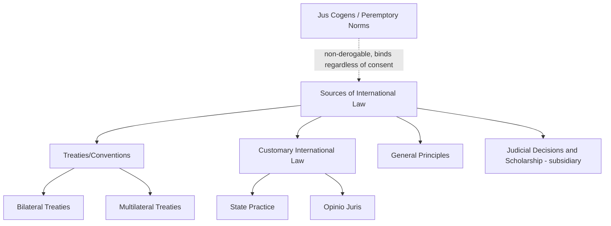

## International Law as a Constraint on State Behavior

### Overview

International law occupies a distinctive and theoretically contested position among constraints on state behavior: it lacks a central enforcement authority analogous to domestic legal systems, yet states overwhelmingly comply with it in the vast majority of cases. For geopolitical risk analysts, understanding *why* and *under what conditions* international law constrains state behavior — and, critically, when and how that constraint breaks down — is essential for calibrating predictions about treaty compliance, territorial disputes, use-of-force decisions, and the durability of negotiated settlements.

### Sources of International Law

**Key Points**

- Codified in **Article 38(1) of the Statute of the International Court of Justice**, the canonical (though not exclusive) enumeration of sources:
  1. International conventions/treaties (explicit consent-based obligations)
  2. International custom, as evidence of a general practice accepted as law (customary international law, requiring both consistent state practice and *opinio juris* — a sense of legal obligation)
  3. General principles of law recognized by civilized nations
  4. Judicial decisions and the teachings of highly qualified publicists, as subsidiary means for determining rules of law
- **Jus cogens** (peremptory norms) constitute a distinct category of customary international law from which no derogation is permitted, even by treaty (e.g., prohibitions on genocide, slavery, torture, aggression) — these norms bind states regardless of consent

### Theoretical Debates: Why Do States Comply?

**1. Realist Skepticism**

Classical Realism treats international law as epiphenomenal to power — states comply when compliance aligns with interest and disregard law when vital interests are at stake, with law functioning primarily as post-hoc rationalization rather than genuine constraint.

**2. Rational Institutionalist / Liberal View**

States comply because international law reduces transaction costs, provides focal points for coordination, enables credible commitment, and generates reputational capital valuable for future cooperation — compliance is interest-based but law genuinely shapes the calculation of interest.

**3. Constructivist / English School View**

International law is constitutive of state identity and international society itself — compliance reflects internalized normative commitment and the "logic of appropriateness," not merely cost-benefit calculation. This aligns closely with the English School's treatment of international law as one of Bull's core institutions of international society.

**4. Managerial/Compliance School (Chayes and Chayes)**

Most non-compliance stems not from willful defection but from ambiguity, capacity limitations, and time lags in treaty implementation — the system's design should therefore focus on managing compliance through transparency and capacity-building rather than coercive enforcement.

**5. Legal Process/Transnational Legal Process (Koh)**

Compliance emerges through repeated interaction, interpretation, and internalization of legal norms into domestic legal and political systems over time, rather than through a single compliance decision.

**Key Points**

- [Inference] These theories are not strictly mutually exclusive; empirically, different compliance mechanisms likely dominate in different issue-areas — reputational and institutionalist logics appear to carry more explanatory weight in trade and investment law, while power-political calculation appears more dominant in core security and territorial matters

### Mechanisms of Enforcement (Absent Central Authority)

| Mechanism | Description | Effectiveness Profile |
| --- | --- | --- |
| Reciprocity | Non-compliance invites reciprocal non-compliance by other parties | Strong in symmetric, repeated-interaction regimes (trade, diplomatic law) |
| Reputational cost | Non-compliance damages a state's credibility for future agreements | Moderate; varies with regime type and audience costs |
| Institutionalized dispute settlement | Binding adjudication (WTO DSB, ICJ, investment arbitration) | Strong where compliance is itself low-cost; weaker on core sovereignty/security issues |
| Countermeasures | Lawful unilateral response to another state's breach (e.g., suspension of reciprocal obligations) | Available under customary law (Articles on State Responsibility) but self-help in nature |
| Third-party sanctions | Collective punitive measures imposed by other states or organizations | Effectiveness varies widely; often politically selective |
| Domestic incorporation | International obligations enforced through domestic courts and legislatures | Strong in dualist/monist systems with robust rule-of-law institutions |

### The ICJ and International Adjudication

**Key Points**

- The International Court of Justice adjudicates disputes between consenting states (contentious jurisdiction, based on state consent via special agreement, treaty clause, or optional clause declarations under Article 36) and issues non-binding advisory opinions at the request of authorized UN organs
- ICJ judgments in contentious cases are binding on the parties (UN Charter Article 94), but enforcement in the event of non-compliance requires Security Council action — itself subject to P5 veto, creating a structural enforcement gap for judgments against or implicating permanent members or their close allies
- Not all states accept compulsory ICJ jurisdiction under the Optional Clause, and many that do attach significant reservations, meaning a substantial portion of potential interstate disputes fall outside the Court's compulsory reach absent specific consent
- Distinct from the **International Criminal Court (ICC)**, which addresses individual criminal responsibility (genocide, crimes against humanity, war crimes, aggression) rather than state responsibility, and which lacks universal jurisdiction — its jurisdiction depends on territoriality, nationality of the accused, State Party status, or UN Security Council referral

**Example**

A state that loses an ICJ contentious case but declines to comply faces no automatic enforcement mechanism beyond the prevailing party's option to seek Security Council action under Article 94(2) — itself vulnerable to veto if the non-complying state is a P5 member or a P5 member's closely aligned partner, illustrating the direct structural link between Security Council power politics and the practical enforceability of international judicial rulings.

### State Responsibility and Breach

**Key Points**

- Governed primarily by the International Law Commission's **Articles on Responsibility of States for Internationally Wrongful Acts** (2001, widely regarded as reflecting customary international law despite not being adopted as a binding treaty)
- An internationally wrongful act requires: (1) conduct attributable to the state under international law, and (2) a breach of an international obligation
- Available responses to breach include: countermeasures (proportionate, reversible unilateral measures by an injured state), retorsion (unfriendly but lawful acts, such as downgrading diplomatic relations), and collective responses through international organizations
- **Erga omnes** obligations (owed to the international community as a whole, e.g., prohibitions on genocide and aggression) permit any state — not only directly injured parties — to invoke state responsibility, a distinct feature relevant to assessing which international actors have legal standing to respond to grave violations

### Compliance Variation Across Issue-Areas

**1. High Compliance Domains**

Diplomatic law (embassy immunity), commercial/trade law, investment arbitration awards, and technical regulatory regimes generally show high compliance rates, reflecting strong reciprocity incentives, institutionalized dispute mechanisms, and relatively low sovereignty sensitivity.

**2. Contested Compliance Domains**

Human rights law shows highly variable compliance depending on regime type, domestic institutional strength, and the presence of monitoring/enforcement mechanisms (regional human rights courts show notably higher compliance rates in jurisdictions with strong domestic rule-of-law traditions).

**3. Low Compliance Under Existential Pressure**

Core security law — particularly the UN Charter's prohibition on the use of force (Article 2(4)) outside self-defense (Article 51) or Security Council authorization — shows the most contested compliance record, with states routinely invoking expansive self-defense or humanitarian justifications for military action of disputed legality.

[Inference] This pattern of compliance variation suggests that international law's constraining force operates on a gradient closely correlated with the perceived stakes to core state security and survival interests — a finding broadly consistent with both Realist skepticism about law's binding force in high-stakes security matters and Rationalist/English School claims about law's genuine constraining role in lower-stakes, higher-reciprocity domains.

### Use of Force: The Hardest Case

**Key Points**

- UN Charter Article 2(4) prohibits the threat or use of force against the territorial integrity or political independence of any state, with only two universally recognized exceptions: individual/collective self-defense under Article 51 (pending Security Council action) and Security Council authorization under Chapter VII
- Contested doctrines expanding beyond these textual exceptions include anticipatory/preemptive self-defense, humanitarian intervention absent Security Council authorization, and the Responsibility to Protect (R2P) doctrine — each remains legally disputed among states and scholars rather than settled law
- State practice on use-of-force legality is a recurring focal point for assessing the erosion or resilience of core Charter-era legal constraints, since departures by powerful states (whether justified or not) generate precedent-setting pressure independent of formal legal outcomes

**Example**

When a major power justifies military action under an expansive self-defense or humanitarian rationale not clearly supported by prevailing legal interpretation, the resulting state practice and the reaction of other states (acquiescence, condemnation, selective invocation of similar justification in unrelated contexts) becomes itself a data point in the evolution of customary international law — meaning analysts should track not only the legality of a given action but the pattern of subsequent state responses as an indicator of whether a new customary norm is consolidating or the existing prohibition is being reaffirmed.

### International Law as a Risk-Analytic Tool

**Key Points**

- **Treaty commitment depth** (reservations, denunciation clauses, domestic ratification requirements) is a standard input for assessing the credibility of a state's international commitments
- **Compliance track record** in a given issue-area is a stronger predictor of future compliance than the formal legal text alone — a state's history of reservations, non-implementation, or selective compliance in a domain is informative independent of its nominal treaty obligations
- **Domestic incorporation mechanisms** (monist vs. dualist legal systems, judicial independence, legislative implementing authority) materially affect the practical bindingness of international obligations within a given state
- **Legal justification patterns** for disputed state actions (a state investing significant diplomatic and legal resources into justifying an action under international law, versus simply disregarding legal framing) are themselves informative about that state's continued investment in the legitimacy value of the rules-based order

### Critiques and Limitations

- **Compliance-pull skepticism**: Realist and some rational-choice scholars argue observed compliance largely reflects convergence between legal obligation and independently existing state interest, rather than law exerting independent causal constraint — a methodologically difficult claim to fully adjudicate empirically
- **Selective enforcement critique**: Enforcement and accountability mechanisms (Security Council referral, sanctions, ICC jurisdiction) are widely noted to apply asymmetrically, correlating with the relative power of the alleged violator rather than uniformly with the severity of violation
- **Fragmentation concern**: The proliferation of specialized international legal regimes (trade, investment, human rights, environmental, law of the sea) with distinct dispute-resolution bodies raises concerns about doctrinal fragmentation and inconsistent interpretation across regimes
- [Unverified] The precise causal weight of legal obligation versus underlying interest convergence in driving observed state compliance rates remains a genuinely open empirical and methodological question in the international law and international relations literature, without clean resolution

### Next Steps

- **Related Topics**: The English School and international society (international law as a Bullian institution); customary international law formation and opinio juris; the ICJ vs. ICC jurisdictional distinction; Articles on State Responsibility and countermeasures; UN Charter Article 2(4) and the use-of-force regime; Responsibility to Protect (R2P) doctrine; jus cogens and erga omnes obligations; treaty reservations and denunciation as commitment-credibility signals; compliance theory (managerial, transnational legal process, rational institutionalist approaches)