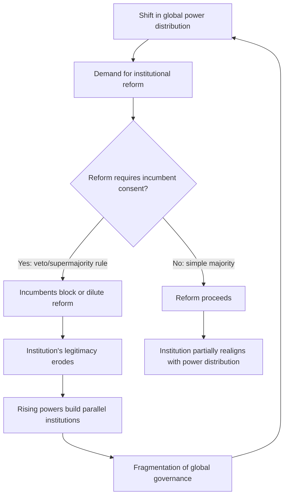

## Institutional Gridlock and Reform Debates

### Definition and Conceptual Scope

Institutional gridlock refers to the structural inability of international institutions—the UN Security Council, IMF, World Bank, WTO, and similar bodies—to adapt decision-making rules, membership structures, or operational mandates in response to shifts in global power distribution. Reform debates encompass the recurring, often decades-long negotiations aimed at resolving this mismatch between institutional design (frozen at the moment of founding) and contemporary geopolitical realities.

For geopolitical risk analysis, gridlock is a risk multiplier: it degrades the capacity of multilateral bodies to manage crises (pandemics, financial contagion, armed conflict), pushes states toward unilateral or minilateral alternatives, and creates legitimacy deficits that adversarial powers exploit rhetorically.

### Historical Origins of Gridlock

**Key Points**

- Most major post-1945 institutions encode a power distribution that no longer reflects current economic or demographic weight.
- Reform requires supermajorities or unanimity among incumbents who benefit from the status quo, creating a structural veto against change.

The UN Security Council's five permanent members (P5) reflect 1945 victor-power status, not 2026 GDP, population, or military capability rankings. The IMF and World Bank quota systems, though revised multiple times (notably in 2010 and 2015), still underweight China, India, and other emerging economies relative to their share of global output. The WTO's consensus-based decision rule, designed for a smaller membership with more homogeneous interests, has produced near-total paralysis in the Doha Round (launched 2001, effectively dead by the mid-2010s).

### Mechanisms That Produce Gridlock

**Veto and Blocking Power**

Formal veto rights (UN Security Council P5) or de facto blocking thresholds (IMF's 85% supermajority requirement, which gives the United States alone an effective veto given its ~16-17% voting share) allow single or small groups of states to prevent reform regardless of broader membership preference.

**Consensus Requirements**

The WTO requires consensus for major rule changes. As membership grew from 23 GATT founding members to 160+ WTO members with sharply divergent development levels and interests, achieving consensus on new disciplines (agriculture, e-commerce, industrial subsidies) became progressively harder.

**Ratification Thresholds**

Charter amendments to the UN Charter require ratification by two-thirds of the General Assembly, including all five permanent Security Council members (UN Charter Article 108). This nests a veto inside a supermajority requirement, compounding the difficulty.

**Distributional Conflict**

Reform is rarely positive-sum. Expanding Security Council permanent seats, or reweighting IMF quotas, necessarily reduces the relative influence of incumbents. States with the leverage to block change have limited incentive to trade away that leverage.

### Illustrative Diagram: Gridlock Feedback Loop

### Case Study: UN Security Council Reform

**Key Points**

- Reform proposals have circulated since the early 1990s (post-Cold War membership surge) without structural change to the P5.
- The G4 (Brazil, Germany, India, Japan), the African Union's Ezulwini Consensus, and the Uniting for Consensus group (Italy, Pakistan, and others opposing new permanent seats) represent competing, mutually blocking reform coalitions.

Intergovernmental Negotiations (IGN) on Security Council reform have run continuously since 2008 without a text-based negotiation format that most reform advocates consider necessary for progress. The core obstacle is that any expansion of permanent seats requires the consent of the existing P5, at least one of which (typically the United States, Russia, or China, depending on the proposal) has historically resisted specific candidate additions.

**Example**

A G4 proposal to add Brazil, Germany, India, and Japan as new permanent members without veto power has been repeatedly blocked, in part because regional rivals (Pakistan opposing India, Italy opposing Germany, Argentina/Mexico opposing Brazil) mobilize Uniting for Consensus opposition, and in part because P5 members are reluctant to dilute their relative standing even when the proposed new members would lack veto rights.

### Case Study: IMF and World Bank Quota Reform

The IMF's 2010 Quota and Governance Reform, agreed in principle in 2010, was not ratified by the U.S. Congress until December 2015—a five-year delay attributable to domestic legislative gridlock rather than IMF-level disagreement, illustrating how national ratification processes compound international gridlock. Even after ratification, the reform only modestly rebalanced quota shares; China's voting share rose but remained well below its share of global GDP on a purchasing-power-parity basis. Discussions for a 16th General Review of Quotas continued through the 2020s without resolving the underlying underrepresentation issue.

### Case Study: WTO Dispute Settlement Paralysis

**Key Points**

- The WTO Appellate Body ceased functioning in December 2019 after the United States blocked the appointment of new judges, citing concerns about judicial overreach.
- This is a case of gridlock operating through appointment-blocking rather than formal veto or amendment procedures.

Because Appellate Body members are appointed by consensus of the Dispute Settlement Body, a single member's sustained objection—sustained by the U.S. across both the Obama and Trump administrations—can and did render the appellate mechanism non-functional. Members created the Multi-Party Interim Appeal Arbitration Arrangement (MPIA) as a workaround, but as a plurilateral opt-in mechanism it does not restore universal binding appellate review. [Inference: Whether reform proposals under discussion at the WTO Ministerial Conferences will restore a fully functioning two-tier dispute settlement system by any specific date remains contested and depends on unresolved U.S. policy positions.]

### Theoretical Frameworks for Analyzing Gridlock

**Historical Institutionalism**

Emphasizes "lock-in" and path dependency: institutions designed for one distribution of power persist because the transaction costs of renegotiation are high and incumbents control the renegotiation process itself.

**Rational Design Theory**

Argues that institutional design features (flexibility, scope, control mechanisms) are chosen deliberately by founding states to serve their interests, and that reform difficulty is often a designed feature, not an accident—hard-to-amend rules provide credible commitment value precisely because they cannot be easily changed.

**Power Transition Theory**

Frames gridlock as a symptom of the gap between an institution's formal power distribution and the underlying material power distribution among states; the wider this gap grows, the greater the pressure for either reform or institutional bypass.

**Regime Complexity / Fragmentation Theory**

Focuses on the consequence side: when reform fails, actors do not simply accept the status quo—they build parallel or overlapping institutions (forum-shopping, competitive regime creation), producing a denser but less coherent governance landscape.

### Institutional Bypass as a Response to Gridlock

**Key Points**

- When formal reform fails, dissatisfied powers frequently construct alternative institutions rather than continuing to negotiate within blocked structures.
- This does not resolve gridlock; it displaces activity into parallel venues, often reducing the original institution's centrality and leverage.

Examples of bypass institutions built partly in response to perceived underrepresentation or blockage in incumbent bodies include the New Development Bank (NDB, founded by BRICS states in 2014) and the Asian Infrastructure Investment Bank (AIIB, founded in 2016), both frequently interpreted as responses to slow or insufficient World Bank/IMF governance reform. The G20's elevation as a premier forum for global economic coordination after the 2008 financial crisis likewise reflected dissatisfaction with the G7's narrower membership, though the G20 itself operates by consensus and is subject to its own coordination difficulties.

### Analytical Indicators for Risk Assessment

When assessing gridlock risk in a given institution, analysts typically examine:

- **Decision rule stringency**: unanimity or supermajority thresholds versus simple majority
- **Veto distribution**: formal (charter-based) versus informal (appointment-blocking, budget leverage)
- **Membership heterogeneity**: divergence in interests, development level, and strategic alignment among members
- **Power-representation gap**: divergence between formal voting/seat shares and material indicators (GDP, population, military capability, trade volume)
- **Exit and bypass options**: availability and credibility of alternative institutions that dissatisfied members could construct or join
- **External shock exposure**: whether crises (financial, pandemic, security) are increasing pressure for rapid adaptation that the institution's decision rules cannot accommodate

### Illustrative Diagram: Power-Representation Gap

<svg xmlns="http://www.w3.org/2000/svg" viewBox="0 0 640 320">
\<style\>
.lbl { font-family: sans-serif; font-size: 13px; fill: #222; }
.title { font-family: sans-serif; font-size: 15px; fill: #111; font-weight: bold; }
.axis { stroke: #444; stroke-width: 1.5; }
\</style\>
<text x="20" y="24" class="title">Power vs. Representation Gap (svg_diagram)</text>
<line x1="60" y1="270" x2="600" y2="270" class="axis" />
<line x1="60" y1="270" x2="60" y2="40" class="axis" />
<text x="10" y="150" class="lbl" transform="rotate(-90 10,150)">Voting/Seat Share</text>
<text x="280" y="300" class="lbl">Material Power Share (GDP, Pop.)</text>
<line x1="60" y1="270" x2="600" y2="40" stroke="#999" stroke-dasharray="4,4" />
<text x="480" y="60" class="lbl" fill="#999">Parity line</text>
<circle cx="150" cy="90" r="7" fill="#c0392b" />
<text x="160" y="85" class="lbl">Incumbent Power A (over-represented)</text>
<circle cx="480" cy="230" r="7" fill="#2980b9" />
<text x="330" y="250" class="lbl">Rising Power B (under-represented)</text>
<circle cx="200" cy="200" r="7" fill="#27ae60" />
<text x="210" y="200" class="lbl">Mid-size Power C (near parity)</text>
</svg>

### Reform Proposals Under Active Debate (as of 2026)

**Key Points**

- UN Security Council: multiple expansion models (permanent vs. non-permanent seats, veto restraint proposals) remain deadlocked in the Intergovernmental Negotiations process.
- IMF: pressure continues for a 16th General Review of Quotas to further rebalance shares toward emerging economies, alongside debate over preserving U.S. veto-equivalent blocking power.
- WTO: proposals to reform the Appellate Body appointment process and to permit plurilateral agreements outside strict consensus requirements remain under negotiation at successive Ministerial Conferences.

[Unverified: Given the pace of negotiation on each of these tracks, any claim about a specific resolution timeline should be treated as speculative; these processes have historically extended well beyond initially projected timeframes.]

A veto-restraint proposal—under which P5 members would voluntarily pledge not to use the veto in cases of mass atrocity crimes (genocide, crimes against humanity, war crimes)—has gathered over 100 UN member state endorsements (the "ACT Code of Conduct" and the France-Mexico initiative) but remains non-binding and has not altered actual P5 veto behavior in practice.

### Practical Implications for Risk Analysts

- Gridlock should be modeled as a persistent baseline condition, not a temporary anomaly, when forecasting multilateral crisis response capacity.
- The absence of institutional reform is itself informative: it signals which states retain effective blocking power and indicates where bypass institutions are more likely to emerge.
- Analysts should track appointment and budget processes (which can produce de facto gridlock, as with the WTO Appellate Body) alongside formal amendment processes, since informal blocking is often faster-moving and harder to forecast than charter reform.
- Distinguish between gridlock at the level of rule change (structural reform) and gridlock at the level of case-by-case decision-making (e.g., Security Council resolutions on specific conflicts), as these can have different drivers and different risk implications.

### Related Topics

- UN Security Council veto power and P5 dynamics
- BRICS and the New Development Bank as parallel institutions
- G7 versus G20 as competing coordination forums
- WTO dispute settlement reform and the Appellate Body crisis
- Regime complexity and forum-shopping in international law
- Sovereign debt restructuring architecture and IMF conditionality
- Minilateralism as an alternative to universal multilateralism
- Legitimacy deficits in global governance institutions