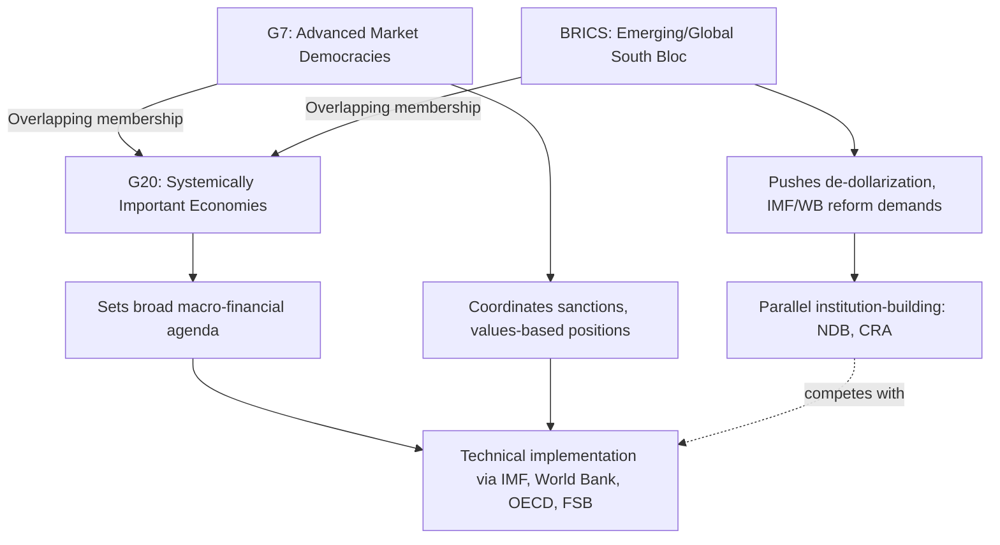

## Informal Groupings: G7, G20, and BRICS

### Conceptual Definition

Informal groupings are multilateral forums that operate without founding treaties, permanent secretariats (in most cases), or binding enforcement mechanisms. Membership, agenda, and outputs (communiqués, declarations) are determined by consensus among participating heads of state or government, rather than by charter-defined voting rules. Their influence derives from the combined economic and political weight of members, the signaling value of coordinated statements, and their function as venues for informal bargaining that can precede or bypass formal treaty-based institutions.

For geopolitical risk analysis, these groupings matter because they aggregate and reveal alignment or fracture among major powers faster than treaty bodies can, and because their declarations—though non-binding—often set the agenda that formal institutions (IMF, WTO, UN) subsequently act on.

### G7: Structure and Function

**Key Points**

- Members: Canada, France, Germany, Italy, Japan, United Kingdom, United States, plus the European Union as a non-enumerated participant.
- Originated as the G6 in 1975 (Rambouillet, France), became G7 with Canada's addition in 1976.
- Russia was included as the G8 from 1998 to 2014, then suspended following the annexation of Crimea, returning the group to G7 format.
- No permanent secretariat; the presidency rotates annually among members and hosts the annual summit plus ministerial meetings (finance, foreign affairs, energy).

The G7 represents advanced, market-democracy economies and functions primarily as a coordination mechanism among historically aligned Western powers plus Japan. Its declarations typically address macroeconomic policy coordination, sanctions coordination (notably visible in the post-2022 Russia sanctions regime), and values-based statements on democracy, human rights, and security.

**Example**

Following Russia's 2022 invasion of Ukraine, the G7 became the primary venue for coordinating a price cap on Russian seaborne oil exports, synchronizing export controls on dual-use technology, and aligning asset-freeze measures against Russian sovereign reserves—illustrating how an informal grouping can produce de facto binding coordination among its members even without a treaty mechanism, because each member separately implements the agreed measures through domestic law.

### G20: Structure and Function

**Key Points**

- Members: Argentina, Australia, Brazil, Canada, China, France, Germany, India, Indonesia, Italy, Japan, Mexico, Russia, Saudi Arabia, South Africa, South Korea, Turkey, United Kingdom, United States, the European Union, and the African Union (added as a permanent member in 2023).
- Originated in 1999 as a finance-minister-level forum after the Asian Financial Crisis; elevated to a leaders' summit in 2008 in response to the global financial crisis.
- Represents roughly 85% of global GDP and around two-thirds of world population.
- No permanent secretariat; annually rotating presidency organizes a "troika" (past, current, next host) for continuity.

The G20 was designed explicitly to be more representative than the G7 by including major emerging economies, and it functions as the primary forum where advanced and emerging economies negotiate jointly on macroeconomic coordination, financial regulation, and increasingly on climate finance and sovereign debt restructuring (notably through the Common Framework for Debt Treatment, launched in 2020 to coordinate debt relief involving both traditional Paris Club creditors and non-traditional creditors like China).

**Example**

The G20's 2021 agreement on a global minimum corporate tax rate (part of the OECD/G20 Inclusive Framework on Base Erosion and Profit Shifting) illustrates the group's capacity to build political consensus that is subsequently operationalized through technical bodies (OECD) and implemented via domestic legislation in member states—again demonstrating the pattern of informal-forum agreement followed by formal-institution or domestic-law implementation.

### BRICS: Structure and Function

**Key Points**

- Original members (2009): Brazil, Russia, India, China; South Africa joined in 2010, forming "BRICS."
- 2024 expansion added Egypt, Ethiopia, Iran, Saudi Arabia, and the United Arab Emirates as full members (Saudi Arabia's acceptance of full membership has remained ambiguous in practice; see status note below).
- Indonesia became a full member on January 6, 2025.
- As of the September 2026 New Delhi summit (18th BRICS Summit), the bloc comprises ten to eleven full members depending on how Saudi Arabia's status is counted, plus a "partner country" category (created at the 2024 Kazan summit) that as of 2025-2026 includes Belarus, Bolivia, Cuba, Kazakhstan, Malaysia, Nigeria, Thailand, Uganda, Uzbekistan, and Vietnam.
- No permanent secretariat; annually rotating chairship (India held the 2026 chair; China assumes the 2027 chair).

**Status Note on Saudi Arabia**

India, as the 2026 BRICS chair, has classified Saudi Arabia as a full member, with an Indian government backgrounder stating that BRICS comprises 11 countries and that Saudi Arabia became a full member in January 2024. Saudi Arabia has nevertheless continued to use "invited country" terminology for its own participation, and Reuters reporting from April 2026 indicated Riyadh has deliberately avoided formalizing membership to preserve its relationship with Washington. [Inference: This dual-track characterization suggests Saudi Arabia is functioning as a de facto hedging member, participating without full political commitment, which is itself a relevant data point for geopolitical risk analysis of Gulf state alignment strategy.] [Wikipedia](https://en.wikipedia.org/wiki/Member_states_of_BRICS)[The Rio Times](https://www.riotimesonline.com/brics-2026-complete-guide/)

**Key Points**

- As of September 2026, BRICS represents roughly half of world population and around 40% of global GDP on the counting basis used by the bloc's own communications. [Tutorsbot](https://tutorsbot.com/blog/brics-countries-list-2026-members)
- The New Development Bank (NDB), headquartered in Shanghai, had approved $42.9 billion across 139 projects as of April 2026, functioning as BRICS's primary institutional (treaty-based) offshoot, distinct from the informal summit process itself. [The Rio Times](https://www.riotimesonline.com/brics-2026-complete-guide/)

BRICS originated as an economic categorization (the term "BRIC" was coined by Goldman Sachs economist Jim O'Neill in a 2001 research paper identifying high-growth emerging economies) before being adopted by the four countries themselves as a political coordination platform starting with the first formal summit in Yekaterinburg in 2009. Unlike the G7 and G20, BRICS explicitly frames itself as a Global South counterweight to Western-dominated institutions, with declared priorities including de-dollarization of trade settlement, reform of IMF/World Bank governance, and expanded use of national-currency payment systems.

**Example**

At the September 2026 New Delhi summit, China and Russia used the platform to back an expanded UN Security Council role for Brazil and India and to call for a "fairer multipolar world order," while the summit drew criticism from the Trump administration, which has described the bloc as anti-American and threatened tariffs on countries aligning with it—illustrating how BRICS functions simultaneously as an economic coordination forum and a geopolitical signaling platform in the context of U.S.-China strategic competition. [Tutorsbot](https://tutorsbot.com/blog/brics-countries-list-2026-members)

### Comparative Structural Analysis

| Dimension | G7 | G20 | BRICS |
| --- | --- | --- | --- |
| Founding logic | Advanced-economy policy coordination | Systemic financial crisis response, broader representation | Emerging-economy/Global South counterweight |
| Decision rule | Consensus, non-binding | Consensus, non-binding | Consensus, non-binding |
| Permanent secretariat | No | No | No (NDB has one; the summit process does not) |
| Formal institutional offshoot | None (relies on IMF/World Bank/WTO) | Financial Stability Board linkage, OECD technical work | New Development Bank, Contingent Reserve Arrangement |
| Membership growth mechanism | Static since 1976 (Russia suspension aside) | Static since 1999 founding, AU added 2023 | Active expansion (2024, 2025 waves) plus partner-country tier |
| Primary strategic framing | Western/advanced-democracy alignment | Advanced-emerging economy bridge | Global South/multipolarity counterweight to Bretton Woods institutions |

### Illustrative Diagram: Relationship Among the Three Groupings

### Analytical Framework: Why States Value Informal Groupings

**Flexibility Advantage**

Informal groupings can add or reconfigure membership, agenda items, and working groups without treaty amendment, making them more adaptive than charter-based institutions—directly contrasting with the gridlock dynamics affecting the UN Security Council or WTO.

**Signaling Function**

Joint communiqués and declarations serve as low-cost, high-visibility signals of political alignment or disagreement among great powers. Divergence in language (e.g., G7 statements on Russia versus BRICS statements avoiding direct condemnation) provides analysts with real-time indicators of coalition structure.

**Agenda-Setting Without Binding Commitment**

Because outputs are non-binding, groupings can float ambitious proposals (a G20 global minimum tax, a BRICS local-currency payment system) as trial balloons, testing political viability before committing to formal treaty negotiation.

**Venue Competition and Regime Complexity**

The proliferation of BRICS institutional offshoots (NDB, Contingent Reserve Arrangement) in parallel with continued G20 engagement by the same states (e.g., China, India, Brazil, Russia, South Africa all sit in both G20 and BRICS) illustrates "forum-shopping": states participate in overlapping institutions to maximize bargaining leverage and hedge against gridlock or unfavorable outcomes in any single venue.

### Risk Analysis Indicators

When assessing these groupings for geopolitical risk purposes, analysts typically track:

- **Communiqué language divergence**: shifts in tone or omitted topics can signal internal coalition strain (e.g., G7 members disagreeing on China policy language)
- **Attendance signals**: head-of-state absence or downgraded delegation level at summits often indicates strategic distancing
- **Institutional offshoot growth**: expansion of NDB lending, or BRICS payment-system pilots, indicates the bloc is moving from rhetorical to operational capacity
- **Membership expansion criteria and pace**: rapid, loosely vetted expansion (as with BRICS's 2024-2025 waves) can dilute internal cohesion, since incoming members may hold divergent interests (e.g., Iran and Saudi Arabia both joining despite historical rivalry)
- **Overlap and hedging behavior**: states maintaining active engagement in both a Western-aligned grouping (G7/G20) and BRICS simultaneously (e.g., India, Brazil, South Africa) indicate strategic non-alignment rather than bloc commitment

[Inference: The durability of BRICS as a cohesive geopolitical actor, as opposed to a loose economic coordination label, remains an open analytical question given the significant divergence in political systems, security alignments, and economic interests among members such as India (a Quad member and U.S. strategic partner) and Iran or Russia.]

### Practical Implications for Analysts

- Do not treat G7, G20, or BRICS communiqué language as binding commitment; treat it as a leading indicator of subsequent bilateral or formal-institutional action.
- Track chairship rotation schedules, since the host country materially shapes agenda priorities for that year (e.g., India's 2026 BRICS chairship theme emphasized Global South representation and technology cooperation).
- Monitor NDB and Contingent Reserve Arrangement disbursement data as a harder, quantifiable proxy for BRICS institutional capacity, since summit declarations alone provide limited predictive power.
- Recognize that membership in one grouping does not preclude active, even primary, engagement in a rival grouping; bloc-based analytical models that assume mutual exclusivity will misread the behavior of swing states like India, Brazil, Indonesia, and South Africa.

### Related Topics

- New Development Bank and Contingent Reserve Arrangement architecture
- De-dollarization initiatives and cross-border payment systems (e.g., BRICS Pay proposals)
- G20 Common Framework for Debt Treatment
- Institutional gridlock and reform debates (UN Security Council, IMF, WTO)
- Minilateralism versus universal multilateralism
- Quad (Australia, India, Japan, United States) as a security-oriented minilateral grouping
- Sanctions coordination mechanisms among G7 members
- Global South coalition dynamics and non-alignment strategies