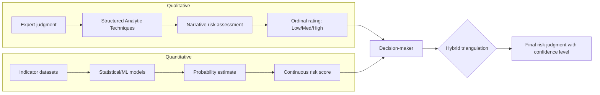

## Qualitative versus Quantitative Risk Assessment Approaches

### Conceptual Definition

Political risk assessment methodology divides broadly into two epistemological traditions: qualitative approaches, which rely on expert judgment, structured narrative analysis, and contextual interpretation; and quantitative approaches, which rely on numerical indicators, statistical modeling, and probabilistic forecasting. Most operational risk analysis frameworks in practice use hybrid methods, but understanding the pure forms of each tradition clarifies their distinct assumptions, strengths, and failure modes.

### Qualitative Risk Assessment

**Key Points**

- Relies on expert judgment, area studies expertise, and structured analytic techniques rather than numerical scoring as the primary output.
- Produces narrative assessments, scenario descriptions, and ordinal risk categorizations (e.g., low/medium/high) rather than continuous probability estimates.
- Draws heavily on qualitative political science methods: process tracing, comparative case studies, and historical analogy.

**Core Techniques**

*Structured Analytic Techniques (SATs)*, developed largely within the U.S. intelligence community and formalized in tradecraft manuals, include methods such as Analysis of Competing Hypotheses (ACH), which requires analysts to systematically evaluate evidence against multiple rival hypotheses rather than anchoring on a single narrative; Devil's Advocacy, which assigns an analyst to argue against the prevailing consensus view to stress-test it; and Key Assumptions Check, which makes explicit the assumptions underlying a judgment so they can be individually challenged.

*Scenario Planning* constructs multiple plausible future trajectories (typically three to five) rather than a single point forecast, explicitly modeling divergent paths a situation could take based on different combinations of driving variables. This technique, pioneered by Herman Kahn at RAND and later refined by Royal Dutch Shell's planning group, is particularly suited to genuinely uncertain situations where historical base rates provide limited guidance.

*Expert Elicitation and Delphi Method* systematically aggregates judgments from multiple subject-matter experts, typically through iterative anonymous rounds of questioning with feedback, to converge toward a defensible consensus judgment while reducing groupthink and dominant-individual bias.

*Country and Regional Deep-Dive Analysis* involves area specialists producing contextualized narrative assessments that incorporate historical trajectory, elite relationships, institutional idiosyncrasies, and cultural/social dynamics that resist numerical encoding.

**Example**

An analyst assessing coup risk in a given country using qualitative methods would examine factors such as recent patterns of military patronage, the personal relationship between the head of state and key generals, the military's institutional cohesion versus factionalization, and historical precedent for military intervention in that specific political culture—synthesizing these into a narrative judgment ("elevated risk over the next 6-12 months, driven primarily by X and Y") rather than a probability percentage.

**Strengths**

- Captures context-specific, non-recurring, or idiosyncratic factors that do not fit standardized indicator sets (e.g., a specific succession dispute within a ruling family)
- Accommodates genuine uncertainty and novel situations lacking sufficient historical data for statistical modeling
- Allows incorporation of tacit knowledge, informal networks, and elite-level dynamics that are difficult to quantify
- More easily communicates causal mechanisms ("why" a risk exists), not just its magnitude

**Limitations**

- Vulnerable to well-documented cognitive biases: confirmation bias, anchoring, availability heuristic, groupthink, and mirror-imaging (assuming foreign actors reason as the analyst would)
- Difficult to backtest or validate systematically, since narrative judgments are rarely expressed in falsifiable, precise terms
- Reproducibility is limited; different analysts examining the same situation may reach materially different conclusions
- Scales poorly across a large portfolio of countries or assets, since deep-dive analysis is labor- and expertise-intensive

### Quantitative Risk Assessment

**Key Points**

- Relies on numerical indicators, statistical models, and/or machine learning to produce risk scores or probability estimates.
- Typically involves an underlying dataset of political, economic, and social indicators tracked over time and across countries.
- Aims for reproducibility, comparability across cases, and (where possible) statistical validation against historical outcomes.

**Core Techniques**

*Composite Index Construction* aggregates multiple weighted indicators into a single risk score. Examples include indices tracking dimensions such as government stability, socioeconomic conditions, investment profile, internal and external conflict, corruption, military involvement in politics, religious and ethnic tensions, law and order, democratic accountability, and bureaucratic quality—each scored and weighted to produce a composite country risk rating.

*Statistical/Econometric Models* use regression-based or panel-data techniques to estimate the relationship between observable indicators (GDP growth, inflation, income inequality, prior conflict history, regime type, ethnic fractionalization) and the probability of a defined outcome (civil war onset, coup, expropriation, sovereign default). Logistic regression is common where the outcome is binary (event/no-event within a time window).

*Machine Learning Approaches* apply techniques such as random forests, gradient boosting, or neural networks to large feature sets in order to improve predictive accuracy over linear models, particularly where interactions between variables are complex or non-linear. [Inference: The marginal predictive gain of ML approaches over well-specified logistic models in political forecasting is contested in the academic literature and appears highly dependent on the specific outcome being forecast and the quality/breadth of the underlying feature set.]

*Event Data and Text-as-Data Methods* extract structured signals from unstructured text (news reports, social media) using natural language processing, coding events into standardized categories (e.g., protest, verbal conflict, material cooperation) via frameworks such as CAMEO (Conflict and Mediation Event Observations), enabling near-real-time monitoring of political events at scale.

*Prediction Markets and Forecasting Tournaments* aggregate distributed judgment through market-like mechanisms or structured forecasting competitions (exemplified by the Good Judgment Project's work on "superforecasters"), producing continuously updated probability estimates that can outperform both individual experts and simple statistical models in some domains, particularly for well-defined, verifiable near-term questions.

**Example**

A quantitative sovereign risk model might estimate default probability using a logistic regression with predictors including external debt-to-GDP ratio, foreign reserve coverage of short-term debt, current account balance, and a lagged indicator of prior default history, outputting a specific probability (e.g., "14% probability of default within 24 months") that can be directly compared across countries and tracked over time.

**Strengths**

- Reproducible and auditable: the same inputs and model specification will generate the same output regardless of which analyst runs it
- Enables systematic backtesting: model performance can be evaluated against realized historical outcomes using standard statistical metrics (e.g., area under the ROC curve, Brier scores)
- Scales efficiently across large portfolios (dozens to hundreds of countries) without proportional increases in analyst time
- Reduces (though does not eliminate) susceptibility to individual cognitive bias, since the model applies consistent logic across cases

**Limitations**

- Sensitive to data quality and availability; many higher-risk states have the weakest official statistics, creating a systematic bias where the data is worst precisely where risk is highest
- Historical base-rate models perform poorly on genuinely novel situations without precedent (structural breaks, unprecedented technology-driven mobilization, unique leadership personalities)
- Risk of false precision: a output like "14% probability" can convey unwarranted confidence given underlying data and model uncertainty
- Model outputs are only as good as variable selection and weighting choices, which themselves often embed qualitative judgment calls that are less visible or scrutinized once encoded numerically
- Weak at capturing tail risk and genuinely novel "black swan" or "grey rhino" events, since these are by definition underrepresented or absent in historical training data

### Illustrative Diagram: Methodological Comparison

### Hybrid and Triangulated Approaches

**Key Points**

- Most institutional risk practices (sovereign risk desks, political risk insurers, intelligence agencies) combine both traditions rather than relying exclusively on one.
- Quantitative models often serve as a screening or triage layer; qualitative analysis is then applied to cases flagged as elevated risk for deeper investigation.

*Structured Expert Judgment with Quantitative Calibration*: Analysts provide probability estimates (a quantitative output) but arrive at them through qualitative reasoning processes, and their historical calibration (how well past probability estimates matched realized outcomes) is tracked statistically to improve future judgment quality—this approach underlies methods like the Intelligence Community's increasing use of explicit probabilistic language paired with structured tradecraft standards.

*Model-Informed Narrative*: A quantitative model generates an initial risk score or flag, which an analyst then investigates qualitatively to identify the specific causal drivers, assess whether the historical relationships embedded in the model still hold given current context, and adjust the final judgment accordingly.

*Red Team / Structured Debate*: Quantitative outputs are qualitatively stress-tested through adversarial review (a red team) that explicitly interrogates model assumptions, data quality, and edge cases the model may not capture.

### Comparative Table

| Dimension | Qualitative | Quantitative |
| --- | --- | --- |
| Primary output | Narrative judgment, ordinal category | Numerical score, probability estimate |
| Reproducibility | Low to moderate (analyst-dependent) | High (given fixed model/data) |
| Handles novel/unprecedented events | Strong | Weak (depends on historical training data) |
| Scalability across many cases | Weak (labor-intensive) | Strong |
| Vulnerability to bias | Cognitive bias (individual/group) | Data bias, model specification bias |
| Backtesting/validation | Difficult | Feasible via statistical metrics |
| Communicates causal mechanism | Strong | Weak (correlation-focused) |
| Typical use case | Deep single-country analysis, scenario planning | Portfolio-wide screening, sovereign credit modeling |

### Analytical Framework for Choosing an Approach

The choice between qualitative and quantitative methods—or their combination—typically depends on:

- **Data availability**: quantitative models require sufficient historical data of adequate quality; qualitative methods can function with sparse or unreliable data
- **Time horizon**: short-term, well-defined event forecasting (e.g., "will an election be held on schedule") favors quantitative/forecasting-tournament methods; long-term structural risk (e.g., "how might this country's political economy evolve over a decade") favors qualitative scenario methods
- **Portfolio breadth**: single high-stakes decisions (e.g., a major foreign direct investment) justify deep qualitative analysis; broad portfolio monitoring (e.g., a global investment fund tracking 80 countries) favors quantitative screening
- **Precedent availability**: well-precedented event types (currency crises, election-related unrest in established multiparty systems) suit quantitative base-rate modeling; genuinely novel dynamics (a new ideological movement, an unprecedented technology's political effects) require qualitative judgment
- **Decision-maker needs**: some audiences require a single defensible number for capital allocation or insurance pricing; others require a causal narrative to inform strategic planning

### Common Failure Modes Across Both Traditions

**Qualitative Failure Modes**

- Groupthink within analytic teams sharing similar backgrounds or institutional culture
- Overreliance on historical analogy that does not actually fit the current case (reasoning by superficial similarity)
- Insufficient challenge of prevailing consensus, particularly under organizational or political pressure to align with a preferred narrative

**Quantitative Failure Modes**

- "Garbage in, garbage out": model outputs inherit any bias, gaps, or manipulation present in underlying data (particularly acute for authoritarian-state-reported economic statistics)
- Overfitting: models tuned too closely to historical data perform poorly on genuinely new situations
- False precision: numerical outputs can create unwarranted confidence, obscuring substantial underlying uncertainty
- Regime change blindness: models trained on historical relationships can fail when the underlying political-economic regime itself shifts (a structural break), since past correlations no longer hold

[Inference: The persistent tension between these two traditions in practice reflects a genuine bias-variance-type tradeoff rather than a solvable methodological problem—qualitative methods reduce bias from ignoring context at the cost of higher variance across analysts, while quantitative methods reduce variance across analysts at the cost of potential bias from imperfect indicator selection and historical data limitations.]

### Related Topics

- Structured Analytic Techniques and intelligence tradecraft standards
- Composite political risk indices (e.g., ICRG-style methodologies)
- Scenario planning and the Shell/RAND planning traditions
- Machine learning applications in conflict and coup forecasting
- Forecasting tournaments and the Good Judgment Project
- Event data coding frameworks (CAMEO, GDELT)
- Cognitive bias mitigation in intelligence analysis
- Sovereign credit risk modeling methodology