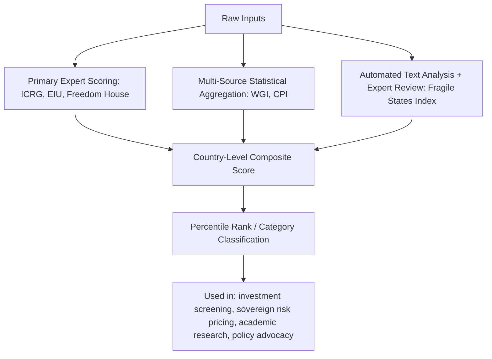

## Major Political Risk Indices and Their Methodologies

### Conceptual Overview

Political risk indices convert qualitative political, economic, and social conditions into standardized, comparable numerical scores across countries and time. They serve institutional investors, insurers, credit rating agencies, and corporate risk functions as a common reference language for cross-country comparison, portfolio screening, and trend monitoring. Each major index reflects distinct methodological choices about indicator selection, weighting, aggregation, and update frequency, which materially affect scores and rankings even when covering the same underlying countries.

### International Country Risk Guide (ICRG)

**Key Points**

- Published monthly by the PRS Group (Political Risk Services); one of the longest-running commercial political risk indices, with data extending back to the early 1980s.
- Produces three sub-indices—Political Risk, Financial Risk, and Economic Risk—which are combined into a Composite Risk Rating.
- The Political Risk component uses 12 weighted subcomponents.

**Methodology**

The Political Risk index scores twelve components: government stability, socioeconomic conditions, investment profile, internal conflict, external conflict, corruption, military in politics, religious tensions, law and order, ethnic tensions, democratic accountability, and bureaucratic quality. Each component receives a numerical score based on analyst assessment against a defined risk-point scale, with government stability, socioeconomic conditions, and investment profile weighted more heavily (12 points maximum each) than others (typically 6 points maximum). Points are summed and inverted, such that a higher composite score indicates lower risk—a convention that can create confusion for users unfamiliar with the scale direction.

The Financial Risk and Economic Risk sub-indices incorporate variables such as foreign debt as a percentage of GDP, current account balance, net international liquidity, exchange rate stability, GDP per capita, real GDP growth, inflation, and budget balance.

**Example**

A country experiencing a contested election, rising ethnic tensions, and a deteriorating fiscal position would see its ICRG scores fall across the government stability, ethnic tensions, and budget balance subcomponents respectively, pulling down both the Political Risk sub-score and the overall Composite Risk Rating, which analysts would then interpret through the month-over-month trend rather than the absolute level alone.

**Strengths and Limitations**

ICRG's long time series (40+ years for many countries) makes it well-suited to longitudinal and econometric research, and it is widely used as an independent variable in academic political economy studies. [Inference: The proprietary, analyst-driven scoring process for individual subcomponents is not fully transparent in its granular weighting logic, which limits external replication of exact score derivation even though the overall framework is publicly documented.]

### Economist Intelligence Unit (EIU) Risk Services

**Key Points**

- Produces country risk scores across multiple risk categories: sovereign risk, currency risk, banking sector risk, political risk, economic structure risk.
- Political risk scoring incorporates factors such as social unrest potential, orderly political transfer likelihood, armed conflict, international disputes, and policy-making process quality.
- Also publishes the separately branded Democracy Index, which scores countries on electoral process and pluralism, functioning of government, political participation, political culture, and civil liberties, classifying countries into full democracies, flawed democracies, hybrid regimes, and authoritarian regimes.

**Methodology**

EIU country risk models combine quantitative macroeconomic indicators with qualitative analyst judgment from in-house country specialists, producing both numerical scores (typically on a 0-100 scale, with lower scores indicating lower risk) and letter-grade risk bands. The Democracy Index specifically uses 60 indicators grouped into five categories, each scored by a combination of expert assessment and, where available, public opinion survey data, producing a composite score on a 0-10 scale.

**Example**

The Democracy Index's category classification is frequently cited in geopolitical risk reporting to characterize regime trajectories—for instance, tracking a country's movement from "flawed democracy" toward "hybrid regime" status over successive annual editions as a proxy for democratic backsliding, which analysts then correlate with elevated political and expropriation risk.

### Freedom House: Freedom in the World

**Key Points**

- Annual report scoring countries on political rights (0-40 points across 10 indicators) and civil liberties (0-60 points across 15 indicators), for a combined 100-point scale.
- Classifies countries as "Free," "Partly Free," or "Not Free" based on aggregate score bands.
- Scoring is conducted by a combination of in-house analysts and external consultants, reviewed by regional and thematic experts, and subject to institutional review committees before publication.

**Methodology**

Political rights indicators assess electoral process, political pluralism and participation, and functioning of government. Civil liberties indicators assess freedom of expression and belief, associational and organizational rights, rule of law, and personal autonomy and individual rights. Each indicator is scored on a numeric scale by expert assessment against a detailed methodology document with defined criteria for each score level, intended to standardize judgment across different country analysts.

**Strengths and Limitations**

Freedom House's methodology emphasizes transparency, publishing detailed indicator-level scoring guidance and methodology notes, which supports external scrutiny and replication of the scoring logic more than some proprietary commercial indices. [Inference: Because the index relies substantially on expert judgment rather than purely objective/administrative data points, scores can be influenced by the institutional and geopolitical orientation of the organization and its funding sources, a critique that has been raised regarding several human-rights- and democracy-focused indices generally, not uniquely Freedom House.]

### World Bank Worldwide Governance Indicators (WGI)

**Key Points**

- Covers six dimensions: Voice and Accountability, Political Stability and Absence of Violence/Terrorism, Government Effectiveness, Regulatory Quality, Rule of Law, and Control of Corruption.
- Aggregates data from over 30 underlying data sources, including other indices, surveys, and expert assessments, rather than conducting primary scoring itself.
- Reports both a percentile rank (0-100) and a standardized score (typically ranging roughly from -2.5 to 2.5) with explicit margins of error for each country-indicator pair.

**Methodology**

WGI uses an unobserved components model, a statistical aggregation technique that treats each dimension of governance as a latent (unobserved) variable estimated from multiple correlated observed indicators drawn from third-party sources (e.g., Freedom House, EIU, Bertelsmann Transformation Index, various business surveys). This approach explicitly quantifies uncertainty, reporting standard errors alongside point estimates—a methodological feature that distinguishes WGI from single-source indices and that the World Bank itself emphasizes when cautioning against over-precise interpretation of small year-to-year or country-to-country differences.

**Example**

A researcher comparing two countries with WGI Rule of Law percentile ranks of 52 and 55 respectively should, given the reported margins of error, generally treat this difference as not statistically significant, whereas a gap between ranks of 20 and 80 would represent a robust, meaningfully large difference in assessed governance quality.

### Transparency International Corruption Perceptions Index (CPI)

**Key Points**

- Focuses exclusively on perceived public-sector corruption, scored 0 (highly corrupt) to 100 (very clean).
- Aggregates a minimum of three data sources per country from a pool of independent institutions' surveys and assessments (e.g., World Economic Forum, Bertelsmann Foundation, various regional development banks), requiring at least three sources for a country to be included.
- Uses a standardization procedure to make heterogeneous source scales comparable before averaging.

**Methodology**

Because the CPI measures perceptions rather than directly observed corrupt transactions (which are inherently difficult to measure directly), it aggregates expert and business-executive survey data from multiple independent sources, standardizes each source using a matching-percentiles technique, and then averages the standardized scores, with a confidence interval reported for each country reflecting the number and variance of underlying sources.

**Strengths and Limitations**

The multi-source aggregation reduces dependence on any single survey's methodology or potential bias, and the explicit confidence interval reporting is comparable in spirit to WGI's approach. [Inference: Perception-based measurement inherently lags actual corruption trends when public/expert perception is slow to update following genuine policy change, a limitation acknowledged in the CPI's own methodological documentation.]

### Fragile States Index (Fund for Peace)

**Key Points**

- Scores states across 12 indicators grouped into cohesion, economic, political, and social/cross-cutting categories, producing a composite score where higher scores indicate greater fragility.
- Uses a proprietary content analysis software tool (CAST - Conflict Assessment System Tool) to process large volumes of publicly available documents and media, supplemented by quantitative data and qualitative expert review.

**Methodology**

The CAST engine performs automated content analysis on a large corpus of documents (news reports, NGO reports, government documents) to generate initial indicator scores, which are then reviewed and adjusted through quantitative data cross-checks and a panel review process involving regional experts, combining an automated text-as-data approach with human expert validation—an early and still-active example of hybridizing computational and traditional qualitative methods in index construction.

### Illustrative Diagram: Index Construction Approaches Compared

### Comparative Table

| Index | Publisher | Core Focus | Aggregation Method | Update Frequency |
| --- | --- | --- | --- | --- |
| ICRG | PRS Group | Political/financial/economic composite risk | In-house analyst scoring, weighted subcomponents | Monthly |
| EIU Risk Services / Democracy Index | Economist Intelligence Unit | Sovereign/political/currency risk; democracy classification | Analyst judgment + macro data; survey-informed | Risk services ongoing; Democracy Index annual |
| Freedom in the World | Freedom House | Political rights and civil liberties | Expert scoring against defined rubric, panel-reviewed | Annual |
| Worldwide Governance Indicators | World Bank | Six governance dimensions | Unobserved components model, 30+ third-party sources | Annual |
| Corruption Perceptions Index | Transparency International | Perceived public-sector corruption | Standardized multi-source survey averaging | Annual |
| Fragile States Index | Fund for Peace | State fragility across 12 indicators | Automated content analysis (CAST) + expert review | Annual |

### Methodological Considerations for Index Selection and Use

**Source Independence and Aggregation Method**

Indices that aggregate multiple independent third-party sources (WGI, CPI) reduce single-source bias but inherit any correlated bias shared across sources (e.g., if most underlying surveys draw on similar expert networks). Single-organization indices (ICRG, Freedom House) offer more internally consistent methodology across countries and time but concentrate reliance on one institution's analyst judgment and potential institutional bias.

**Perception versus Outcome Measurement**

Several major indices (CPI, portions of EIU and Freedom House scoring) measure perceptions of conditions rather than directly observed outcomes, which is often unavoidable given the difficulty of directly measuring phenomena like corruption or political rights violations, but which introduces a distinct error source separate from sampling or coding error.

**Precision and Uncertainty Communication**

WGI and CPI explicitly report confidence intervals or standard errors; many other indices report point scores or rankings without formal uncertainty quantification, which can lead users to over-interpret small differences between closely ranked countries. Best practice for analysts is to treat close rankings as approximately tied unless the index explicitly demonstrates statistical separation.

**Update Lag and Timeliness**

Annual indices (Freedom House, WGI, CPI, Fragile States Index) necessarily lag fast-moving events; a coup, war onset, or rapid democratic backsliding occurring shortly after an annual index's data cutoff will not be reflected until the following year's edition. Monthly indices (ICRG) and continuously updated risk services (EIU) offer better timeliness for operational decision-making but may sacrifice some methodological consistency achievable with a slower, more deliberate annual review cycle.

**Composite Score Interpretation Risk**

Composite scores that blend heterogeneous dimensions (e.g., ICRG combining government stability with bureaucratic quality into a single Political Risk figure) can mask offsetting movements—a country improving on one subcomponent while deteriorating on another may show an unchanged composite score, obscuring meaningfully different underlying dynamics. Analysts should examine subcomponent-level data rather than relying solely on top-line composite figures when precision matters for a specific decision.

### Practical Application Guidance

- Cross-validate findings across multiple indices rather than relying on a single source, since methodological divergence can produce materially different country rankings for the same underlying reality
- Weight index selection to the specific risk dimension of interest (e.g., use CPI or WGI's Control of Corruption dimension specifically for corruption-focused due diligence rather than a broad composite score)
- Treat annual indices as lagging confirmation of trends rather than early-warning tools; pair with higher-frequency qualitative monitoring or event-data feeds for time-sensitive decisions
- Examine methodology documentation for each index before use, since scale direction (higher score = higher or lower risk) varies across indices and is a common source of misinterpretation

### Related Topics

- Qualitative versus quantitative risk assessment approaches
- Sovereign credit rating methodologies (Moody's, S&P, Fitch)
- Event data and text-as-data methods (CAMEO, GDELT)
- Composite index construction and unobserved components modeling
- Democratic backsliding measurement and classification frameworks
- Political risk insurance underwriting practices
- Corruption measurement challenges and alternative metrics